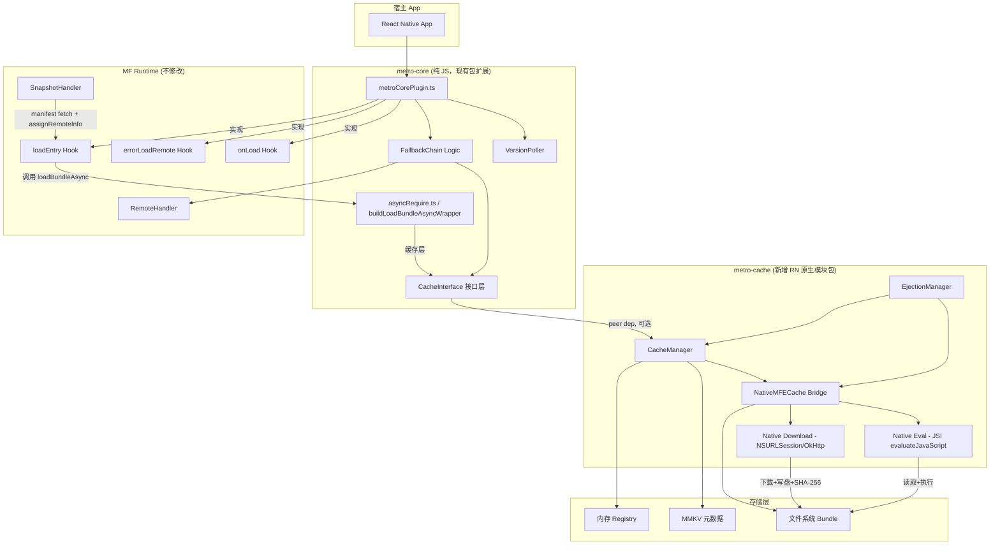
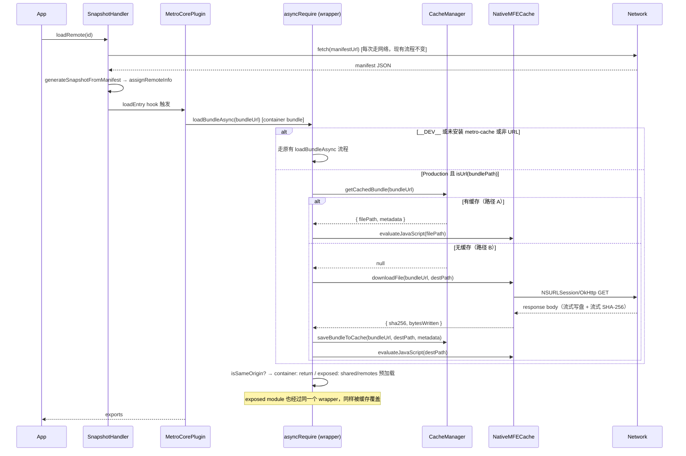
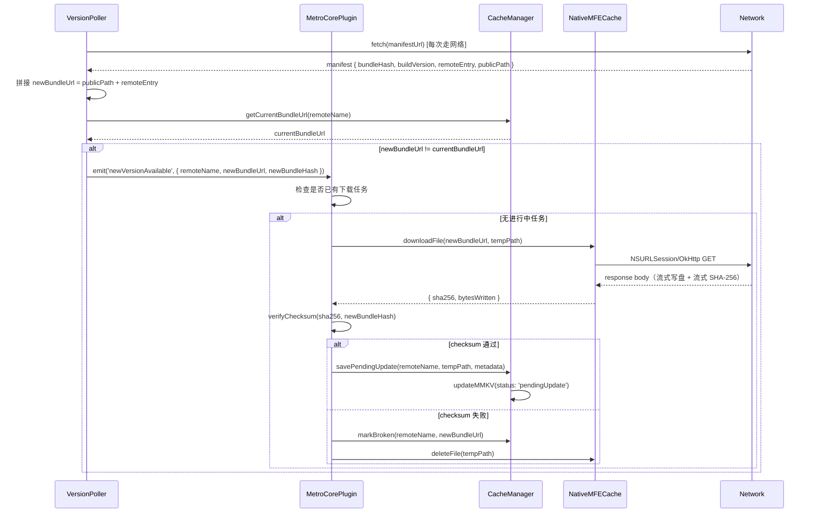
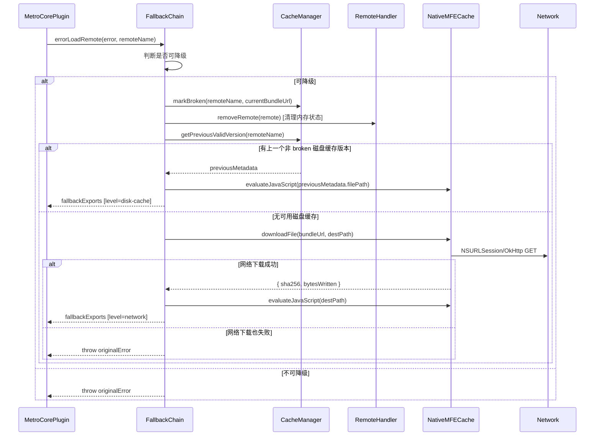

# 技术设计文档：MFE 生命周期管理

## 概述

本文档描述 React Native + Module Federation (Metro) 项目中 MFE 生命周期管理功能的技术设计。

当前系统每次 App 启动都会重新下载远程 bundle，`registry` 和 `loading` 均为纯内存对象，重启后清空，且缺乏完整性校验、版本检测、缓存持久化、热更新、错误降级和自动清理能力。

本设计在不修改 `@module-federation/runtime` 核心库的前提下，通过扩展 `metroCorePlugin.ts` 中的 hooks 实现以下能力：

- **持久化缓存**：两层缓存架构（内存 → 磁盘），无网络时兜底
- **Checksum 校验**：下载完成后的 SHA-256 完整性验证
- **版本检测**：后台定期轮询 manifest，检测新版本
- **Fallback 链**：降级链（当前版本 → 历史磁盘缓存 → 网络重新下载 → 抛出错误）
- **热更新**：后台静默下载，下次启动生效
- **自动清理**：固定保留 current + previous 两个版本，基于使用时间的磁盘清理
- **失败重试**：broken 版本支持配置延迟重试，避免偶发错误导致版本永久废弃

实现顺序：c（持久化缓存）→ a（checksum 校验）→ b（版本检测）→ e（fallback 链）→ d（热更新）→ f（清理）

### 核心设计决策：Native 层闭环

Production 模式下，RN 原生只在 `__DEV__` 下注入 `__loadBundleAsync`。`@module-federation/metro` 的 `asyncRequire.ts` 通过引入 `@expo/metro-runtime` 的 `buildAsyncRequire()` 解决了这个问题，底层链路为 `RCTNetworking.sendRequest(url)` → `eval(body)`。

但 `@expo/metro-runtime` 的 `buildUrlForBundle` 在 production 下只接受 `http://` / `https://` 协议，`file://` 路径会直接抛出异常，无法用于从磁盘加载缓存 bundle。

因此，本设计将**下载、存储、校验、执行**全部下沉到 RN 原生模块（`NativeMFECache`）中完成：

- `downloadFile(url, destPath)` → native 层用 `NSURLSession`/`OkHttp` 下载，同时流式计算 SHA-256，一步完成下载+写盘+hash
- `evaluateJavaScript(filePath)` → native 层读取磁盘文件，通过 JSI `runtime.evaluateJavaScript()` 直接执行

这样做的优势：
1. **路径 A（有缓存）只需一次 native 调用**：`evaluateJavaScript(filePath)`，零网络请求，不依赖 `loadBundleAsync`
2. **路径 B（无缓存）只需一次网络请求**：`downloadFile` 下载+写盘+hash 一步到位，再 `evaluateJavaScript` 执行，消除了旧方案中 `fetch` + `loadBundleAsync` 的两次请求问题
3. **不受 `buildUrlForBundle` 的协议限制**：完全绕过 `@expo/metro-runtime` 的 URL 处理层
4. **数据不需要在 JS ↔ Native 之间传递**：bundle 内容始终在 native 层流转（网络 → 磁盘 → JS 引擎），避免大字符串跨桥传输

### 开发模式处理

`__DEV__` 模式下，bundle URL 带有 query params（`dev=true&lazy=true&...`），每次代码改动都会重新打包。缓存在开发模式下没有意义且会导致问题，因此 `buildLoadBundleAsyncWrapper` 中需要跳过所有缓存逻辑：

```typescript
if (__DEV__) {
  // 开发模式：直接走现有的 loadBundleAsync 流程，跳过缓存
  const encodedBundlePath = bundlePath.replaceAll('../', '..%2F');
  await loadBundleAsync(encodedBundlePath);
}
```

---

## 包结构决策

### 为什么需要独立的 `metro-cache` 包

`@module-federation/metro`（即 `metro-core`）是一个纯 JS/TS 的 npm 库，发布时不包含任何 native 代码。它不能直接依赖 MMKV、原生文件系统等需要在宿主 App 中链接的 native 模块。

然而，RN 的 JS Bridge / JSI 在 `loadBundleAsync` 被调用时已经完全初始化（native 层 → InitializeCore → index.js → MF init → loadRemote），因此 native 模块在运行时是完全可用的。

### 包拆分方案

```
core/packages/
  metro-core/          ← 现有包，纯 JS/TS，零 native 依赖
  metro-cache/         ← 新增包，RN 原生模块
    android/           ← Kotlin 实现（文件系统 + SHA-256 + HTTP 下载 + JS 执行）
    ios/               ← Objective-C++ 实现（文件系统 + SHA-256 + HTTP 下载 + JS 执行）
    src/
      index.ts         ← 暴露 CacheManager、VersionPoller、EjectionManager
      NativeMFECache.ts ← NativeModules 桥接接口
```

### 依赖关系

```
宿主 App
  ├── @module-federation/metro        (peer dep: @module-federation/metro-cache)
  └── @module-federation/metro-cache  (需要 pod install / gradle sync)
        ├── react-native-mmkv         (MMKV KV 存储)
        └── [原生代码]                 (文件系统 + SHA-256 + HTTP 下载 + JS 执行，内置于包中)
```

- `metro-core` 将 `metro-cache` 声明为 **peer dependency**（可选），通过接口调用，不强制安装
- `metro-cache` 包含完整的 native 代码和 MMKV 依赖，宿主 App 安装后执行 `pod install` / gradle sync 即可
- 若宿主 App 未安装 `metro-cache`，`metro-core` 降级为每次启动重新下载（当前行为），不影响基本功能

---

## Zephyr 集成与版本解析

### Zephyr Tag URL 机制

Zephyr 在**构建时**将 `zephyr:dependencies` 中的抽象版本选择器（`@latest`、`@stable`、`^1.2.3`）解析为具体的 tag URL，注入到 metro federation 配置中。运行时 `remoteInfo.entry` 已经是一个具体的 Zephyr edge URL：

```
# 构建时配置（抽象）
"zephyr:dependencies": {
  "miniApp": "miniApp@latest"
}

# 运行时注入（具体 tag URL，指向 manifest）
remote.entry = "https://t-latest-miniApp-acme-abc123.zephyr-cloud.io/mf-manifest.json"
# 注意：这是初始值。后续 assignRemoteInfo() 会将 remoteInfo.entry 覆盖为 bundle URL
```

这个 tag URL 是**动态指针**：`@latest` 今天指向 v1，明天可能指向 v2，但 URL 本身不变。每次请求该 URL，Zephyr 都会实时评估 tag 条件（branch、CI 状态、git tag 等），找到最新匹配版本并返回其内容。

### Remote Dependencies 解析

Zephyr 的依赖解析系统在构建时工作，支持多种版本选择器：

- `@latest`：指向满足 tag 条件的最新版本（动态）
- `@stable`：指向标记为 stable 的版本（动态）
- `@v2.1`：指向特定 git tag 的版本（相对稳定，但 tag 可重新指向）

**Application UID 格式**：`{appName}.{repoName}.{orgName}`，例如 `miniApp.my-repo.my-org`。同仓库的依赖可以简写为 `miniApp`。

**Remote-of-Remote 依赖**：当 remote A 依赖 remote B 时，Zephyr 在**构建 A 时**就已将 B 的 tag URL 解析并注入到 A 的 manifest 中。运行时加载 A 时，A 的 manifest 中已包含 B 的具体 entry URL，无需宿主 App 感知 B 的存在。这意味着：

- 每个 remote 独立缓存，互不依赖
- 宿主 App 只需管理直接依赖的 remote 缓存
- Remote-of-remote 的版本由各自的 manifest 决定，Zephyr 在构建时已锁定

### 对缓存 Key 设计的影响

**不能用 manifest URL 作为缓存 key**，因为同一个 tag URL 会随时间指向不同版本的 bundle。

**正确的缓存 key**：`bundleUrl`（bundle 下载 URL，immutable）

```
缓存 key = bundleUrl
```

- Bundle URL 是 immutable 的：每个版本有独立 URL（包含 username、buildId、content hash）
- 同 URL → 同内容，可以直接复用缓存
- URL 不同 → 新版本，需要下载并存为新的缓存条目
- `bundleHash`（SHA-256）用于 checksum 校验，不作为缓存 key
- `buildVersion` 仅作为人类可读的版本标签

### 版本检测的正确方式

由于 tag URL 是动态的，`VersionPoller` 通过 fetch manifest 后拼接 bundle URL 来检测新版本：

```
轮询时 fetch manifest（每次走网络）
    ↓
从 manifest 拼接 bundle URL（publicPath + remoteEntry）
    ↓
与 CacheManager 中当前激活版本的 bundleUrl 比对
    ↓
bundleUrl 不同 → 触发 newVersionAvailable
bundleUrl 相同 → 无需更新
```

---

## Host 构建变更检测

### 问题背景

缓存的 remote bundle 是基于特定 host 环境构建和下载的。当 host App 发布新版本（App Store 更新）时，shared 依赖版本、remote 配置（entry URL）等可能发生变化，导致缓存的 remote bundle 与新 host 不兼容。

由于 `buildLoadBundleAsyncWrapper` 会优先从缓存加载，不兼容的 bundle 可能被执行，导致 shared 协商失败或运行时错误。

### 解决方案：hostBuildHash

在 host 构建时，基于影响 remote 兼容性的配置生成一个 hash，注入到 host bundle 中。App 启动时比对，不一致则清空所有 remote 缓存。

**构建侧**：

```typescript
// 在 serializer.ts 的 getModuleFederationSerializer 中计算
// 当 options.runModule === true（主入口 bundle）时注入
const hostBuildHash = crypto.createHash('sha256').update(JSON.stringify({
  shared: mfConfig.shared,    // shared 版本声明（版本变化影响兼容性）
  remotes: mfConfig.remotes,  // remote 配置（entry URL 变化意味着不同的 remote 源）
})).digest('hex').slice(0, 16); // 取前 16 位，足够唯一
```

通过 serializer 中的 `generateVirtualModule` 注入（与 `__EARLY_SHARED__`、`__EARLY_REMOTES__` 相同的机制）：

```typescript
// serializer.ts 中，在 options.runModule === true 分支
function getHostBuildHash(mfConfig: ModuleFederationConfigNormalized): Module {
  const hash = crypto.createHash('sha256').update(JSON.stringify({
    shared: mfConfig.shared,
    remotes: mfConfig.remotes,
  })).digest('hex').slice(0, 16);
  const code = `globalThis.__MF_HOST_BUILD_HASH__="${hash}";`;
  return generateVirtualModule('__host_build_hash__', code);
}

// 在 finalPreModules 中加入
const finalPreModules = [
  getHostBuildHash(mfConfig),  // 新增
  getEarlyShared(syncSharedModules),
  getEarlyRemotes(syncRemoteModules),
  ...preModules,
];
```

这种方式的优势：
- 复用 Metro serializer 已有的虚拟模块注入机制，无需额外的构建步骤
- 在 host bundle 的 preModules 中执行，确保在 MF 初始化之前就已设置
- 只在主入口 bundle（`runModule === true`）中注入，remote bundle 不受影响

**运行时**：

```typescript
// CacheManager.initialize() 中
const storedHostHash = mmkv.getString('mfe:hostBuildHash');
const currentHostHash = globalThis.__MF_HOST_BUILD_HASH__;

if (storedHostHash && storedHostHash !== currentHostHash) {
  // host 构建变更，清空所有 remote 缓存
  logger.info('[MFE-Cache] host build changed, invalidating all remote caches');
  await this.invalidateAllCaches();
}

mmkv.set('mfe:hostBuildHash', currentHostHash);
```

`invalidateAllCaches()` 删除所有 remote 的磁盘 bundle 文件和 MMKV 记录，强制下次 `loadEntry` 走路径 B（网络下载）。

---

## Checksum 设计

### 问题背景

manifest 中 `shared[].hash` 字段目前为空字符串，`metaData` 中也没有 bundle 级别的 hash。要做 checksum 校验，需要在**构建侧**生成 hash 并写入 manifest。

### 构建侧：写入 bundleHash

在 `bundle-remote/index.ts` 的 `bundleFederatedRemote` 函数中，**所有 bundle**（container、exposed、shared）写入磁盘后、manifest 最终写入前，计算 SHA-256 hash 并写入 manifest：

```
for each bundle in [container, ...exposedModules, ...sharedModules]:
    buildBundle(server, requestOpts)          → 生成 bundle 代码
    saveBundleAndMap(bundle, saveBundleOpts)   → 写入 bundle 到磁盘
    ↓
    fs.readFile(bundleOutputPath)              → 读取已写入的 bundle 文件
    crypto.createHash('sha256').update(content).digest('hex')
    ↓
    存储到 bundleHashMap[bundlePath] = hash
    ↓
所有 bundle 构建完成后，更新 manifest：
    rawManifest.metaData.buildInfo.bundleHash = bundleHashMap['miniApp.bundle']
    rawManifest.exposes[i].hash = bundleHashMap[`exposed/${exposeName}.bundle`]
    rawManifest.exposes[i].assets.js.sync = [`exposed/${exposeName}.bundle`]
    rawManifest.shared[i].hash = bundleHashMap[`shared/${sharedName}.bundle`]
    rawManifest.shared[i].assets.js.sync = [`shared/${sharedName}.bundle`]
    ↓
fs.writeFile(manifestOutputFilepath)       → 写入 mf-manifest.json
```

选择 `bundle-remote/index.ts` 而非 `serializer.ts` 的原因：
- 它是构建 remote bundle 的命令入口，manifest 的最终读写逻辑已在此文件中
- `buildBundle` 返回的 `bundle` 对象直接有 `code`，也可从磁盘文件读取
- 可以在一个地方处理所有 bundle 的 hash 计算和 manifest 更新

manifest 更新后的结构：
```json
{
  "metaData": {
    "buildInfo": {
      "buildVersion": "1.0.0",
      "buildName": "miniApp",
      "bundleHash": "a3f2c1d4e5b6..."  // container bundle hash
    }
  },
  "exposes": [
    {
      "id": "miniApp:example",
      "name": "example",
      "path": "./example",
      "hash": "b4e3d2c1a0f9...",  // exposed bundle hash
      "assets": {
        "js": {
          "sync": ["exposed/example.bundle"],  // 更新为 bundle 路径
          "async": []
        }
      }
    }
  ],
  "shared": [
    {
      "id": "react",
      "name": "react",
      "hash": "c5f4e3d2b1a0...",  // shared bundle hash（如果 eager=false）
      "assets": {
        "js": {
          "sync": ["shared/react.bundle"],  // 更新为 bundle 路径（如果 eager=false）
          "async": []
        }
      }
    }
  ]
}
```

这一步在 Node.js 构建环境中执行，使用 Node 内置的 `crypto` 模块，无需额外依赖。

### 运行时：校验流程

```
NativeMFECache.downloadFile(bundleUrl, destPath) 完成
    ↓
downloadFile 返回 { sha256, bytesWritten }（下载过程中流式计算）
    ↓
从 SnapshotHandler.manifestCache 读取已缓存的 manifest
    ↓
根据 bundleUrl 确定 bundle 类型和对应的 hash 字段：
    - Container bundle (miniApp.bundle) → manifest.metaData.buildInfo.bundleHash
    - Exposed bundle (exposed/example.bundle) → manifest.exposes[].hash（通过 name 匹配）
    - Shared bundle (shared/react.bundle) → manifest.shared[].hash（通过 name 匹配）
    ↓
若对应 hash 字段存在：
    比对 downloadFile 返回的 sha256 与 manifest 中的 hash
    不一致 → 删除已下载文件，标记 broken，触发 errorLoadRemote
    一致 → 继续执行 evaluateJavaScript(destPath)
若 hash 字段不存在：
    跳过校验，记录 warn 日志，继续正常加载
```

关键点：
- checksum 校验在 `downloadFile` 返回时就已完成，不需要额外读取文件计算 hash
- manifest 在 `SnapshotHandler.getManifestJson` 中已经从网络 fetch 并缓存在内存 `manifestCache` 里（App 生命周期级别），运行时读取 hash 不需要额外网络请求
- bundle 内容始终在 native 层流转（网络 → 磁盘），不需要传回 JS 层做 hash 计算
- 需要根据 bundleUrl 路径（如 `exposed/example.bundle`）匹配 manifest 中对应的 hash 字段

### 安全边界说明

checksum 的主要防护目标是**传输损坏**（网络截断、CDN 错误）和**磁盘静默损坏**。它不能防止攻击者同时篡改 manifest 和 bundle（因为 manifest 本身没有签名）。代码签名/manifest 签名属于更高级别的安全需求，不在本 spec 范围内。

---

## 架构

### 系统架构图



### 数据流：Bundle 加载流程



### 数据流：热更新流程



### 数据流：Fallback 链



---

## 组件与接口

### NativeMFECache Bridge（metro-cache 包）

**文件路径：** `core/packages/metro-cache/src/NativeMFECache.ts`

这是 `metro-cache` 包对外暴露的原生模块接口，iOS（Objective-C++）和 Android（Kotlin）各自实现：

```typescript
import { NativeModules } from 'react-native';

export interface NativeMFECacheSpec {
  // 文件系统操作
  writeFile(path: string, content: string, encoding: 'utf8' | 'base64'): Promise<void>;
  readFile(path: string, encoding: 'utf8' | 'base64'): Promise<string>;
  deleteFile(path: string): Promise<void>;
  fileExists(path: string): Promise<boolean>;
  getDocumentDirectory(): Promise<string>;

  // SHA-256 hash 计算
  sha256File(filePath: string): Promise<string>;
  sha256String(content: string): Promise<string>;

  // HTTP 下载（native 层闭环：下载 + 写盘 + 流式 SHA-256）
  downloadFile(url: string, destPath: string): Promise<{ sha256: string; bytesWritten: number }>;

  // JS 执行（native 层闭环：读磁盘文件 + JSI evaluateJavaScript）
  evaluateJavaScript(filePath: string): Promise<void>;
}

export default NativeModules.MFECache as NativeMFECacheSpec;
```

**`downloadFile` 实现要点**：
- iOS：`NSURLSession.dataTask` 或 `downloadTask`，写入 `destPath`，使用 `CommonCrypto CC_SHA256` 流式计算 hash
- Android：`OkHttp` 下载，`MessageDigest.getInstance("SHA-256")` 流式计算
- 返回值包含 `sha256`（hex string）和 `bytesWritten`，调用方可直接用于 checksum 校验
- 下载失败时 reject Promise，调用方在 JS 层 catch 处理

**`evaluateJavaScript` 实现要点**：
- iOS：通过 `RCTBridge` 获取 `RCTCxxBridge`，访问 JSI `runtime` 调用 `evaluateJavaScript(buffer, sourceURL)`；Objective-C++ (.mm) 可直接调用 C++ JSI 接口
- Android：通过 `ReactContext.getCatalystInstance().getJavaScriptModule()` 或 JSI 接口执行
- `sourceURL` 参数使用文件路径，便于错误堆栈定位
- 执行完成后 bundle 中的全局注册代码（如 `__FEDERATION__.__NATIVE__[name]`）已生效

### CacheInterface（metro-core 接口层）

**文件路径：** `core/packages/metro-core/src/modules/cache-interface.ts`

`metro-core` 通过此接口与 `metro-cache` 解耦，运行时动态 require：

```typescript
export interface ICacheNative {
  writeFile(path: string, content: string, encoding: 'utf8' | 'base64'): Promise<void>;
  readFile(path: string, encoding: 'utf8' | 'base64'): Promise<string>;
  deleteFile(path: string): Promise<void>;
  fileExists(path: string): Promise<boolean>;
  getDocumentDirectory(): Promise<string>;
  sha256File(filePath: string): Promise<string>;
  sha256String(content: string): Promise<string>;
  downloadFile(url: string, destPath: string): Promise<{ sha256: string; bytesWritten: number }>;
  evaluateJavaScript(filePath: string): Promise<void>;
}

// 运行时尝试加载 metro-cache，未安装则返回 null（降级为每次重新下载）
export function tryLoadCacheNative(): ICacheNative | null {
  try {
    return require('@module-federation/metro-cache').NativeMFECache;
  } catch {
    return null;
  }
}
```

### CacheManager（metro-cache 包）

**文件路径：** `core/packages/metro-cache/src/CacheManager.ts`

```typescript
interface CacheManagerConfig {
  mmkvInstanceId?: string;       // MMKV 实例 ID，默认 'mfe-cache'
  bundleDir?: string;            // bundle 存储目录，默认 DocumentDirectory/mfe-bundles
}

interface CacheManager {
  // 初始化，从 MMKV 恢复内存索引
  initialize(): Promise<void>;

  // 查询缓存：用 bundleUrl 作为 key（immutable URL）
  getCachedBundle(bundleUrl: string): Promise<CachedBundleResult | null>;

  // 生成 bundle 文件的目标路径（供 downloadFile 使用）
  getBundleDestPath(remoteName: string, bundleUrl: string): Promise<string>;

  // 保存下载完成的 bundle 元数据（bundle 文件已由 downloadFile 写入 destPath）
  // 自动轮转：new → current，current → previous，删除更旧版本
  saveBundleToCache(
    remoteName: string,
    filePath: string,           // downloadFile 已写入的文件路径
    metadata: Omit<BundleMetadata, 'remoteName' | 'filePath' | 'downloadedAt' | 'lastUsedAt' | 'status' | 'retryCount' | 'lastRetryAt'>
  ): Promise<BundleMetadata>;

  // 保存 PendingUpdate bundle 元数据（bundle 文件已由 downloadFile 写入 tempPath）
  savePendingUpdate(
    remoteName: string,
    filePath: string,           // downloadFile 已写入的临时文件路径
    metadata: Omit<BundleMetadata, 'remoteName' | 'filePath' | 'downloadedAt' | 'lastUsedAt' | 'status' | 'retryCount' | 'lastRetryAt'>
  ): Promise<BundleMetadata>;

  // 激活 PendingUpdate（冷启动时调用，触发版本轮转）
  activatePendingUpdate(remoteName: string): Promise<BundleMetadata | null>;

  // 标记为 BrokenVersion（用 bundleUrl 标识）
  markBroken(remoteName: string, bundleUrl: string): Promise<void>;

  // 获取 previous 版本（非 broken）
  getPreviousValidVersion(remoteName: string): Promise<BundleMetadata | null>;

  // 获取当前激活版本的 bundleUrl
  getCurrentBundleUrl(remoteName: string): string | null;

  // 更新 lastUsedAt
  updateLastUsedAt(remoteName: string): Promise<void>;

  // 获取所有 metadata（供 EjectionManager 使用）
  getAllMetadata(): BundleMetadata[];

  // 删除指定 remoteName 的所有缓存
  removeAll(remoteName: string): Promise<void>;

  // 清空所有 remote 缓存（host 构建变更时调用）
  invalidateAllCaches(): Promise<void>;
}

interface CachedBundleResult {
  source: 'memory' | 'disk';
  filePath: string;        // bundle 磁盘路径，两种 source 均有效
  metadata: BundleMetadata;
}
```

### VersionPoller

**文件路径：** `core/packages/metro-cache/src/VersionPoller.ts`

```typescript
interface VersionPollerConfig {
  intervalSeconds?: number;   // 轮询间隔，默认 300，最小 60
}

interface VersionPoller {
  register(remoteName: string, manifestUrl: string): void;
  unregister(remoteName: string): void;
  start(): void;
  stop(): void;
  on(event: 'newVersionAvailable', listener: (info: VersionUpdateInfo) => void): void;
  off(event: 'newVersionAvailable', listener: (info: VersionUpdateInfo) => void): void;
}

interface VersionUpdateInfo {
  remoteName: string;
  currentBundleUrl: string;    // 当前激活版本的 bundle URL
  newBundleUrl: string;        // 新 bundle 的下载 URL（从 manifest 的 publicPath + remoteEntry 拼接）
  newBundleHash: string;       // manifest 中新版本的 bundleHash（用于 checksum 校验）
  newBuildVersion: string;     // 新版本的 buildVersion（人类可读）
  manifestUrl: string;
}
```

版本检测逻辑：
- 直接调用原生 `fetch(manifestUrl)`，确保每次都从网络获取最新 manifest
- 从 manifest 中拼接 bundle URL（`publicPath + remoteEntry`），与 `cacheManager.getCurrentBundleUrl()` 比对
- bundle URL 不同 → 新版本可用，emit `newVersionAvailable`
- bundle URL 相同 → 无需更新
```

### EjectionManager

**文件路径：** `core/packages/metro-cache/src/EjectionManager.ts`

```typescript
interface EjectionConfig {
  maxUnusedDays?: number;          // 最大未使用天数，默认 30
  retryDelayHours?: number;        // broken 版本重试间隔（小时），默认 24
  maxRetryAttempts?: number;       // broken 版本最大重试次数，默认 1
}

interface EjectionManager {
  // App 启动时执行周期性清理检查，同时处理 broken 版本重试
  runStartupCleanup(): Promise<void>;

  // 扩展 removeRemote，增加磁盘清理
  ejectRemote(remoteName: string): Promise<void>;

  // 清理超过未使用天数的 remote
  pruneUnusedRemotes(): Promise<void>;

  // 检查 broken 版本是否满足重试条件（距上次重试超过 retryDelayHours 且 retryCount < maxRetryAttempts）
  // 满足条件则将状态重置为 active，允许下次启动重新尝试加载
  retryBrokenVersionsIfEligible(): Promise<void>;
}
```

**broken 版本重试逻辑**：

```
App 启动时 runStartupCleanup() 调用 retryBrokenVersionsIfEligible()
    ↓
遍历所有 status=broken 的 BundleMetadata
    ↓
对每个 broken 版本检查：
  retryCount < maxRetryAttempts
  AND (lastRetryAt === null OR now - lastRetryAt >= retryDelayHours * 3600 * 1000)
    ↓
满足条件 → status 重置为 active，retryCount++，lastRetryAt = now
不满足   → 保持 broken，跳过
```

这样偶发的网络截断或 CDN 抖动导致的 checksum 失败，在下次启动时会自动重试，而不是永久废弃该版本。

---

## 数据模型

### BundleMetadata

```typescript
type BundleStatus = 'active' | 'pendingUpdate' | 'broken' | 'pendingCleanup';

interface BundleMetadata {
  remoteName: string;        // MFE 名称，如 "miniApp"
  bundleHash: string;        // SHA-256 hash（构建侧写入 manifest，运行时校验用）
  buildVersion: string;      // manifest 中的版本标签（人类可读，非唯一）
  filePath: string;          // 磁盘上的绝对路径
  bundleUrl: string;         // bundle 下载 URL（immutable，作为缓存 key）
  downloadedAt: number;      // 下载时间戳（ms）
  lastUsedAt: number;        // 最后使用时间戳（ms）
  status: BundleStatus;      // 当前状态
  // broken 重试相关
  retryCount: number;        // 已重试次数，初始为 0
  lastRetryAt: number | null; // 最后一次重试时间戳（ms），null 表示从未重试
}
```

### MMKV 存储结构

每个缓存版本对应一条 MMKV 记录：

```
# Bundle 元数据（高频读取，App 启动时扫描）
mfe:bundle:{remoteName}:{bundleUrl_hash}  → BundleMetadata JSON
# 注：bundleUrl_hash 是 bundleUrl 的短 hash（如 SHA-256 前 16 位），避免 URL 过长作为 key

# 当前激活版本的 bundleUrl 指针
mfe:active:{remoteName}                   → bundleUrl string

# 上一个版本的 bundleUrl 指针
mfe:previous:{remoteName}                 → bundleUrl string

# Host 构建 hash（用于检测 host 更新后清空缓存）
mfe:hostBuildHash                         → hostBuildHash string
```

**版本保留策略**：每个 remoteName 固定保留 **current + previous** 两个版本。安装新版本时：
```
previous = current
current = newBundleUrl
删除 previous 之前的旧版本目录（如有）
```

这比可配置的 `maxVersionsPerRemote` 更简单，且足够应对 fallback 场景。

### 存储规模估算

```
10 remotes × 2 versions × 1KB metadata = ~20KB MMKV
10 remotes × 2 versions × ~500KB bundle = ~10MB 磁盘
```

MMKV 和磁盘均在合理范围内。

### 内存索引结构

```typescript
// CacheManager 内部维护的内存索引（从 MMKV 恢复）
interface MemoryIndex {
  // bundleUrl -> BundleMetadata（快速查找缓存命中）
  urlIndex: Map<string, BundleMetadata>;
  // remoteName -> 当前激活的 BundleMetadata
  activeVersions: Map<string, BundleMetadata>;
  // remoteName -> 上一个版本的 BundleMetadata（可能为 null）
  previousVersions: Map<string, BundleMetadata | null>;
}
```

### VersionPoller 内部状态

```typescript
interface PollerState {
  registeredRemotes: Map<string, string>;  // remoteName -> manifestUrl
  intervalId: ReturnType<typeof setInterval> | null;
  appStateSubscription: ReturnType<typeof AppState.addEventListener> | null;
  isActive: boolean;
}
```

---

## 与现有 Hooks 的集成

### 核心设计决策：Manifest 不缓存，只缓存 Bundle

经过详细分析，manifest 不应该被持久化缓存，原因：

1. **Manifest 是 bundle 的完整运行时契约**：包含 `shared[].requiredVersion/version/singleton`（shared 协商）、`exposes[]`（模块映射）、`remoteEntry`（bundle 路径）、`publicPath`（CDN 地址）、`globalName`（全局注册名）、`remotes[]`（级联依赖）等。任何字段的 stale 都可能导致运行时错误。
2. **Zephyr tag URL 是动态指针**：同一 URL（如 `@latest`）在不同时间可能指向不同版本的 manifest，缓存 manifest 会导致 stale 元数据与实际 bundle 不匹配。
3. **Bundle URL 是 immutable 的**：每个版本有独立 URL（包含 username、buildId、content hash），同 URL 同内容，天然适合做缓存 key。

**最终方案**：
- **Manifest 流程完全不动** — 每次走网络，shared 协商、expose 解析、bundle URL 拼接全部用现有 `SnapshotHandler` 逻辑
- **在 `asyncRequire.ts` 的 `buildLoadBundleAsyncWrapper` 里加缓存层** — 替换内层 `loadBundleAsync` 调用，同时覆盖 container bundle 和 exposed module bundle
- **缓存 key 就是 bundle URL** — 因为 bundle URL 是 immutable 的
- **命中 → `evaluateJavaScript(filePath)`**，跳过网络下载
- **未命中 → `downloadFile(url, destPath)` + `evaluateJavaScript(destPath)`**，绕过 `loadBundleAsync`

### `remoteInfo.entry` 的语义澄清

**关键发现**：`loadEntry` hook 收到的 `remoteInfo.entry` 是 **bundle URL**，不是 manifest URL。

完整赋值链路：

```
用户配置 remote.entry = "https://t-latest-miniApp-xxx.zephyr-cloud.io/mf-manifest.json"
    ↓
SnapshotHandler.loadRemoteSnapshotInfo() → getManifestJson(moduleInfo.entry)
    ↓  （此时 moduleInfo.entry 仍是 manifest URL）
loaderHook.lifecycle.fetch.emit(manifestUrl) → 下载 manifest
    ↓
manifestCache.set(manifestUrl, manifestJson)  ← key 是 manifest URL
    ↓
generateSnapshotFromManifest(manifestJson) → 提取 remoteEntry（如 "miniApp.bundle"）
    ↓
assignRemoteInfo() 在 afterResolve hook 中执行：
  getResourceUrl(snapshot, remoteEntryInfo.url) = publicPath + remoteEntry
  remoteInfo.entry = "https://xxx.zephyr-cloud.io/miniApp.bundle"  ← 被覆盖为 bundle URL
    ↓
loadEntry hook 被调用，remoteInfo.entry 已经是 bundle URL
```

因此：
- `remoteInfo.entry` = bundle URL（如 `https://xxx.zephyr-cloud.io/miniApp.bundle`）
- `loadEntry` 调用 `loadBundleAsync(entry)` 时，这个 URL 会传入 `buildLoadBundleAsyncWrapper`，在 wrapper 内部作为缓存 key

### 缓存层插入点：`asyncRequire.ts` 的 `buildLoadBundleAsyncWrapper`

#### 为什么不在 `loadEntry` hook 里加缓存

Remote 构建产物包含两层 bundle：
- **container bundle**（如 `miniApp.bundle`）：入口，注册 `__FEDERATION__.__NATIVE__[name]`
- **exposed module bundle**（如 `exposed/example.bundle`）：实际业务代码

两者都是远程下载的，加载链路都经过 `asyncRequire.ts` 的 `buildLoadBundleAsyncWrapper` → 内层 `loadBundleAsync`。区别只是 eval 之后：container 走 `isSameOrigin=false` 的早返回分支，exposed module 走完整的 shared/remotes 预加载。

`loadEntry` hook 只拦截 container bundle 的加载入口。如果缓存层放在 `loadEntry`，exposed module bundle 无法被缓存——而它才是真正的业务代码，体积通常比 container 大。

因此缓存层放在 `buildLoadBundleAsyncWrapper` 内部，替换内层 `loadBundleAsync` 调用。一个拦截点同时覆盖 container 和 exposed module，且 wrapper 后半段的 shared/remotes 预加载逻辑不受影响（`evaluateJavaScript` 执行完后效果和 `loadBundleAsync` 一样——代码已经 eval 进 JS 引擎）。

#### 缓存判断条件

`buildLoadBundleAsyncWrapper` 处理所有 bundle 加载，包括 host 自身的 split bundle。通过 `isUrl(bundlePath)` 区分：
- remote bundle（container + exposed module）：完整 URL（`https://...`），走缓存逻辑
- host 自身的 split bundle：相对路径，走原有 `loadBundleAsync` 流程

#### `metroCorePlugin.ts` 的角色变化

`loadEntry` hook 不再包含缓存逻辑，保持现有行为：调用 `loadBundleAsync`（即 wrapper），由 wrapper 内部处理缓存。`metroCorePlugin.ts` 仍然负责：
- `onLoad` hook：更新 `lastUsedAt`
- `errorLoadRemote` hook：触发 FallbackChain
- VersionPoller 的注册和启动
- `CacheManager.initialize()` 的调用

#### 代码示例

```typescript
// asyncRequire.ts 中的 buildLoadBundleAsyncWrapper
function buildLoadBundleAsyncWrapper() {
  const registry = require('mf:remote-module-registry');
  const cacheNative = tryLoadCacheNative(); // 动态加载 metro-cache，未安装返回 null

  const __loadBundleAsync =
    globalThis[`${__METRO_GLOBAL_PREFIX__ ?? ''}__loadBundleAsync`];
  const loadBundleAsync =
    __loadBundleAsync as typeof globalThis.__loadBundleAsync;

  return async (originalBundlePath: string) => {
    const scope = globalThis.__FEDERATION__.__NATIVE__[__METRO_GLOBAL_PREFIX__];
    const publicPath = getPublicPath(scope.origin);
    const bundlePath = getBundlePath(originalBundlePath, publicPath);

    // --- 缓存层：只拦截 remote bundle（完整 URL） ---
    if (!__DEV__ && cacheNative && isUrl(bundlePath)) {
      const { CacheManager, NativeMFECache } = cacheNative;

      // 路径 A：有缓存，从磁盘加载
      const cached = await CacheManager.getCachedBundle(bundlePath);
      if (cached) {
        await NativeMFECache.evaluateJavaScript(cached.filePath);
      } else {
        // 路径 B：无缓存，native 层下载 + 执行
        const destPath = await CacheManager.getBundleDestPath(bundlePath);
        const { sha256 } = await NativeMFECache.downloadFile(bundlePath, destPath);

        // checksum 校验（container bundle 有 bundleHash，exposed module 暂无）
        // TODO: 构建侧为 exposed module 也生成 hash
        await CacheManager.saveBundleToCache(bundlePath, destPath, { sha256 });
        await NativeMFECache.evaluateJavaScript(destPath);
      }
    } else {
      // host split bundle、dev 模式、或未安装 metro-cache：走原有流程
      const encodedBundlePath = bundlePath.replaceAll('../', '..%2F');
      await loadBundleAsync(encodedBundlePath);
    }

    // --- 以下逻辑不变：shared/remotes 预加载 ---
    // 注：loadBundleAsync 返回 Promise<void>，result 始终为 undefined
    // 新方案中 evaluateJavaScript 同样返回 Promise<void>，语义一致
    if (!isSameOrigin(bundlePath, publicPath)) {
      return; // container bundle 早返回，无需预加载 shared/remotes
    }

    const bundleId = getBundleId(bundlePath, publicPath!);
    const shared = scope.deps.shared[bundleId];
    const remotes = scope.deps.remotes[bundleId];

    const promises = [];
    if (shared && shared.length > 0) {
      promises.push(...shared.map(registry.loadSharedToRegistry));
    }
    if (remotes && remotes.length > 0) {
      promises.push(...remotes.map(registry.loadRemoteToRegistry));
    }

    await Promise.all(promises);
  };
}
```

**三条路径说明：**

- 降级模式（`__DEV__` 或未安装 `metro-cache` 或 host split bundle）：走原有 `loadBundleAsync` 流程，完全跳过缓存逻辑
- 路径 A（Production，remote bundle 有缓存）：`evaluateJavaScript(filePath)` 从磁盘执行，零 bundle 网络请求
- 路径 B（Production，remote bundle 无缓存）：`downloadFile` 一次网络请求完成下载+写盘+hash，`evaluateJavaScript` 从磁盘执行；下次启动走路径 A

### onLoad Hook 集成（更新 lastUsedAt）

```typescript
onLoad: async ({ remote }) => {
  await cacheManager.updateLastUsedAt(remote.name);
}
```

### errorLoadRemote Hook 集成（Fallback 链）

```typescript
errorLoadRemote: async ({ id, error, origin }) => {
  const remoteName = extractRemoteName(id);
  return fallbackChain.execute(remoteName, error, origin);
}
```

### `loadBundleAsync` 返回值分析

`@expo/metro-runtime` 的 `buildAsyncRequire.ts` 中明确定义了类型：

```typescript
type AsyncRequire = (path: string) => Promise<void>;
```

整条链路 `buildAsyncRequire()` → `loadBundleAsync()` → `fetchThenEvalAsync()` 返回的都是 `Promise<void>`。`fetchThenEvalAsync` 内部 `eval(body)` 的返回值被忽略。

因此，现有代码中 `const result = await loadBundleAsync(encodedBundlePath)` 的 `result` 实际上是 `undefined`，后续的 `return result` 等价于 `return undefined`。

**结论**：新方案中用 `NativeMFECache.evaluateJavaScript()` （同样返回 `Promise<void>`）替换 `loadBundleAsync` 不存在返回值兼容性问题。wrapper 函数可以直接 `return`（或不返回），语义完全一致。

### `buildAsyncRequire` 内部 cache 的影响

`@expo/metro-runtime` 的 `buildAsyncRequire()` 内部维护了一个 `cache: Map<string, Promise<void>>`，用于去重同一 bundle path 的重复加载请求。当我们的 wrapper 绕过 `loadBundleAsync` 时，这个 cache 不会被填充。

但这不会造成问题，原因：
1. Metro 的 `__loadBundleAsync` 调用方（Metro runtime 的 `asyncRequire`）本身就保证每个 bundle path 只会被请求一次
2. `CacheManager.getCachedBundle` 是幂等的——有缓存就返回 filePath，不会重复下载
3. 即使 `evaluateJavaScript` 被重复调用，也只是重新 eval 同一文件（Metro 的 module registry 会处理重复注册）

因此新方案不需要额外的去重机制。

### Fallback 与 SnapshotHandler 的一致性

当 FallbackChain 降级到 previous 版本时，需要注意 `SnapshotHandler.manifestCache` 中存的是当前（broken）版本的 manifest。由于我们不缓存 manifest，降级时需要通过 `RemoteHandler.removeRemote()` 清理内存状态后，让 MF Runtime 重新走一遍 manifest fetch + snapshot 流程，确保 manifest 与 bundle 版本一致。

```typescript
// FallbackChain 降级流程
// 1. markBroken 当前版本
await cacheManager.markBroken(remoteName, currentBundleUrl);
// 2. removeRemote 清理内存状态（包括 manifestCache、globalLoading 等）
origin.remoteHandler.removeRemote(remote);
// 3. 尝试 previous 版本
const prevMeta = await cacheManager.getPreviousValidVersion(remoteName);
if (prevMeta) {
  // previous 版本的 bundle 在磁盘上，直接执行
  // 注意：此时 manifest 已被 removeRemote 清理，下次 loadRemote 会重新 fetch manifest
  // 但 fallback 场景下我们直接执行 previous bundle，跳过 manifest 流程
  await NativeMFECache.evaluateJavaScript(prevMeta.filePath);
}
```

---

## 正确性属性

*A property is a characteristic or behavior that should hold true across all valid executions of a system — essentially, a formal statement about what the system should do. Properties serve as the bridge between human-readable specifications and machine-verifiable correctness guarantees.*

### Property 1: 缓存命中时跳过网络下载

*For any* bundle URL，当 CacheManager 中存在该 URL 的有效缓存（status 为 active）时，`buildLoadBundleAsyncWrapper` 应从磁盘加载 bundle，不应发出任何 bundle 网络请求。

**Validates: Requirements c.2, c.3**

---

### Property 2: Bundle 持久化 Round-Trip

*For any* remoteName 和 bundle 内容，成功下载并写入缓存后，重新初始化 CacheManager（模拟 App 重启），应能从 MMKV 和文件系统中读回相同的 BundleMetadata 和 bundle 内容。

**Validates: Requirements c.4, c.7**

---

### Property 3: Checksum 校验正确性

*For any* bundle 内容和 manifest checksum，当 checksum 与 bundle 的 SHA-256 hash 不匹配时，校验函数应返回失败，且该 bundle 的状态应被标记为 broken；当 checksum 匹配时，校验函数应返回成功，bundle 状态应为 active。

**Validates: Requirements a.2, a.4**

---

### Property 4: 版本比对触发事件

*For any* remoteName、当前激活版本的 `bundleUrl` 和 manifest 中拼接出的新 `bundleUrl`，当两者不相等时，VersionPoller 应触发 `newVersionAvailable` 事件，携带正确的 remoteName、currentBundleUrl 和 newBundleUrl；当两者相等时，不应触发该事件。

**Validates: Requirements b.2, b.3**

---

### Property 5: AppState 控制轮询生命周期

*For any* VersionPoller 实例，当 AppState 变为 'background' 时，轮询应暂停（不再发出请求）；当 AppState 变回 'active' 时，轮询应恢复。

**Validates: Requirements b.6**

---

### Property 6: Fallback 链降级顺序

*For any* remoteName，当最新版本被标记为 broken 时，FallbackChain 应按顺序尝试：上一个非 broken 磁盘缓存版本 → 网络重新下载 → 抛出原始错误。对于有 N 个历史版本的 remoteName，降级应使用最近的非 broken 版本。

**Validates: Requirements e.3, e.4**

---

### Property 7: 降级次数限制

*For any* remoteName，在单次 App 生命周期内，当连续降级次数超过 3 次时，FallbackChain 应停止自动降级并直接抛出错误，不再尝试任何 fallback。

**Validates: Requirements e.8**

---

### Property 8: 后台下载并发控制

*For any* remoteName，当同时触发多个 `newVersionAvailable` 事件时，系统中该 remoteName 的后台下载任务数量应始终不超过 1。

**Validates: Requirements d.8**

---

### Property 9: PendingUpdate 冷启动激活 Round-Trip

*For any* remoteName，当一个版本被标记为 PendingUpdate 后，重新初始化 CacheManager（模拟冷启动），`activatePendingUpdate` 应将该版本状态变更为 active，并将其作为该 remoteName 的当前版本。

**Validates: Requirements d.2, d.4**

---

### Property 10: removeRemote 完整清理

*For any* remoteName，调用 `ejectRemote` 后，该 remoteName 对应的所有磁盘 bundle 文件应不存在，MMKV 中该 remoteName 的所有 BundleMetadata 记录应被删除。

**Validates: Requirements f.1, f.2**

---

### Property 11: 版本轮转保留两个版本

*For any* remoteName，当新版本被激活（`activatePendingUpdate` 或 `saveBundleToCache`）时，CacheManager 应将原 current 降为 previous，并删除更旧的版本（磁盘文件 + MMKV 记录），使该 remoteName 的磁盘版本数始终不超过 2（current + previous）。激活版本和 PendingUpdate 版本不被删除。

**Validates: Requirements f.4, f.8**

---

### Property 13: Broken 版本重试资格判断

*For any* broken 版本，当 `retryCount < maxRetryAttempts` 且距 `lastRetryAt`（或 `downloadedAt`，若从未重试）超过 `retryDelayHours` 时，`retryBrokenVersionsIfEligible` 应将其状态重置为 active 并递增 `retryCount`；否则保持 broken 不变。

**Validates: Requirements f.9**

---

### Property 12: lastUsedAt 更新

*For any* remoteName，每次 bundle 加载成功后（onLoad hook 触发），该 remoteName 在 MMKV 中的 lastUsedAt 时间戳应大于等于加载前的时间戳。

**Validates: Requirements f.3**

---

## 错误处理

### 错误分类

| 错误类型 | 处理策略 | 是否触发 Fallback |
|---------|---------|-----------------|
| 网络请求失败（fetch error） | 记录日志，尝试缓存 | 是 |
| Checksum 校验失败 | 标记 broken，删除文件 | 是 |
| 文件系统写入失败 | 记录日志，继续使用网络 bundle | 否 |
| MMKV 读取失败 | 记录日志，回退网络下载 | 否 |
| Manifest 请求失败 | 记录日志，跳过本次轮询 | 否 |
| 磁盘文件删除失败 | 标记 pendingCleanup，下次重试 | 否 |

### 错误日志格式

所有错误日志使用统一前缀 `[MFE-Cache]`，包含 remoteName、操作类型和错误详情：

```
[MFE-Cache] [ERROR] remoteName=app1 op=writeFile error=ENOSPC: no space left on device
[MFE-Cache] [WARN] remoteName=app1 op=checksum skipped: no checksum in manifest
[MFE-Cache] [INFO] remoteName=app1 fallback=cache level=previous version=1.0.1
```

### Fallback 链防无限循环

`FallbackChain` 在 `VersionPoller` 的 `fallbackCount` Map 中追踪每个 remoteName 的降级次数，超过 3 次后直接抛出，防止无限降级循环（需求 e.8）。

---

## 测试策略

### 双轨测试方法

本功能采用单元测试 + 属性测试的双轨方法：

- **单元测试**：验证具体示例、边缘情况和错误条件
- **属性测试**：验证跨所有输入的通用属性

两者互补，共同提供全面覆盖。

### 属性测试配置

**推荐库：** `fast-check`（TypeScript 原生支持，与 Jest/Vitest 集成良好）

每个属性测试配置：
- 最少运行 100 次迭代（`numRuns: 100`）
- 每个测试通过注释引用设计文档中的属性编号
- 标签格式：`// Feature: mfe-lifecycle-management, Property {N}: {property_text}`

```typescript
// 示例属性测试结构
import fc from 'fast-check';

test('Property 2: Bundle 持久化 Round-Trip', async () => {
  // Feature: mfe-lifecycle-management, Property 2: Bundle 持久化 Round-Trip
  await fc.assert(
    fc.asyncProperty(
      fc.string({ minLength: 1 }),  // remoteName
      fc.string({ minLength: 1 }),  // bundleContent
      fc.string({ minLength: 1 }),  // buildVersion
      async (remoteName, bundleContent, buildVersion) => {
        const cm = new CacheManager(mockConfig);
        await cm.saveBundleToCache(remoteName, bundleContent, { buildVersion });

        // 模拟重启：重新初始化
        const cm2 = new CacheManager(mockConfig);
        await cm2.initialize();

        const result = await cm2.getCachedBundle(remoteName);
        expect(result).not.toBeNull();
        expect(result!.metadata.buildVersion).toBe(buildVersion);
      }
    ),
    { numRuns: 100 }
  );
});
```

### 单元测试重点

- **边缘情况**：磁盘写入失败、MMKV 读取失败、无 checksum 的 manifest、空 bundle 内容
- **集成点**：`asyncRequire.ts` wrapper 缓存查找与写入、`errorLoadRemote` hook 触发 fallback
- **错误条件**：网络超时、文件系统权限错误、MMKV 损坏

### 各模块测试文件

| 模块 | 测试文件 |
|-----|---------|
| CacheManager | `cache-manager.test.ts` |
| VersionPoller | `version-poller.test.ts` |
| EjectionManager | `ejection-manager.test.ts` |
| NativeMFECache Bridge | `native-mfe-cache.test.ts` |
| MetroCorePlugin 集成 | `metro-core-plugin.test.ts` |

### 原生模块 Mock 策略

在测试环境中，`NativeMFECache` 通过 Jest mock 替换为内存实现，确保测试不依赖真实设备环境：

```typescript
jest.mock('@module-federation/metro-cache', () => ({
  NativeMFECache: {
    writeFile: jest.fn().mockResolvedValue(undefined),
    readFile: jest.fn().mockResolvedValue('bundle-content'),
    deleteFile: jest.fn().mockResolvedValue(undefined),
    fileExists: jest.fn().mockResolvedValue(true),
    getDocumentDirectory: jest.fn().mockResolvedValue('/mock/documents'),
    sha256File: jest.fn().mockResolvedValue('abc123'),
    sha256String: jest.fn().mockResolvedValue('abc123'),
    downloadFile: jest.fn().mockResolvedValue({ sha256: 'abc123', bytesWritten: 1024 }),
    evaluateJavaScript: jest.fn().mockResolvedValue(undefined),
  },
}));
```
