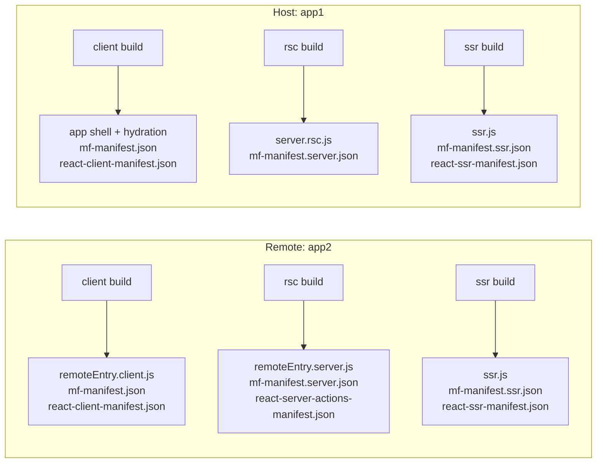
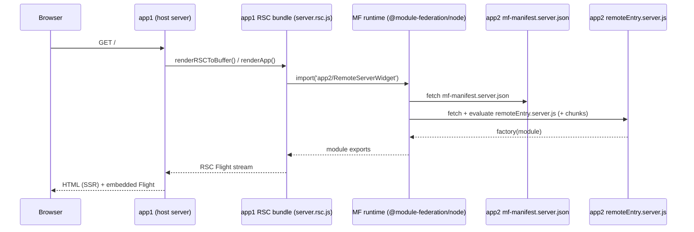
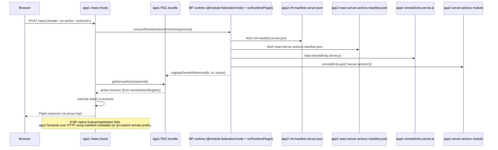
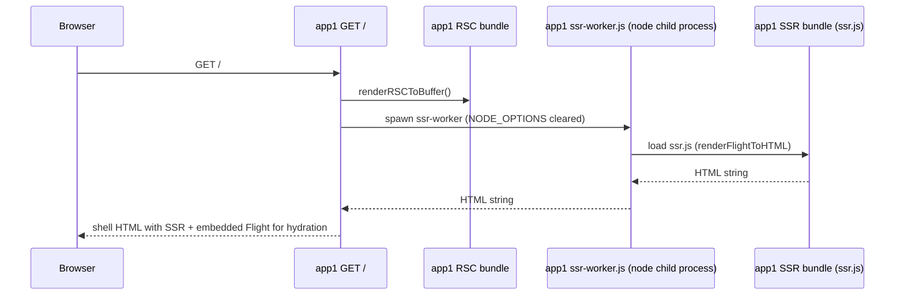

# RSC + Module Federation (rsc-demo) — Implementation Guide

This is the **single, consolidated** doc for the `apps/rsc-demo/` reference implementation: how the build works, how runtime resolution works, and what we changed in `react-server-dom-webpack` (RSDW) to make the whole system “just work”.

## Table of Contents

- [Goals](#goals)
- [Glossary](#glossary)
- [Repo Layout](#repo-layout)
- [Architecture At A Glance](#architecture-at-a-glance)
- [Build System](#build-system)
  - [Three Layers](#three-layers)
  - [Share Scopes](#share-scopes)
  - [Webpack Config Entry Points](#webpack-config-entry-points)
- [Manifests And Metadata](#manifests-and-metadata)
  - [React Manifests](#react-manifests)
  - [MF Manifests](#mf-manifests)
  - [`additionalData.rsc` Fields](#additionaldatarsc-fields)
  - [`manifest.rsc` (build input) vs `additionalData.rsc` (manifest output)](#manifestrsc-build-input-vs-additionaldatarsc-manifest-output)
- [Patched `react-server-dom-webpack` Patch Set](#patched-react-server-dom-webpack-patch-set)
  - [Baseline + Diff Artifact](#baseline--diff-artifact)
  - [What We Changed (Minimal Functional Patch)](#what-we-changed-minimal-functional-patch)
  - [RSC Loaders (Client / RSC / SSR)](#rsc-loaders-client--rsc--ssr)
  - [Server Action Registry (Global)](#server-action-registry-global)
  - [ReactFlightPlugin Patches](#reactflightplugin-patches)
  - [Node Register Patches](#node-register-patches)
- [Runtime Behavior](#runtime-behavior)
  - [Client-Side Federation](#client-side-federation)
  - [Server-Side Federation (RSC)](#server-side-federation-rsc)
  - [SSR Rendering (HTML From Flight)](#ssr-rendering-html-from-flight)
  - [SSR Export Retention (Tree-Shaking Fix)](#ssr-export-retention-tree-shaking-fix)
  - [Federated Server Actions](#federated-server-actions)
- [Testing + CI](#testing--ci)
- [Invariants / Guardrails](#invariants--guardrails)
- [Known Limitations + Follow-Ups](#known-limitations--follow-ups)
- [Appendix](#appendix)

## Goals

- **Monolithic UX** for federated RSC apps: no placeholder components and no silent “render null” fallbacks.
- **MF-native server actions are the default**: remote actions execute **in-process** via Module Federation; HTTP proxying exists only as fallback.
- **No “strict mode” env toggles** required for correctness. (Debug logging exists, but behavior does not change.)
- **Symmetric builds**: both apps build `client` + `rsc` + `ssr`. The demo designates `app1` as the host and `app2` as the remote by configuration (remotes/exposes/ports), not by capability.
- **Layer-correct React resolution**:
  - RSC layer resolves `react-server` exports.
  - SSR + client resolve normal React exports.
- **SSR must not crash** from webpack tree-shaking exports that React reads dynamically.

## Glossary

- **Host**: the app that renders the page and consumes remotes (demo: `app1`).
- **Remote**: the app that provides federated modules (demo: `app2`).
- **Client layer**: browser build.
- **RSC layer**: server build that resolves `react-server` exports (`resolve.conditionNames` includes `react-server`).
- **SSR layer**: server build that renders HTML from an RSC Flight stream (`target: async-node`), and must **not** run with `react-server` conditions at runtime.
- **Share scopes**:
  - `rsc` → RSC server bundles (ensures React resolves to `react-server` builds).
  - `client` → browser and SSR bundles (ensures React resolves to normal client builds).
- **React manifests**:
  - `react-client-manifest.json` (Flight client references)
  - `react-server-actions-manifest.json` (server action IDs → exports)
  - `react-ssr-manifest.json` (SSR module map)
- **MF manifests**:
  - `mf-manifest.json` / `mf-manifest.server.json` / `mf-manifest.ssr.json` (+ `*-stats.json`)
  - `additionalData.rsc` embeds RSC metadata into MF manifests.

## Repo Layout

- Demo app root: `apps/rsc-demo/`
  - Host: `apps/rsc-demo/packages/app1/`
  - Remote: `apps/rsc-demo/packages/app2/`
  - Shared runtime/build helpers: `apps/rsc-demo/packages/app-shared/`
  - Tests (Node + Playwright): `apps/rsc-demo/packages/e2e/`
- Shared demo RSC module (client refs + server actions): `packages/rsc-demo-shared/` (`@rsc-demo/shared`)
- Patched React Server DOM bindings (no vendored distro): `patches/react-server-dom-webpack@19.2.0.patch`
  - Applied to npm `react-server-dom-webpack@19.2.0` via `pnpm.patchedDependencies`
- MF manifest metadata: `packages/manifest/src/rscManifestMetadata.ts`

## Architecture At A Glance

### Build outputs per app (three webpack layers)



### RSC render with a remote Server Component



### MF-native server actions (default) with HTTP fallback



### SSR rendering path (HTML from Flight)



## Build System

This is an Nx + pnpm monorepo. The RSC demo’s build logic is intentionally explicit: you can read “the system” by reading the build scripts.

### Three Layers

Each app builds three outputs:

- **client**: browser JS + `remoteEntry.client.js`
- **rsc**: server bundle that resolves `react-server` exports + `remoteEntry.server.js`
- **ssr**: server bundle for `react-dom/server` HTML rendering + `react-ssr-manifest.json`

The layers exist because “RSC server execution”, “SSR HTML rendering”, and “browser hydration” have incompatible requirements:

- RSC layer must resolve `react-server` exports.
- SSR needs `react-dom/server`, which must not resolve to `react-server`.
- Browser needs normal client builds.

### Share Scopes

We enforce two share scopes:

- `rsc`: used by RSC-layer federation.
- `client`: used by browser and SSR federation.

Every MF config in the demo sets `experiments: { asyncStartup: true }` and avoids `eager: true`.

### Webpack Config Entry Points

- app1 (host):
  - client: `apps/rsc-demo/packages/app1/scripts/client.build.js`
  - rsc: `apps/rsc-demo/packages/app1/scripts/server.build.js`
  - ssr: `apps/rsc-demo/packages/app1/scripts/ssr.build.js`
- app2 (remote):
  - client: `apps/rsc-demo/packages/app2/scripts/client.build.js`
  - rsc: `apps/rsc-demo/packages/app2/scripts/server.build.js`
  - ssr: `apps/rsc-demo/packages/app2/scripts/ssr.build.js`

Both apps also have a `scripts/build.js` runner that cleans `build/` and runs the three compilations:

- `apps/rsc-demo/packages/app1/scripts/build.js`
- `apps/rsc-demo/packages/app2/scripts/build.js`

## Manifests And Metadata

### React Manifests

Generated by `react-server-dom-webpack/plugin` (npm + pnpm patch):

- `react-client-manifest.json` (client refs for Flight)
- `react-server-actions-manifest.json` (server action IDs)
- `react-ssr-manifest.json` (SSR module map)

### MF Manifests

Generated by MF enhanced plugin:

- `mf-manifest.json` (client layer)
- `mf-manifest.server.json` (rsc layer)
- `mf-manifest.ssr.json` (ssr layer)

### `additionalData.rsc` Fields

The MF manifest plugin attaches RSC metadata in:
- `packages/manifest/src/rscManifestMetadata.ts`

Core fields used by the demo:

- `additionalData.rsc.layer`: `client | rsc | ssr`
- `additionalData.rsc.shareScope`: `client | rsc`
- `additionalData.rsc.isRSC`: boolean
- `additionalData.rsc.conditionNames`: for debugging / reproducibility
- `additionalData.rsc.clientComponents`: registry used by SSR to map Flight client references → SSR module IDs

In the demo, app2 also publishes:
- `additionalData.rsc.exposeTypes` (auto-generated from the compilation module graph), which the runtime plugin uses to decide what to register as actions.

### `manifest.rsc` (build input) vs `additionalData.rsc` (manifest output)

In this repo, we treat **MF manifests as the transport** for RSC metadata.

- **Build-time input**: each `ModuleFederationPlugin` instance can pass `manifest.rsc` config.
  - In the demo apps we intentionally keep this minimal (typically `manifest: { rsc: {} }`) and let the manifest plugin infer defaults from the compilation (layer, shareScope, exposeTypes, etc.).
- **Build-time output**: the manifest plugin computes/normalizes and then writes the final object into:
  - `mf-manifest*.json` → `additionalData.rsc` (and also `rsc` for convenience)

The normalizer lives here:
- `packages/manifest/src/rscManifestMetadata.ts`

Practical schema (subset used by the demo):

```ts
type RscLayer = 'client' | 'rsc' | 'ssr';
type RscShareScope = 'client' | 'rsc';

interface ManifestRscOptions {
  layer?: RscLayer;
  shareScope?: RscShareScope;
  isRSC?: boolean;
  conditionNames?: string[];

  // Optional: published manifest asset names (or absolute URLs).
  // In this repo we publish asset names like `react-server-actions-manifest.json`,
  // and runtimes resolve them relative to the remote mf-manifest URL (no hard-coded hostnames).
  serverActionsManifest?: string;
  clientManifest?: string;

  // Optional: classify exposes so runtime can treat some as server actions
  exposeTypes?: Record<string, 'client-component' | 'server-component' | 'server-action' | 'server-action-stubs'>;

  // Optional override: client component registry for SSR moduleMap resolution.
  // If omitted, `rscManifestMetadata.ts` derives it from React manifests:
  // - client layer: react-client-manifest.json
  // - ssr layer: react-ssr-manifest.json (preferred) or react-client-manifest.json (fallback)
  clientComponents?: Record<string, any>;
}
```

Where `additionalData.rsc.clientComponents` comes from (when not overridden):

- client build: derived from `react-client-manifest.json`
- ssr build: derived from `react-ssr-manifest.json` (preferred), otherwise from `react-client-manifest.json`

Where this metadata is consumed:

- **SSR worker**: preloads `globalThis.__RSC_SSR_REGISTRY__` from `mf-manifest.ssr.json` (required):
  - `apps/rsc-demo/packages/app1/server/ssr-worker.js`
  - `apps/rsc-demo/packages/app2/server/ssr-worker.js`
- **MF-native server actions**: runtime plugin uses:
  - `exposeTypes` to detect `server-action` exposes
  - `serverActionsManifest` (published asset name/URL) to fetch action IDs
  - `apps/rsc-demo/packages/app-shared/scripts/rscRuntimePlugin.js`

## Patched `react-server-dom-webpack` Patch Set

We patch npm `react-server-dom-webpack@19.2.0` (via `pnpm.patchedDependencies`) so we can:

- expose stable, consumable loader entrypoints (`rsc-*-loader`)
- emit manifests early enough for MF compilation hooks
- provide a server action registry that survives MF share-scope / module duplication edge cases

### Baseline + Diff Artifact

- Baseline: npm `react-server-dom-webpack@19.2.0`
- Minimal functional diff artifact (applied patch): `patches/react-server-dom-webpack@19.2.0.patch`

### What We Changed (Minimal Functional Patch)

Patched/added files (functional, inside the npm package):

- `package.json`
  - exports new loader entrypoints:
    - `react-server-dom-webpack/rsc-client-loader`
    - `react-server-dom-webpack/rsc-server-loader`
    - `react-server-dom-webpack/rsc-ssr-loader`
- `server.node.js`
  - wraps `registerServerReference()` to populate a global registry on `globalThis`
  - exports `getServerAction()`, `getDynamicServerActionsManifest()`, `clearServerActionRegistry()`
- `server.node.unbundled.js`
  - similar registry behavior for unbundled node usage
- `cjs/react-server-dom-webpack-plugin.js`
  - emits manifests at `PROCESS_ASSETS_STAGE_SUMMARIZE`
  - emits `react-server-actions-manifest.json` and merges action entries from loaders
- `cjs/react-server-dom-webpack-node-register.js`
  - supports inline `'use server'` functions by injecting registration calls
- Added loaders:
  - `cjs/rsc-client-loader.js`
  - `cjs/rsc-server-loader.js`
  - `cjs/rsc-ssr-loader.js`

### RSC Loaders (Client / RSC / SSR)

Loader entrypoints used by the demo:

- **client layer**: `react-server-dom-webpack/rsc-client-loader`
  - turns file-level `'use server'` exports into `createServerReference()` stubs
  - records entries into a **per-output-path** `serverReferencesMap`
    (read by build plugins via `getServerReferencesMap(context)`)
- **rsc layer**: `react-server-dom-webpack/rsc-server-loader`
  - turns `'use client'` modules into `createClientModuleProxy(file://...)`
  - registers file-level `'use server'` exports via `registerServerReference`
  - registers named inline `'use server'` functions and records them into `inlineServerActionsMap`
- **ssr layer**: `react-server-dom-webpack/rsc-ssr-loader`
  - replaces `'use server'` exports with throw-stubs (SSR must not execute actions)

### Server Action Bootstrapping (No Manual Requires)

Why this exists:
- `'use server'` modules imported from **client components** are transformed by the
  client loader and are **not** reachable from the RSC server entry graph.
- Those modules still need to **execute once** so their `registerServerReference(...)`
  side effects run and the server action registry is populated.

How it works (webpack-native, no filesystem scanning):
- **Client build** uses `CollectServerActionsPlugin` to read
  `rsc-client-loader.getServerReferencesMap(context)` and record the module URLs
  of every file-level `'use server'` module seen by the client compilation.
- **RSC server build** uses `ServerActionsBootstrapPlugin` to:
  1. **wait** for that module list (shared in-process registry)
  2. generate a **virtual bootstrap entry** that `require()`s each action module
  3. add the virtual module as an **additional entry dependency** so it executes
     during server startup (no runtime monkey‑patching)
- **Build order matters**: the client build must run **before** the server build
  so the registry is populated. The demo build scripts already run
  `client → server → ssr` sequentially.

Result:
- No `require(...)` lists in `server-entry.js`
- No generated bootstrap file on disk (virtual module)
- Server actions register consistently without runtime monkey‑patching

### Server Action Registry (Global)

Why a global registry exists:

- In MF scenarios it’s possible to end up with multiple module instances of RSDW across different containers/chunks.
- Without a shared registry, actions can be registered in one instance and looked up in another, yielding “missing action” failures.

Where:
- `react-server-dom-webpack/server.node`

Exports used by the demo host:
- `getServerAction(actionId)`
- `getDynamicServerActionsManifest()`

### ReactFlightPlugin Patches

Where:
- `react-server-dom-webpack/plugin` (patches `cjs/react-server-dom-webpack-plugin.js`)

What changed:

- emit `react-client-manifest.json` and `react-server-actions-manifest.json` earlier (`PROCESS_ASSETS_STAGE_SUMMARIZE`) so MF’s compilation hooks can read them
- merge server actions from:
  - AST-discovered `'use server'` file exports
- `serverReferencesMap` (client loader; per output path)
  - `inlineServerActionsMap` (server loader)

### Node Register Patches

Where:
- `react-server-dom-webpack/node-register` (patches `cjs/react-server-dom-webpack-node-register.js`)

What changed:
- adds “inline action” detection (functions whose body begins with `'use server'`) and injects `registerServerReference(...)` calls so those actions are discoverable.

## Runtime Behavior

### Client-Side Federation

Client-side federation is demonstrated by:
- `apps/rsc-demo/packages/app1/src/RemoteButton.js`

Behavior:
- loads `app2/Button` via MF on the client after mount
- **throws** on load failure (no “unavailable” placeholder UI)

### Server-Side Federation (RSC)

Server-side federation is demonstrated by:
- `apps/rsc-demo/packages/app1/src/FederatedDemo.server.js`

Behavior:
- RSC server imports `app2/RemoteServerWidget` and renders it as part of the server component tree.

### SSR Rendering (HTML From Flight)

SSR is implemented via:

- SSR worker (separate process without `react-server`):
  - `apps/rsc-demo/packages/app1/server/ssr-worker.js`
  - `apps/rsc-demo/packages/app2/server/ssr-worker.js`
- SSR bundle entry:
  - `apps/rsc-demo/packages/app1/src/framework/ssr-entry.js`
  - `apps/rsc-demo/packages/app2/src/framework/ssr-entry.js`

Key points:

- The server renders RSC to a Flight buffer.
- The worker loads `build/ssr.js` and calls `renderFlightToHTML(flightBuffer, clientManifest)`.
- SSR resolves client references using a preloaded registry (`globalThis.__RSC_SSR_REGISTRY__`) built from `mf-manifest.ssr.json` (`additionalData.rsc.clientComponents`).

### SSR Export Retention (Tree-Shaking Fix)

The real SSR failure mode is webpack tree-shaking:

- React SSR reads exports dynamically from the SSR bundle.
- Webpack can’t see those accesses statically → it can prune exports → SSR renders an `undefined` export.

Fix (build-time, not runtime placeholders):

- `apps/rsc-demo/packages/app-shared/scripts/AutoIncludeClientComponentsPlugin.js`
  - reads `react-client-manifest.json`
  - `compilation.addInclude(...)` for every referenced client module
  - calls `moduleGraph.getExportsInfo(mod).setUsedInUnknownWay(runtime)` so webpack keeps exports

SSR bundle config also sets:
- `optimization.mangleExports = false`
- `optimization.concatenateModules = false`

### Federated Server Actions

Server actions have two execution paths:

1) **MF-native (default)**: remote action executes in-process via MF.
2) **HTTP forwarding (fallback)**: host proxies the Flight request to the remote, using manifest metadata (or an explicit `remote:<name>:` prefix) to identify the target.

#### MF-native path (default)

Pieces:

- Host action handler calls `ensureRemoteActionsRegistered(actionId)`:
  - `apps/rsc-demo/packages/app1/server/api.server.js`
- Host uses the federation runtime to bootstrap remote action modules from manifest metadata:
  - `apps/rsc-demo/packages/app-shared/scripts/rscRuntimePlugin.js` (`ensureRemoteActionsForAction()` / `ensureRemoteServerActions()`)
- Runtime plugin registers actions on remote load:
  - `apps/rsc-demo/packages/app-shared/scripts/rscRuntimePlugin.js`

How registration works:

- Runtime plugin loads remote `mf-manifest.server.json` (next to `remoteEntry.server.js`) and reads `additionalData.rsc.exposeTypes`.
- For exposes marked `server-action`, it fetches `react-server-actions-manifest.json`.
- It loads the expose module and calls `registerServerReference(fn, id, exportName)` for each manifest entry.
- Patched RSDW stores these in `globalThis.__RSC_SERVER_ACTION_REGISTRY__`, so `getServerAction(actionId)` works from the host.

#### HTTP forwarding fallback

Where:
- `apps/rsc-demo/packages/app1/server/api.server.js` (`forwardActionToRemote`)

Behavior:
- if `getServerAction(actionId)` is missing after MF-native registration attempts, the host resolves the remote via manifests (or explicit prefix) and proxies the Flight request to the remote `/react`.

## Testing + CI

Local:

- build packages: `pnpm -w build:pkg`
- RSC tests: `npx nx run rsc-demo:test:rsc --skip-nx-cache`
- Playwright E2E: `npx nx run rsc-demo:test:e2e --skip-nx-cache`

CI:

- Adds an RSC E2E workflow: `.github/workflows/e2e-rsc.yml`
- The main workflow includes the RSC E2E job: `.github/workflows/build-and-test.yml`

What we assert in tests:

- remote client component loads via MF and is interactive
- remote server component renders in the host server component tree
- MF-native server actions execute with **no proxy hop** (asserted via response headers)
- SSR is deterministic and doesn’t require placeholder components

## Invariants / Guardrails

- MF configs must set `experiments: { asyncStartup: true }`.
- Do **not** use `eager: true` for shared modules; async init is expected.
- Keep share scopes separated by layer: `rsc` vs `client`.
- SSR worker must not run with `react-server` condition at runtime (`NODE_OPTIONS` stripped).

## Known Limitations + Follow-Ups

- Full server-side federation of `'use client'` components (rendering remote client islands via SSR) needs a more general registry/manifest merge strategy. The demo shows the shape and keeps the hard problems explicit.
- HTTP forwarding exists as fallback for robustness; long-term production usage should aim to make MF-native the only path.

## Appendix

### RSDW diff reproduction

The minimal functional diff is checked in:
- `patches/react-server-dom-webpack@19.2.0.patch`

To reproduce a file-level diff locally (npm package vs patched package):

```bash
tmpdir="$(mktemp -d)"
cd "$tmpdir"
npm pack react-server-dom-webpack@19.2.0
tar -xzf react-server-dom-webpack-19.2.0.tgz
cp -R package package.orig
patch -d package -p1 < /path/to/core/patches/react-server-dom-webpack@19.2.0.patch
diff -ruN package.orig package || true
```
