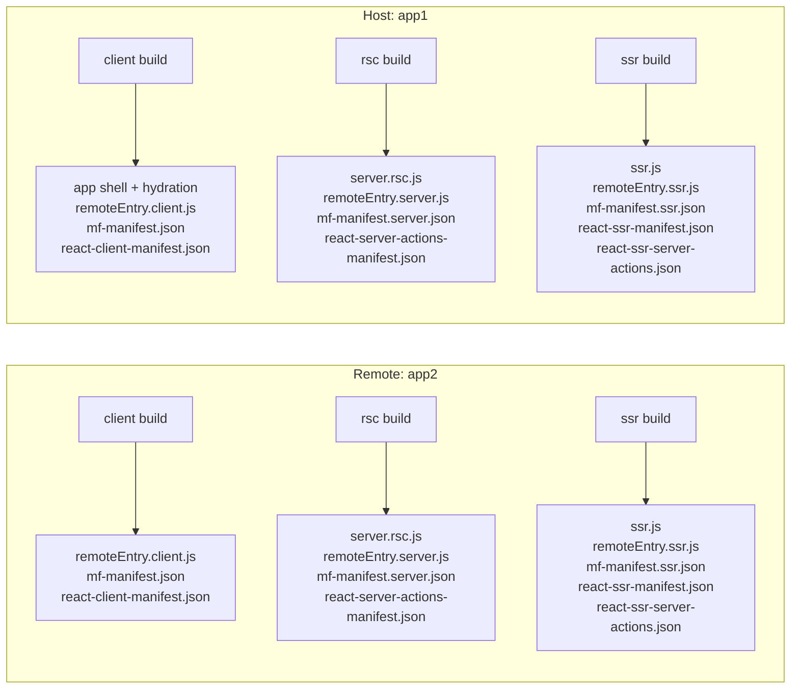
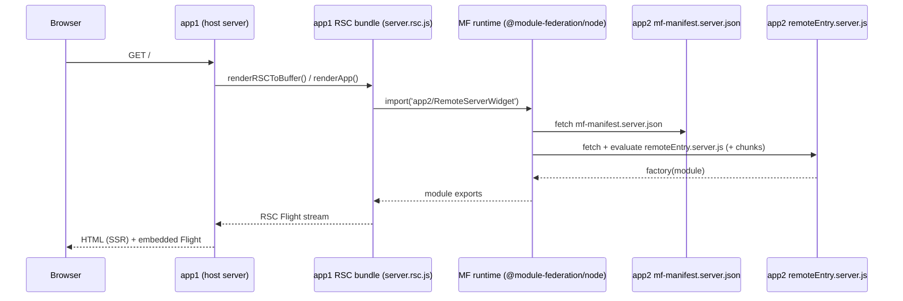
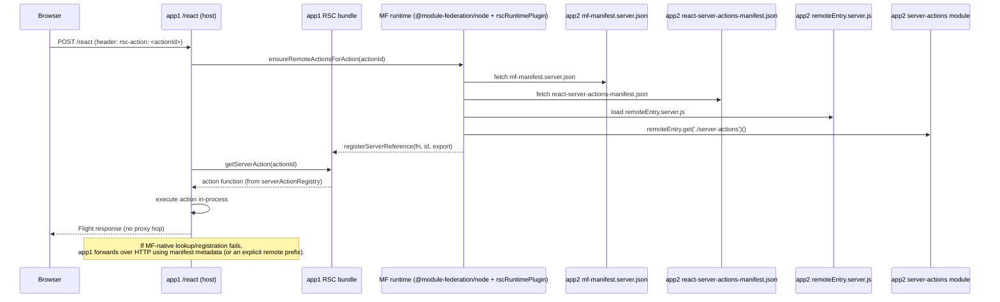
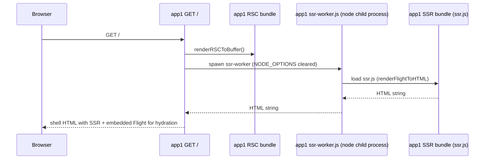

# RSC + Module Federation (rsc-demo) — Implementation Guide

This is the **single, consolidated** doc for the `apps/rsc-demo/` reference implementation: how the build works, how runtime resolution works, and what we changed in `react-server-dom-webpack` (RSDW) to make the whole system “just work”.

## Table of Contents

- [Goals](#goals)
- [Glossary](#glossary)
- [Repo Layout](#repo-layout)
- [Architecture At A Glance](#architecture-at-a-glance)
- [Build System](#build-system)
  - [Three Layers](#three-layers)
  - [Share Scopes](#share-scopes)
  - [Shared Packages (Rslib, Bundleless)](#shared-packages-rslib-bundleless)
  - [Webpack Config Entry Points](#webpack-config-entry-points)
  - [Build Orchestration (Multi-Compiler)](#build-orchestration-multi-compiler)
- [Recreate / Run The Demo](#recreate--run-the-demo)
- [Manifests And Metadata](#manifests-and-metadata)
  - [React Manifests](#react-manifests)
  - [MF Manifests](#mf-manifests)
  - [`additionalData.rsc` Fields](#additionaldatarsc-fields)
  - [`manifest.rsc` (build input) vs `additionalData.rsc` (manifest output)](#manifestrsc-build-input-vs-additionaldatarsc-manifest-output)
- [Patched `react-server-dom-webpack` Patch Set](#patched-react-server-dom-webpack-patch-set)
  - [Baseline + Diff Artifact](#baseline--diff-artifact)
  - [What We Changed (Minimal Functional Patch)](#what-we-changed-minimal-functional-patch)
  - [RSC Loaders (Client / RSC / SSR)](#rsc-loaders-client--rsc--ssr)
  - [Server Action Registry (Global)](#server-action-registry-global)
  - [ReactFlightPlugin Patches](#reactflightplugin-patches)
  - [Node Register Patches](#node-register-patches)
- [Runtime Behavior](#runtime-behavior)
  - [Client-Side Federation](#client-side-federation)
  - [Server-Side Federation (RSC)](#server-side-federation-rsc)
  - [Runtime Plugin Hooks + Manifest Resolution](#runtime-plugin-hooks--manifest-resolution)
  - [SSR Rendering (HTML From Flight)](#ssr-rendering-html-from-flight)
  - [SSR Export Retention (Tree-Shaking Fix)](#ssr-export-retention-tree-shaking-fix)
  - [Federated Server Actions](#federated-server-actions)
- [Testing + CI](#testing--ci)
- [React Version Compatibility](#react-version-compatibility)
- [Invariants / Guardrails](#invariants--guardrails)
- [Known Limitations + Follow-Ups](#known-limitations--follow-ups)
- [Appendix](#appendix)
  - [Next.js loader conventions (reference)](#nextjs-loader-conventions-reference)

## Goals

- **Monolithic UX** for federated RSC apps: no placeholder components and no silent “render null” fallbacks.
- **MF-native server actions are the default**: remote actions execute **in-process** via Module Federation; HTTP proxying exists only as fallback.
- **No “strict mode” env toggles** required for correctness. (Debug logging exists, but behavior does not change.)
- **Symmetric builds**: both apps build `client` + `rsc` + `ssr`. The demo designates `app1` as the host and `app2` as the remote by configuration (remotes/exposes/ports), not by capability.
- **Layer-correct React resolution**:
  - RSC layer resolves `react-server` exports.
  - SSR + client resolve normal React exports.
- **SSR must not crash** from webpack tree-shaking exports that React reads dynamically.

## Glossary

- **Host**: the app that renders the page and consumes remotes (demo: `app1`).
- **Remote**: the app that provides federated modules (demo: `app2`).
- **Client layer**: browser build.
- **RSC layer**: server build that resolves `react-server` exports (`resolve.conditionNames` includes `react-server`).
- **SSR layer**: server build that renders HTML from an RSC Flight stream (`target: async-node`), and must **not** run with `react-server` conditions at runtime.
- **Share scopes**:
  - `rsc` → RSC server bundles (ensures React resolves to `react-server` builds).
  - `client` → browser and SSR bundles (ensures React resolves to normal client builds).
- **React manifests**:
  - `react-client-manifest.json` (Flight client references)
  - `react-server-actions-manifest.json` (server action IDs → exports)
  - `react-ssr-manifest.json` (SSR module map)
  - `react-ssr-server-actions.json` (SSR stub manifest; actions throw in SSR)
- **MF manifests**:
  - `mf-manifest.json` / `mf-manifest.server.json` / `mf-manifest.ssr.json` (+ `*-stats.json`)
  - `additionalData.rsc` embeds RSC metadata into MF manifests.

## Repo Layout

- Demo app root: `apps/rsc-demo/`
  - Host: `apps/rsc-demo/app1/`
  - Remote: `apps/rsc-demo/app2/`
  - Shared framework (demo app shell + router, built with Rslib): `apps/rsc-demo/framework/`
  - Shared demo module (client-safe exports + shared server actions, built with Rslib): `apps/rsc-demo/shared/`
  - Build/seed helpers shared by app1/app2: `apps/rsc-demo/scripts/shared/`
  - Tests (Node + Playwright): `apps/rsc-demo/e2e/`
- Shared RSC MF tooling (webpack + runtime plugins, built with Rslib): `packages/rsc/`
- `@rsc-demo/shared` exports:
  - Client-safe + shared server actions: `apps/rsc-demo/shared/src/index.js`
  - Server-only exports (DB + server components): `apps/rsc-demo/shared/src/server.js` (imported as `@rsc-demo/shared/server`)
- Patched React Server DOM bindings (no vendored distro): `patches/react-server-dom-webpack@19.2.0.patch`
  - Applied to npm `react-server-dom-webpack@19.2.0` via `pnpm.patchedDependencies`
- MF manifest metadata: `packages/manifest/src/rscManifestMetadata.ts`

## Architecture At A Glance

### Build outputs per app (three webpack layers)



### RSC render with a remote Server Component



### MF-native server actions (default) with HTTP fallback



### SSR rendering path (HTML from Flight)



## Build System

This is an Nx + pnpm monorepo. The RSC demo’s build logic is intentionally explicit: you can read “the system” by reading the build scripts.

### Three Layers

Each app builds three outputs:

- **client**: browser JS + `remoteEntry.client.js`
- **rsc**: server bundle that resolves `react-server` exports + `remoteEntry.server.js`
- **ssr**: server bundle for `react-dom/server` HTML rendering + `react-ssr-manifest.json`

The layers exist because “RSC server execution”, “SSR HTML rendering”, and “browser hydration” have incompatible requirements:

- RSC layer must resolve `react-server` exports.
- SSR needs `react-dom/server`, which must not resolve to `react-server`.
- Browser needs normal client builds.

### Share Scopes

We enforce two share scopes:

- `rsc`: used by RSC-layer federation.
- `client`: used by browser and SSR federation.

Every MF config in the demo sets `experiments: { asyncStartup: true }` and avoids `eager: true`.

Note:
- Share scopes are set by the webpack configs. The runtime plugin **reads** `additionalData.rsc`
  but does not override share scopes at runtime.

### Shared Packages (Rslib, Bundleless)

Two workspace packages power the demo app shell and shared RSC bits:

- `@rsc-demo/framework` (`apps/rsc-demo/framework/`)
- `@rsc-demo/shared` (`apps/rsc-demo/shared/`)

Both are built with **Rslib** in **bundleless** mode (output mirrors `src/`):

- ESM + CJS outputs (ES2021 syntax), plus `.d.ts` for ESM.
- Outputs live under `dist/` but preserve `src/`-relative paths (`outBase: 'src'`).

To keep RSC directives intact through Rslib/Rspack:

- `@module-federation/rsc/webpack/preserveRscDirectivesLoader` marks `buildInfo.rscDirective`
  when it sees a leading `'use client'` / `'use server'`.
- `@module-federation/rsc/webpack/PreserveRscDirectivesPlugin` re-injects the directive
  at the top of emitted JS assets if it was stripped.

This ensures:

- MF manifest `exposeTypes` inference can still read directives in shared packages.
- Webpack loaders (`rsc-*`) see correct directives when consuming workspace packages.

Configured in:

- `apps/rsc-demo/shared/rslib.config.ts`
- `apps/rsc-demo/framework/rslib.config.ts`

`packages/rsc/` (the tooling package) is also built with Rslib bundleless output and is consumed as a workspace dependency.

### Webpack Config Entry Points

- app1 (host):
  - client: `apps/rsc-demo/app1/scripts/client.build.js`
  - rsc: `apps/rsc-demo/app1/scripts/server.build.js`
  - ssr: `apps/rsc-demo/app1/scripts/ssr.build.js`
- app2 (remote):
  - client: `apps/rsc-demo/app2/scripts/client.build.js`
  - rsc: `apps/rsc-demo/app2/scripts/server.build.js`
  - ssr: `apps/rsc-demo/app2/scripts/ssr.build.js`

Notes:

- Client builds include `ClientServerActionsBootstrapPlugin`, which adds include edges for every `'use server'` module (from the compilation graph or the `rsc-client-loader` map) and marks their exports as used so client stubs are not tree-shaken away.
- Host server remotes can be overridden for local dev via `APP2_REMOTE_URL` (defaults to `http://localhost:4102/mf-manifest.server.json`).
- RSC remotes use `remoteType: 'script'`, and **remote** server containers emit `library: { type: 'commonjs-module' }`
  so the Node runtime can execute remotes + chunks (see `app2` RSC build).
- SSR remotes are manifest URLs (`mf-manifest.ssr.json`) and rely on the Node runtime defaults
  (no explicit `remoteType` in SSR configs).

Both apps also have a `scripts/build.js` runner that cleans `build/` and runs the three compilations:

- `apps/rsc-demo/app1/scripts/build.js`
- `apps/rsc-demo/app2/scripts/build.js`

### Build Orchestration (Multi-Compiler)

Both app build scripts delegate to a shared runner:

- `apps/rsc-demo/scripts/shared/build.js`

That runner uses **webpack multi-compiler** (`webpack([client, rsc, ssr])`) so all three layers execute **in a single Node process**. This is required for:

- **Server action bootstrapping** (client → server in-memory registry)
- **SSR client include retention** (client manifest registry → SSR include list)

There is **no disk fallback** for these registries. If you split the builds across processes or machines, those handoffs will fail by design.

## Recreate / Run The Demo

### Local build + run (recommended)

```bash
pnpm install
pnpm -w build

# In separate terminals:
pnpm -C apps/rsc-demo start:app2
pnpm -C apps/rsc-demo start:app1
```

Defaults:
- app1 (host) → `http://localhost:4101`
- app2 (remote) → `http://localhost:4102`

Optional overrides:
- `APP2_REMOTE_URL` to point app1 at a different remote manifest URL.
- `PORT` to change the server port (either app).

### Nx equivalents

```bash
npx nx run rsc-demo:build

# In separate terminals:
npx nx run rsc-demo:serve:app2
npx nx run rsc-demo:serve:app1
```

Notes:
- The build must run as a **multi-compiler** in one process (the shared build script already does this).
- If you split the client/RSC/SSR builds across processes, server action bootstrapping and SSR
  export retention will fail by design.

Quick sanity check:
- Visit `http://localhost:4101` and confirm the remote server component (from app2) renders
  inside the host page, and the federated client button loads and responds to clicks.


## Manifests And Metadata

### React Manifests

Generated by `react-server-dom-webpack/plugin` (npm + pnpm patch):

- `react-client-manifest.json` (client refs for Flight)
- `react-server-actions-manifest.json` (server action IDs)
- `react-ssr-manifest.json` (SSR module map)
- `react-ssr-server-actions.json` (SSR stub manifest; actions throw during SSR)

### MF Manifests

Generated by MF enhanced plugin:

- `mf-manifest.json` (client layer)
- `mf-manifest.server.json` (rsc layer)
- `mf-manifest.ssr.json` (ssr layer)

In the demo, server + SSR builds set explicit `manifest.fileName` (`mf-manifest.server` / `mf-manifest.ssr`) so each layer’s manifest is written alongside its `remoteEntry.*.js` and can be consumed directly as a “manifest remote.”

### `additionalData.rsc` Fields

The MF manifest plugin attaches RSC metadata in:
- `packages/manifest/src/rscManifestMetadata.ts`

Core fields used by the demo:

- `additionalData.rsc.layer`: `client | rsc | ssr`
- `additionalData.rsc.shareScope`: `client | rsc`
- `additionalData.rsc.isRSC`: boolean
- `additionalData.rsc.conditionNames`: for debugging / reproducibility
- `additionalData.rsc.clientComponents`: registry used by SSR to map Flight client references → SSR module IDs
  - Present on **client + ssr** manifests (not on rsc).
  - Entries include `request`, `ssrRequest`, `chunks`, and `exports`.
- `additionalData.rsc.serverActionsManifest`: published asset name (rsc layer only) when `react-server-actions-manifest.json` exists
- `additionalData.rsc.clientManifest`: published asset name (client/ssr layer) when `react-client-manifest.json` exists
- `additionalData.rsc.exposeTypes`: classification of exposes derived from module directives
  (`server-component`, `client-component`, `server-action`, `server-action-stubs`)
- `additionalData.rsc.remote` (optional pass-through): remote metadata if provided via `manifest.rsc.remote`
  (e.g. `name`, `entry`, `url`, `actionsEndpoint`, `actionsEndpointPath`, `manifestUrl`)

In the demo, each app publishes:
- `additionalData.rsc.exposeTypes` (auto-generated from the compilation module graph), which the runtime plugin uses to decide what to register as actions.

How `exposeTypes` is inferred:

- The manifest plugin walks the compilation module graph and builds a **directive index**
  from `module.buildInfo.rscDirective`.
- `rsc-*` loaders set this field for webpack builds.
- `preserveRscDirectivesLoader` sets the same field for Rslib bundleless outputs.

### `manifest.rsc` (build input) vs `additionalData.rsc` (manifest output)

In this repo, we treat **MF manifests as the transport** for RSC metadata.

- **Build-time input**: each `ModuleFederationPlugin` instance can pass `manifest.rsc` config.
  - In the demo apps we intentionally keep this minimal (typically `manifest: { rsc: {} }`) and let the manifest plugin infer defaults from the compilation (layer, shareScope, exposeTypes, etc.).
  - Any custom `manifest.rsc` fields (e.g. `remote`, `actionsEndpointPath`) are **pass‑through** and will appear in `additionalData.rsc`.
- **Build-time output**: the manifest plugin computes/normalizes and then writes the final object into:
  - `mf-manifest*.json` → `additionalData.rsc` (and also `rsc` for convenience)

The normalizer lives here:
- `packages/manifest/src/rscManifestMetadata.ts`

Practical schema (subset used by the demo):

```ts
type RscLayer = 'client' | 'rsc' | 'ssr';
type RscShareScope = 'client' | 'rsc';

interface ManifestRscOptions {
  layer?: RscLayer;
  shareScope?: RscShareScope;
  isRSC?: boolean;
  conditionNames?: string[];

  // Optional: published manifest asset names (or absolute URLs).
  // In this repo we publish asset names like `react-server-actions-manifest.json`,
  // and runtimes resolve them relative to the remote mf-manifest URL (no hard-coded hostnames).
  serverActionsManifest?: string;
  clientManifest?: string;

  // Optional: relative path for HTTP actions endpoint fallback (default: /react).
  actionsEndpointPath?: string;

  // Optional: remote metadata (pass-through). Used by rscRuntimePlugin if provided.
  remote?: {
    name?: string;
    entry?: string;
    url?: string;
    actionsEndpoint?: string;
    actionsEndpointPath?: string;
    manifestUrl?: string;
  };

  // Optional: classify exposes so runtime can treat some as server actions
  exposeTypes?: Record<string, 'client-component' | 'server-component' | 'server-action' | 'server-action-stubs'>;

  // Optional override: client component registry for SSR moduleMap resolution.
  // If omitted, `rscManifestMetadata.ts` derives it from React manifests:
  // - client layer: react-client-manifest.json
  // - ssr layer: react-ssr-manifest.json (preferred) or react-client-manifest.json (fallback)
  clientComponents?: Record<string, any>;
}
```

Where `additionalData.rsc.clientComponents` comes from (when not overridden):

- client build: derived from `react-client-manifest.json`
- ssr build: derived from `react-ssr-manifest.json` (preferred), otherwise from `react-client-manifest.json`

Client manifest canonicalization:

- Client builds run `CanonicalizeClientManifestPlugin`, which removes `dist/` entries from `react-client-manifest.json` when an equivalent `src/` or `framework/` entry exists. This keeps SSR registry keys stable and avoids duplicate client reference paths.

Where this metadata is consumed:

- **SSR worker**: preloads `globalThis.__RSC_SSR_REGISTRY__` from `mf-manifest.ssr.json` (required):
  - `apps/rsc-demo/app1/server/ssr-worker.js`
  - `apps/rsc-demo/app2/server/ssr-worker.js`
- **SSR runtime plugin**: merges remote registries during federation snapshot load:
  - `packages/rsc/runtime/rscSSRRuntimePlugin.ts`
- **MF-native server actions**: runtime plugin uses:
  - `exposeTypes` to detect `server-action` exposes
  - `serverActionsManifest` (published asset name/URL) to fetch action IDs
  - `packages/rsc/runtime/rscRuntimePlugin.ts`

## Patched `react-server-dom-webpack` Patch Set

We patch npm `react-server-dom-webpack@19.2.0` (via `pnpm.patchedDependencies`) so we can:

- expose stable, consumable loader entrypoints (`rsc-*-loader`)
- emit manifests early enough for MF compilation hooks
- provide a server action registry that survives MF share-scope / module duplication edge cases

### Baseline + Diff Artifact

- Baseline: npm `react-server-dom-webpack@19.2.0`
- Minimal functional diff artifact (applied patch): `patches/react-server-dom-webpack@19.2.0.patch`

### What We Changed (Minimal Functional Patch)

Patched/added files (functional, inside the npm package):

- `package.json`
  - exports new loader entrypoints:
    - `react-server-dom-webpack/rsc-client-loader`
    - `react-server-dom-webpack/rsc-server-loader`
    - `react-server-dom-webpack/rsc-ssr-loader`
- `server.node.js`
  - wraps `registerServerReference()` to populate a global registry on `globalThis`
  - exports `getServerAction()`, `getDynamicServerActionsManifest()`, `clearServerActionRegistry()`
- `server.node.unbundled.js`
  - similar registry behavior for unbundled node usage
- `cjs/react-server-dom-webpack-plugin.js`
  - emits manifests at `PROCESS_ASSETS_STAGE_SUMMARIZE`
  - emits `react-server-actions-manifest.json` and merges action entries from loaders
- `cjs/react-server-dom-webpack-node-register.js`
  - supports inline `'use server'` functions by injecting registration calls
- Added loaders:
  - `cjs/rsc-client-loader.js`
  - `cjs/rsc-server-loader.js`
  - `cjs/rsc-ssr-loader.js`

### RSC Loaders (Client / RSC / SSR)

Loader entrypoints used by the demo:

- **client layer**: `react-server-dom-webpack/rsc-client-loader`
  - turns file-level `'use server'` exports into `createServerReference()` stubs
  - records entries into a **per-output-path** `serverReferencesMap`
    (read by build plugins via `getServerReferencesMap(context)`)
  - sets `module.buildInfo.rscDirective = 'use server'` for manifest inference
- **rsc layer**: `react-server-dom-webpack/rsc-server-loader`
  - turns `'use client'` modules into `createClientModuleProxy(file://...)`
  - registers file-level `'use server'` exports via `registerServerReference`
  - registers named inline `'use server'` functions and records them into `inlineServerActionsMap`
  - sets `module.buildInfo.rscDirective` for manifest inference
- **ssr layer**: `react-server-dom-webpack/rsc-ssr-loader`
  - replaces `'use server'` exports with throw-stubs (SSR must not execute actions)
  - does **not** currently set `module.buildInfo.rscDirective` (SSR builds in the demo
    don’t rely on expose-type inference)

### Server Action Bootstrapping (No Manual Requires)

Why this exists:
- `'use server'` modules imported from **client components** are transformed by the
  client loader and are **not** reachable from the RSC server entry graph.
- Those modules still need to **execute once** so their `registerServerReference(...)`
  side effects run and the server action registry is populated.

How it works (webpack-native, no filesystem scanning):
- **Client build** uses `CollectServerActionsPlugin` to read
  `rsc-client-loader.getServerReferencesMap(context)` and record the module URLs
  of every file-level `'use server'` module seen by the client compilation.
- The module list is stored in an in-memory registry keyed by **output path** (or compiler context)
  in `packages/rsc/webpack/serverActionsRegistry.ts`.
- **RSC server build** uses `ServerActionsBootstrapPlugin` to:
  1. **wait** for that module list (shared in-process registry)
  2. generate a **virtual bootstrap entry** that `require()`s each action module
  3. add the virtual module as an **additional entry dependency** so it executes
     during server startup (no runtime monkey‑patching)
- **Build execution model**: the demo runs all three webpack configs via **multi-compiler** in one process.
  The server build waits for the client build to populate the in-memory registry.
  If you split the builds across processes, server action bootstrapping will fail (by design — we removed disk fallbacks).

Result:
- No `require(...)` lists in `server-entry.js`
- No generated bootstrap file on disk (virtual module)
- Server actions register consistently without runtime monkey‑patching

### Server Action Registry (Global)

Why a global registry exists:

- In MF scenarios it’s possible to end up with multiple module instances of RSDW across different containers/chunks.
- Without a shared registry, actions can be registered in one instance and looked up in another, yielding “missing action” failures.

Where:
- `react-server-dom-webpack/server.node`

Exports used by the demo host:
- `getServerAction(actionId)`
- `getDynamicServerActionsManifest()`

Build-time enforcement:

- RSC webpack configs alias `react-server-dom-webpack/server.node` (and `/server`) to the **patched** `server.node.js` path.
- MF share config also imports that same path for `react-server-dom-webpack/server.node` to avoid registry mismatches.

### ReactFlightPlugin Patches

Where:
- `react-server-dom-webpack/plugin` (patches `cjs/react-server-dom-webpack-plugin.js`)

What changed:

- emit `react-client-manifest.json` and `react-server-actions-manifest.json` earlier (`PROCESS_ASSETS_STAGE_SUMMARIZE`) so MF’s compilation hooks can read them
- merge server actions from:
  - AST-discovered `'use server'` file exports
  - `serverReferencesMap` (client loader; per output path)
  - `inlineServerActionsMap` (server loader)

### Node Register Patches

Where:
- `react-server-dom-webpack/node-register` (patches `cjs/react-server-dom-webpack-node-register.js`)

What changed:
- adds “inline action” detection (functions whose body begins with `'use server'`) and injects `registerServerReference(...)` calls so those actions are discoverable.

## Runtime Behavior

### Client-Side Federation

Client-side federation is demonstrated by:
- `apps/rsc-demo/app1/src/RemoteButton.js`

Behavior:
- loads `app2/Button` via MF on the client after mount
- **throws** on load failure (no “unavailable” placeholder UI)

### Server-Side Federation (RSC)

Server-side federation is demonstrated by:
- `apps/rsc-demo/app1/src/FederatedDemo.server.js`

Behavior:
- RSC server imports `app2/RemoteServerWidget` and renders it as part of the server component tree.
- Remotes are configured as **manifest remotes** (`app2@http://localhost:4102/mf-manifest.server.json`);
  the Node runtime resolves `remoteEntry.server.js` (a `commonjs-module` container) and its chunks.

### Runtime Plugin Hooks + Manifest Resolution

`@module-federation/rsc/runtime/rscRuntimePlugin` integrates with the MF runtime and is the **source of truth** for remote action registration and manifest-driven behavior on the server.

Server/SSR builds always include the Node runtime plugin **first**:

```
runtimePlugins: [
  require.resolve('@module-federation/node/runtimePlugin'),
  require.resolve('@module-federation/rsc/runtime/rscRuntimePlugin.js'),
]
```

Hooks used:

- **`afterResolve`**: caches remote RSC config from the remote manifest (`additionalData.rsc`).
- **`onLoad`**: when a remote expose is loaded, checks `exposeTypes` and registers server actions if the expose is `server-action`.
- **`initContainer`**: eagerly registers server actions for `server-action` exposes after container init.

Helper APIs exported (used by app servers/tests):

- `parseRemoteActionId`, `resolveRemoteAction`, `getIndexedRemoteAction`
- `ensureRemoteActionsForAction`, `ensureRemoteServerActions`

Manifest resolution rules:

- If the remote entry **already is** a manifest URL (`mf-manifest*.json`), fetch it directly.
- Otherwise, for `remoteEntry.*.js` URLs the runtime resolves a **sibling** manifest:
  - `remoteEntry.server.js` → `mf-manifest.server.json`
  - `remoteEntry.ssr.js` → `mf-manifest.ssr.json`
  - `remoteEntry.client.js` → `mf-manifest.json`
- If the remote config provides explicit manifest metadata, the runtime honors:
  - `manifestUrl` / `manifest` / `statsUrl` / `manifestFile`
- The runtime merges `additionalData.rsc` and `rsc` blocks from the manifest, and
  merges any provided `remote` metadata into a single `rsc.remote` config.
  If no remote name is set, it infers one from the manifest/remote info.

Caching + registry:

- Shared global runtime state: `globalThis.__RSC_MF_RUNTIME_STATE__`
- Remote manifests + action manifests cached with **TTL = 30s**
- When a **server actions manifest** cache entry expires, the indexed action map
  for that remote is cleared

Remote action IDs:

- **Explicit prefix**: `remote:<name>:<actionId>` forces resolution to the named remote.
- **Unprefixed IDs** are attributed by scanning remote action manifests.

HTTP fallback endpoint resolution (when MF-native lookup fails):

- Prefer `additionalData.rsc.remote.actionsEndpoint` (if provided).
- Else derive from `actionsEndpointPath` (pass‑through field) and the remote’s base URL.
- Default path: `/react`

### SSR Rendering (HTML From Flight)

SSR is implemented via:

- SSR worker (separate process without `react-server`):
  - `apps/rsc-demo/app1/server/ssr-worker.js`
  - `apps/rsc-demo/app2/server/ssr-worker.js`
- SSR bundle entry:
  - `apps/rsc-demo/framework/framework/ssr-entry.js`
- SSR runtime plugin (merges remote registries on manifest load):
  - `packages/rsc/runtime/rscSSRRuntimePlugin.ts`
  - wired in `ssr.build.js` via:
    - `@module-federation/node/runtimePlugin`
    - `@module-federation/rsc/runtime/rscSSRRuntimePlugin`

Key points:

- The server renders RSC to a Flight buffer.
- The worker loads `build/ssr.js` and calls `renderFlightToHTML(flightBuffer, clientManifest)`.
- SSR resolves client references using a preloaded registry (`globalThis.__RSC_SSR_REGISTRY__`) built from `mf-manifest.ssr.json` (`additionalData.rsc.clientComponents`).
- Registry entries prefer `ssrRequest` (SSR module ID) and fall back to `request`.

### SSR Export Retention (Tree-Shaking Fix)

The real SSR failure mode is webpack tree-shaking:

- React SSR reads exports dynamically from the SSR bundle.
- Webpack can’t see those accesses statically → it can prune exports → SSR renders an `undefined` export.

Fix (build-time, not runtime placeholders):

- `packages/rsc/webpack/AutoIncludeClientComponentsPlugin.ts`
  - waits for the client compiler to cache `react-client-manifest.json` in-process
    (via `packages/manifest/src/rscManifestMetadata.ts` and `globalThis.__MF_RSC_CLIENT_MANIFEST_REGISTRY__`)
  - `compilation.addInclude(...)` for every referenced client module
  - calls `moduleGraph.getExportsInfo(mod).setUsedInUnknownWay(runtime)` so webpack keeps exports
  - fail-fast on timeout (no filesystem polling fallback)

SSR bundle config also sets:
- `optimization.mangleExports = false`
- `optimization.concatenateModules = false`

### Federated Server Actions

Server actions have two execution paths:

1) **MF-native (default)**: remote action executes in-process via MF.
2) **HTTP forwarding (fallback)**: host proxies the Flight request to the remote, using manifest metadata (or an explicit `remote:<name>:` prefix) to identify the target.

#### MF-native path (default)

Pieces:

- Host action handler calls `ensureRemoteActionsRegistered(actionId)` (local wrapper around
  `ensureRemoteActionsForAction`):
  - `apps/rsc-demo/app1/server/api.server.js`
- Client stubs are guaranteed to be present in the browser bundle via:
  - `packages/rsc/webpack/ClientServerActionsBootstrapPlugin.ts`
- Host uses the federation runtime to bootstrap remote action modules from manifest metadata:
  - `packages/rsc/runtime/rscRuntimePlugin.ts` (`ensureRemoteActionsForAction()` / `ensureRemoteServerActions()`)
- Runtime plugin registers actions on remote load:
  - `packages/rsc/runtime/rscRuntimePlugin.ts`

Action ID routing rules:

- If the action ID is prefixed as `remote:<name>:<id>`, the runtime **forces** resolution to that remote.
- Otherwise it scans remote server-action manifests and indexes ownership in `remoteActionIndex`.

Client bundling detail:

- `ClientServerActionsBootstrapPlugin` adds include edges for every `'use server'` module (from the compilation graph or the loader map) and marks exports as used.
- This keeps `createServerReference` stubs in the main client bundle even if MF exposes would otherwise isolate the module into a separate chunk.

How registration works:

- Runtime plugin loads remote `mf-manifest.server.json` (next to `remoteEntry.server.js`) and reads `additionalData.rsc.exposeTypes`.
- For exposes marked `server-action`, it fetches `react-server-actions-manifest.json`.
- It loads the expose module and calls `registerServerReference(fn, id, exportName)` for each manifest entry.
- Patched RSDW stores these in `globalThis.__RSC_SERVER_ACTION_REGISTRY__`, so `getServerAction(actionId)` works from the host.

#### HTTP forwarding fallback

Where:
- `apps/rsc-demo/app1/server/api.server.js` (`forwardActionToRemote`)

Behavior:
- if `getServerAction(actionId)` is missing after MF-native registration attempts, the host resolves the remote via manifests (or explicit prefix) and proxies the Flight request to the remote `/react`.
- forwarding only targets the configured `actionsEndpoint` (no user-query-derived URLs) and tags the response with `x-federation-action-mode` headers for test assertions.

## Testing + CI

Local:

- build packages: `pnpm -w build`
- RSC tests: `pnpm -C apps/rsc-demo test:rsc` (or `npx nx run rsc-demo:test:rsc --skip-nx-cache`)
- RSC unit/integration suites live in `apps/rsc-demo/e2e/rsc/*.test.js` (Node’s `node:test` runner).
- Playwright E2E: `pnpm -C apps/rsc-demo test:e2e` (or `npx nx run rsc-demo:test:e2e --skip-nx-cache`)

CI:

- Adds an RSC E2E workflow: `.github/workflows/e2e-rsc.yml`
- The main workflow includes the RSC E2E job: `.github/workflows/build-and-test.yml`

What we assert in tests:

- Build guardrails (layer targets, share scopes, asyncStartup, manifest names)
- Manifest correctness (additionalData.rsc fields, exposeTypes, clientComponents)
- remote client component loads via MF and is interactive
- remote server component renders in the host server component tree
- MF-native server actions execute with **no proxy hop** (asserted via response headers)
- SSR is deterministic and doesn’t require placeholder components

## React Version Compatibility

This repo’s RSC demo and patched RSDW are **tested against React 19.2.0**
(`react`, `react-dom`, `react-server-dom-webpack` pinned to `19.2.0`). If you
target other React versions, validate loader patch expectations and manifest formats
against those versions before relying on the MF RSC runtime in production.

React 19 note:

- The RSC server build resolves `react.react-server.js` and `jsx-runtime.react-server.js`
  **by file path** because these subpaths are not exposed via package `exports`.

## Invariants / Guardrails

- MF configs must set `experiments: { asyncStartup: true }`.
- Do **not** use `eager: true` for shared modules; async init is expected.
- Keep share scopes separated by layer: `rsc` vs `client`.
- SSR worker must not run with `react-server` condition at runtime (`NODE_OPTIONS` stripped).
- SSR registry normalization prefers `ssrRequest` (from manifest metadata) and falls back to `request`.
- Do not export `server-only` modules from `@rsc-demo/shared` root; use `@rsc-demo/shared/server` for DB + server component exports.

## Known Limitations + Follow-Ups

- Full server-side federation of `'use client'` components (rendering remote client islands via SSR) needs a more general registry/manifest merge strategy. The demo shows the shape and keeps the hard problems explicit.
- HTTP forwarding exists as fallback for robustness; long-term production usage should aim to make MF-native the only path.

## Appendix

### RSDW diff reproduction

The minimal functional diff is checked in:
- `patches/react-server-dom-webpack@19.2.0.patch`

To reproduce a file-level diff locally (npm package vs patched package):

```bash
tmpdir="$(mktemp -d)"
cd "$tmpdir"
npm pack react-server-dom-webpack@19.2.0
tar -xzf react-server-dom-webpack-19.2.0.tgz
cp -R package package.orig
patch -d package -p1 < /path/to/core/patches/react-server-dom-webpack@19.2.0.patch
diff -ruN package.orig package || true
```

### Next.js loader conventions (reference)

Reference implementation inspected locally (Next `14.2.16` from `node_modules/.pnpm/next@14.2.16*/node_modules/next/dist/build/webpack/loaders/*`):

- `next-flight-loader` parses module directives via `getRSCModuleInformation`, annotates `buildInfo.rsc`, and rewrites `'use client'` boundaries into proxy modules (`createProxy`) keyed by a stable resource key (including barrel optimization hints). It also uses `getAssumedSourceType` to decide ESM vs CJS for client boundaries.
- `next-flight-client-entry-loader` emits **eager** imports for every client reference and uses `webpackExports` to retain only the required exports (or the whole module if export names are unknown).
- `next-flight-client-module-loader` injects `callServer` wrappers when `buildInfo.rsc.actions` is present so client stubs can call server actions.
- `next-flight-action-entry-loader` generates a CJS action map that eagerly imports action modules and exports bound endpoints (explicitly avoiding tree-shaking).
- `create-compiler-aliases` wires `react-server-dom-webpack/*` aliases per layer (client, server, edge), ensuring consistent runtime/channel selection.

How this maps to the demo:

- We rely on the patched RSDW loaders (`rsc-server-loader`, `rsc-client-loader`, `rsc-ssr-loader`) for directive transforms and server action stubs.
- Export retention is achieved by `AutoIncludeClientComponentsPlugin` (adds includes + `setUsedInUnknownWay`), which serves the same goal as Next’s eager client entry imports.
- Server action registration is MF-runtime-driven (manifest + `rscRuntimePlugin`) instead of Next’s per-app action entry module.
- Client stub retention uses `ClientServerActionsBootstrapPlugin` (adds include edges + marks exports used), serving the same goal as Next’s `next-flight-action-entry-loader`.
