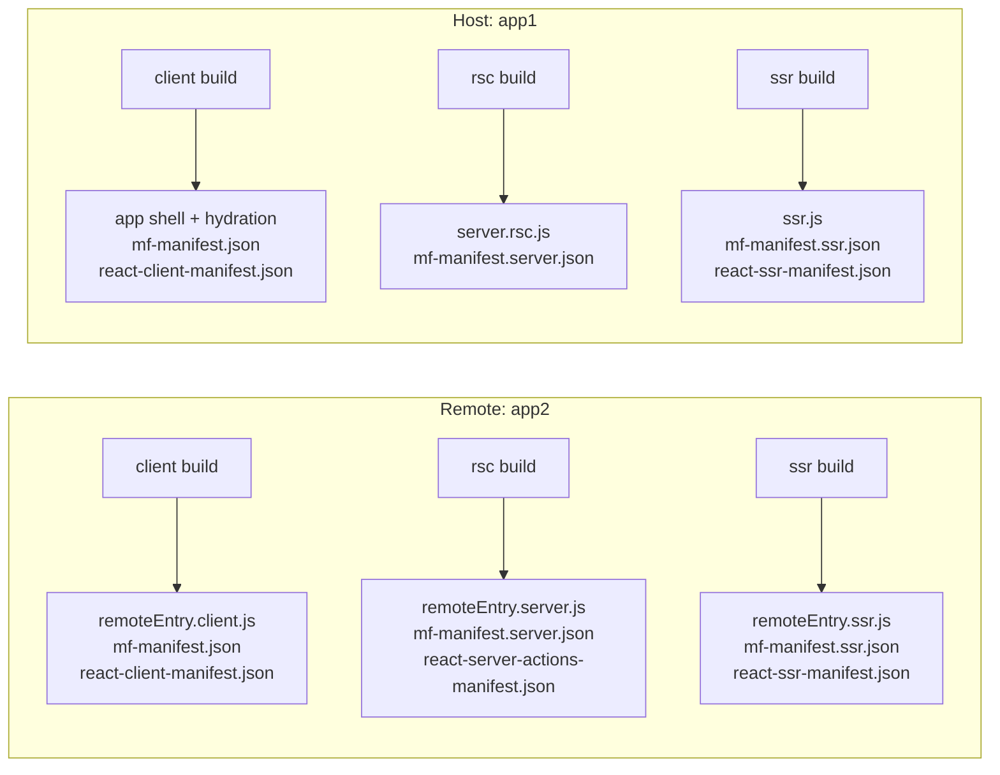
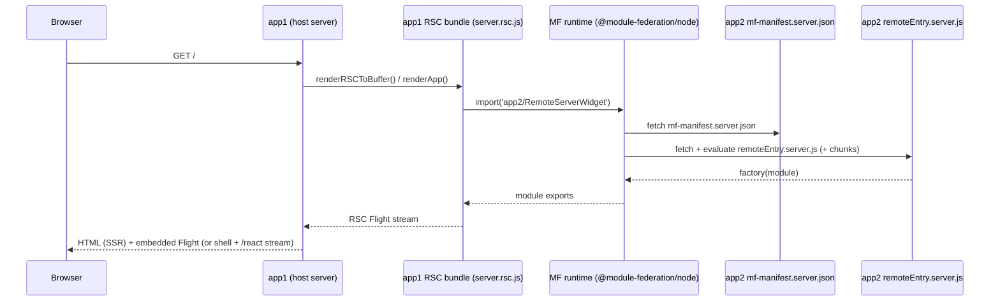
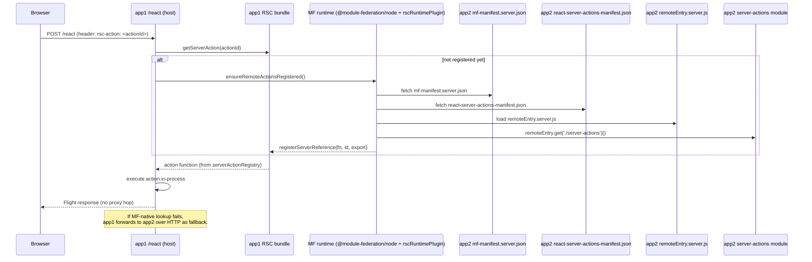
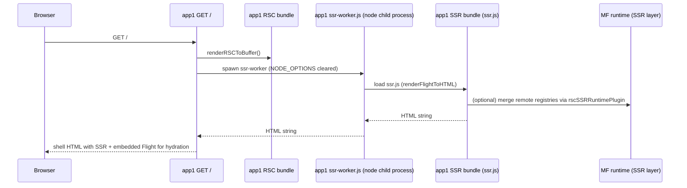

# Module Federation + React Server Components (RSC)

This repo contains an **RSC + Module Federation** reference implementation (see `apps/rsc-demo/`) plus a **vendored** `react-server-dom-webpack` package (see `packages/react-server-dom-webpack/`) so we can iterate on loaders/manifests/runtime behavior inside this monorepo.

Related deep-dive docs (demo-scoped):
- `apps/rsc-demo/FEDERATION_NATIVE_RSC.md`
- `apps/rsc-demo/ARCHITECTURE_PROPOSAL.md`

## Glossary

- **Host**: the app that renders the page and consumes remotes (demo: `app1`).
- **Remote**: the app that provides federated modules (demo: `app2`).
- **RSC (server) layer**: webpack build that resolves `react-server` exports (`target: async-node`, `resolve.conditionNames` includes `react-server`).
- **SSR layer**: webpack build that renders HTML from an RSC Flight stream (must **not** run with `react-server` resolution).
- **Client layer**: browser build.
- **Share scope**:
  - `rsc` → server/RSC layer (ensures React resolves to `react-server` builds).
  - `client` → browser and SSR layers (ensures React resolves to normal client builds).
- **React manifests**:
  - `react-client-manifest.json` (client component references for Flight)
  - `react-server-actions-manifest.json` (server action IDs → exports)
  - `react-ssr-manifest.json` (SSR module map)
- **MF manifests**:
  - `mf-manifest.json` / `mf-manifest.server.json` / `mf-manifest.ssr.json` (+ `*-stats.json`)
  - `additionalData.rsc` metadata is used to stitch MF ↔ React manifests together.

## Vendored `react-server-dom-webpack` (what changed and why)

We vendor `react-server-dom-webpack@19.2.0` into `packages/react-server-dom-webpack/` so we can:
- add a small, stable loader API (`rsc-*-loader`) that’s easy to consume from our webpack configs
- produce manifests early enough for MF to read them during compilation
- expose a shared **server action registry** that survives MF share-scope/module duplication edge-cases

### Baseline

The baseline comparison for “original” is the published npm package:
- `react-server-dom-webpack@19.2.0`

### Diff summary (vs npm `react-server-dom-webpack@19.2.0`)

Compared to the npm tarball, the vendored copy:

- Adds:
  - `packages/react-server-dom-webpack/cjs/rsc-client-loader.js`
  - `packages/react-server-dom-webpack/cjs/rsc-server-loader.js`
  - `packages/react-server-dom-webpack/cjs/rsc-ssr-loader.js`
- Modifies (functional patches we rely on):
  - `packages/react-server-dom-webpack/package.json` (exports + `private: true`)
  - `packages/react-server-dom-webpack/server.node.js` (global action registry + helpers)
  - `packages/react-server-dom-webpack/server.node.unbundled.js` (action registry + helpers)
  - `packages/react-server-dom-webpack/cjs/react-server-dom-webpack-plugin.js` (emit timing + manifest merging)
  - `packages/react-server-dom-webpack/cjs/react-server-dom-webpack-node-register.js` (inline action registration)
- Modifies (mechanical formatting; not behavior-critical):
  - `packages/react-server-dom-webpack/server.js`
  - `packages/react-server-dom-webpack/static.js`
  - `packages/react-server-dom-webpack/esm/react-server-dom-webpack-node-loader.production.js`
  - `packages/react-server-dom-webpack/cjs/react-server-dom-webpack-client.*`
  - `packages/react-server-dom-webpack/cjs/react-server-dom-webpack-server.*`

To reproduce a file-level diff locally:
```bash
# Run from the repo root
tmpdir="$(mktemp -d)"
cd "$tmpdir"
npm pack react-server-dom-webpack@19.2.0
tar -xzf react-server-dom-webpack-19.2.0.tgz
cd - >/dev/null
diff -ruN "$tmpdir/package" "packages/react-server-dom-webpack" || true
```

### Functional patches we rely on

1) **Webpack loader entrypoints (new)**

Added explicit exports so apps can depend on a stable path:
- `packages/react-server-dom-webpack/package.json` exports:
  - `react-server-dom-webpack/rsc-client-loader`
  - `react-server-dom-webpack/rsc-server-loader`
  - `react-server-dom-webpack/rsc-ssr-loader`

Implementation:
- `packages/react-server-dom-webpack/cjs/rsc-client-loader.js`
- `packages/react-server-dom-webpack/cjs/rsc-server-loader.js`
- `packages/react-server-dom-webpack/cjs/rsc-ssr-loader.js`

High-level behavior:
- **client loader**: transforms `'use server'` modules into `createServerReference()` stubs and records entries in a shared `serverReferencesMap`.
- **server loader (RSC layer)**:
  - transforms `'use client'` modules into `createClientModuleProxy(file://…)` proxies
  - ensures `'use server'` exports are registered (including “inline server actions”)
  - records inline actions into a shared `inlineServerActionsMap`
- **ssr loader**: transforms `'use server'` modules into stubs that throw (SSR must not execute actions).

2) **Server action registry (new exports)**

We patch the Node server entrypoints to provide:
- a shared `serverActionRegistry` (keyed by actionId)
- `getServerAction(actionId)` lookup used by the host action handler
- `getDynamicServerActionsManifest()` for inline/dynamic actions

Files:
- `packages/react-server-dom-webpack/server.node.js`
- `packages/react-server-dom-webpack/server.node.unbundled.js`

Why:
- With MF + share scopes, it’s possible to end up with multiple module instances of
  `react-server-dom-webpack/server*` across containers/chunks. Using `globalThis`
  avoids “registered in one instance, looked up in another” failures.

3) **ReactFlightPlugin emit timing + manifest merging**

We patch the webpack plugin so MF can read React manifests during compilation:
- `packages/react-server-dom-webpack/cjs/react-server-dom-webpack-plugin.js`

Key behavior:
- emits `react-client-manifest.json` and `react-server-actions-manifest.json` at
  `PROCESS_ASSETS_STAGE_SUMMARIZE` (early enough for MF manifest hooks)
- merges server-action entries from:
  - AST-discovered file-level actions
  - `serverReferencesMap` (client loader)
  - `inlineServerActionsMap` (server loader)
  - optional `extraServerActionsManifests` (for future remote merging)

4) **Node register inline action support**

We patch the Node `node-register` implementation so non-bundled Node usage can
still register inline actions:
- `packages/react-server-dom-webpack/cjs/react-server-dom-webpack-node-register.js`

### Mechanical/format-only differences

Some vendored files may differ from npm only by formatting (quotes/trailing commas).
Those changes are not relied on for behavior.

## MF ↔ React manifest stitching (build-time)

The bridge between MF and React manifests is:
- `packages/manifest/src/rscManifestMetadata.ts` (adds `additionalData.rsc.*`)

At a high level:
- React’s plugin emits `react-client-manifest.json` / `react-ssr-manifest.json` /
  `react-server-actions-manifest.json`.
- The MF manifest plugin reads those assets and attaches:
  - `additionalData.rsc.layer`, `shareScope`, `conditionNames`, `isRSC`
  - `additionalData.rsc.clientComponents` (SSR needs this to resolve client refs)
  - app-specific metadata like `additionalData.rsc.exposeTypes` / endpoints

### Why SSR needs special handling (tree-shaking)

React SSR resolves client components by dynamically reading exports from the SSR bundle.
Webpack can’t “see” those accesses statically, so exports can be tree-shaken → SSR tries
to render an `undefined` export.

Our current fix is build-time (not runtime placeholders):
- include every client component referenced by `react-client-manifest.json`
- mark its exports as “used in unknown way” so webpack keeps them

Implementation:
- `apps/rsc-demo/packages/app-shared/scripts/AutoIncludeClientComponentsPlugin.js`
  (used by `apps/rsc-demo/packages/app1/scripts/ssr.build.js` and app2 equivalent)

## Runtime architecture (RSC, SSR, actions)

### High-level build outputs



### RSC render with a remote Server Component



### MF-native server actions (default) with HTTP fallback



### SSR rendering path (HTML from Flight)



## Key “moving parts” in this repo

- **Vendored RSDW**
  - loaders: `packages/react-server-dom-webpack/cjs/rsc-*-loader.js`
  - server action registry: `packages/react-server-dom-webpack/server.node.js`
  - plugin patches: `packages/react-server-dom-webpack/cjs/react-server-dom-webpack-plugin.js`
- **MF manifest metadata**
  - `packages/manifest/src/rscManifestMetadata.ts`
- **Demo runtime plugins**
  - `apps/rsc-demo/packages/app-shared/scripts/rscRuntimePlugin.js` (MF-native actions registration)
  - `apps/rsc-demo/packages/app-shared/scripts/rscSSRRuntimePlugin.js` (SSR registry merging)
- **SSR export-preservation**
  - `apps/rsc-demo/packages/app-shared/scripts/AutoIncludeClientComponentsPlugin.js`

## Invariants / guardrails

- MF configs must set `experiments: { asyncStartup: true }`.
- Do **not** use `eager: true` for shared modules; async init is expected.
- Keep share scopes separated by layer: `rsc` vs `client`.
- SSR must not use `react-server` condition at runtime (`NODE_OPTIONS` stripped in worker).

## Known limitations / follow-ups

- Full server-side federation of `'use client'` components requires merging remote client component registries into the host SSR/RSC resolver in a general way (the demo currently demonstrates the shape and keeps the hard parts explicit).
- The demo still contains an HTTP forwarding path for server actions (fallback only). Long-term we want MF-native to be the only mode for production-like usage.
