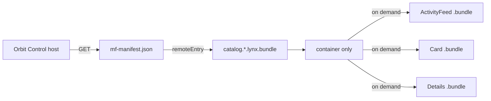

# Lynx Module Federation demo

This is an official Rspeedy + ReactLynx application, not a browser-only
simulation. It includes:

- a native background host and remote built as `.lynx.bundle` artifacts;
- a Lynx for Web host mounted in the official `<lynx-view>` custom element;
- ordinary `import('catalog/Card')` and runtime `loadRemote()` consumers;
- three lazy remote screens loaded over HTTP from `mf-manifest.json`;
- host, Card, Details, and ActivityFeed consumers of one shared singleton;
- independent background and main-thread layer scopes.

The remote uses the default split transport:



The host never addresses a generated `remoteEntry.js` directly. Both import
styles resolve the manifest, whose `metaData.remoteEntry` names the public
`.lynx.bundle` container. Lazy expose bundles are fetched separately.

## Run the native app

Build the official native host and remote and validate their manifests:

```sh
pnpm e2e:native
```

For Lynx Explorer on a phone, use a LAN-reachable origin and bind the Rspeedy
server to the network:

```sh
LYNX_DEV_HOST=0.0.0.0 \
LYNX_REMOTE_ORIGIN=http://<your-lan-ip>:3000 \
  pnpm dev
```

The configured official `pluginQRCode()` prints the app QR code. Open Lynx
Explorer on the device and scan it. The phone must be able to reach
`<your-lan-ip>:3000`; `127.0.0.1` refers to the phone itself and will not work.
Set `CATALOG_NATIVE_MANIFEST_URL` when the remote manifest is hosted elsewhere.

`e2e:native` is intentionally named artifact validation: CI has no iOS or
Android Lynx runtime. It compiles the real Rspeedy host and remote, verifies
both binary bundles, checks the manifest's background expose/share layer
metadata, then launches the dev server and fetches the host, manifest,
container, and every lazy bundle over HTTP. Scanning the QR runs those same
served artifacts in the native runtime.

## Run the real Lynx Web E2E

Install Chromium once, then run:

```sh
pnpm exec playwright install chromium
pnpm e2e:web
```

The test builds the official Rspeedy web host and remote, starts an ephemeral
HTTP server, and mounts `dist/host-web/main.web.bundle` through
`@lynx-js/web-core`'s public `<lynx-view>`. Playwright uses a mobile viewport
and touch input. It verifies:

- manifest, container, and lazy expose requests over HTTP;
- compiled `import()` and runtime `loadRemote()` results;
- rendering and navigation through the ReactLynx UI;
- shared-state identity and mutations across host and remote consumers;
- no Lynx, page, or console errors.

A failed run writes `test/real-web/artifacts/failure.png`. Override artifact
paths with `LYNX_HOST_WEB_BUNDLE`, `LYNX_REMOTE_MANIFEST`,
`LYNX_REMOTE_WEB_BUNDLE`, and `LYNX_WEB_E2E_SCREENSHOT`.

## Test matrix

| Command           | Evidence                                                   |
| ----------------- | ---------------------------------------------------------- |
| `pnpm e2e:native` | Real native Rspeedy builds plus binary/manifest validation |
| `pnpm e2e:web`    | Real official `<lynx-view>` browser runtime E2E            |
| `pnpm test`       | Both official Rspeedy checks                               |

The web remote enables `mainThread: true`, so each exposure has background and
main-thread variants. The demo deliberately scopes `orbit-shared-state` to
the semantic `background` realm; E2E proves singleton identity across the host
and all remotes in that realm. It does not claim cross-thread identity because
JavaScript objects cannot cross Lynx's realm boundary.
