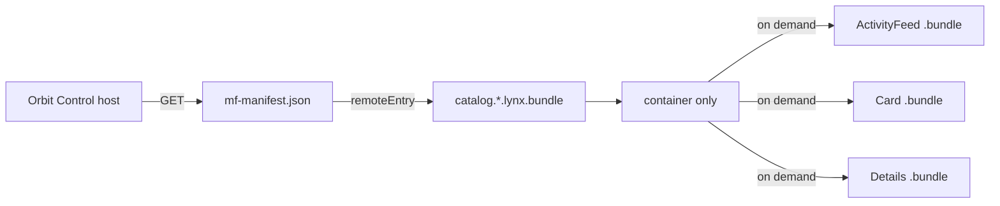

# Lynx Module Federation demo

This is an official Rspeedy + ReactLynx application, not a browser-only
simulation. It includes:

- a standalone UIKit iOS application derived from Lynx's official
  `HelloLynxSwift` starter;
- a native background host with paired ReactLynx remote UI built as
  `.lynx.bundle` artifacts;
- a Lynx for Web host mounted in the official `<lynx-view>` custom element;
- ordinary `import('catalog/Card')` and runtime `loadRemote()` consumers;
- three lazy remote screens loaded over HTTP from `mf-manifest.json`;
- host, Card, Details, and ActivityFeed consumers of one shared singleton;
- independent background and main-thread layer scopes.

The remote uses the default split transport:



The host never addresses a generated `remoteEntry.js` directly. Both import
styles resolve the manifest, whose `metaData.remoteEntry` names the public
`.lynx.bundle` container. Lazy expose bundles are fetched separately.

## Run the standalone iOS app

The app under `ios/` is a real iPhone/iPad application embedding `LynxView`.
It does not require Lynx Explorer. Its exact official starter source and commit
are recorded in `ios/UPSTREAM.md`.

On macOS:

```sh
pnpm ios:prepare
pnpm ios:pods
pnpm ios:open
pnpm dev
```

Run the `OrbitControl` scheme in Xcode. The Debug app loads
`http://localhost:3000/main.lynx.bundle`; set the `LYNX_BUNDLE_URL` scheme
environment variable to a LAN-reachable URL for a physical device. The shell
injects both Lynx template and generic resource fetchers, so the root Bundle,
federated container, and Lazy Bundles can arrive over HTTP(S).

For a physical device, use the same LAN origin for both the host bundle and
the manifest URL compiled into it:

```sh
export LYNX_REMOTE_ORIGIN=http://<your-lan-ip>:3000
pnpm ios:prepare
pnpm ios:device
```

Set the Xcode scheme's `LYNX_BUNDLE_URL` to
`http://<your-lan-ip>:3000/main.lynx.bundle`. `ios:device` rejects loopback
origins and binds Rspeedy to `0.0.0.0`, so the phone can fetch the host,
manifest, container, and lazy bundles from the same server.

Release builds embed `ios/Resources/main.lynx.bundle` and retain strict ATS
defaults. Build the host with the production manifest origin before syncing it:

```sh
LYNX_REMOTE_ORIGIN=https://cdn.example.com/catalog/ pnpm build:native
pnpm ios:sync
```

Only the host bundle is embedded. The manifest, container, and lazy expose
bundles remain separately deployable HTTP(S) artifacts. The iOS simulator E2E
launches the app, taps **Load remote catalog**, verifies compiled imports,
runtime `loadRemote()`, and shared singleton identity, then checks every native
bundle request observed by the test server. It also launches the Release app
without a root URL override to prove the embedded host and strict ATS branch.

## Run with Lynx Explorer

Build the official native host and remote and validate their manifests:

```sh
pnpm e2e:native
```

For Lynx Explorer on a phone, use a LAN-reachable origin and bind the Rspeedy
server to the network:

```sh
LYNX_DEV_HOST=0.0.0.0 \
LYNX_REMOTE_ORIGIN=http://<your-lan-ip>:3000 \
  pnpm dev
```

The configured official `pluginQRCode()` prints the app QR code. Open Lynx
Explorer on the device and scan it. The phone must be able to reach
`<your-lan-ip>:3000`; `127.0.0.1` refers to the phone itself and will not work.
Set `CATALOG_NATIVE_MANIFEST_URL` when the remote manifest is hosted elsewhere.

`e2e:native` is artifact and transport validation. It compiles the real Rspeedy
host and remote, verifies the background container plus paired main-thread
snapshot bytecode in every lazy UI bundle, checks the manifest's public
background expose/share metadata, then fetches the host, manifest, container,
and every lazy bundle over HTTP. The macOS CI job adds a real iOS Simulator
runtime test of those artifacts.

## Run the real Lynx Web E2E

Install Chromium once, then run:

```sh
pnpm exec playwright install chromium
pnpm e2e:web
```

The test builds the official Rspeedy web host and remote, starts an ephemeral
HTTP server, and mounts `dist/host-web/main.web.bundle` through
`@lynx-js/web-core`'s public `<lynx-view>`. Playwright uses a mobile viewport
and touch input. It verifies:

- manifest, container, and lazy expose requests over HTTP;
- compiled `import()` and runtime `loadRemote()` results;
- rendering and navigation through the ReactLynx UI;
- shared-state identity and mutations across host and remote consumers;
- no Lynx, page, or console errors.

A failed run writes `test/real-web/artifacts/failure.png`. Override artifact
paths with `LYNX_HOST_WEB_BUNDLE`, `LYNX_REMOTE_MANIFEST`,
`LYNX_REMOTE_WEB_BUNDLE`, and `LYNX_WEB_E2E_SCREENSHOT`.

## Test matrix

| Command                 | Evidence                                                         |
| ----------------------- | ---------------------------------------------------------------- |
| `pnpm e2e:native`       | Real native Rspeedy builds plus binary/manifest validation       |
| `pnpm e2e:ios`          | Standalone UIKit app + iOS Simulator federation/runtime E2E      |
| `pnpm e2e:web`          | Real official `<lynx-view>` browser runtime E2E                  |
| `pnpm test:ios-project` | Cross-platform iOS project, provenance, pod, and ATS policy gate |
| `pnpm test`             | Cross-platform native artifact and Lynx Web checks               |

The web remote enables `mainThread: true`, so each exposure has background and
main-thread variants. The demo deliberately scopes `orbit-shared-state` to
the semantic `background` realm; E2E proves singleton identity across the host
and all remotes in that realm. It does not claim cross-thread identity because
JavaScript objects cannot cross Lynx's realm boundary.
