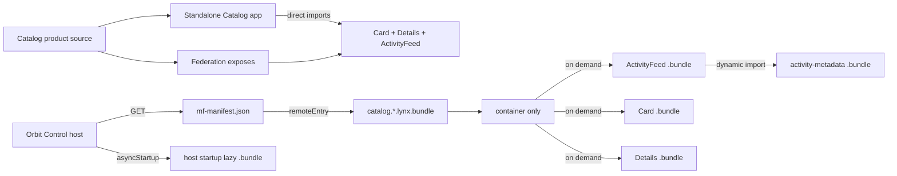

# Lynx Module Federation demo

This is an official Rspeedy + ReactLynx application, not a browser-only
simulation. It includes:

- a standalone UIKit iOS application derived from Lynx's official
  `HelloLynxSwift` starter;
- a runnable Orbit Catalog product for native Lynx and Lynx Web;
- a native background host with paired ReactLynx remote UI built as
  `.lynx.bundle` artifacts;
- a Lynx for Web host mounted in the official `<lynx-view>` custom element;
- compile-time `import ... from 'catalog/Card'`, dynamic
  `import('catalog/Details')`, and runtime `loadRemote()` consumers;
- three lazy remote screens plus a nested remote chunk loaded over HTTP from
  `mf-manifest.json`;
- host, Card, Details, and ActivityFeed consumers of one shared singleton;
- independent background and main-thread layer scopes.

The remote uses the default split transport:



The host never addresses a generated `remoteEntry.js` directly. Both import
styles resolve the manifest, whose `metaData.remoteEntry` names the public
`.lynx.bundle` container. Lazy expose bundles are fetched separately. The Web
remote uses `publicPath: 'auto'`; Module Federation resolves its container and
split assets from the fetched manifest URL instead of Lynx Web's internal
`document.currentScript`. Native remotes use the explicit
`LYNX_REMOTE_ORIGIN` because they have no browser script URL. Native host assets
default to `/host-native/`, which works for a root deployment and the bundled
iOS resource provider; set `LYNX_HOST_ORIGIN` when they live elsewhere.

## Rspeedy compatibility boundary

Rspeedy 0.16 resolves its own `@rspack/core`, while this repository needs
`@rspack-canary/core` 2.1.5-canary-54a0d8f3-20260715194831 for the Lynx layer
and chunk behavior under test. `rspack-canary-rspeedy.mjs` is the single
compatibility boundary: it starts Rspeedy with Node resolution hooks that map
`@rspack/core` to the pinned canary and `@rsbuild/core` to the workspace's
matching package.

Every demo build, development, and preview script in `package.json` invokes
that wrapper. Application and federation source import neither the wrapper nor
the canary package. Remove the wrapper when Rspeedy supports the repository's
Rspack package directly; then point those package scripts back to the public
Rspeedy CLI and remove the canary alias together.

## Run the standalone Catalog product

The Catalog directly renders `Card`, `Details`, and `ActivityFeed` from the
same source files published by `federation.config.mjs`. It is a complete app,
not an artifact placeholder:

```sh
pnpm dev:catalog:native
pnpm dev:catalog:web
```

The native command prints a QR code for Lynx Explorer on port 3001. Production
builds emit regular root apps at `dist/catalog-native/main.lynx.bundle` and
`dist/catalog-web/main.web.bundle`.

Catalog app and federation transport are separate Rspeedy builds by design.
ReactLynx's `experimental_isLazyBundle` mode applies to the whole compilation
and emits `DynamicComponent` bundles, so the provider build contains only the
manifest, container, three lazy expose roots, and ActivityFeed's nested lazy
chunk. The regular Catalog build bundles
its local shared-state implementation; the provider marks that implementation
`import: false`, so Orbit supplies the negotiated singleton and does not
download Catalog's standalone app or duplicate shared state.

The federation configs explicitly enable `experiments.asyncStartup`. Shared
modules do not use `eager: true`: the host waits for share-scope initialization
and loads its singleton provider from a host `lazy-bundle/*.bundle` before
application startup. The remote's `import: false` consumer then reuses that
initialized background-realm singleton.

`src/app/staticCard.ts` is the standard asynchronous bootstrap boundary. It
contains a module-scope static `import * as card from 'catalog/Card'`; importing
that local boundary asynchronously delays evaluation without replacing the
federated import with a runtime loader.

On iOS, root-relative host and standalone Catalog lazy-bundle paths resolve
against an HTTP root bundle's origin. Embedded Release host assets resolve
against the signed app bundle.

## Run the standalone iOS app

The app under `ios/` is a real iPhone/iPad application embedding `LynxView`.
It does not require Lynx Explorer. Its exact official starter source and commit
are recorded in `ios/UPSTREAM.md`.

On macOS:

```sh
pnpm ios:prepare
pnpm ios:pods
pnpm ios:open
pnpm dev
```

Run the `OrbitControl` scheme in Xcode. The Debug app loads
`http://localhost:3000/main.lynx.bundle`; set the `LYNX_BUNDLE_URL` scheme
environment variable to a LAN-reachable URL for a physical device. The shell
injects both Lynx template and generic resource fetchers, so the root Bundle,
federated container, and Lazy Bundles can arrive over HTTP(S).

The same shell can launch Catalog as an independent native product by setting
`LYNX_BUNDLE_URL` to `http://localhost:3000/catalog-native/main.lynx.bundle`.
The iOS E2E launches both root apps, interacts with Catalog locally, then proves
that Orbit loads those component sources through federation.

For a physical device, use the same LAN origin for both the host bundle and
the manifest URL compiled into it:

```sh
export LYNX_REMOTE_ORIGIN=http://<your-lan-ip>:3000
pnpm ios:prepare
pnpm ios:device
```

Set the Xcode scheme's `LYNX_BUNDLE_URL` to
`http://<your-lan-ip>:3000/main.lynx.bundle`. `ios:device` rejects loopback
origins and binds Rspeedy to `0.0.0.0`, so the phone can fetch the host,
manifest, container, and lazy bundles from the same server.

Release builds embed `ios/Resources/main.lynx.bundle`. ATS permits only local
networking for the simulator/LAN demo; arbitrary and public insecure HTTP loads
remain disabled. Build the host with the production manifest origin before
syncing it:

```sh
LYNX_REMOTE_ORIGIN=https://cdn.example.com/catalog/ pnpm build:native
pnpm ios:sync
```

The root host bundle and its non-eager async-startup lazy bundles are embedded.
The manifest, container, and lazy expose bundles remain separately deployable
HTTP(S) artifacts. One Release simulator build runs all three UI scenarios: it
launches the app, taps **Load remote catalog**, verifies compiled imports,
runtime `loadRemote()`, and shared singleton identity, then checks every native
bundle request observed by the test server; launches Catalog as a standalone
root; and launches without a root URL override to prove the embedded host.

## Run with Lynx Explorer

Build the official native host and remote and validate their manifests:

```sh
pnpm e2e:native
```

For Lynx Explorer on a phone, use a LAN-reachable origin and bind the Rspeedy
server to the network:

```sh
LYNX_DEV_HOST=0.0.0.0 \
LYNX_REMOTE_ORIGIN=http://<your-lan-ip>:3000 \
  pnpm dev
```

The configured official `pluginQRCode()` prints the app QR code. Open Lynx
Explorer on the device and scan it. The phone must be able to reach
`<your-lan-ip>:3000`; `127.0.0.1` refers to the phone itself and will not work.
Set `CATALOG_NATIVE_MANIFEST_URL` when the remote manifest is hosted elsewhere.

`e2e:native` is artifact and transport validation. It compiles the real Rspeedy
host, Catalog app, and remote, verifies the regular standalone root bundle, two
separately transported host lazy bundles (including the async-startup
singleton), the background container, three independently loadable remote UI
roots, and ActivityFeed's nested dynamic-import bundle; checks the manifest's
public background expose/share metadata; then fetches every artifact over HTTP.
The macOS CI job adds a real iOS Simulator runtime test of those artifacts.

## Run the real Lynx Web E2E

Install Chromium once, then run:

```sh
pnpm exec playwright install chromium
pnpm e2e:web
```

The test builds the official Rspeedy web host, Catalog app, and remote; starts
an ephemeral HTTP server; and mounts both `dist/host-web/main.web.bundle` and
`dist/catalog-web/main.web.bundle` through
`@lynx-js/web-core`'s public `<lynx-view>`. Playwright uses a mobile viewport
and touch input. The server indexes realpath-contained artifacts before it
listens, so URL input never becomes a filesystem path and internal errors are
not returned to clients. The test verifies:

- manifest, container, lazy expose, and nested remote chunk requests over HTTP;
- async-startup share initialization over its host lazy-bundle request;
- static import, dynamic `import()`, and runtime `loadRemote()` results;
- rendering and navigation through the ReactLynx UI, including output from the
  nested dynamic import;
- shared-state identity and mutations across host and remote consumers;
- direct local composition and shared state in the standalone Catalog;
- no federation requests while Catalog runs through direct imports;
- no Lynx, page, or console errors.

A failed run writes `test/real-web/artifacts/failure.png`. Override artifact
paths with `LYNX_HOST_WEB_BUNDLE`, `LYNX_REMOTE_MANIFEST`,
`LYNX_REMOTE_WEB_BUNDLE`, `LYNX_CATALOG_WEB_BUNDLE`, and
`LYNX_WEB_E2E_SCREENSHOT`.

## Test matrix

| Command                 | Evidence                                                         |
| ----------------------- | ---------------------------------------------------------------- |
| `pnpm e2e:native`       | Native Catalog + host/provider binary and transport validation   |
| `pnpm e2e:ios`          | iOS Catalog launch plus Orbit federation/runtime E2E             |
| `pnpm e2e:web`          | Standalone Catalog and federated Orbit in official `<lynx-view>` |
| `pnpm test:ios-project` | Cross-platform iOS project, provenance, pod, and ATS policy gate |
| `pnpm test:ci-policy`   | Wrapper ownership and Android emulator partition policy          |
| `pnpm test`             | Cross-platform native artifact and Lynx Web checks               |

The web remote enables `mainThread: true`, so each exposure has background and
main-thread variants. The demo deliberately scopes `orbit-shared-state` to
the semantic `background` realm; E2E proves singleton identity across the host
and all remotes in that realm. It does not claim cross-thread identity because
JavaScript objects cannot cross Lynx's realm boundary.
