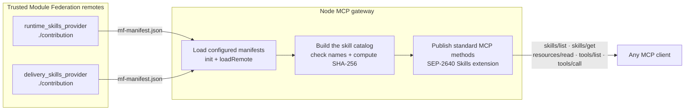

# Federated skills over MCP

This is a runnable proof of concept. It answers one question: can separate
Module Federation builds supply skills and tools to a normal MCP server?

Yes. Two trusted remotes expose a small JavaScript object. A Node gateway loads
those objects, checks them, hashes every skill file, and publishes the result
through MCP. The MCP client does not need to know that Module Federation is
involved.

## What this is

A **skill provider** is a Module Federation remote that exposes
`./contribution`. That contribution contains:

- one or more skills, each with a `SKILL.md` and optional supporting files
- optional JavaScript functions that the gateway publishes as MCP tools
- a provider name and build version

The **gateway** is a Node process. It loads the configured providers and turns
their content into one MCP server. Clients see ordinary skills, resources, and
tools.



## How it works

1. Rspack builds each provider as its own `remoteEntry.js` and
   `mf-manifest.json`.
2. The gateway creates a Module Federation runtime with both manifest URLs.
3. `loadRemote` loads each provider's `./contribution` module.
4. The gateway rejects duplicate skill URIs, resource URIs, and tool names.
5. It computes the byte length and SHA-256 digest of every skill file.
6. The MCP server advertises `io.modelcontextprotocol/skills` and handles
   `skills/list`, `skills/get`, and `resources/read`.
7. Provider functions appear through the usual `tools/list` and `tools/call`
   methods.

The MCP SDK adds `resultType: "complete"` to the 2026-07-28 wire response. It
removes that transport field before returning the local client result.

## What the proof contains

| Remote                     | Skill                         | Tool                         |
| -------------------------- | ----------------------------- | ---------------------------- |
| `runtime_skills_provider`  | `diagnose-federation-runtime` | `inspect_federation_runtime` |
| `delivery_skills_provider` | `ship-federated-skill`        | `inspect_skill_delivery`     |

Each skill also has one supporting Markdown file. The finished MCP catalog has
two skills, four resources, and two tools.

## Why this is useful

- **Independent builds.** A provider can ship new skill content or tool code
  without rebuilding the gateway. Restarting the gateway loads the configured
  provider build.
- **Instructions stay with the code they describe.** A remote can carry a tool
  and the skill that teaches an agent when and how to call it.
- **One MCP connection.** The client sees one server instead of learning how
  each provider is built or hosted.
- **Checks happen in one place.** The gateway owns name collision checks,
  resource sizes, and SEP-2640 digests.
- **MCP stays portable.** Module Federation stops at the gateway. MCP clients
  written in Rust, Python, or any other language receive the same protocol.

This is most useful when several trusted JavaScript providers release on
different schedules. For a few static `SKILL.md` files, serving MCP resources
directly is simpler.

## Run the proof

From the repository root:

```bash
pnpm exec turbo run build --filter=skills-over-mcp-poc
pnpm --filter skills-over-mcp-poc run demo
```

The demo starts a temporary HTTP server for both remote builds, launches the
stdio MCP gateway with the official TypeScript MCP client, calls both Skills
methods, reads one resource, verifies its digest, and invokes both remote tools.

Expected result:

```json
{
  "extension": { "directoryRead": false },
  "skillNames": ["diagnose-federation-runtime", "ship-federated-skill"],
  "resourceCount": 4,
  "toolProviders": ["runtime_skills_provider", "delivery_skills_provider"],
  "digestVerified": true,
  "getMatchesList": true
}
```

## Connect another MCP client

Build first, then keep the provider files available:

```bash
pnpm --filter skills-over-mcp-poc run providers
```

Launch `apps/skills-over-mcp/dist/gateway/main.cjs` as a stdio MCP server with
this environment variable:

```text
SKILLS_PROVIDER_ORIGIN=http://127.0.0.1:43110
```

## Test with Codex

Build the proof and start the provider server:

```bash
pnpm exec turbo run build --filter=skills-over-mcp-poc
pnpm --filter skills-over-mcp-poc run providers
```

Keep that terminal open. From another terminal at the repository root, add the
gateway to Codex:

```bash
codex mcp add federated-skills \
  --env SKILLS_PROVIDER_ORIGIN=http://127.0.0.1:43110 \
  -- node "$PWD/apps/skills-over-mcp/dist/gateway/main.cjs"
```

Check the saved configuration:

```bash
codex mcp get federated-skills --json
```

Restart Codex, run `/mcp`, and confirm that `federated-skills` is connected.
Then ask Codex:

```text
Use the federated-skills MCP server.

1. Call inspect_federation_runtime.
2. Call inspect_skill_delivery.
3. List its MCP resources.
4. Read skill://module-federation/runtime/diagnose-federation-runtime/SKILL.md.
5. Summarize the loaded provider IDs and the skill instructions.
```

Codex can call both remote tools and read all four resources. The proof's
automated test covers the separate SEP-2640 `skills/list` request because
automatic MCP skill loading is not currently documented by Codex.

Remove the test server when finished:

```bash
codex mcp remove federated-skills
```

See the [Codex MCP documentation](https://learn.chatgpt.com/docs/extend/mcp)
for other configuration options.
