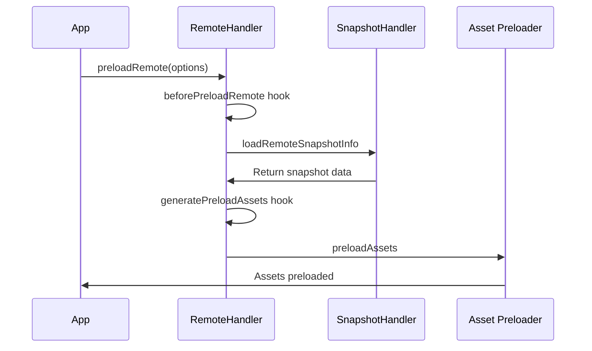

# Module Federation Advanced Runtime Patterns

Use this document for runtime plugins, recovery, share scope, and preload behavior. [advanced-topics.md](./advanced-topics.md) is the index for advanced production material.

## Runtime Plugin System

⚠️ **PERFORMANCE WARNING**: Each plugin adds overhead to module loading that varies based on implementation complexity. Mobile devices may experience significantly slower performance. Use plugins sparingly and measure performance impact in production.

### Plugin Performance Impact

```typescript
// PERFORMANCE CONSIDERATIONS
// Plugin performance impact varies based on:
// - Plugin complexity and implementation
// - Number of active plugins
// - Device capabilities and network conditions
// - Size and frequency of module loads
//
// General guidelines:
// - Fewer plugins typically perform better
// - Mobile devices may show more pronounced impact
// - Measure performance in your specific environment
// - Consider plugin combining strategies for optimization

// ✅ PRODUCTION OPTIMIZATION - Combine plugins
const productionPlugin: ModuleFederationRuntimePlugin = {
  name: 'CombinedProductionPlugin',

  // Combine multiple hooks in one plugin
  beforeRequest(args) {
    // Security validation
    validateUrl(args.id);
    // Performance tracking
    performance.mark(`start-${args.id}`);
    // Error tracking setup
    setupErrorTracking(args.id);
    return args;
  },

  onLoad(args) {
    // Performance measurement
    performance.mark(`end-${args.id}`);
    // Cache warming
    warmCache(args.id);
    // Analytics
    trackModuleLoad(args.id);
    return args;
  },

  errorLoadRemote(args) {
    // Unified error handling
    handleError(args);
    return getFallback(args.id);
  }
};
```

### Available Plugin Hooks

The actual plugin system provides these hooks (from the codebase):

```typescript
// Real plugin interface from runtime-core/src/type/plugin.ts
export type ModuleFederationRuntimePlugin = CoreLifeCyclePartial &
  SnapshotLifeCycleCyclePartial &
  SharedLifeCycleCyclePartial &
  RemoteLifeCycleCyclePartial &
  ModuleLifeCycleCyclePartial &
  ModuleBridgeLifeCycleCyclePartial & {
    name: string;
    version?: string;
    apply?: (instance: ModuleFederation) => void;
  };

// Core lifecycle hooks available:
type CoreLifeCycle = {
  beforeInit: (args: { userOptions: UserOptions; options: Options; origin: ModuleFederation; shareInfo: ShareInfos }) => void;
  init: (args: { options: Options; origin: ModuleFederation }) => void;
  beforeInitContainer: (args: { shareScope: ShareScopeMap[string]; initScope: InitScope; remoteEntryInitOptions: RemoteEntryInitOptions; remoteInfo: RemoteInfo; origin: ModuleFederation }) => Promise<any>;
  initContainer: (args: { shareScope: ShareScopeMap[string]; initScope: InitScope; remoteEntryInitOptions: RemoteEntryInitOptions; remoteInfo: RemoteInfo; remoteEntryExports: RemoteEntryExports; origin: ModuleFederation; id?: string; remoteSnapshot?: ModuleInfo }) => Promise<any>;
};

// Remote lifecycle hooks available:
type RemoteLifeCycle = {
  beforeRequest: (args: { id: string; options: Options; origin: ModuleFederation }) => Promise<any>;
  onLoad: (args: { id: string; pkgNameOrAlias: string; expose: string; exposeModule?: any; exposeModuleFactory?: any; remote: Remote; options: ModuleOptions; moduleInstance: Module; origin: ModuleFederation }) => Promise<any>;
  errorLoadRemote: (args: { id: string; error: unknown; from: CallFrom; lifecycle: 'onLoad' | 'beforeRequest' | 'beforeLoadShare' | 'afterResolve'; origin: ModuleFederation }) => Promise<any>;
  beforePreloadRemote: (args: { preloadOps: Array<PreloadRemoteArgs>; options: Options; origin: ModuleFederation }) => Promise<any>;
  generatePreloadAssets: (args: { origin: ModuleFederation; preloadOptions: PreloadOptions[number]; remote: Remote; remoteInfo: RemoteInfo; globalSnapshot: GlobalModuleInfo; remoteSnapshot: ModuleInfo }) => Promise<any>;
};

// Shared lifecycle hooks available:
type SharedLifeCycle = {
  beforeLoadShare: (args: { pkgName: string; shareInfo?: Shared; shared: Options['shared']; origin: ModuleFederation }) => Promise<any>;
  afterResolve: (args: LoadRemoteMatch) => Promise<any>;
};
```

### Plugin Registration

⚠️ **CRITICAL**: Never register plugins without proper error boundaries and memory management.

```typescript
// ❌ DANGEROUS - No error handling or cleanup
const dangerousPlugin: ModuleFederationRuntimePlugin = {
  name: 'dangerous-plugin',
  version: '1.0.0',

  beforeRequest(args) {
    console.log('Loading remote:', args.id);
    // Can modify the request args
    return {
      ...args,
      id: args.id // or modify to redirect to different module
    };
  },

  onLoad(args) {
    console.log('Module loaded:', args.id);
    // Can return a custom module wrapper
    return args.exposeModule;
  },

  errorLoadRemote(args) {
    console.error('Failed to load remote:', args.id, args.error);
    // Return fallback module or null to let error propagate
    if (args.lifecycle === 'onLoad') {
      return () => 'Fallback module';
    }
    return null;
  }
};

// ✅ PRODUCTION - Error handling and cleanup
const productionSafePlugin: ModuleFederationRuntimePlugin = {
  name: 'production-safe-plugin',
  version: '1.0.0',

  beforeRequest(args) {
    try {
      // Validate and sanitize
      const sanitizedId = sanitizeModuleId(args.id);
      return { ...args, id: sanitizedId };
    } catch (error) {
      console.error('Plugin error in beforeRequest:', error);
      return args; // Continue with original
    }
  },

  onLoad(args) {
    try {
      // Track with timeout
      const timeout = setTimeout(() => {
        console.warn('Module load taking too long:', args.id);
      }, 5000);

      // Cleanup on completion
      Promise.resolve().then(() => clearTimeout(timeout));

      return args.exposeModule;
    } catch (error) {
      console.error('Plugin error in onLoad:', error);
      return args.exposeModule;
    }
  },

  errorLoadRemote(args) {
    // Structured error logging
    const errorData = {
      module: args.id,
      lifecycle: args.lifecycle,
      error: args.error.message,
      stack: args.error.stack,
      timestamp: new Date().toISOString()
    };

    // Send to monitoring service
    sendToMonitoring(errorData);

    // Return appropriate fallback
    return getFallbackForModule(args.id);
  }
};

// Register plugin during initialization
const federationInstance = new ModuleFederation({
  name: 'my-app',
  remotes: [/* ... */],
  plugins: [productionSafePlugin]
});

// Or register plugins globally (from runtime-core/src/global.ts)
import { registerGlobalPlugins } from '@module-federation/runtime-core';
registerGlobalPlugins([productionSafePlugin]);
```

## Error Handling and Recovery

⚠️ **Recovery boundary**: `errorLoadRemote` is not a blanket network safety net. Remote-entry loading has its own loader hooks (`loadEntryError` and `afterLoadEntry`), while `errorLoadRemote` handles runtime lifecycle failures such as request, share-load, and module-load recovery.

### Error Types NOT Handled by errorLoadRemote

```typescript
// These errors should be handled outside errorLoadRemote or through loader hooks:
// 1. CORS errors (most common in production)
// 2. Network timeouts
// 3. CSP violations
// 4. DNS failures
// 5. SSL/TLS errors

// ✅ Remote-entry recovery belongs in loaderHook.loadEntryError
federationInstance.loaderHook.lifecycle.loadEntryError.on(
  async ({ origin, remoteInfo, getRemoteEntry }) => {
    reportEntryFailure(remoteInfo);
    return getRemoteEntry({
      origin,
      remoteInfo: alternateRemoteInfo(remoteInfo),
    });
  },
);

// ✅ PRODUCTION FIX - Wrap ALL remote loads
async function safeLoadRemote(id: string) {
  const timeout = new Promise((_, reject) =>
    setTimeout(() => reject(new Error('Timeout')), 5000)
  );

  try {
    return await Promise.race([
      federationInstance.loadRemote(id),
      timeout
    ]);
  } catch (error) {
    // Handle ALL error types including CORS
    console.error(`Failed to load ${id}:`, error);
    return getFallbackModule(id);
  }
}
```

### Error Recovery Plugin

```typescript
// Real error handling pattern from the codebase
const errorRecoveryPlugin: ModuleFederationRuntimePlugin = {
  name: 'ErrorRecoveryPlugin',

  errorLoadRemote(args) {
    const { id, error, from, lifecycle, origin } = args;

    console.error(`Failed to load ${id} during ${lifecycle}:`, error.message);

    // Different recovery strategies based on lifecycle
    if (lifecycle === 'onLoad') {
      // Return a fallback module
      return () => {
        console.warn(`Using fallback for ${id}`);
        return { default: () => 'Fallback Content' };
      };
    }

    if (lifecycle === 'beforeRequest') {
      // Try alternative remote configuration
      const fallbackId = id.replace('/app1/', '/app1-backup/');
      return { ...args, id: fallbackId };
    }

    // Let error propagate for other cases
    return null;
  }
};
```

### Retry Plugin Implementation

The codebase includes a real retry plugin that retries manifest fetches (via the `fetch` loader hook) and remote entry loading (via `loadEntryError`):

```typescript
// From packages/retry-plugin/src/index.ts
import { RetryPlugin } from '@module-federation/retry-plugin';

const federationInstance = new ModuleFederation({
  name: 'my-app',
  remotes: [/* ... */],
  plugins: [
    RetryPlugin({
      retryTimes: 3,    // default 3
      retryDelay: 1000, // default 1000ms; can also be (attempt) => number
      // Backup domains rotated through on failed attempts
      domains: ['https://cdn-primary.example.com', 'https://cdn-backup.example.com'],
      addQuery: true,   // appends retryCount=N query to bust caches
      onRetry: ({ times, url }) => console.warn(`Retry #${times} for ${url}`),
      onError: ({ url }) => console.error(`Gave up on ${url}`),
    }),
  ],
});

// Simplified internal fetchRetry implementation
// (from packages/retry-plugin/src/fetch-retry.ts)
async function fetchRetry(params: FetchRetryOptions, lastRequestUrl?: string, originalTotal?: number) {
  const {
    url,
    fetchOptions = {},
    retryTimes = 3,
    retryDelay = 1000,
    domains,
    addQuery,
    onRetry,
    onSuccess,
    onError,
  } = params;

  // Retries rotate through backup domains and can append a retryCount
  // query parameter; before each retry it waits retryDelay
  // (a fixed number of milliseconds or a per-attempt function)
  const requestUrl = getRetryUrl(url, { domains, addQuery /* ... */ });

  try {
    const response = await fetch(requestUrl, fetchOptions);
    if (!response.ok) {
      throw new Error(`Request failed: ${response.status}`);
    }
    return response;
  } catch (error) {
    if (retryTimes <= 0) {
      onError?.({ domains, url: requestUrl, tagName: 'fetch' });
      throw new Error('The request failed and has now been abandoned');
    }
    onRetry?.({ times: (originalTotal ?? retryTimes) - retryTimes + 1, domains, url: requestUrl, tagName: 'fetch' });
    return fetchRetry({ ...params, retryTimes: retryTimes - 1 }, requestUrl, originalTotal ?? retryTimes);
  }
}
```

## Share Scope Management

⚠️ **MEMORY MANAGEMENT WARNING**: Share scopes may not be automatically garbage collected in many implementations. Shared module versions can accumulate in memory over time, potentially causing memory growth issues.

### Share Scope Memory Leaks

```typescript
// ❌ POTENTIAL MEMORY ISSUE - Implementation-dependent
// Many implementations retain all versions of shared modules in memory
export type ShareScopeMap = {
  [scopeName: string]: {
    [packageName: string]: {
      [version: string]: { // ALL versions retained!
        get: () => Promise<any>;
        loaded?: boolean;
        lib?: () => any; // Module instance - may not be automatically freed
      }
    }
  }
};

// ✅ PRODUCTION FIX - Implement share scope cleanup
class ShareScopeManager {
  private shareScopes = new Map<string, Map<string, VersionedModule[]>>();
  private readonly MAX_VERSIONS_PER_MODULE = 3;

  addSharedModule(scope: string, name: string, version: string, module: any) {
    if (!this.shareScopes.has(scope)) {
      this.shareScopes.set(scope, new Map());
    }

    const scopeMap = this.shareScopes.get(scope)!;
    if (!scopeMap.has(name)) {
      scopeMap.set(name, []);
    }

    const versions = scopeMap.get(name)!;
    versions.push({ version, module, timestamp: Date.now() });

    // Cleanup old versions
    if (versions.length > this.MAX_VERSIONS_PER_MODULE) {
      const sorted = versions.sort((a, b) =>
        semver.compare(b.version, a.version)
      );

      // Keep only recent versions
      const toKeep = sorted.slice(0, this.MAX_VERSIONS_PER_MODULE);
      scopeMap.set(name, toKeep);

      // Free memory from old versions
      const toRemove = sorted.slice(this.MAX_VERSIONS_PER_MODULE);
      toRemove.forEach(v => {
        delete v.module;
        console.log(`Freed shared module: ${name}@${v.version}`);
      });
    }
  }
}
```

### Share Scope Architecture

```typescript
// Real share scope structure from runtime-core/src/type/config.ts
export type ShareScopeMap = {
  [scope: string]: {
    [pkgName: string]: {
      [sharedVersion: string]: Shared;
    }
  }
};

// Each Shared entry includes:
// {
//   version, get, shareConfig: SharedConfig, scope, useIn, from, deps,
//   lib?, loaded?, loading?, eager?, strategy, treeShaking?
// }

// shareScopeMap initialization shape
class ModuleFederation {
  shareScopeMap: ShareScopeMap;

  constructor(userOptions: UserOptions) {
    // The map is owned by the SharedHandler and mirrored on the instance
    this.sharedHandler = new SharedHandler(this);
    this.shareScopeMap = this.sharedHandler.shareScopeMap;
    // ... initialization logic
  }
}
```

### Share Scope Plugin Example

```typescript
const shareScopePlugin: ModuleFederationRuntimePlugin = {
  name: 'ShareScopePlugin',

  beforeLoadShare(args) {
    const { pkgName, shareInfo, shared, origin } = args;

    // Access the share scope map.
    const scopeMap = origin.shareScopeMap;
    console.log('Available scopes:', Object.keys(scopeMap));

    // Check what versions are available
    const defaultScope = scopeMap['default'];
    if (defaultScope && defaultScope[pkgName]) {
      const versions = Object.keys(defaultScope[pkgName]);
      console.log(`Available versions for ${pkgName}:`, versions);
    }

    return args;
  },

  afterResolve(args) {
    const { id, pkgNameOrAlias, remote, origin } = args;
    console.log(`Resolved remote: ${id} from ${remote.name}`);
    return args;
  }
};
```

### Share Scope Initialization

```typescript
// Simplified from webpack-bundler-runtime/src/initializeSharing.ts
function initializeSharing({
  shareScopeName,
  webpackRequire,
  initPromises,
  initTokens,
  initScope,
}: InitializeSharingOptions) {
  const shareScopeKeys = Array.isArray(shareScopeName)
    ? shareScopeName
    : [shareScopeName];

  const _initializeSharing = function(shareScopeKey: string) {
    const mfInstance = webpackRequire.federation.instance;
    // initTokens/initScope guard against circular init calls (elided)

    const promise = initPromises[shareScopeKey];
    if (promise) return promise;

    // Initialize the share scope through the runtime
    const promises = mfInstance.initializeSharing(shareScopeKey, {
      strategy: mfInstance.options.shareStrategy,
      initScope,
      from: 'build'
    });
    attachShareScopeMap(webpackRequire);

    if (!promises.length) {
      return (initPromises[shareScopeKey] = true);
    }

    return (initPromises[shareScopeKey] = Promise.all(promises).then(
      () => (initPromises[shareScopeKey] = true),
    ));
  };

  return Promise.all(shareScopeKeys.map(_initializeSharing)).then(() => true);
}
```

## Module Preloading

⚠️ **PERFORMANCE WARNING**: Preloading can make your app SLOWER, not faster. Preloading blocks the main thread and can delay initial render by 2-10 seconds.

### Preloading Performance Impact

```typescript
// Example shape for fixture-backed measurement
const preloadingImpact = {
  withoutPreload: {
    firstPaint: 'baseline',
    interactive: 'baseline',
    fullyLoaded: 'baseline'
  },
  naivePreload: {
    firstPaint: 'slower',
    interactive: 'slower',
    fullyLoaded: 'slower'
  },
  strategicPreload: {
    firstPaint: 'baseline',
    interactive: 'same-or-faster',
    fullyLoaded: 'same-or-faster'
  }
};

// ❌ NAIVE PRELOADING - Blocks everything
await federationInstance.preloadRemote([
  { nameOrAlias: 'app1' },
  { nameOrAlias: 'app2' },
  { nameOrAlias: 'app3' }
]); // User stares at blank screen for 3+ seconds!

// ✅ PRODUCTION PRELOADING - Progressive enhancement
class ProductionPreloader {
  async preloadProgressive(modules: PreloadConfig[]) {
    // 1. Critical path only
    const critical = modules.filter(m => m.critical);
    if (critical.length > 0) {
      await this.preloadCritical(critical);
    }

    // 2. Render initial UI
    await this.renderShell();

    // 3. Preload visible components
    const visible = modules.filter(m => m.visible && !m.critical);
    this.preloadDuringIdle(visible);

    // 4. Preload remaining after interaction
    const remaining = modules.filter(m => !m.visible && !m.critical);
    this.preloadAfterInteraction(remaining);
  }

  private async preloadCritical(modules: PreloadConfig[]) {
    // Only preload what's needed for first render
    const essentials = modules.map(m => ({
      nameOrAlias: m.name,
      exposes: m.criticalExposes || []
    }));

    await federationInstance.preloadRemote(essentials);
  }

  private preloadDuringIdle(modules: PreloadConfig[]) {
    if ('requestIdleCallback' in window) {
      requestIdleCallback(() => {
        modules.forEach(m => {
          federationInstance.preloadRemote([{
            nameOrAlias: m.name
          }]).catch(() => {}); // Don't block on failures
        });
      });
    }
  }
}
```

### Preload Architecture



### Real Preload Implementation

```typescript
// Simplified from runtime-core/src/remote/index.ts
class RemoteHandler {
  async preloadRemote(preloadOptions: Array<PreloadRemoteArgs>): Promise<void> {
    const { host } = this;
    const preloadResults: PreloadRemoteResult[] = [];
    let preloadError: Error | undefined;

    // Call beforePreloadRemote hook
    await this.hooks.lifecycle.beforePreloadRemote.emit({
      preloadOps: preloadOptions,
      options: host.options,
      origin: host,
    });

    const preloadOps: PreloadOptions = formatPreloadArgs(
      host.options.remotes,
      preloadOptions,
    );

    await Promise.all(
      preloadOps.map(async (ops) => {
        const { remote, preloadConfig } = ops;
        const remoteInfo = getRemoteInfo(remote);
        const id = `${remote.name}/*`;

        // Load snapshot information
        const { globalSnapshot, remoteSnapshot } =
          await host.snapshotHandler.loadRemoteSnapshotInfo({
            moduleInfo: remote,
          });

        // Generate preload assets
        const assets = await this.hooks.lifecycle.generatePreloadAssets.emit({
          origin: host,
          preloadOptions: ops,
          remote,
          remoteInfo,
          globalSnapshot,
          remoteSnapshot,
        });

        const results = await preloadAssets(remoteInfo, host, assets);
        preloadResults.push({ remote, remoteInfo, preloadConfig, id, results });
      }),
    );

    const failedResults = preloadResults.flatMap((preloadResult) =>
      preloadResult.results.filter(
        (result) => result.status === 'error' || result.status === 'timeout',
      ),
    );
    if (failedResults.length > 0) {
      preloadError = new Error(
        `preloadRemote failed to load ${failedResults.length} resource(s).`,
      );
    }

    await this.hooks.lifecycle.afterPreloadRemote.emit({
      preloadOps: preloadOptions,
      options: host.options,
      origin: host,
      results: preloadResults,
      error: preloadError,
    });
    if (preloadError) {
      throw preloadError;
    }
  }
}

// Simplified from utils/preload.ts (assets are URL strings)
export function preloadAssets(
  remoteInfo: RemoteInfo,
  host: ModuleFederation,
  assets: PreloadAssets
): Promise<PreloadAssetResult[]> {
  const { cssAssets, jsAssetsWithoutEntry, entryAssets } = assets;
  const results: Array<Promise<PreloadAssetResult>> = [];

  if (host.options.inBrowser) {
    // Remote entries are loaded (and cached) via getRemoteEntry
    entryAssets.forEach(({ moduleInfo }) => {
      results.push(waitForRemoteEntryPreload(host, remoteInfo, moduleInfo));
    });

    // CSS files are preloaded via <link rel="preload" as="style">
    // created through the createLink loader hook
    cssAssets.forEach((cssUrl) => {
      results.push(waitForLinkPreload({
        host,
        remoteInfo,
        url: cssUrl,
        attrs: { rel: 'preload', as: 'style' },
      }));
    });

    // JS assets are preloaded via <link rel="preload" as="script">
    jsAssetsWithoutEntry.forEach((jsUrl) => {
      results.push(waitForLinkPreload({
        host,
        remoteInfo,
        url: jsUrl,
        attrs: { rel: 'preload', as: 'script' },
      }));
    });
  }

  return Promise.all(results);
}
```

### Preload Configuration

```typescript
// Real preload options from the codebase
interface PreloadRemoteArgs {
  nameOrAlias: string;
  exposes?: string[];
  resourceCategory?: 'all' | 'sync';
  share?: boolean;
  depsRemote?: boolean | Array<depsPreloadArg>;
  filter?: (assetUrl: string) => boolean;
}

interface PreloadAssetResult {
  url: string;
  status: 'success' | 'error' | 'timeout' | 'cached';
  resourceType: 'manifest' | 'remoteEntry' | 'js' | 'css';
  initiator: 'loadRemote' | 'preloadRemote';
  id: string;
  error?: unknown;
}

// Usage example
const federationInstance = new ModuleFederation(/* config */);

// Preload specific remotes
await federationInstance.preloadRemote([
  {
    nameOrAlias: 'shell',
    exposes: ['./Header', './Footer']
  },
  {
    nameOrAlias: 'mf-app-02',
    resourceCategory: 'sync'
  }
]);
```

### Preload Hook Integration

```typescript
// Real preload plugin from the codebase
const preloadPlugin: ModuleFederationRuntimePlugin = {
  name: 'PreloadPlugin',

  beforePreloadRemote(args) {
    const { preloadOps, options, origin } = args;
    console.log('Starting preload for:', preloadOps.map(op => op.nameOrAlias));
    return args;
  },

  generatePreloadAssets(args) {
    const { origin, preloadOptions, remote, remoteInfo, globalSnapshot, remoteSnapshot } = args;

    // Custom asset generation logic (css/js assets are URL strings)
    const customAssets = {
      cssAssets: [],
      jsAssetsWithoutEntry: [],
      entryAssets: []
    };

    // Add critical CSS for faster rendering
    if (remoteInfo.name === 'shell') {
      customAssets.cssAssets.push(
        remoteInfo.entry.replace('/remoteEntry.js', '/critical.css')
      );
    }

    return customAssets;
  }
};
```
