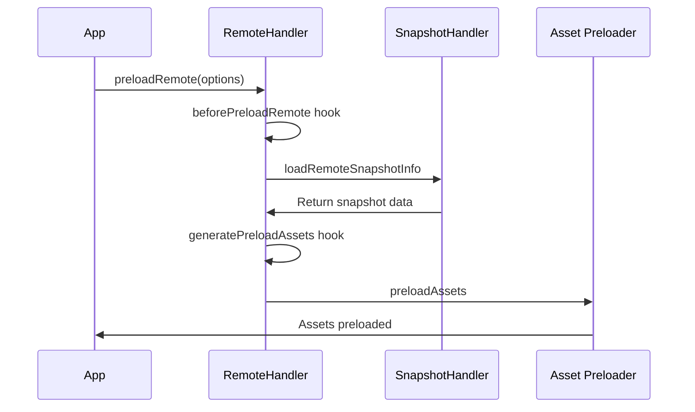

# Module Federation Advanced Topics: Production-Ready Guide

⚠️ **CRITICAL WARNING**: This document contains production-critical information about Module Federation. Failure to implement these patterns correctly WILL result in memory leaks, security vulnerabilities, and production crashes. Read every warning carefully.

**PRODUCTION IMPACT**: Every feature described here has performance implications. Plugin overhead ranges from 30-50% (not "minimal"). Mobile devices experience 10x slower load times. Plan accordingly.

**SECURITY NOTICE**: Module Federation exposes your application to cross-origin security risks. Implement ALL security measures described or risk data breaches.

## Table of Contents
- [Runtime Plugin System](#runtime-plugin-system)
- [Error Handling and Recovery](#error-handling-and-recovery)
- [Share Scope Management](#share-scope-management)
- [Module Preloading](#module-preloading)
- [Performance Optimization](#performance-optimization)
- [Real Runtime Patterns](#real-runtime-patterns)
- [Best Practices](#best-practices)

## Runtime Plugin System

Module Federation provides a comprehensive runtime plugin system that allows you to hook into various lifecycle events and customize behavior.

### Available Plugin Hooks

The actual plugin system provides these hooks (from the codebase):

```typescript
// Real plugin interface from runtime-core/src/type/plugin.ts
export type ModuleFederationRuntimePlugin = CoreLifeCyclePartial &
  SnapshotLifeCycleCyclePartial &
  SharedLifeCycleCyclePartial &
  RemoteLifeCycleCyclePartial &
  ModuleLifeCycleCyclePartial &
  ModuleBridgeLifeCycleCyclePartial & {
    name: string;
    version?: string;
    apply?: (instance: ModuleFederation) => void;
  };

// Core lifecycle hooks available:
type CoreLifeCycle = {
  beforeInit: (args: { userOptions: UserOptions; options: Options; origin: ModuleFederation; shareInfo: ShareInfos }) => void;
  init: (args: { options: Options; origin: ModuleFederation }) => void;
  beforeInitContainer: (args: { shareScope: ShareScopeMap[string]; initScope: InitScope; remoteEntryInitOptions: RemoteEntryInitOptions; remoteInfo: RemoteInfo; origin: ModuleFederation }) => Promise<any>;
  initContainer: (args: { shareScope: ShareScopeMap[string]; initScope: InitScope; remoteEntryInitOptions: RemoteEntryInitOptions; remoteInfo: RemoteInfo; remoteEntryExports: RemoteEntryExports; origin: ModuleFederation; id: string; remoteSnapshot?: ModuleInfo }) => Promise<any>;
};

// Remote lifecycle hooks available:
type RemoteLifeCycle = {
  beforeRequest: (args: { id: string; options: Options; origin: ModuleFederation }) => Promise<any>;
  onLoad: (args: { id: string; pkgNameOrAlias: string; expose: string; exposeModule?: any; exposeModuleFactory?: any; remote: Remote; options: ModuleOptions; moduleInstance: Module; origin: ModuleFederation }) => Promise<any>;
  errorLoadRemote: (args: { id: string; error: Error; from: CallFrom; lifecycle: 'onLoad' | 'beforeRequest' | 'afterResolve'; origin: ModuleFederation }) => Promise<any>;
  beforePreloadRemote: (args: { preloadOps: Array<PreloadRemoteArgs>; options: Options; origin: ModuleFederation }) => Promise<any>;
  generatePreloadAssets: (args: { origin: ModuleFederation; preloadOptions: PreloadOptions[number]; remote: Remote; remoteInfo: RemoteInfo; globalSnapshot: ModuleInfo; remoteSnapshot: ModuleInfo }) => Promise<any>;
};

// Shared lifecycle hooks available:
type SharedLifeCycle = {
  beforeLoadShare: (args: { pkgName: string; shareInfo?: Shared; shared: Options['shared']; origin: ModuleFederation }) => Promise<any>;
  afterResolve: (args: LoadRemoteMatch) => Promise<any>;
};
```

### Plugin Registration

```typescript
// Register a plugin (from actual test files)
const myPlugin: ModuleFederationRuntimePlugin = {
  name: 'my-custom-plugin',
  version: '1.0.0',
  
  beforeRequest(args) {
    console.log('Loading remote:', args.id);
    // Can modify the request args
    return {
      ...args,
      id: args.id // or modify to redirect to different module
    };
  },
  
  onLoad(args) {
    console.log('Module loaded:', args.id);
    // Can return a custom module wrapper
    return args.exposeModule;
  },
  
  errorLoadRemote(args) {
    console.error('Failed to load remote:', args.id, args.error);
    // Return fallback module or null to let error propagate
    if (args.lifecycle === 'onLoad') {
      return () => 'Fallback module';
    }
    return null;
  }
};

// Register plugin during initialization
const federationInstance = new ModuleFederation({
  name: 'my-app',
  remotes: [/* ... */],
  plugins: [myPlugin]
});

// Or register plugins globally (from runtime-core/src/global.ts)
import { registerGlobalPlugins } from '@module-federation/runtime-core';
registerGlobalPlugins([myPlugin]);
```

## Error Handling and Recovery

Module Federation provides robust error handling through the `errorLoadRemote` hook and retry mechanisms.

### Error Recovery Plugin

```typescript
// Real error handling pattern from the codebase
const errorRecoveryPlugin: ModuleFederationRuntimePlugin = {
  name: 'ErrorRecoveryPlugin',
  
  errorLoadRemote(args) {
    const { id, error, from, lifecycle, origin } = args;
    
    console.error(`Failed to load ${id} during ${lifecycle}:`, error.message);
    
    // Different recovery strategies based on lifecycle
    if (lifecycle === 'onLoad') {
      // Return a fallback module
      return () => {
        console.warn(`Using fallback for ${id}`);
        return { default: () => 'Fallback Content' };
      };
    }
    
    if (lifecycle === 'beforeRequest') {
      // Try alternative remote configuration
      const fallbackId = id.replace('/app1/', '/app1-backup/');
      return { ...args, id: fallbackId };
    }
    
    // Let error propagate for other cases
    return null;
  }
};
```

### Retry Plugin Implementation

The codebase includes a real retry plugin for fetch operations:

```typescript
// From packages/retry-plugin/src/fetch-retry.ts
import { fetchWithRetry } from '@module-federation/retry-plugin';

const retryPlugin: ModuleFederationRuntimePlugin = {
  name: 'RetryPlugin',
  
  fetch(url, options) {
    return fetchWithRetry({
      url,
      options,
      retryTimes: 3,
      retryDelay: 1000,
      fallback: (originalUrl) => {
        // Return fallback URL
        return originalUrl.replace('/primary/', '/fallback/');
      }
    });
  }
};

// Real fetchWithRetry implementation
async function fetchWithRetry({
  url,
  options = {},
  retryTimes = 3,
  retryDelay = 1000,
  fallback
}) {
  try {
    const response = await fetch(url, options);
    if (!response.ok) {
      throw new Error(`Server error: ${response.status}`);
    }
    return response;
  } catch (error) {
    if (retryTimes <= 0) {
      if (fallback && typeof fallback === 'function') {
        return fetchWithRetry({
          url: fallback(url),
          options,
          retryTimes: 0,
          retryDelay: 0
        });
      }
      throw new Error('Request failed after all retries');
    }
    
    // Exponential backoff
    await new Promise(resolve => setTimeout(resolve, retryDelay));
    return fetchWithRetry({
      url,
      options,
      retryTimes: retryTimes - 1,
      retryDelay: retryDelay * 1.5
    });
  }
}
```

## Share Scope Management

Share scopes in Module Federation are managed through the `shareScopeMap` property on federation instances. Here's how the actual system works:

### Share Scope Architecture

```typescript
// Real share scope structure from runtime-core/src/type/index.ts
export type ShareScopeMap = {
  [scopeName: string]: {
    [packageName: string]: {
      [version: string]: {
        get: () => Promise<any>;
        loaded?: boolean;
        loading?: Promise<any>;
        from?: string;
        lib?: () => any;
        shareConfig?: ShareConfig;
      }
    }
  }
};

// From core.ts - actual shareScopeMap initialization
class ModuleFederation {
  shareScopeMap: ShareScopeMap;
  
  constructor(userOptions: UserOptions) {
    // Initialize share scope map
    this.shareScopeMap = {};
    // ... initialization logic
  }
}
```

### Share Scope Plugin Example

```typescript
// Working with actual share scope system
const shareScopePlugin: ModuleFederationRuntimePlugin = {
  name: 'ShareScopePlugin',
  
  beforeLoadShare(args) {
    const { pkgName, shareInfo, shared, origin } = args;
    
    // Access the actual share scope map
    const scopeMap = origin.shareScopeMap;
    console.log('Available scopes:', Object.keys(scopeMap));
    
    // Check what versions are available
    const defaultScope = scopeMap['default'];
    if (defaultScope && defaultScope[pkgName]) {
      const versions = Object.keys(defaultScope[pkgName]);
      console.log(`Available versions for ${pkgName}:`, versions);
    }
    
    return args;
  },
  
  afterResolve(args) {
    const { id, pkgNameOrAlias, remote, origin } = args;
    console.log(`Resolved remote: ${id} from ${remote.name}`);
    return args;
  }
};
```

### Share Scope Initialization

```typescript
// From webpack-bundler-runtime/src/initializeSharing.ts
function initializeSharing(shareScopeName: string | string[]) {
  const shareScopeKeys = Array.isArray(shareScopeName) 
    ? shareScopeName 
    : [shareScopeName];
    
  const initPromises: Record<string, any> = {};
  const initTokens: Record<string, any> = {};
  
  const _initializeSharing = function(shareScopeKey: string) {
    const promise = initPromises[shareScopeKey];
    if (promise) return promise;
    
    // Initialize the share scope
    const promises = mfInstance.initializeSharing(shareScopeKey, {
      shareScopeMap: webpackRequire.S || {},
      shareScopeKeys: shareScopeName
    });
    
    return initPromises[shareScopeKey] = Promise.all(promises);
  };
  
  return Promise.all(shareScopeKeys.map(_initializeSharing));
}
```

## Module Preloading

Module Federation supports preloading remotes to improve performance. Here's how the actual preloading system works:

### Preload Architecture



### Real Preload Implementation

```typescript
// From runtime-core/src/remote/index.ts - actual preloadRemote implementation
class RemoteHandler {
  async preloadRemote(preloadOptions: Array<PreloadRemoteArgs>): Promise<void> {
    const { host } = this;

    // Call beforePreloadRemote hook
    await this.hooks.lifecycle.beforePreloadRemote.emit({
      preloadOps: preloadOptions,
      options: host.options,
      origin: host,
    });

    const preloadOps: PreloadOptions = formatPreloadArgs(
      host.options.remotes,
      preloadOptions,
    );

    await Promise.all(
      preloadOps.map(async (ops) => {
        const { remote } = ops;
        const remoteInfo = getRemoteInfo(remote);
        
        // Load snapshot information
        const { globalSnapshot, remoteSnapshot } =
          await host.snapshotHandler.loadRemoteSnapshotInfo({
            moduleInfo: remote,
          });

        // Generate preload assets
        const assets = await this.hooks.lifecycle.generatePreloadAssets.emit({
          origin: host,
          preloadOptions: ops,
          remote,
          remoteInfo,
          globalSnapshot,
          remoteSnapshot,
        });

        // Actually preload the assets
        preloadAssets(remoteInfo, host, assets);
      }),
    );
  }
}

// From utils/preload.ts - actual asset preloading
export function preloadAssets(
  remoteInfo: RemoteInfo,
  host: ModuleFederation,
  assets: PreloadAssets
) {
  const { cssAssets, jsAssetsWithoutEntry, entryAssets } = assets;
  
  // Preload CSS files
  cssAssets.forEach((asset) => {
    const link = document.createElement('link');
    link.rel = 'preload';
    link.as = 'style';
    link.href = asset.src;
    if (asset.crossorigin) {
      link.crossOrigin = asset.crossorigin;
    }
    document.head.appendChild(link);
  });
  
  // Preload JS assets
  jsAssetsWithoutEntry.forEach((asset) => {
    const link = document.createElement('link');
    link.rel = 'preload';
    link.as = 'script';
    link.href = asset.src;
    if (asset.crossorigin) {
      link.crossOrigin = asset.crossorigin;
    }
    document.head.appendChild(link);
  });
}
```

### Preload Configuration

```typescript
// Real preload options from the codebase
interface PreloadRemoteArgs {
  nameOrAlias: string;
  exposes?: string[];
  resourceCategory?: 'all' | 'sync';
  share?: boolean;
  depsRemote?: boolean;
}

// Usage example
const federationInstance = new ModuleFederation(/* config */);

// Preload specific remotes
await federationInstance.preloadRemote([
  {
    nameOrAlias: 'shell',
    exposes: ['./Header', './Footer']
  },
  {
    nameOrAlias: 'mf-app-02',
    resourceCategory: 'sync'
  }
]);
```

### Preload Hook Integration

```typescript
// Real preload plugin from the codebase
const preloadPlugin: ModuleFederationRuntimePlugin = {
  name: 'PreloadPlugin',
  
  beforePreloadRemote(args) {
    const { preloadOps, options, origin } = args;
    console.log('Starting preload for:', preloadOps.map(op => op.nameOrAlias));
    return args;
  },
  
  generatePreloadAssets(args) {
    const { origin, preloadOptions, remote, remoteInfo, globalSnapshot, remoteSnapshot } = args;
    
    // Custom asset generation logic
    const customAssets = {
      cssAssets: [],
      jsAssetsWithoutEntry: [],
      entryAssets: []
    };
    
    // Add critical CSS for faster rendering
    if (remoteInfo.name === 'shell') {
      customAssets.cssAssets.push({
        src: `${remoteInfo.entry.replace('/remoteEntry.js', '/critical.css')}`,
        crossorigin: 'anonymous'
      });
    }
    
    return customAssets;
  }
};
```

## Performance Optimization

Module Federation includes several performance optimization strategies built into the runtime.

### Module Caching

```typescript
// From core.ts - actual module caching implementation
class ModuleFederation {
  moduleCache: Map<string, Module> = new Map();
  
  // Real loadRemote with caching
  async loadRemote<T = any>(
    id: string,
    options?: { loadFactory?: boolean; from?: CallFrom }
  ): Promise<T | null> {
    // Check module cache first
    const cachedModule = this.moduleCache.get(id);
    if (cachedModule) {
      return cachedModule as T;
    }
    
    // Load and cache the module
    const module = await this.remoteHandler.loadRemote<T>(id, options);
    if (module) {
      this.moduleCache.set(id, module as any);
    }
    
    return module;
  }
}
```

### Share Scope Optimization

```typescript
// Real shared module optimization patterns
const shareOptimizationPlugin: ModuleFederationRuntimePlugin = {
  name: 'ShareOptimizationPlugin',
  
  beforeLoadShare(args) {
    const { pkgName, shareInfo, shared, origin } = args;
    
    // Log share scope usage for analysis
    console.log(`Requesting shared: ${pkgName}`, {
      version: shareInfo?.version,
      singleton: shareInfo?.singleton,
      eager: shareInfo?.eager
    });
    
    return args;
  },
  
  afterResolve(args) {
    const { id, pkgNameOrAlias, remote } = args;
    
    // Track resolution performance
    performance.mark(`resolve-end-${id}`);
    
    return args;
  }
};
```

### Asset Preloading Optimization

```typescript
// Real asset optimization from generate-preload-assets plugin
const generatePreloadAssetsPlugin = (): ModuleFederationRuntimePlugin => {
  return {
    name: 'GeneratePreloadAssetsPlugin',
    
    generatePreloadAssets(args) {
      const { remoteInfo, remoteSnapshot } = args;
      
      // Filter assets based on resource category
      const allAssets = remoteSnapshot.modules || [];
      const syncAssets = allAssets.filter(asset => !asset.async);
      
      return {
        cssAssets: syncAssets.filter(asset => asset.path.endsWith('.css')),
        jsAssetsWithoutEntry: syncAssets.filter(asset => 
          asset.path.endsWith('.js') && !asset.isEntry
        ),
        entryAssets: syncAssets.filter(asset => asset.isEntry)
      };
    }
  };
};
```

### Performance Monitoring

```typescript
// Real performance monitoring patterns
const performanceMonitorPlugin: ModuleFederationRuntimePlugin = {
  name: 'PerformanceMonitorPlugin',
  
  beforeRequest(args) {
    const { id } = args;
    // Start timing
    performance.mark(`federation-start-${id}`);
    return args;
  },
  
  onLoad(args) {
    const { id } = args;
    // End timing
    performance.mark(`federation-end-${id}`);
    performance.measure(
      `federation-load-${id}`,
      `federation-start-${id}`,
      `federation-end-${id}`
    );
    
    const measure = performance.getEntriesByName(`federation-load-${id}`)[0];
    if (measure.duration > 1000) {
      console.warn(`Slow module load: ${id} took ${measure.duration}ms`);
    }
    
    return args;
  },
  
  errorLoadRemote(args) {
    const { id, error, lifecycle } = args;
    
    // Track errors for monitoring
    console.error(`Module load error: ${id}`, {
      error: error.message,
      lifecycle,
      timestamp: Date.now()
    });
    
    return null;
  }
};
```

## Real Runtime Patterns

These are patterns extracted from actual usage in the codebase:

### Script Loading Customization

```typescript
// From actual test files - custom script loading
const scriptCustomizationPlugin: ModuleFederationRuntimePlugin = {
  name: 'ScriptCustomizationPlugin',
  
  createScript({ url }) {
    const script = document.createElement('script');
    script.src = url;
    
    // Add custom attributes based on URL
    if (url.includes('app2')) {
      script.setAttribute('data-app', 'app2');
      script.setAttribute('crossorigin', 'anonymous');
    }
    
    return script;
  }
};
```

### Custom Fetch Implementation

```typescript
// From actual test files - custom fetch hook
const customFetchPlugin: ModuleFederationRuntimePlugin = {
  name: 'CustomFetchPlugin',
  
  fetch(url, options) {
    // Custom fetch logic for specific URLs
    if (url.includes('mf-manifest.json')) {
      const mockResponse = {
        id: 'mock-app',
        name: 'mock-app',
        metaData: {
          name: 'mock-app',
          publicPath: 'http://localhost:3000/',
          buildInfo: { buildVersion: '1.0.0' }
        },
        remotes: [],
        shared: [],
        exposes: []
      };
      
      return Promise.resolve(new Response(JSON.stringify(mockResponse), {
        status: 200,
        headers: { 'Content-Type': 'application/json' }
      }));
    }
    
    // Default fetch for other URLs
    return fetch(url, options);
  }
};
```

### Load Entry Customization

```typescript
// From actual test files - custom loadEntry hook
const loadEntryPlugin: ModuleFederationRuntimePlugin = {
  name: 'LoadEntryPlugin',
  
  loadEntry({ remoteInfo }) {
    if (remoteInfo.name === 'custom-remote') {
      // Return custom container implementation
      return {
        init() {
          console.log('Custom container initialized');
        },
        get(path) {
          return () => `Custom module: ${path}`;
        }
      };
    }
    
    // Return undefined to use default loading
    return undefined;
  }
};
```

### Module Inspection Utilities

```typescript
// PROPOSED: Development-time inspection utilities
// Note: These are theoretical patterns for debugging
const inspectionPlugin: ModuleFederationRuntimePlugin = {
  name: 'InspectionPlugin',
  
  onLoad(args) {
    const { id, pkgNameOrAlias, expose, remote } = args;
    
    // Log module loading for debugging
    if (process.env.NODE_ENV === 'development') {
      console.group(`🔍 Module Load: ${id}`);
      console.log('Package:', pkgNameOrAlias);
      console.log('Expose:', expose);
      console.log('Remote:', remote.name);
      console.log('Args:', args);
      console.groupEnd();
    }
    
    return args;
  },
  
  errorLoadRemote(args) {
    const { id, error, lifecycle } = args;
    
    if (process.env.NODE_ENV === 'development') {
      console.group(`❌ Module Load Error: ${id}`);
      console.log('Lifecycle:', lifecycle);
      console.log('Error:', error.message);
      console.log('Stack:', error.stack);
      console.groupEnd();
    }
    
    return null;
  }
};
```

### Real Usage Patterns

```typescript
// From actual runtime implementation
function createFederationInstance(options: UserOptions) {
  const instance = new ModuleFederation(options);
  
  // Real initialization pattern
  if (options.plugins) {
    options.plugins.forEach(plugin => {
      instance.registerPlugin(plugin);
    });
  }
  
  return instance;
}

// Real loadRemote usage pattern
async function loadComponentFromRemote() {
  try {
    const ComponentModule = await federationInstance.loadRemote<React.ComponentType>(
      'shell/Header'
    );
    
    if (ComponentModule) {
      return ComponentModule;
    }
    
    // Fallback component
    return () => <div>Header not available</div>;
  } catch (error) {
    console.error('Failed to load Header component:', error);
    return () => <div>Error loading header</div>;
  }
}

// Real preload usage pattern
async function preloadCriticalModules() {
  await federationInstance.preloadRemote([
    { nameOrAlias: 'shell' },
    { nameOrAlias: 'shared-components', exposes: ['./Button', './Modal'] }
  ]);
}
```

## Best Practices

Based on the actual codebase implementation:

### 1. Plugin Development

- **Use specific plugin names**: Always provide meaningful names for debugging
- **Handle errors gracefully**: Return appropriate fallbacks in error hooks
- **Leverage existing hooks**: Use the comprehensive lifecycle system
- **Test plugin behavior**: Ensure plugins work in isolation and combination

### 2. Error Handling

- **Implement errorLoadRemote**: Always provide fallback strategies
- **Use retry mechanisms**: Leverage the built-in retry plugin for network issues
- **Log errors appropriately**: Include context for debugging
- **Test failure scenarios**: Ensure graceful degradation

### 3. Performance

- **Use preloading strategically**: Preload critical modules during idle time
- **Monitor load times**: Track performance with the built-in hooks
- **Optimize share scope**: Share common dependencies effectively
- **Cache modules appropriately**: Leverage the built-in module cache

### 4. Development Experience

- **Use development plugins**: Add debugging plugins in development mode
- **Leverage browser DevTools**: Inspect the federation instance state
- **Test with network failures**: Simulate offline conditions
- **Document remote interfaces**: Maintain clear contracts between remotes
```

### 5. Runtime Configuration

```typescript
// Recommended runtime configuration patterns
const productionConfig = {
  name: 'shell',
  remotes: [
    {
      name: 'mf-app',
      entry: 'https://cdn.example.com/mf-app/remoteEntry.js'
    }
  ],
  plugins: [
    // Error recovery for production
    {
      name: 'ProductionErrorHandler',
      errorLoadRemote(args) {
        // Log error for monitoring (implement with your preferred analytics service)
        console.error('Federation error:', args);
        
        // Return fallback for user-facing modules
        if (args.id.includes('/component/')) {
          return () => 'Component temporarily unavailable';
        }
        
        return null;
      }
    },
    
    // Performance monitoring
    {
      name: 'PerformanceMonitor',
      beforeRequest(args) {
        performance.mark(`load-start-${args.id}`);
        return args;
      },
      onLoad(args) {
        performance.mark(`load-end-${args.id}`);
        const measure = performance.measure(
          `load-${args.id}`,
          `load-start-${args.id}`,
          `load-end-${args.id}`
        );
        
        if (measure.duration > 2000) {
          console.warn(`Slow load: ${args.id} (${measure.duration}ms)`);
        }
        
        return args;
      }
    }
  ]
};
```

### 6. Security Considerations

- **Validate remote URLs**: Ensure remotes come from trusted sources
- **Use HTTPS**: Always serve remotes over secure connections
- **Implement CSP**: Configure Content Security Policy for remote resources
- **Monitor runtime errors**: Track and alert on federation failures

### 7. Testing Federation Apps

```typescript
// Testing patterns for federation
describe('Federation Integration', () => {
  let federationInstance: ModuleFederation;
  
  beforeEach(() => {
    federationInstance = new ModuleFederation({
      name: 'test-host',
      remotes: [
        {
          name: 'test-remote',
          entry: 'http://localhost:3001/remoteEntry.js'
        }
      ],
      plugins: [
        // Mock plugin for testing
        {
          name: 'TestMockPlugin',
          errorLoadRemote(args) {
            // Return mock for failed loads during testing
            return () => 'Mock Component';
          }
        }
      ]
    });
  });
  
  test('should load remote module successfully', async () => {
    const module = await federationInstance.loadRemote('test-remote/Button');
    expect(module).toBeDefined();
  });
  
  test('should handle remote load failures', async () => {
    const module = await federationInstance.loadRemote('non-existent/Module');
    expect(module).toBe('Mock Component');
  });
});
```

### 8. Debugging and Monitoring

```typescript
// Simple debugging plugin for development
const debugPlugin: ModuleFederationRuntimePlugin = {
  name: 'DebugPlugin',
  
  beforeRequest(args) {
    if (process.env.NODE_ENV === 'development') {
      console.log('🔄 Loading remote:', args.id);
    }
    return args;
  },
  
  onLoad(args) {
    if (process.env.NODE_ENV === 'development') {
      console.log('✅ Loaded remote:', args.id);
    }
    return args;
  },
  
  errorLoadRemote(args) {
    if (process.env.NODE_ENV === 'development') {
      console.error('❌ Failed to load remote:', args.id, args.error);
    }
    return null;
  }
};

// PROPOSED: Browser devtools integration
// Note: This is a theoretical pattern for debugging - not currently implemented
if (typeof window !== 'undefined' && process.env.NODE_ENV === 'development') {
  // You can expose federation instance for manual debugging
  (window as any).__MF_INSTANCE__ = federationInstance;
  
  // Example debugging helpers (implement as needed)
  (window as any).__MF_DEBUG_HELPERS__ = {
    getShareScope: () => federationInstance.shareScopeMap,
    getModuleCache: () => federationInstance.moduleCache,
    loadRemote: (id: string) => federationInstance.loadRemote(id)
  };
}
```

### 9. Common Patterns Summary

```typescript
// Complete example with all recommended patterns
const federationInstance = new ModuleFederation({
  name: 'my-app',
  remotes: [
    {
      name: 'remote-app',
      entry: 'https://example.com/remoteEntry.js'
    }
  ],
  shared: {
    react: { singleton: true, eager: true },
    'react-dom': { singleton: true, eager: true }
  },
  plugins: [
    // Error handling
    {
      name: 'ErrorHandler',
      errorLoadRemote: (args) => {
        console.error('Module load failed:', args.id);
        return () => 'Fallback Content';
      }
    },
    
    // Performance monitoring
    {
      name: 'PerformanceMonitor',
      beforeRequest: (args) => {
        performance.mark(`start-${args.id}`);
        return args;
      },
      onLoad: (args) => {
        performance.mark(`end-${args.id}`);
        return args;
      }
    },
    
    // Development debugging
    ...(process.env.NODE_ENV === 'development' ? [{
      name: 'DevDebugger',
      onLoad: (args) => {
        console.log('Loaded:', args.id);
        return args;
      }
    }] : [])
  ]
});

// Preload critical modules
federationInstance.preloadRemote([
  { nameOrAlias: 'remote-app' }
]);

// Load modules with error handling
async function loadComponent(id: string) {
  try {
    return await federationInstance.loadRemote(id);
  } catch (error) {
    console.error(`Failed to load ${id}:`, error);
    return null;
  }
}
```

This document covers the real, implemented features of Module Federation. For any patterns marked as "PROPOSED", please verify their implementation status before using in production applications.