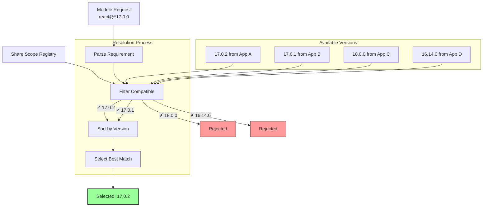
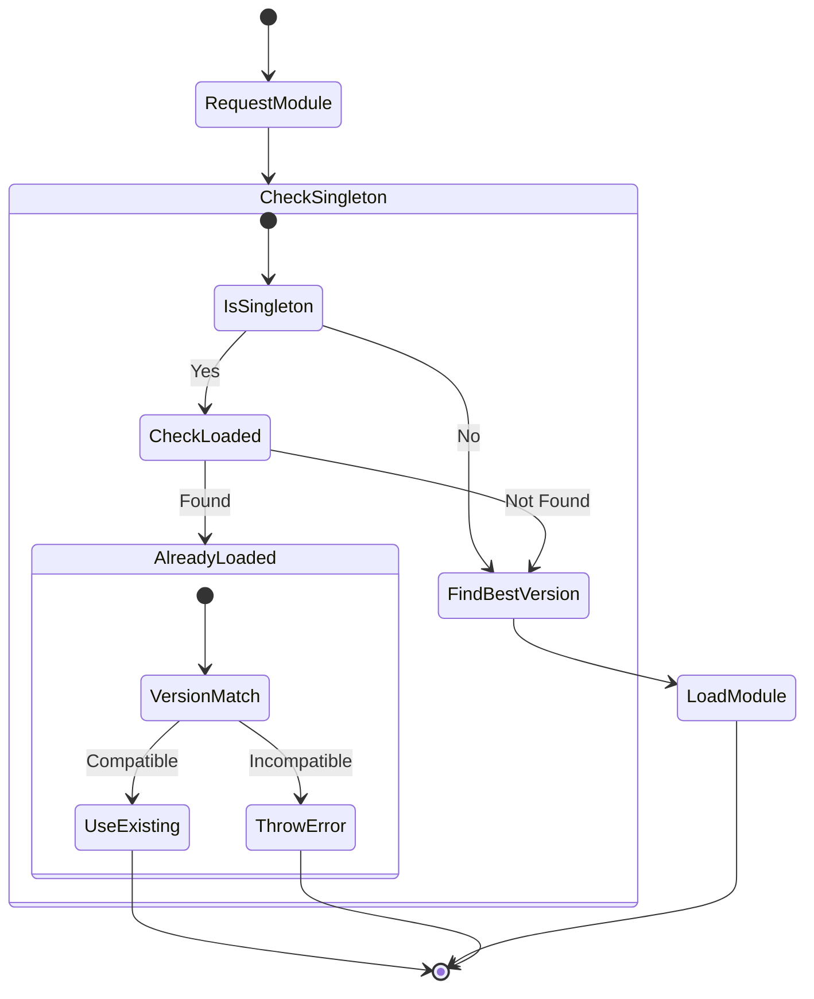
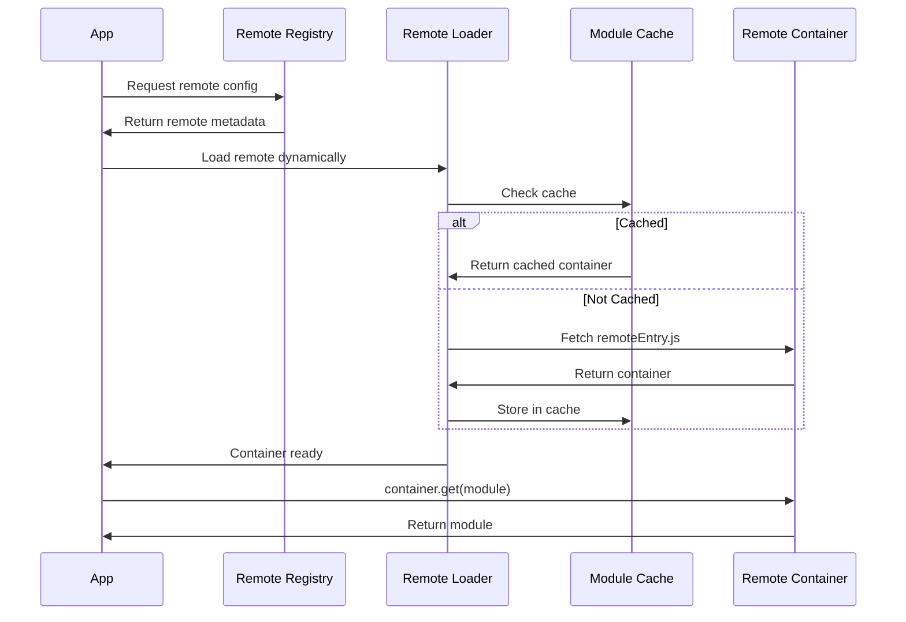
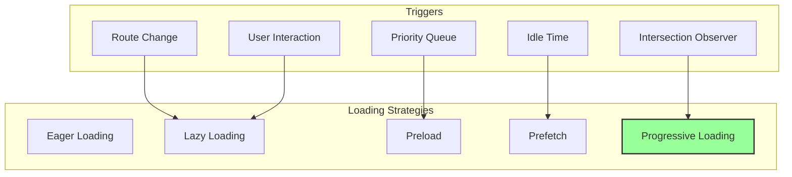
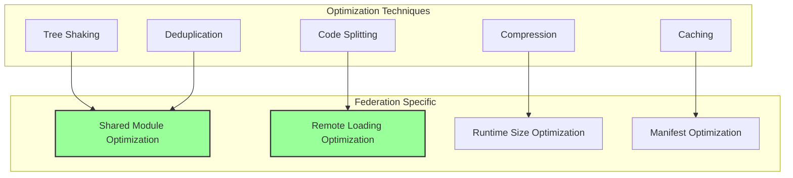
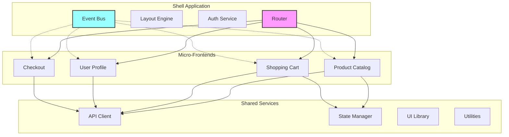

# Module Federation Advanced Topics

This document covers advanced topics in Module Federation including version negotiation, share scope management, dynamic remotes, performance optimizations, and complex architectural patterns.

## Table of Contents
- [Version Negotiation Deep Dive](#version-negotiation-deep-dive)
- [Share Scope Management](#share-scope-management)
- [Dynamic Remotes and Lazy Loading](#dynamic-remotes-and-lazy-loading)
- [Performance Optimizations](#performance-optimizations)
- [Advanced Architectural Patterns](#advanced-architectural-patterns)
- [Security Considerations](#security-considerations)
- [Debugging and Monitoring](#debugging-and-monitoring)

## Version Negotiation Deep Dive

### How Version Resolution Works



### Version Resolution Algorithm

```typescript
// Core version resolution implementation
class VersionResolver {
  /**
   * Resolve best version from available versions
   */
  resolveBestVersion(
    availableVersions: Map<string, ModuleInfo>,
    requirement: string,
    options: ResolveOptions = {}
  ): string | null {
    const { 
      singleton = false,
      strictVersion = false,
      preferLoaded = false 
    } = options;
    
    // Step 1: Filter compatible versions
    const compatible = Array.from(availableVersions.entries())
      .filter(([version, info]) => {
        if (strictVersion) {
          return version === requirement;
        }
        return this.satisfies(version, requirement);
      });
    
    if (compatible.length === 0) {
      return null;
    }
    
    // Step 2: Apply singleton constraint
    if (singleton) {
      const loaded = compatible.find(([_, info]) => info.loaded);
      if (loaded) {
        return loaded[0];
      }
    }
    
    // Step 3: Sort by preference
    compatible.sort(([v1, i1], [v2, i2]) => {
      // Prefer loaded modules if specified
      if (preferLoaded) {
        if (i1.loaded && !i2.loaded) return -1;
        if (!i1.loaded && i2.loaded) return 1;
      }
      
      // Sort by version (highest first)
      return this.compareVersions(v2, v1);
    });
    
    return compatible[0][0];
  }
  
  /**
   * Advanced version satisfaction with ranges
   */
  satisfies(version: string, requirement: string): boolean {
    // Handle special cases
    if (!requirement || requirement === '*' || requirement === 'latest') {
      return true;
    }
    
    // Parse version and requirement
    const v = this.parseVersion(version);
    const req = this.parseRequirement(requirement);
    
    // Apply range logic
    return this.checkRange(v, req);
  }
  
  private parseRequirement(requirement: string): VersionRequirement {
    const rangeRegex = /^([\^~><=]+)?(.+)$/;
    const match = requirement.match(rangeRegex);
    
    if (!match) {
      return { operator: '=', version: requirement };
    }
    
    return {
      operator: match[1] || '=',
      version: match[2]
    };
  }
}
```

### Handling Version Conflicts



### Advanced Version Strategies

```typescript
// Custom version strategy plugin
class VersionStrategyPlugin {
  name = 'VersionStrategyPlugin';
  
  apply(federation: FederationInstance) {
    // Override version resolution
    federation.hooks.beforeLoadShare.tapAsync(
      this.name,
      async (request, version, options) => {
        // Custom resolution logic
        if (request === 'react' && this.isProduction()) {
          // In production, prefer exact versions
          options.strictVersion = true;
        }
        
        if (request.startsWith('@company/')) {
          // For internal packages, always use latest
          version = 'latest';
        }
        
        return [request, version, options];
      }
    );
    
    // Handle version conflicts
    federation.hooks.error.tapAsync(
      this.name,
      async (error, context) => {
        if (error.code === 'VERSION_CONFLICT') {
          // Log to monitoring
          this.logVersionConflict(error, context);
          
          // Attempt recovery
          if (context.singleton && context.fallback) {
            return context.fallback();
          }
        }
      }
    );
  }
}
```

## Share Scope Management

### Share Scope Architecture

```mermaid
graph TB
    subgraph "Global Share Scopes"
        Default[Default Scope]
        CustomA[Custom Scope A]
        CustomB[Custom Scope B]
    end
    
    subgraph "Default Scope Contents"
        React[react@18.0.0]
        ReactDOM[react-dom@18.0.0]
        Lodash[lodash@4.17.21]
    end
    
    subgraph "Apps"
        App1[App 1]
        App2[App 2]
        App3[App 3]
    end
    
    App1 --> Default
    App2 --> Default
    App3 --> CustomA
    
    Default --> React
    Default --> ReactDOM
    Default --> Lodash
    
    style Default fill:#bbf,stroke:#333,stroke-width:2px
```

### Custom Share Scope Implementation

```typescript
// Advanced share scope manager
class ShareScopeManager {
  private scopes: Map<string, ShareScope> = new Map();
  
  /**
   * Create isolated share scope
   */
  createScope(name: string, options: ShareScopeOptions = {}): ShareScope {
    const scope: ShareScope = {
      name,
      modules: new Map(),
      options,
      
      // Register module in scope
      register(packageName: string, version: string, moduleGetter: ModuleGetter) {
        if (!this.modules.has(packageName)) {
          this.modules.set(packageName, new Map());
        }
        
        const versions = this.modules.get(packageName)!;
        versions.set(version, {
          get: moduleGetter,
          loaded: false,
          loading: null,
          from: options.from || 'unknown'
        });
      },
      
      // Get module from scope with advanced options
      async get(packageName: string, requiredVersion: string, options?: GetOptions) {
        const versions = this.modules.get(packageName);
        if (!versions) {
          throw new Error(`Package ${packageName} not found in scope ${name}`);
        }
        
        // Use custom resolver if provided
        const resolver = options?.resolver || this.defaultResolver;
        const version = resolver(versions, requiredVersion, options);
        
        if (!version) {
          throw new Error(
            `No compatible version of ${packageName} found for ${requiredVersion}`
          );
        }
        
        return this.loadVersion(packageName, version);
      },
      
      // Merge another scope
      merge(otherScope: ShareScope) {
        for (const [pkg, versions] of otherScope.modules) {
          for (const [version, info] of versions) {
            this.register(pkg, version, info.get);
          }
        }
      }
    };
    
    this.scopes.set(name, scope);
    return scope;
  }
  
  /**
   * Cross-scope module sharing
   */
  async shareAcrossScopes(
    packageName: string,
    fromScope: string,
    toScope: string,
    version?: string
  ) {
    const source = this.scopes.get(fromScope);
    const target = this.scopes.get(toScope);
    
    if (!source || !target) {
      throw new Error('Invalid scope names');
    }
    
    const versions = source.modules.get(packageName);
    if (!versions) {
      throw new Error(`Package ${packageName} not found in ${fromScope}`);
    }
    
    if (version) {
      // Share specific version
      const moduleInfo = versions.get(version);
      if (moduleInfo) {
        target.register(packageName, version, moduleInfo.get);
      }
    } else {
      // Share all versions
      for (const [v, info] of versions) {
        target.register(packageName, v, info.get);
      }
    }
  }
}
```

### Scope Isolation Patterns

```typescript
// Isolated scope for micro-frontends
class IsolatedScopePlugin {
  name = 'IsolatedScopePlugin';
  
  apply(federation: FederationInstance) {
    const scopeManager = new ShareScopeManager();
    
    // Create isolated scopes per feature
    federation.hooks.beforeInit.tap(this.name, (options) => {
      const feature = options.metadata?.feature;
      if (feature) {
        // Create feature-specific scope
        const scopeName = `feature-${feature}`;
        scopeManager.createScope(scopeName, {
          isolated: true,
          fallbackScope: 'default'
        });
        
        // Override default scope
        options.shareScope = scopeName;
      }
    });
    
    // Handle cross-scope requests
    federation.hooks.beforeLoadShare.tapAsync(
      this.name,
      async (request, version, options) => {
        if (options.crossScope) {
          // Check multiple scopes
          const scopes = ['default', options.shareScope, ...options.additionalScopes];
          
          for (const scope of scopes) {
            try {
              const module = await scopeManager.getFromScope(scope, request, version);
              if (module) return module;
            } catch (e) {
              // Continue to next scope
            }
          }
        }
        
        return [request, version, options];
      }
    );
  }
}
```

## Dynamic Remotes and Lazy Loading

### Dynamic Remote Loading Architecture



### Advanced Dynamic Remote Implementation

```typescript
// Dynamic remote loader with advanced features
class DynamicRemoteLoader {
  private remoteCache = new Map<string, RemoteContainer>();
  private loadingMap = new Map<string, Promise<RemoteContainer>>();
  private registry: RemoteRegistry;
  
  constructor(registryUrl: string) {
    this.registry = new RemoteRegistry(registryUrl);
  }
  
  /**
   * Load remote with retry and fallback
   */
  async loadRemote(
    remoteName: string,
    options: DynamicLoadOptions = {}
  ): Promise<RemoteContainer> {
    // Check cache
    if (this.remoteCache.has(remoteName)) {
      return this.remoteCache.get(remoteName)!;
    }
    
    // Check if already loading
    if (this.loadingMap.has(remoteName)) {
      return this.loadingMap.get(remoteName)!;
    }
    
    // Start loading
    const loadPromise = this.loadRemoteWithRetry(remoteName, options);
    this.loadingMap.set(remoteName, loadPromise);
    
    try {
      const container = await loadPromise;
      this.remoteCache.set(remoteName, container);
      return container;
    } finally {
      this.loadingMap.delete(remoteName);
    }
  }
  
  private async loadRemoteWithRetry(
    remoteName: string,
    options: DynamicLoadOptions
  ): Promise<RemoteContainer> {
    const { retries = 3, timeout = 30000, fallbackUrl } = options;
    
    // Get remote config from registry
    const config = await this.registry.getRemoteConfig(remoteName);
    
    // Try primary URL
    for (let attempt = 0; attempt < retries; attempt++) {
      try {
        return await this.loadFromUrl(config.url, remoteName, timeout);
      } catch (error) {
        console.warn(`Attempt ${attempt + 1} failed for ${remoteName}:`, error);
        
        if (attempt < retries - 1) {
          // Exponential backoff
          await this.delay(Math.pow(2, attempt) * 1000);
        }
      }
    }
    
    // Try fallback URL if provided
    if (fallbackUrl || config.fallbackUrl) {
      try {
        return await this.loadFromUrl(
          fallbackUrl || config.fallbackUrl!,
          remoteName,
          timeout
        );
      } catch (error) {
        throw new Error(
          `Failed to load remote ${remoteName} from all URLs`
        );
      }
    }
    
    throw new Error(`Failed to load remote ${remoteName} after ${retries} attempts`);
  }
  
  private async loadFromUrl(
    url: string,
    scope: string,
    timeout: number
  ): Promise<RemoteContainer> {
    return new Promise((resolve, reject) => {
      const script = document.createElement('script');
      script.src = url;
      script.async = true;
      
      const timer = setTimeout(() => {
        script.remove();
        reject(new Error(`Timeout loading ${url}`));
      }, timeout);
      
      script.onload = async () => {
        clearTimeout(timer);
        
        // Get container from global scope
        const container = (window as any)[scope];
        if (!container) {
          reject(new Error(`Container ${scope} not found`));
          return;
        }
        
        // Initialize container
        await container.init(__webpack_share_scopes__.default);
        resolve(container);
      };
      
      script.onerror = () => {
        clearTimeout(timer);
        script.remove();
        reject(new Error(`Failed to load script ${url}`));
      };
      
      document.head.appendChild(script);
    });
  }
}
```

### Lazy Loading Strategies



### Progressive Loading Implementation

```typescript
// Progressive loading controller
class ProgressiveLoader {
  private observer: IntersectionObserver;
  private priorityQueue: PriorityQueue<LoadTask>;
  private idleCallback: number | null = null;
  
  constructor() {
    // Setup intersection observer for viewport-based loading
    this.observer = new IntersectionObserver(
      this.handleIntersection.bind(this),
      {
        rootMargin: '50px',
        threshold: 0.01
      }
    );
    
    this.priorityQueue = new PriorityQueue();
    this.setupIdleLoading();
  }
  
  /**
   * Register component for progressive loading
   */
  registerComponent(
    element: HTMLElement,
    remoteName: string,
    modulePath: string,
    priority: number = 0
  ) {
    const task: LoadTask = {
      id: `${remoteName}/${modulePath}`,
      remoteName,
      modulePath,
      priority,
      element,
      status: 'pending'
    };
    
    if (priority > 5) {
      // High priority - load immediately
      this.loadTask(task);
    } else if (priority > 2) {
      // Medium priority - add to queue
      this.priorityQueue.enqueue(task);
    } else {
      // Low priority - observe for viewport
      element.dataset.remoteInfo = JSON.stringify({ remoteName, modulePath });
      this.observer.observe(element);
    }
  }
  
  private handleIntersection(entries: IntersectionObserverEntry[]) {
    entries.forEach(entry => {
      if (entry.isIntersecting) {
        const element = entry.target as HTMLElement;
        const info = JSON.parse(element.dataset.remoteInfo || '{}');
        
        if (info.remoteName && info.modulePath) {
          this.loadTask({
            id: `${info.remoteName}/${info.modulePath}`,
            remoteName: info.remoteName,
            modulePath: info.modulePath,
            priority: 1,
            element,
            status: 'pending'
          });
          
          this.observer.unobserve(element);
        }
      }
    });
  }
  
  private setupIdleLoading() {
    if ('requestIdleCallback' in window) {
      this.idleCallback = requestIdleCallback(
        () => this.processIdleQueue(),
        { timeout: 2000 }
      );
    }
  }
  
  private async processIdleQueue() {
    while (!this.priorityQueue.isEmpty()) {
      const task = this.priorityQueue.dequeue();
      if (task && task.status === 'pending') {
        await this.loadTask(task);
      }
      
      // Check if still idle
      if ('requestIdleCallback' in window) {
        await new Promise(resolve => {
          requestIdleCallback(resolve, { timeout: 100 });
        });
      }
    }
  }
  
  private async loadTask(task: LoadTask) {
    task.status = 'loading';
    
    try {
      const module = await __webpack_require__.federation.loadRemote(
        `${task.remoteName}/${task.modulePath}`
      );
      
      task.status = 'loaded';
      
      // Trigger custom event
      task.element?.dispatchEvent(
        new CustomEvent('remoteLoaded', {
          detail: { module, task }
        })
      );
    } catch (error) {
      task.status = 'error';
      console.error(`Failed to load ${task.id}:`, error);
    }
  }
}
```

## Performance Optimizations

### Bundle Optimization Strategies



### Shared Module Optimization

```typescript
// Optimize shared modules configuration
class SharedModuleOptimizer {
  /**
   * Analyze and optimize shared configuration
   */
  optimizeSharedConfig(
    originalConfig: SharedConfig,
    dependencies: Record<string, string>
  ): OptimizedSharedConfig {
    const optimized: OptimizedSharedConfig = {};
    
    // Group by major version
    const versionGroups = this.groupByMajorVersion(dependencies);
    
    Object.entries(originalConfig).forEach(([pkg, config]) => {
      const pkgConfig = typeof config === 'string' 
        ? { import: config } 
        : config;
      
      // Analyze usage patterns
      const usage = this.analyzeUsage(pkg);
      
      optimized[pkg] = {
        ...pkgConfig,
        // Set singleton for framework packages
        singleton: this.isFramework(pkg) ? true : pkgConfig.singleton,
        
        // Optimize version ranges
        requiredVersion: this.optimizeVersionRange(
          pkg,
          pkgConfig.requiredVersion || dependencies[pkg],
          versionGroups[pkg]
        ),
        
        // Set eager loading for critical packages
        eager: usage.isCritical || pkgConfig.eager,
        
        // Enable strict version for production
        strictVersion: process.env.NODE_ENV === 'production' 
          ? pkgConfig.strictVersion ?? true
          : false
      };
    });
    
    return optimized;
  }
  
  /**
   * Deduplicate shared modules across containers
   */
  deduplicateAcrossContainers(
    containers: ContainerConfig[]
  ): DeduplicationResult {
    const moduleMap = new Map<string, Set<string>>();
    
    // Collect all shared modules
    containers.forEach(container => {
      Object.keys(container.shared || {}).forEach(pkg => {
        if (!moduleMap.has(pkg)) {
          moduleMap.set(pkg, new Set());
        }
        moduleMap.get(pkg)!.add(container.name);
      });
    });
    
    // Find common modules
    const commonModules = Array.from(moduleMap.entries())
      .filter(([_, containers]) => containers.size > 1)
      .map(([pkg]) => pkg);
    
    // Create optimized configuration
    return {
      commonModules,
      optimizedConfigs: containers.map(container => ({
        ...container,
        shared: this.optimizeContainerShared(
          container.shared || {},
          commonModules
        )
      }))
    };
  }
}
```

### Runtime Performance Optimization

```typescript
// Runtime performance monitor
class PerformanceMonitor {
  private metrics: Map<string, PerformanceMetric> = new Map();
  
  constructor() {
    this.setupPerformanceObserver();
  }
  
  /**
   * Track module loading performance
   */
  trackModuleLoad(moduleId: string, startTime: number) {
    const endTime = performance.now();
    const duration = endTime - startTime;
    
    const metric: PerformanceMetric = {
      moduleId,
      duration,
      timestamp: Date.now(),
      type: 'module-load'
    };
    
    this.metrics.set(moduleId, metric);
    
    // Report slow loads
    if (duration > 1000) {
      this.reportSlowLoad(metric);
    }
  }
  
  /**
   * Optimize loading based on metrics
   */
  getOptimizationSuggestions(): OptimizationSuggestion[] {
    const suggestions: OptimizationSuggestion[] = [];
    
    // Analyze load times
    const slowModules = Array.from(this.metrics.values())
      .filter(m => m.duration > 500)
      .sort((a, b) => b.duration - a.duration);
    
    if (slowModules.length > 0) {
      suggestions.push({
        type: 'preload',
        message: 'Consider preloading these slow modules',
        modules: slowModules.map(m => m.moduleId)
      });
    }
    
    // Analyze load patterns
    const loadFrequency = this.analyzeLoadFrequency();
    const frequentModules = Array.from(loadFrequency.entries())
      .filter(([_, count]) => count > 5)
      .map(([moduleId]) => moduleId);
    
    if (frequentModules.length > 0) {
      suggestions.push({
        type: 'eager',
        message: 'Consider eager loading frequently used modules',
        modules: frequentModules
      });
    }
    
    return suggestions;
  }
  
  private setupPerformanceObserver() {
    if ('PerformanceObserver' in window) {
      const observer = new PerformanceObserver((list) => {
        list.getEntries().forEach((entry) => {
          if (entry.entryType === 'resource' && 
              entry.name.includes('remoteEntry')) {
            this.trackRemoteLoad(entry as PerformanceResourceTiming);
          }
        });
      });
      
      observer.observe({ entryTypes: ['resource'] });
    }
  }
}
```

### Memory Optimization

```typescript
// Memory-aware module management
class MemoryOptimizedLoader {
  private moduleCache = new Map<string, WeakRef<Module>>();
  private memoryThreshold = 0.8; // 80% memory usage
  
  /**
   * Load module with memory awareness
   */
  async loadModule(moduleId: string): Promise<Module> {
    // Check cache with weak references
    const cached = this.moduleCache.get(moduleId);
    if (cached) {
      const module = cached.deref();
      if (module) {
        return module;
      }
    }
    
    // Check memory before loading
    const memoryUsage = await this.getMemoryUsage();
    if (memoryUsage > this.memoryThreshold) {
      await this.freeMemory();
    }
    
    // Load module
    const module = await this.loadModuleFromRemote(moduleId);
    
    // Store with weak reference
    this.moduleCache.set(moduleId, new WeakRef(module));
    
    return module;
  }
  
  private async getMemoryUsage(): Promise<number> {
    if ('memory' in performance) {
      const memory = (performance as any).memory;
      return memory.usedJSHeapSize / memory.jsHeapSizeLimit;
    }
    return 0;
  }
  
  private async freeMemory() {
    // Clear expired weak references
    for (const [id, ref] of this.moduleCache.entries()) {
      if (!ref.deref()) {
        this.moduleCache.delete(id);
      }
    }
    
    // Force garbage collection if available
    if ('gc' in window) {
      (window as any).gc();
    }
  }
}
```

## Advanced Architectural Patterns

### Micro-Frontend Orchestration



### Advanced Orchestration Implementation

```typescript
// Micro-frontend orchestrator
class MicroFrontendOrchestrator {
  private apps = new Map<string, MicroFrontendApp>();
  private eventBus = new EventEmitter();
  private router: Router;
  
  /**
   * Register micro-frontend application
   */
  registerApp(config: MicroFrontendConfig) {
    const app: MicroFrontendApp = {
      ...config,
      status: 'registered',
      instance: null,
      
      // Lifecycle methods
      async bootstrap() {
        this.status = 'bootstrapping';
        
        // Load remote container
        const container = await loadRemote(config.remote);
        
        // Get app module
        const AppModule = await container.get(config.entry);
        
        this.instance = new AppModule({
          eventBus: this.eventBus,
          router: this.router,
          sharedState: this.getSharedState()
        });
        
        this.status = 'bootstrapped';
      },
      
      async mount(element: HTMLElement) {
        if (this.status !== 'bootstrapped') {
          await this.bootstrap();
        }
        
        this.status = 'mounting';
        await this.instance!.mount(element);
        this.status = 'mounted';
        
        // Emit lifecycle event
        this.eventBus.emit('app:mounted', { name: config.name });
      },
      
      async unmount() {
        if (this.status === 'mounted') {
          this.status = 'unmounting';
          await this.instance!.unmount();
          this.status = 'unmounted';
          
          this.eventBus.emit('app:unmounted', { name: config.name });
        }
      }
    };
    
    this.apps.set(config.name, app);
    
    // Setup route handling
    this.setupRouting(app);
  }
  
  /**
   * Advanced routing with nested apps
   */
  private setupRouting(app: MicroFrontendApp) {
    app.routes.forEach(route => {
      this.router.on(route, async (params) => {
        // Unmount current app
        const currentApp = this.getCurrentApp();
        if (currentApp && currentApp !== app) {
          await currentApp.unmount();
        }
        
        // Mount new app
        const container = document.getElementById('app-container');
        if (container) {
          await app.mount(container);
          
          // Handle nested routing
          if (app.instance?.handleRoute) {
            app.instance.handleRoute(params);
          }
        }
      });
    });
  }
  
  /**
   * Cross-app communication
   */
  setupCommunication() {
    // Global state synchronization
    this.eventBus.on('state:update', ({ key, value, source }) => {
      this.apps.forEach((app, name) => {
        if (name !== source && app.status === 'mounted') {
          app.instance?.onStateUpdate?.(key, value);
        }
      });
    });
    
    // Direct app-to-app messaging
    this.eventBus.on('app:message', ({ from, to, message }) => {
      const targetApp = this.apps.get(to);
      if (targetApp?.status === 'mounted') {
        targetApp.instance?.onMessage?.(from, message);
      }
    });
  }
}
```

### Plugin-Based Architecture

```typescript
// Advanced plugin system for federation
interface FederationPlugin {
  name: string;
  version: string;
  requires?: string[];
  provides?: string[];
  
  // Lifecycle hooks
  onInit?(federation: FederationInstance): void;
  onBeforeLoad?(context: LoadContext): Promise<void>;
  onAfterLoad?(context: LoadContext, module: any): void;
  onError?(error: Error, context: ErrorContext): void;
  
  // Feature extensions
  extendAPI?(api: FederationAPI): void;
  middleware?(): Middleware[];
}

// Plugin manager implementation
class PluginManager {
  private plugins = new Map<string, FederationPlugin>();
  private middleware: Middleware[] = [];
  
  /**
   * Register plugin with dependency resolution
   */
  async registerPlugin(plugin: FederationPlugin) {
    // Check dependencies
    if (plugin.requires) {
      for (const dep of plugin.requires) {
        if (!this.plugins.has(dep)) {
          throw new Error(
            `Plugin ${plugin.name} requires ${dep} which is not loaded`
          );
        }
      }
    }
    
    // Register plugin
    this.plugins.set(plugin.name, plugin);
    
    // Register middleware
    if (plugin.middleware) {
      this.middleware.push(...plugin.middleware());
    }
    
    // Mark provided features
    if (plugin.provides) {
      plugin.provides.forEach(feature => {
        this.markFeatureProvided(feature, plugin.name);
      });
    }
  }
  
  /**
   * Execute middleware chain
   */
  async executeMiddleware(context: MiddlewareContext): Promise<any> {
    let index = 0;
    
    const next = async (): Promise<any> => {
      if (index >= this.middleware.length) {
        return context.proceed();
      }
      
      const middleware = this.middleware[index++];
      return middleware(context, next);
    };
    
    return next();
  }
}
```

## Security Considerations

### Security Architecture

```mermaid
graph TB
    subgraph "Security Layers"
        CSP[Content Security Policy]
        SRI[Subresource Integrity]
        CORS[CORS Policy]
        Sandbox[Sandboxing]
    end
    
    subgraph "Validation"
        URL[URL Validation]
        Version[Version Verification]
        Integrity[Integrity Check]
        Origin[Origin Verification]
    end
    
    subgraph "Runtime Protection"
        Isolation[Module Isolation]
        Permissions[Permission System]
        Audit[Audit Logging]
        Monitor[Security Monitoring]
    end
    
    CSP --> URL
    SRI --> Integrity
    CORS --> Origin
    Sandbox --> Isolation
    
    Validation --> Runtime Protection
    
    style CSP fill:#f99,stroke:#333,stroke-width:2px
    style Isolation fill:#9f9,stroke:#333,stroke-width:2px
```

### Security Implementation

```typescript
// Security-enhanced module loader
class SecureModuleLoader {
  private trustedOrigins = new Set<string>();
  private integrityMap = new Map<string, string>();
  
  /**
   * Load module with security checks
   */
  async loadSecureModule(
    url: string,
    options: SecureLoadOptions = {}
  ): Promise<Module> {
    // Validate URL
    const validatedUrl = this.validateUrl(url);
    
    // Check origin
    if (!this.isTrustedOrigin(validatedUrl)) {
      throw new SecurityError(`Untrusted origin: ${validatedUrl.origin}`);
    }
    
    // Load with integrity check
    const response = await fetch(validatedUrl.href, {
      integrity: this.integrityMap.get(url),
      ...options.fetchOptions
    });
    
    if (!response.ok) {
      throw new Error(`Failed to load module: ${response.statusText}`);
    }
    
    // Validate content
    const content = await response.text();
    this.validateContent(content, options);
    
    // Load in sandbox if requested
    if (options.sandbox) {
      return this.loadInSandbox(content, options.sandbox);
    }
    
    // Normal execution
    return this.executeModule(content);
  }
  
  /**
   * Sandboxed execution
   */
  private async loadInSandbox(
    code: string,
    sandboxOptions: SandboxOptions
  ): Promise<Module> {
    // Create isolated realm
    const realm = new Realm({
      globals: sandboxOptions.allowedGlobals || {}
    });
    
    // Execute in realm
    const moduleExports = realm.evaluate(`
      (function() {
        ${code}
        return module.exports;
      })()
    `);
    
    // Wrap with proxy for additional protection
    return new Proxy(moduleExports, {
      get(target, prop) {
        if (sandboxOptions.blockedProperties?.includes(prop as string)) {
          throw new SecurityError(`Access to ${String(prop)} is blocked`);
        }
        return target[prop];
      }
    });
  }
  
  /**
   * Content validation
   */
  private validateContent(content: string, options: SecureLoadOptions) {
    // Check for suspicious patterns
    const suspiciousPatterns = [
      /eval\s*\(/,
      /new\s+Function\s*\(/,
      /document\.write/,
      /__proto__/,
      /constructor\[['"]constructor['"]\]/
    ];
    
    if (!options.allowDangerousCode) {
      for (const pattern of suspiciousPatterns) {
        if (pattern.test(content)) {
          throw new SecurityError(
            `Suspicious code pattern detected: ${pattern}`
          );
        }
      }
    }
  }
}
```

## Debugging and Monitoring

### Debug Tools Implementation

```typescript
// Federation debugger
class FederationDebugger {
  private enabled = false;
  private logs: DebugLog[] = [];
  
  enable() {
    this.enabled = true;
    this.installHooks();
    this.setupDevtools();
  }
  
  /**
   * Install debugging hooks
   */
  private installHooks() {
    const federation = __webpack_require__.federation;
    
    // Hook into all lifecycle events
    Object.keys(federation.hooks).forEach(hookName => {
      const hook = federation.hooks[hookName];
      
      hook.tap('Debugger', (...args) => {
        this.log({
          type: 'hook',
          name: hookName,
          args,
          timestamp: Date.now(),
          stack: this.captureStack()
        });
      });
    });
  }
  
  /**
   * Setup browser devtools integration
   */
  private setupDevtools() {
    if (typeof window !== 'undefined') {
      // Create custom devtools panel
      (window as any).__FEDERATION_DEVTOOLS__ = {
        get state() {
          return {
            logs: this.logs,
            shareScopes: __webpack_share_scopes__,
            remotes: this.getLoadedRemotes(),
            modules: this.getLoadedModules()
          };
        },
        
        inspect: (moduleId: string) => {
          return this.inspectModule(moduleId);
        },
        
        trace: (moduleId: string) => {
          return this.traceModuleLoading(moduleId);
        },
        
        profile: () => {
          return this.profilePerformance();
        }
      };
    }
  }
  
  /**
   * Module inspection
   */
  private inspectModule(moduleId: string): ModuleInspection {
    const [remote, ...path] = moduleId.split('/');
    const modulePath = path.join('/');
    
    return {
      id: moduleId,
      remote,
      path: modulePath,
      loaded: this.isModuleLoaded(moduleId),
      dependencies: this.getModuleDependencies(moduleId),
      consumers: this.getModuleConsumers(moduleId),
      version: this.getModuleVersion(moduleId),
      size: this.getModuleSize(moduleId),
      loadTime: this.getModuleLoadTime(moduleId)
    };
  }
}

// Usage
const debugger = new FederationDebugger();
debugger.enable();

// In browser console:
__FEDERATION_DEVTOOLS__.inspect('app1/Button');
__FEDERATION_DEVTOOLS__.trace('app1/Header');
```

### Monitoring Integration

```typescript
// Production monitoring
class FederationMonitor {
  constructor(private telemetry: TelemetryService) {}
  
  /**
   * Setup automatic monitoring
   */
  setup() {
    const federation = __webpack_require__.federation;
    
    // Monitor load times
    federation.hooks.beforeLoadRemote.tap('Monitor', (id) => {
      this.telemetry.startTimer(`federation.load.${id}`);
    });
    
    federation.hooks.afterLoadRemote.tap('Monitor', (id, module, metadata) => {
      const duration = this.telemetry.endTimer(`federation.load.${id}`);
      
      this.telemetry.track('federation.module.loaded', {
        moduleId: id,
        duration,
        version: metadata.version,
        size: metadata.size,
        cached: metadata.cached
      });
    });
    
    // Monitor errors
    federation.hooks.error.tap('Monitor', (error, context) => {
      this.telemetry.trackError('federation.error', {
        error: error.message,
        code: error.code,
        context,
        stack: error.stack
      });
    });
    
    // Monitor share scope
    this.monitorShareScope();
  }
  
  private monitorShareScope() {
    setInterval(() => {
      const scopes = __webpack_share_scopes__;
      const stats = {
        scopeCount: Object.keys(scopes).length,
        modules: {},
        totalVersions: 0
      };
      
      Object.entries(scopes).forEach(([scopeName, scope]) => {
        Object.entries(scope).forEach(([pkg, versions]) => {
          stats.modules[pkg] = Object.keys(versions).length;
          stats.totalVersions += Object.keys(versions).length;
        });
      });
      
      this.telemetry.track('federation.shareScope.stats', stats);
    }, 60000); // Every minute
  }
}
```

## Best Practices Summary

1. **Version Management**
   - Use strict versions in production
   - Test version ranges thoroughly
   - Monitor version conflicts

2. **Performance**
   - Implement progressive loading
   - Use manifests for optimization
   - Monitor and optimize bundle sizes

3. **Security**
   - Validate all remote URLs
   - Implement CSP and SRI
   - Sandbox untrusted code

4. **Architecture**
   - Design for isolation
   - Plan for failure scenarios
   - Implement proper monitoring

5. **Developer Experience**
   - Provide debugging tools
   - Document patterns clearly
   - Automate common tasks