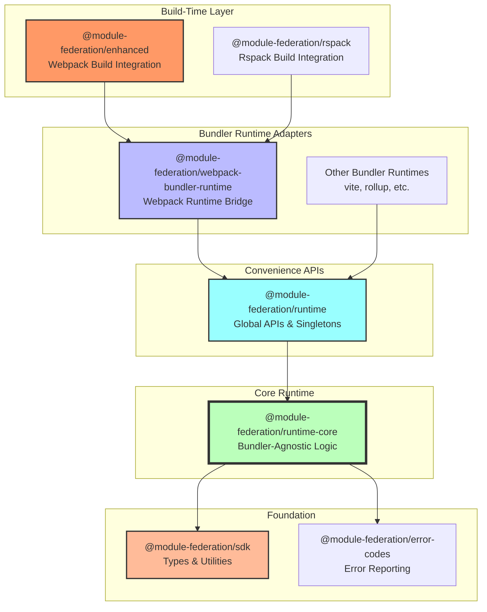
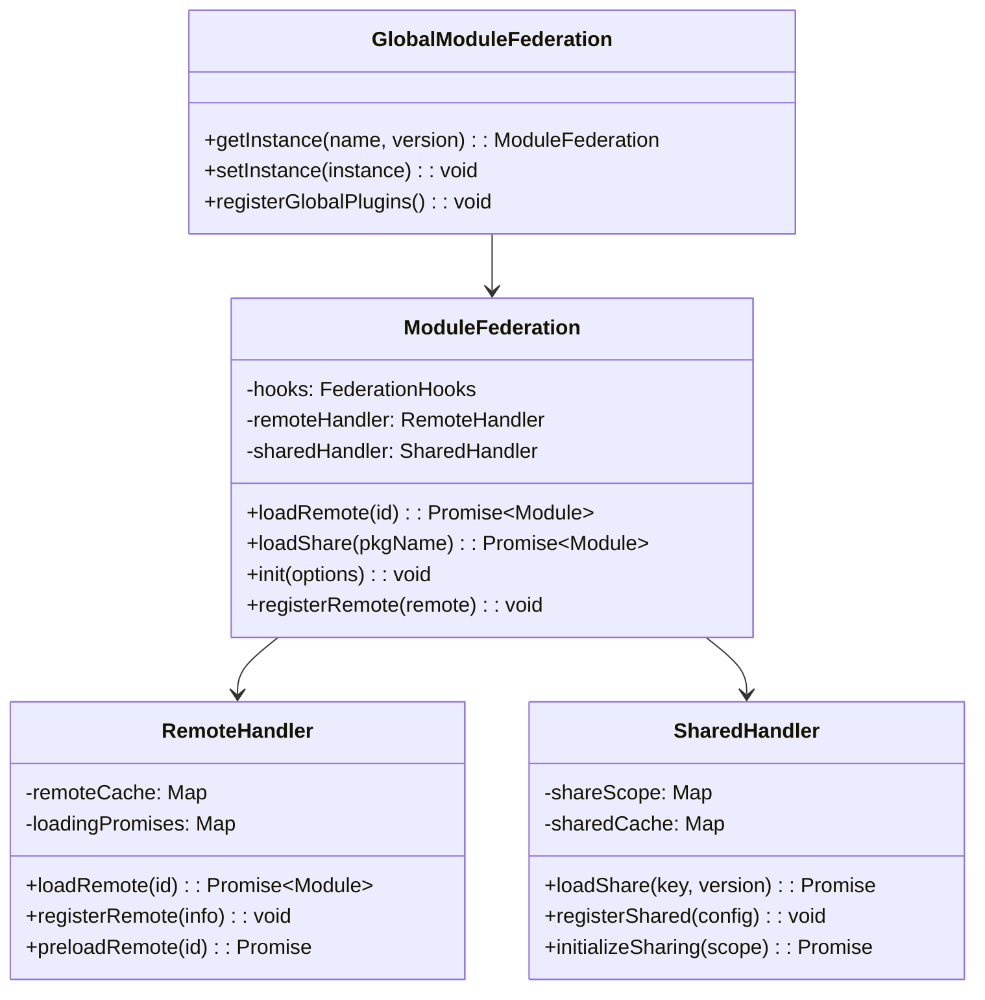
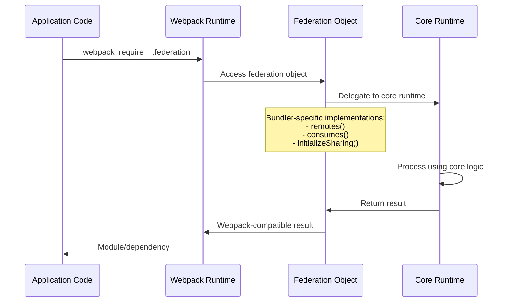
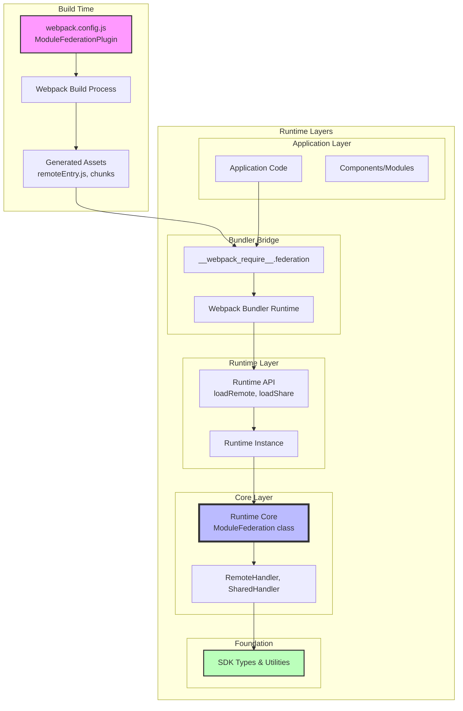
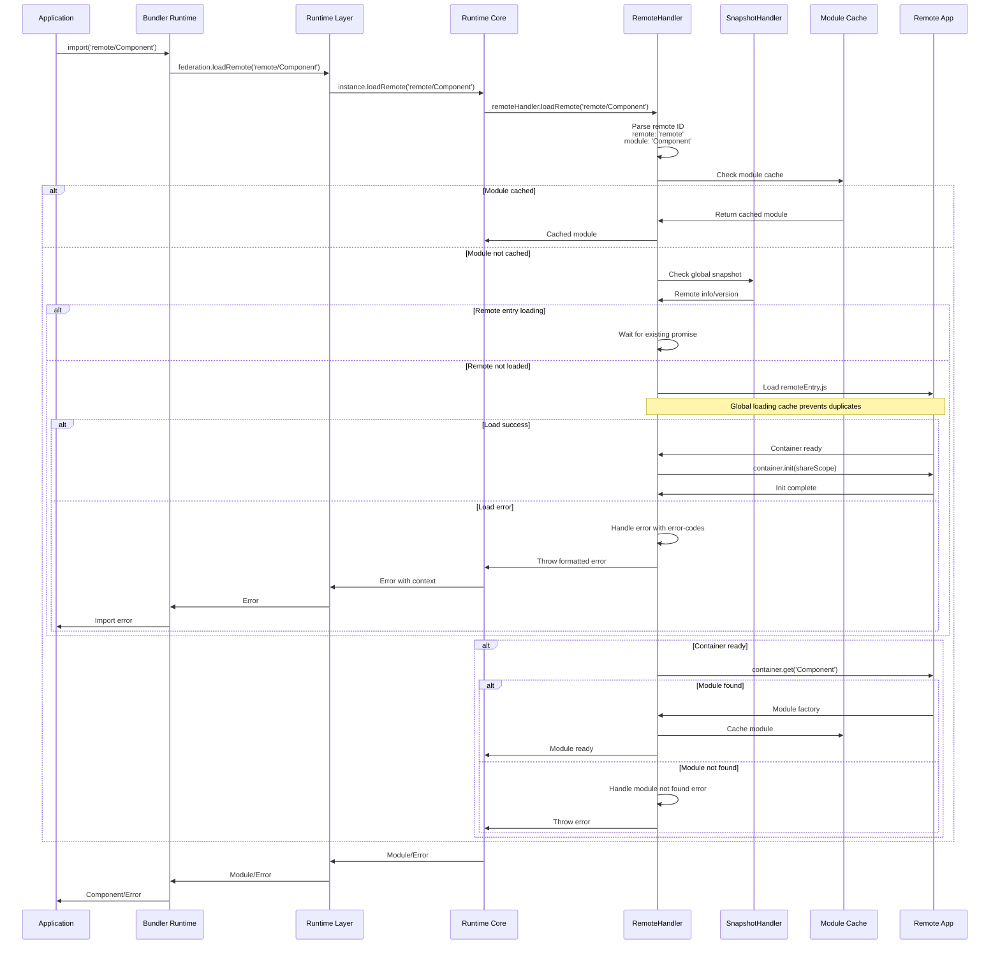
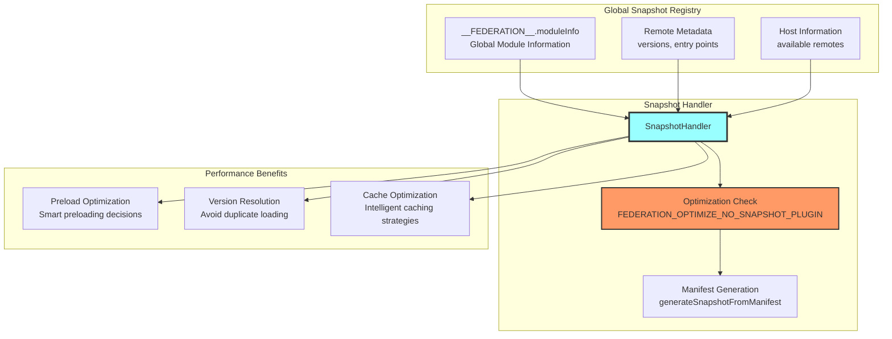
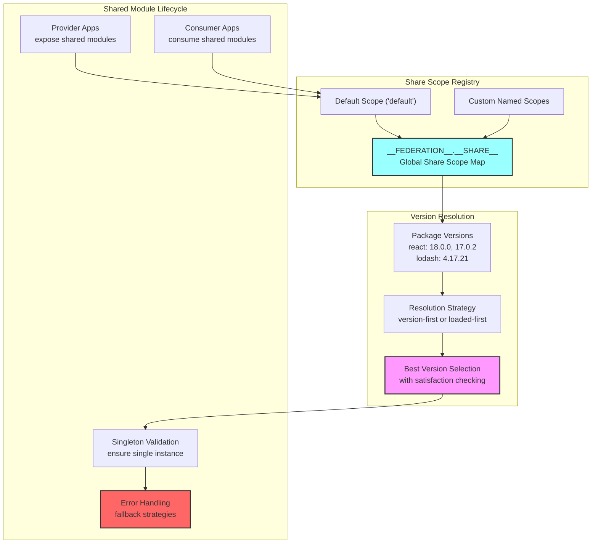

# Module Federation Architecture Overview

Module Federation is a sophisticated runtime and build-time system that enables dynamic code sharing between independent JavaScript applications. This document provides a comprehensive overview based on the actual implementation, designed to help bundler teams understand the architecture and implement Module Federation support.

## Table of Contents
- [Core Architecture](#core-architecture)
- [Package Architecture](#package-architecture)
- [Runtime Layers](#runtime-layers)
- [Build-Time Integration](#build-time-integration)
- [Key Integration Points](#key-integration-points)
- [Architecture Diagrams](#architecture-diagrams)

## Core Architecture

Module Federation consists of a **layered package architecture** that enables dynamic module sharing across different bundlers and environments:



## Package Architecture

### 1. Foundation Layer

#### **@module-federation/sdk**
- **Purpose**: Foundation layer providing types, utilities, and cross-platform support
- **Key Components**:
  - **Type Definitions**: Complete TypeScript types for all Module Federation configurations
  - **Cross-Platform Utilities**: `isBrowserEnv`, `loadScript`, `createScript`, DOM manipulation
  - **Path Handling**: `normalizeWebpackPath` for cross-bundler compatibility
  - **Name Encoding/Decoding**: Safe filename generation (`decodeName`, `encodeName`)
  - **Manifest Processing**: `generateSnapshotFromManifest`, snapshot utilities
  - **Environment Detection**: Runtime environment detection and logging
  - **Module Federation Config**: `createModuleFederationConfig` helper
  - **Utilities**: `inferAutoPublicPath`, `parseEntry`, `simpleJoinRemoteEntry`

#### **@module-federation/error-codes**
- **Purpose**: Centralized error handling and reporting
- **Dependencies**: None (pure foundation package)
- **Key Components**:
  - **Error Code Registry**: Standardized error codes (e.g., `RUNTIME_004`, `RUNTIME_007`)
  - **Error Descriptions**: Human-readable error descriptions (`runtimeDescMap`)
  - **Short Error Messages**: `getShortErrorMsg` for concise error reporting
  - **Runtime Integration**: Used throughout the runtime for consistent error handling

### 2. Core Runtime Layer

#### **@module-federation/runtime-core**
- **Purpose**: Bundler-agnostic core runtime logic
- **Dependencies**: `@module-federation/sdk`, `@module-federation/error-codes`
- **Key Components**:
  - **`ModuleFederation` class**: Central orchestrator with plugin system
  - **`RemoteHandler`**: Remote module loading, caching, and error handling
  - **`SharedHandler`**: Shared dependency resolution and version negotiation
  - **`SnapshotHandler`**: Snapshot optimization for performance
  - **`Module` wrapper**: Individual module management with lifecycle hooks
  - **Hook System**: Extensible plugin architecture (sync/async/waterfall hooks)
  - **Global State Management**: Multi-instance coordination and shared state
  - **Error Handling**: Integration with `@module-federation/error-codes`
  - **Caching System**: Module and remote entry caching strategies

### 3. Runtime Convenience Layer

#### **@module-federation/runtime**
- **Purpose**: Convenience layer with singleton patterns and simplified APIs
- **Dependencies**: `@module-federation/runtime-core`, `@module-federation/sdk`, `@module-federation/error-codes`
- **Key Components**:
  - **Global Instance Management**: Singleton pattern with automatic discovery
  - **Simplified API**: Function-based interface (`loadRemote`, `loadShare`, `init`, `registerRemotes`)
  - **Build Identifier Integration**: Automatic build version handling
  - **Instance Lifecycle**: Automatic instance creation and management
  - **Convenience Exports**: Re-exports of runtime-core with additional helpers
  - **Global Plugin Registration**: Easy plugin setup across all instances
  - **TypeScript Support**: Full type safety for all operations

### 4. Bundler Adapter Layer

#### **@module-federation/webpack-bundler-runtime**
- **Purpose**: Webpack-specific runtime bridge
- **Dependencies**: `@module-federation/runtime`, `@module-federation/sdk`
- **Key Components**:
  - **`Federation` Bridge Object**: Integrates with webpack's `__webpack_require__.federation`
  - **Share Scope Integration**: `attachShareScopeMap` for webpack's sharing system
  - **Container Operations**: `initContainerEntry` for container initialization
  - **Remote Loading**: Integration with webpack's chunk loading system
  - **Module Consumption**: Bridge to webpack's module cache and resolution
  - **Runtime Integration**: Seamless bridging between webpack runtime and federation core

### 5. Build-Time Integration Layer

#### **@module-federation/enhanced**
- **Purpose**: Webpack build-time integration and code generation
- **Dependencies**: Full workspace ecosystem including `@module-federation/error-codes`, `@module-federation/sdk`, `@module-federation/dts-plugin`, `@module-federation/data-prefetch`, `@module-federation/managers`, `@module-federation/manifest`, `@module-federation/rspack`
- **Key Components**:
  - **`ModuleFederationPlugin`**: Main orchestrator with two-phase plugin application
  - **`RemoteEntryPlugin`**: Entry point modification (applied first)
  - **`FederationModulesPlugin`**: Module resolution and federation setup
  - **`FederationRuntimePlugin`**: Runtime code injection and configuration
  - **`ContainerPlugin`**: Container creation and module exposure (conditional)
  - **`ContainerReferencePlugin`**: Remote module reference handling (conditional)
  - **`SharePlugin`**: Shared dependency coordination (conditional)
  - **Additional Plugins**: DTS generation, data prefetch, manifest generation
  - **Schema Validation**: Runtime configuration validation

## Global State Structure

The runtime maintains a global state object accessible via `globalThis.__FEDERATION__`:

```typescript
interface Federation {
  __GLOBAL_PLUGIN__: Array<ModuleFederationRuntimePlugin>;
  __DEBUG_CONSTRUCTOR_VERSION__?: string;
  moduleInfo: GlobalModuleInfo;  // Snapshot registry
  __DEBUG_CONSTRUCTOR__?: typeof ModuleFederation;
  __INSTANCES__: Array<ModuleFederation>;  // All federation instances
  __SHARE__: GlobalShareScopeMap;  // Global share scopes
  __MANIFEST_LOADING__: Record<string, Promise<ModuleInfo>>;
  __PRELOADED_MAP__: Map<string, boolean>;  // Preload tracking
}

// Additional global state
global.__GLOBAL_LOADING_REMOTE_ENTRY__: Record<
  string,
  Promise<RemoteEntryExports | void>
>;  // Remote entry loading cache
```

**Key Global State Features**:
- **Multi-Instance Support**: Multiple federation instances can coexist
- **Snapshot Registry**: Global module information for optimization
- **Share Scope Management**: Cross-instance shared dependency coordination
- **Loading State Tracking**: Prevents duplicate remote entry loading
- **Plugin System**: Global plugins that apply to all instances
- **Debug Support**: Development-time debugging utilities

## Runtime Architecture

### Runtime Core (Bundler Agnostic)



**Key Responsibilities**:
- **Environment Agnostic**: Works in browser, Node.js, and other JavaScript environments
- **Instance Management**: Explicit instance creation and management
- **Plugin System**: Full hook system with sync/async and waterfall patterns
- **Module Loading**: Core logic for remote and shared module loading
- **Version Resolution**: Sophisticated version negotiation algorithms

### Runtime Convenience Layer

```mermaid
flowchart LR
    subgraph "Runtime Package"
        GlobalAPI[Global API Functions]
        InstanceManager[Instance Manager]
        BuildIntegration[Build Integration]
    end
    
    subgraph "Core APIs"
        LoadRemote[loadRemote()]
        LoadShare[loadShare()]
        Init[init()]
        RegisterRemotes[registerRemotes()]
    end
    
    GlobalAPI --> LoadRemote
    GlobalAPI --> LoadShare
    GlobalAPI --> Init
    GlobalAPI --> RegisterRemotes
    
    InstanceManager --> GlobalAPI
    BuildIntegration --> InstanceManager
```

**Key Features**:
- **Singleton Management**: Global instance with automatic discovery
- **Simplified API**: Function-based interface for common operations
- **Build Integration**: Support for build-time identifier injection
- **Developer Experience**: Convenience functions for common patterns

### Bundler Runtime Bridge



**Bundler Bridge Pattern**:
```typescript
// Pattern for any bundler
interface BundlerRuntimeBridge {
  runtime: typeof coreRuntime;        // Core runtime reference
  instance?: ModuleFederation;        // Runtime instance
  bundlerRuntime: {                   // Bundler-specific implementations
    remotes: (options) => Promise<Module>;
    consumes: (options) => Promise<Module>;
    initializeSharing: (scope) => Promise<boolean>;
  };
  attachShareScopeMap: (bundlerRequire) => void;
}
```

## Build-Time Integration

### Plugin Orchestration Pattern

```mermaid
flowchart TD
    MFP[ModuleFederationPlugin]
    
    subgraph "Immediate Plugin Application (apply method)"
        REP["1. RemoteEntryPlugin<br/>FIRST - Must be applied before MFPlugin"]
        FMP["2. FederationModulesPlugin<br/>Module resolution setup"]
        FRP["3. FederationRuntimePlugin<br/>Runtime code injection"]
    end
    
    subgraph "Conditional Plugins (afterPlugins hook)"
        CP["ContainerPlugin<br/>only if options.exposes exists"]
        CRP["ContainerReferencePlugin<br/>only if options.remotes exists"]
        SP["SharePlugin<br/>only if options.shared exists"]
    end
    
    subgraph "Share Sub-plugins"
        CSP[ConsumeSharedPlugin]
        PSP[ProvideSharedPlugin]
    end
    
    MFP -->|apply()| REP
    MFP -->|apply()| FMP
    MFP -->|apply()| FRP
    MFP -->|compiler.hooks.afterPlugins| CP
    MFP -->|compiler.hooks.afterPlugins| CRP
    MFP -->|compiler.hooks.afterPlugins| SP
    
    SP --> CSP
    SP --> PSP
    
    style MFP fill:#f96,stroke:#333,stroke-width:4px
    style REP fill:#f66,stroke:#333,stroke-width:3px
    style SP fill:#69f,stroke:#333,stroke-width:2px
```

### Critical Webpack Integration Points

```typescript
// Key hooks used by Module Federation plugins
interface WebpackIntegrationPoints {
  // Plugin coordination
  'compiler.hooks.afterPlugins': 'Two-phase plugin application - ensures conditional plugins applied after core setup';
  
  // Module resolution interception  
  'normalModuleFactory.hooks.factorize': 'Intercepts module requests before creation for federation modules';
  'normalModuleFactory.hooks.module': 'Processes modules after creation, handles remote/shared modules';
  
  // Build process integration
  'compiler.hooks.make': 'Creates container entries and federation dependencies';
  'compiler.hooks.thisCompilation': 'Sets up dependency factories for federation dependencies';
  
  // Runtime code injection
  'compilation.hooks.runtimeRequirementInTree': 'Adds federation runtime requirements to chunks';
  'compilation.addRuntimeModule': 'Injects federation runtime modules into webpack bundle';
  
  // Entry point handling
  'compiler.hooks.entryOption': 'RemoteEntryPlugin modifies webpack entry configuration';
}
```

## Key Integration Points

### For Bundler Teams Implementing Module Federation

#### 1. **SDK Integration**
```typescript
import { 
  ModuleFederationPluginOptions,
  normalizeWebpackPath,
  createLogger,
  generateSnapshotFromManifest 
} from '@module-federation/sdk';

// Use SDK types and utilities for consistent integration
```

#### 2. **Runtime Core Integration**
```typescript
import { ModuleFederation } from '@module-federation/runtime-core';

// Create bundler-specific runtime bridge
const bundlerRuntime = {
  remotes: (options) => /* bundler-specific remote loading */,
  consumes: (options) => /* bundler-specific shared consumption */,
  // ... other bundler-specific implementations
};
```

#### 3. **Plugin Architecture Pattern**
- **Central Orchestrator**: One main plugin that coordinates all federation functionality
- **Specialized Plugins**: Separate plugins for containers, remotes, and sharing
- **Hook-Based Integration**: Use bundler's hook system for proper timing
- **Runtime Injection**: Ability to inject runtime code into bundles

#### 4. **Required Bundler Capabilities**
- **Module Resolution Interception**: Ability to intercept and redirect module requests
- **Custom Dependency Types**: Support for federation-specific dependencies
- **Runtime Module Injection**: System for adding runtime behavior
- **Asset Management**: Control over chunk creation and naming
- **External Module Support**: Handling of external/remote references

## Architecture Diagrams

### Complete System Architecture



### Module Loading Flow



### Snapshot Optimization System



### Share Scope Management



## Key Architectural Principles

### 1. **Layered Package Architecture**
- Clear separation between build-time and runtime concerns
- Foundation layer (SDK + error-codes) provides cross-platform utilities
- Runtime-core offers bundler-agnostic logic
- Bundler-specific adapters handle platform integration
- Convenience layer provides simplified APIs

### 2. **Two-Phase Plugin Application Strategy**
- **Phase 1 (Immediate)**: Core plugins applied during `apply()` method
  - `RemoteEntryPlugin` (must be first)
  - `FederationModulesPlugin` 
  - `FederationRuntimePlugin`
- **Phase 2 (afterPlugins hook)**: Conditional plugins based on configuration
  - `ContainerPlugin` (only if `exposes` exists)
  - `ContainerReferencePlugin` (only if `remotes` exists)
  - `SharePlugin` (only if `shared` exists)

### 3. **Global State Management**
- Centralized state via `globalThis.__FEDERATION__`
- Multi-instance coordination and shared resource management
- Global snapshot registry for performance optimization
- Prevents duplicate loading of remote entries and modules

### 4. **Performance Optimization Systems**
- **Snapshot System**: Global module information for intelligent loading decisions
- **Caching Strategies**: Module cache, remote entry cache, preload tracking
- **Lazy Loading**: On-demand remote module loading with error handling
- **Version Negotiation**: Sophisticated shared dependency resolution

### 5. **Error Handling & Developer Experience**
- Centralized error codes via `@module-federation/error-codes`
- Comprehensive TypeScript support across all packages
- Rich debugging capabilities with debug constructors
- Hook system for extensibility and customization
- Multiple API layers catering to different developer needs

## Implementation Strategy for Other Bundlers

To implement Module Federation support in your bundler:

1. **Foundation Setup**: 
   - Use `@module-federation/sdk` for types and cross-platform utilities
   - Integrate `@module-federation/error-codes` for consistent error reporting
   - Set up global state management following the established patterns

2. **Runtime Integration**: 
   - Create a bundler-specific runtime bridge following the `webpack-bundler-runtime` pattern
   - Integrate with `@module-federation/runtime-core` for core logic
   - Implement bundler-specific module loading and resolution

3. **Build-Time Plugins**: 
   - Implement the two-phase plugin application strategy
   - Create main orchestrator plugin that coordinates all federation functionality
   - Build specialized plugins for containers, remotes, and sharing
   - Ensure proper integration with bundler's module resolution system

4. **Performance Features**:
   - Implement snapshot optimization system for better performance
   - Add caching strategies for modules and remote entries
   - Support global state coordination for multi-instance scenarios

5. **Testing & Validation**: 
   - Test against existing Module Federation applications
   - Ensure compatibility with the established API surface
   - Validate error handling and edge cases

This architecture enables Module Federation to work across different bundlers while maintaining a consistent developer experience and runtime behavior.

## Next Steps

- Review the actual source code in `/packages/` for implementation details
- Study `@module-federation/enhanced` for webpack build-time integration patterns
- Examine `@module-federation/runtime-core` for bundler-agnostic runtime logic
- Check `@module-federation/sdk` for available utilities and type definitions
- Look at `@module-federation/webpack-bundler-runtime` for bundler bridge patterns