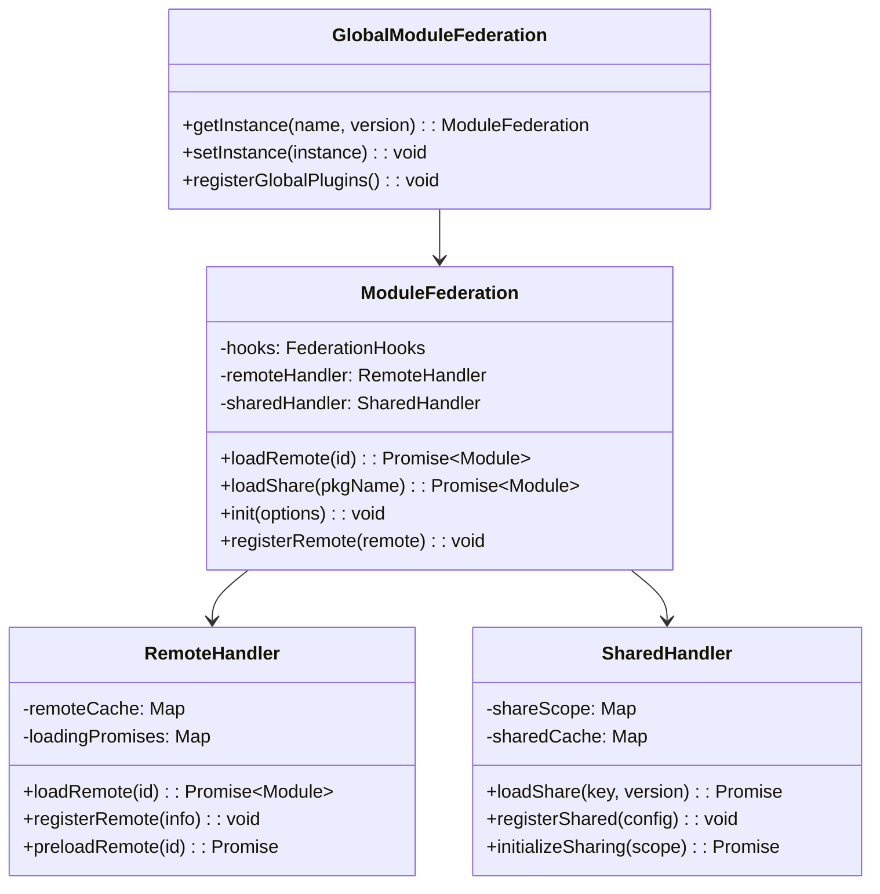
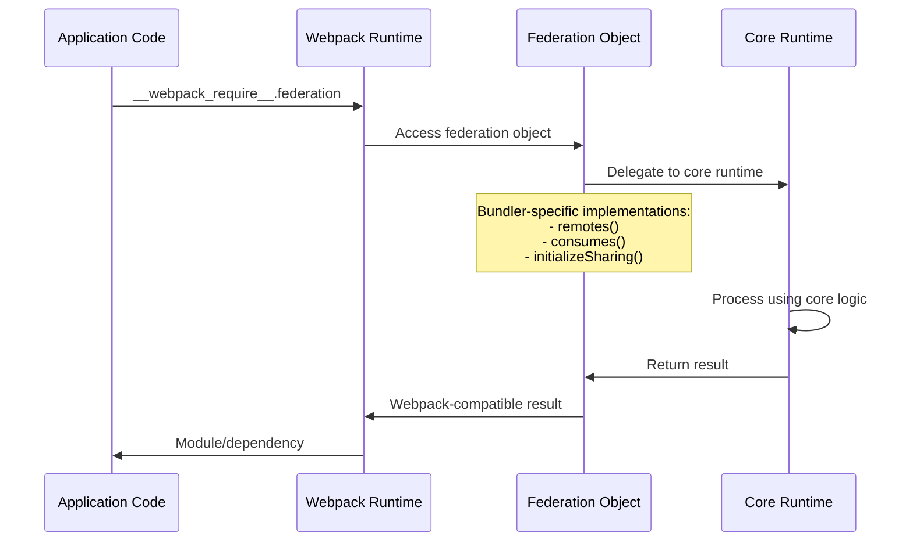
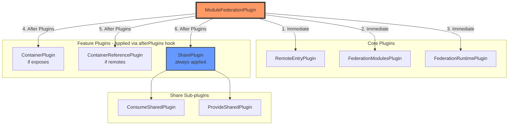
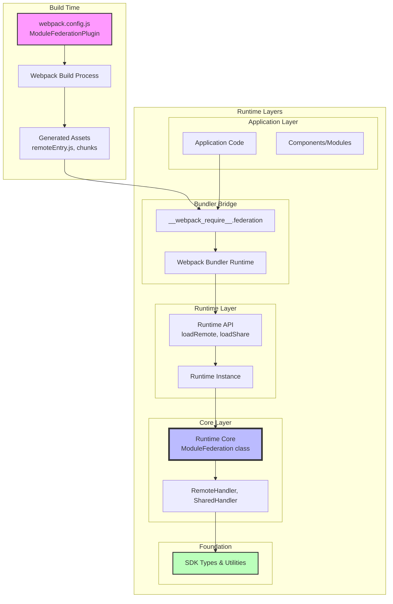
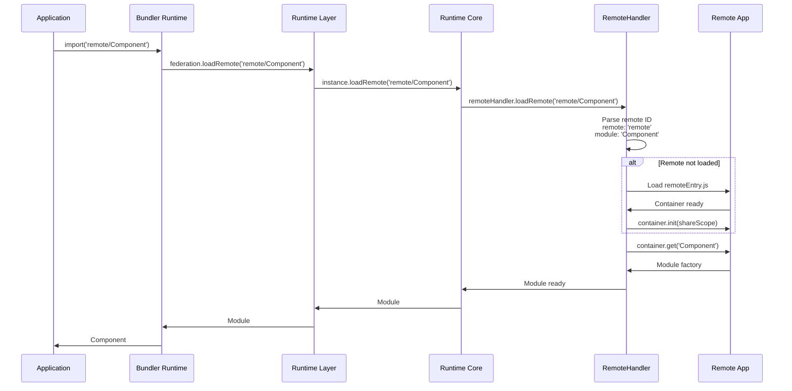
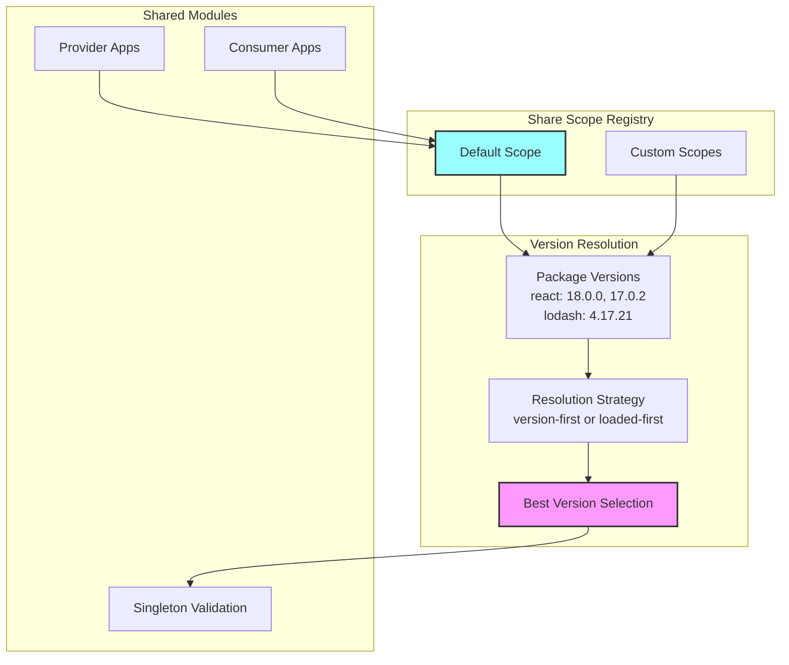

# Module Federation Architecture Overview

Module Federation is a sophisticated runtime and build-time system that enables dynamic code sharing between independent JavaScript applications. This document provides a comprehensive overview based on the actual implementation, designed to help bundler teams understand the architecture and implement Module Federation support.

## Table of Contents
- [Core Architecture](#core-architecture)
- [Package Architecture](#package-architecture)
- [Runtime Layers](#runtime-layers)
- [Build-Time Integration](#build-time-integration)
- [Key Integration Points](#key-integration-points)
- [Architecture Diagrams](#architecture-diagrams)

## Core Architecture

Module Federation consists of **four distinct layers** that work together to enable dynamic module sharing:

```mermaid
graph TB
    subgraph "Build Time Layer"
        Enhanced[Enhanced Plugin<br/>@module-federation/enhanced]
        WebpackPlugin[Webpack Plugins<br/>ContainerPlugin, SharePlugin, etc.]
    end
    
    subgraph "Runtime Adapter Layer"
        WebpackRuntime[Webpack Bundler Runtime<br/>@module-federation/webpack-bundler-runtime]
        OtherRuntimes[Other Bundler Runtimes<br/>vite, rollup, etc.]
    end
    
    subgraph "Runtime Convenience Layer"
        Runtime[Runtime<br/>@module-federation/runtime]
    end
    
    subgraph "Core Runtime Layer"
        RuntimeCore[Runtime Core<br/>@module-federation/runtime-core]
        SDK[SDK<br/>@module-federation/sdk]
    end
    
    Enhanced --> WebpackRuntime
    WebpackRuntime --> Runtime
    Runtime --> RuntimeCore
    RuntimeCore --> SDK
    
    OtherRuntimes --> Runtime
    
    style Enhanced fill:#f9f,stroke:#333,stroke-width:4px
    style WebpackRuntime fill:#bbf,stroke:#333,stroke-width:2px
    style Runtime fill:#9ff,stroke:#333,stroke-width:2px
    style RuntimeCore fill:#bfb,stroke:#333,stroke-width:4px
```

## Package Architecture

### 1. Core Foundation Layer

#### **@module-federation/sdk**
- **Purpose**: Foundation layer providing types, utilities, and cross-platform support
- **Key Components**:
  - Type definitions for all Module Federation configurations
  - Cross-platform utilities (`isBrowserEnv`, `loadScript`, etc.)
  - Path normalization (`normalizeWebpackPath`)
  - Name encoding/decoding for safe filenames
  - Manifest generation and processing utilities
  - Environment detection and logging

#### **@module-federation/runtime-core**
- **Purpose**: Bundler-agnostic core runtime logic
- **Key Components**:
  - `ModuleFederation` class - Central orchestrator
  - `RemoteHandler` - Remote module loading and management
  - `SharedHandler` - Shared dependency resolution and version management
  - `Module` wrapper class - Individual module management
  - Hook system - Extensible plugin architecture with sync/async hooks
  - Global state management for multi-instance scenarios

### 2. Runtime Convenience Layer

#### **@module-federation/runtime**
- **Purpose**: Convenience layer with singleton patterns and simplified APIs
- **Key Components**:
  - Global instance management and discovery
  - Simplified function-based API (`loadRemote`, `loadShare`, `init`)
  - Build identifier integration
  - Instance lifecycle management
  - Re-exports of runtime-core with additional convenience functions

### 3. Bundler Adapter Layer

#### **@module-federation/webpack-bundler-runtime**
- **Purpose**: Webpack-specific runtime bridge
- **Key Components**:
  - `Federation` object that bridges webpack's module system
  - Webpack `__webpack_require__` integration
  - Share scope mapping (`attachShareScopeMap`)
  - Container initialization (`initContainerEntry`)
  - Remote loading with webpack's chunk system
  - Shared module consumption with webpack's module cache

### 4. Build-Time Plugin Layer

#### **@module-federation/enhanced**
- **Purpose**: Webpack build-time integration and code generation
- **Key Components**:
  - `ModuleFederationPlugin` - Main orchestrator
  - `ContainerPlugin` - Creates container entries and exposes modules
  - `ContainerReferencePlugin` - Handles remote module references
  - `SharePlugin` - Coordinates shared dependency handling
  - `ConsumeSharedPlugin` / `ProvideSharedPlugin` - Shared module mechanics
  - `FederationRuntimePlugin` - Injects runtime code into webpack bundles

## Runtime Layers

### Layer 1: Runtime Core (Bundler Agnostic)



**Key Responsibilities**:
- **Environment Agnostic**: Works in browser, Node.js, and other JavaScript environments
- **Instance Management**: Explicit instance creation and management
- **Plugin System**: Full hook system with sync/async and waterfall patterns
- **Module Loading**: Core logic for remote and shared module loading
- **Version Resolution**: Sophisticated version negotiation algorithms

### Layer 2: Runtime Convenience Layer

```mermaid
flowchart LR
    subgraph "Runtime Package"
        GlobalAPI[Global API Functions]
        InstanceManager[Instance Manager]
        BuildIntegration[Build Integration]
    end
    
    subgraph "Core APIs"
        LoadRemote[loadRemote()]
        LoadShare[loadShare()]
        Init[init()]
        RegisterRemotes[registerRemotes()]
    end
    
    GlobalAPI --> LoadRemote
    GlobalAPI --> LoadShare
    GlobalAPI --> Init
    GlobalAPI --> RegisterRemotes
    
    InstanceManager --> GlobalAPI
    BuildIntegration --> InstanceManager
```

**Key Features**:
- **Singleton Management**: Global instance with automatic discovery
- **Simplified API**: Function-based interface for common operations
- **Build Integration**: Support for build-time identifier injection
- **Developer Experience**: Convenience functions for common patterns

### Layer 3: Bundler Runtime Bridge



**Bundler Bridge Pattern**:
```typescript
// Pattern for any bundler
interface BundlerRuntimeBridge {
  runtime: typeof coreRuntime;        // Core runtime reference
  instance?: ModuleFederation;        // Runtime instance
  bundlerRuntime: {                   // Bundler-specific implementations
    remotes: (options) => Promise<Module>;
    consumes: (options) => Promise<Module>;
    initializeSharing: (scope) => Promise<boolean>;
  };
  attachShareScopeMap: (bundlerRequire) => void;
}
```

## Build-Time Integration

### Plugin Orchestration Pattern



### Critical Webpack Integration Points

```typescript
// Key hooks used by Module Federation plugins
interface WebpackIntegrationPoints {
  // Plugin coordination
  'compiler.hooks.afterPlugins': 'Ensures proper plugin application order';
  
  // Module resolution interception  
  'normalModuleFactory.hooks.factorize': 'Intercepts module requests before creation';
  'normalModuleFactory.hooks.module': 'Processes modules after creation';
  
  // Build process integration
  'compiler.hooks.make': 'Creates container entries and dependencies';
  'compiler.hooks.thisCompilation': 'Sets up dependency factories';
  
  // Runtime code injection
  'compilation.hooks.runtimeRequirementInTree': 'Adds runtime requirements';
  'compilation.addRuntimeModule': 'Injects federation runtime code';
}
```

## Key Integration Points

### For Bundler Teams Implementing Module Federation

#### 1. **SDK Integration**
```typescript
import { 
  ModuleFederationPluginOptions,
  normalizeWebpackPath,
  createLogger,
  generateSnapshotFromManifest 
} from '@module-federation/sdk';

// Use SDK types and utilities for consistent integration
```

#### 2. **Runtime Core Integration**
```typescript
import { ModuleFederation } from '@module-federation/runtime-core';

// Create bundler-specific runtime bridge
const bundlerRuntime = {
  remotes: (options) => /* bundler-specific remote loading */,
  consumes: (options) => /* bundler-specific shared consumption */,
  // ... other bundler-specific implementations
};
```

#### 3. **Plugin Architecture Pattern**
- **Central Orchestrator**: One main plugin that coordinates all federation functionality
- **Specialized Plugins**: Separate plugins for containers, remotes, and sharing
- **Hook-Based Integration**: Use bundler's hook system for proper timing
- **Runtime Injection**: Ability to inject runtime code into bundles

#### 4. **Required Bundler Capabilities**
- **Module Resolution Interception**: Ability to intercept and redirect module requests
- **Custom Dependency Types**: Support for federation-specific dependencies
- **Runtime Module Injection**: System for adding runtime behavior
- **Asset Management**: Control over chunk creation and naming
- **External Module Support**: Handling of external/remote references

## Architecture Diagrams

### Complete System Architecture



### Module Loading Flow



### Share Scope Management



## Key Architectural Principles

### 1. **Layered Architecture**
- Clear separation between build-time and runtime concerns
- Progressive enhancement from core to convenience layers
- Bundler-specific adapters maintain compatibility

### 2. **Plugin-Based Extensibility**
- Hook system allows deep customization
- Modular plugins handle specific concerns
- Runtime plugins extend behavior without rebuilding

### 3. **Environment Agnostic Core**
- Runtime core works across different JavaScript environments
- Bundler adapters handle platform-specific integration
- SDK provides cross-platform utilities

### 4. **Performance Optimized**
- Lazy loading of remote modules
- Sophisticated caching strategies
- Version negotiation prevents duplicate dependencies

### 5. **Developer Experience**
- Multiple API layers for different use cases
- Comprehensive TypeScript support
- Rich debugging and monitoring capabilities

## Implementation Strategy for Other Bundlers

To implement Module Federation support in your bundler:

1. **Start with Runtime Integration**: Create a bundler-specific runtime bridge following the webpack-bundler-runtime pattern
2. **Implement Core Plugins**: Build plugins for container creation, remote handling, and sharing
3. **Add Runtime Injection**: Develop system for injecting federation runtime into bundles  
4. **Leverage SDK**: Use existing SDK types and utilities for consistency
5. **Test Integration**: Ensure compatibility with existing Module Federation apps

This architecture enables Module Federation to work across different bundlers while maintaining a consistent developer experience and runtime behavior.

## Next Steps

- Review [Plugin Architecture](./plugin-architecture.md) for detailed plugin implementation patterns
- Study [Runtime Architecture](./runtime-architecture.md) for runtime layer details
- Check [SDK Reference](./sdk-reference.md) for available utilities and types
- Follow [Implementation Guide](./implementation-guide.md) for step-by-step bundler integration