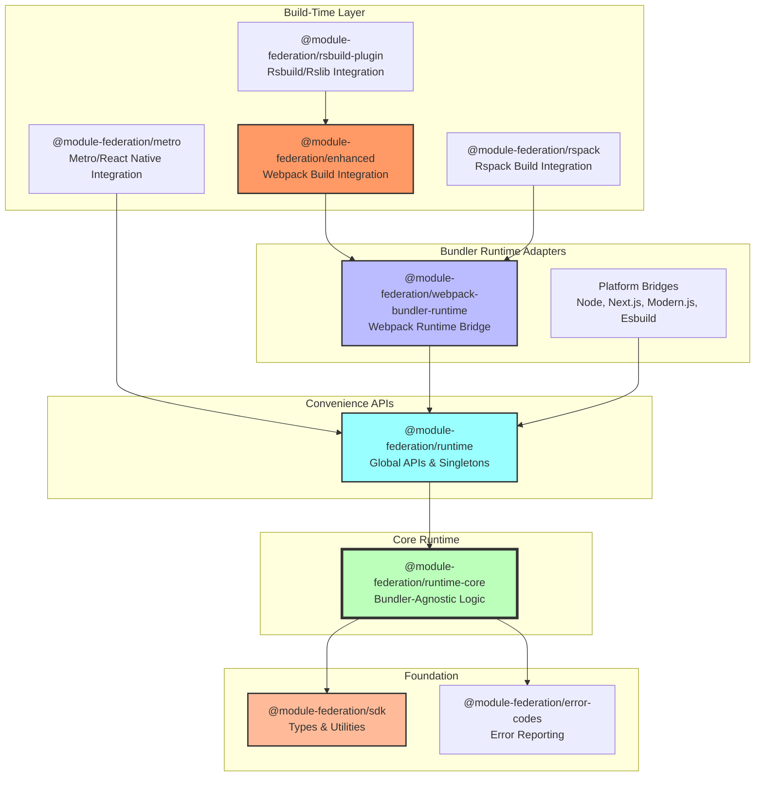
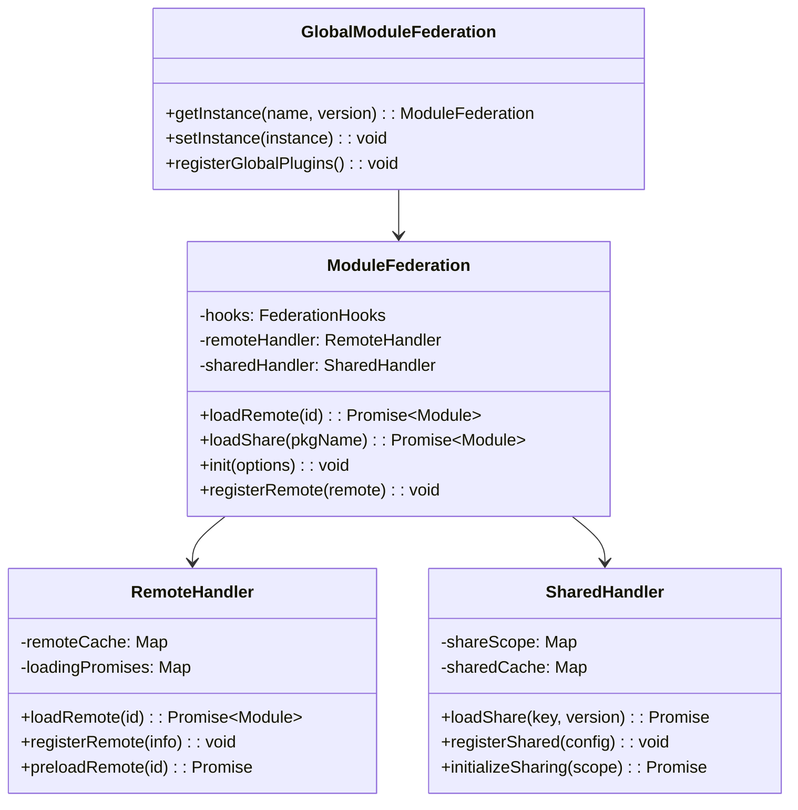
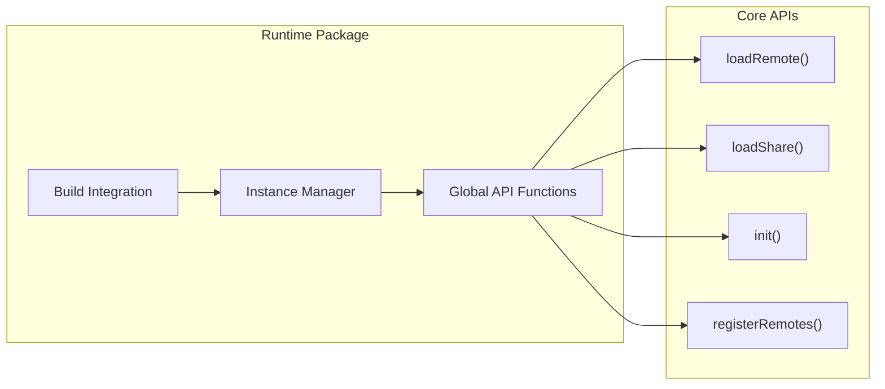
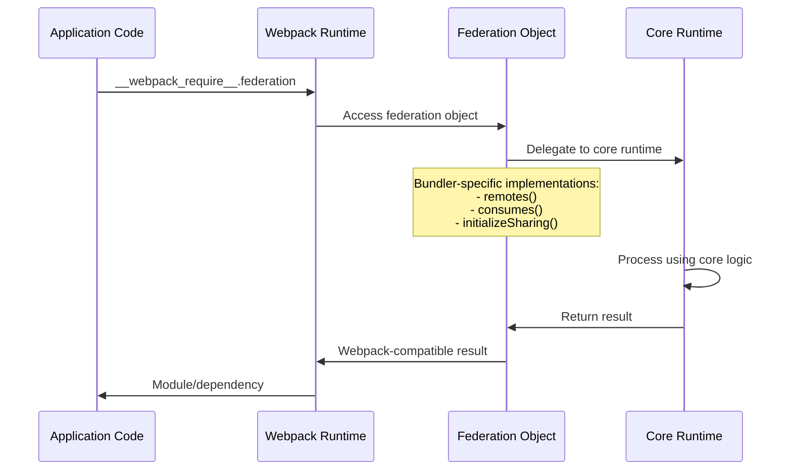
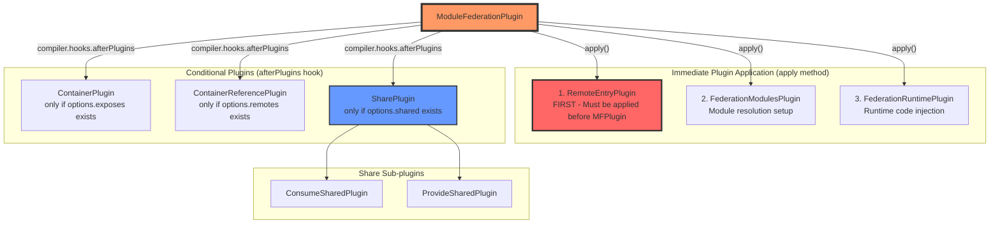
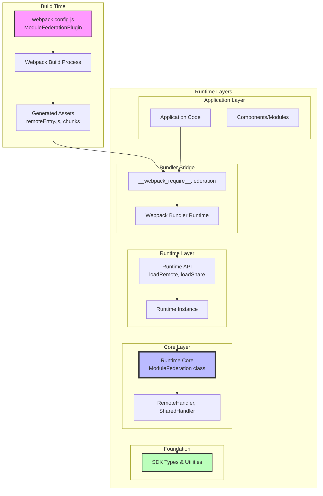
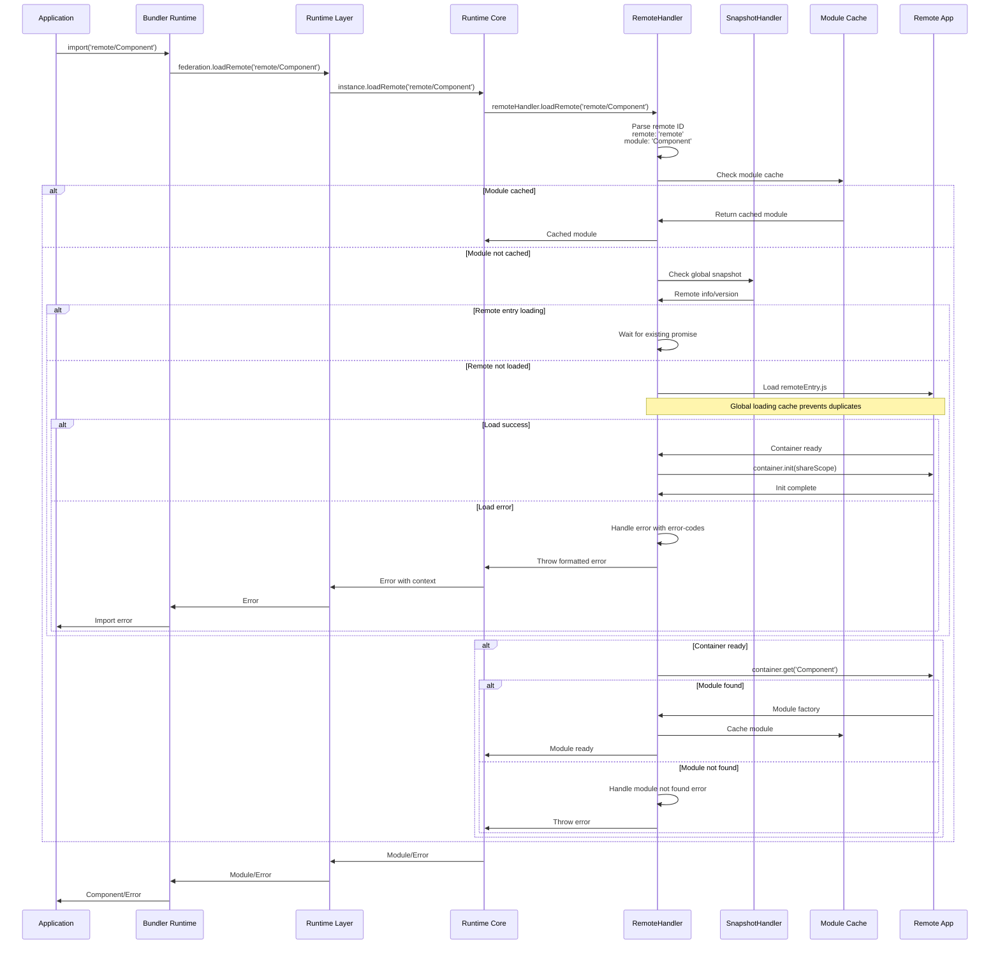
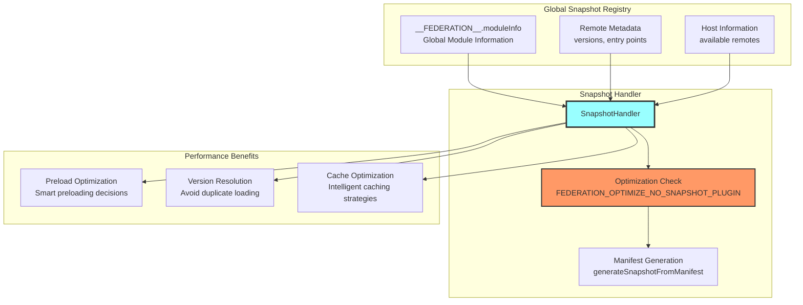
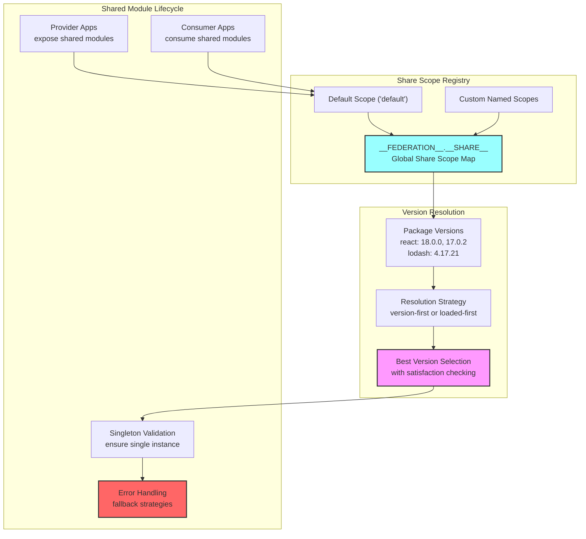

# Module Federation Architecture Overview

Module Federation is a runtime, build-time, type-generation, manifest, and tooling system for dynamic code sharing across independent JavaScript applications. This overview reflects the current monorepo shape: framework and bundler integrations sit on top of a shared runtime contract, while manifests, DTS generation, devtools, retry/observability plugins, examples, and release tooling support the same container protocol.

## Table of Contents

- [Module Federation Explained](./module-federation-explained.md)
- [Repository Map and Canonical Ownership](#repository-map-and-canonical-ownership)
- [Core Architecture](#core-architecture)
- [Package Architecture](#package-architecture)
- [Layer Architecture](./layers-architecture.md)
- [Shared Tree-Shaking Architecture](./shared-tree-shaking-architecture.md)
- [Build-Time Integration](#build-time-integration)
- [Tooling, Examples, and CI](#tooling-examples-and-ci)
- [Key Integration Points](#key-integration-points)
- [Architecture Diagrams](#architecture-diagrams)
- [Security Architecture](./security-architecture.md)
- [Documentation Freshness Checklist](#documentation-freshness-checklist)

## Repository Map and Canonical Ownership

The repository is a pnpm/Turbo monorepo. The root orchestration layer is `package.json`, `pnpm-workspace.yaml`, `turbo.json`, and `.github/workflows/*`; package and app scripts are the executable source of truth for build, lint, test, e2e, docs, and release behavior.


```mermaid
graph TB
    subgraph "Orchestration"
        Workspace["pnpm-workspace.yaml"]
        Turbo["turbo.json tasks"]
        LocalCI["tools/scripts/ci-local.mjs"]
        Workflows[".github/workflows"]
    end

    subgraph "Foundation"
        SDK["@module-federation/sdk"]
        ErrorCodes["@module-federation/error-codes"]
        Utilities["@module-federation/utilities"]
        LegacyCore["@module-federation/core"]
    end

    subgraph "Runtime Contract"
        RuntimeCore["@module-federation/runtime-core"]
        Runtime["@module-federation/runtime"]
        WebpackRuntime["@module-federation/webpack-bundler-runtime"]
        RuntimeTools["@module-federation/runtime-tools"]
    end

    subgraph "Build Integrations"
        Enhanced["@module-federation/enhanced"]
        Rspack["@module-federation/rspack"]
        Rsbuild["@module-federation/rsbuild-plugin"]
        Rspress["@module-federation/rspress-plugin"]
        Esbuild["@module-federation/esbuild"]
        Metro["@module-federation/metro"]
        MetroAdapters["@module-federation/metro-plugin-*"]
    end

    subgraph "Platform Adapters"
        Next["@module-federation/nextjs-mf"]
        Node["@module-federation/node"]
        Modern["@module-federation/modern-js and modern-js-v3"]
        Bridge["@module-federation/bridge-react, bridge-react-webpack-plugin, bridge-vue3"]
        Storybook["@module-federation/storybook-addon"]
        Native["@module-federation/native-federation-*"]
    end

    subgraph "Metadata and DX"
        Manifest["@module-federation/manifest"]
        Managers["@module-federation/managers"]
        DTS["@module-federation/dts-plugin"]
        ThirdPartyDts["@module-federation/third-party-dts-extractor"]
        CLI["@module-federation/cli and create-module-federation"]
        Devtools["@module-federation/devtools"]
        RuntimePlugins["retry-plugin, observability-plugin, inject-external-runtime-core-plugin"]
    end

    subgraph "Validation Surfaces"
        Apps["apps/* examples and e2e fixtures"]
        Playground["@module-federation/playground"]
        Website["apps/website-new + rspress-plugin"]
        Treeshake["treeshake frontend/server"]
        Release["@changesets/assemble-release-plan"]
        WebpackMirror["webpack/ compatibility surface"]
        TreeshakePkgs["@module-federation/treeshake-*"]
    end

    Workspace --> Turbo --> LocalCI --> Workflows
    SDK --> RuntimeCore
    ErrorCodes --> RuntimeCore
    Utilities --> Storybook
    LegacyCore --> Runtime
    RuntimeCore --> Runtime --> WebpackRuntime
    Runtime --> RuntimeTools
    SDK --> Enhanced
    WebpackRuntime --> Enhanced
    Rspack --> Enhanced
    Enhanced --> Rsbuild
    Rsbuild --> Rspress
    Runtime --> Esbuild
    Runtime --> Metro
    Metro --> MetroAdapters
    Enhanced --> Next
    Enhanced --> Node
    Enhanced --> Modern
    Bridge --> Modern
    Enhanced --> Storybook
    Native --> Apps
    Managers --> Manifest
    SDK --> Managers
    SDK --> DTS
    ThirdPartyDts --> DTS
    DTS --> Enhanced
    Manifest --> Enhanced
    CLI --> Enhanced
    RuntimePlugins --> Runtime
    Enhanced --> Apps
    Rspack --> Apps
    Rsbuild --> Apps
    Rspress --> Website
    Esbuild --> Apps
    Metro --> Apps
    Next --> Apps
    Node --> Apps
    Modern --> Apps
    Storybook --> Apps
    Playground --> Website
    Treeshake --> Apps
    TreeshakePkgs --> Treeshake
    Release --> Workflows
```

### Canonical Ownership Layers

The architecture docs use this package taxonomy as their shared map:

- Foundation and legacy utilities: `sdk`, `error-codes`, `utilities`, `core`
- Runtime contract: `runtime-core`, `runtime`, `webpack-bundler-runtime`, `runtime-tools`
- Build integrations: `enhanced`, `rspack`, `rsbuild-plugin`, `rspress-plugin`, `esbuild`, `metro`, Metro adapter packages
- Platform adapters: `nextjs-mf`, `node`, `modern-js`, bridge packages, `storybook-addon`, native federation packages
- Metadata and type tooling: `manifest`, `managers`, `dts-plugin`, `third-party-dts-extractor`, `typescript`, `cli`, `create-module-federation`
- Observability and validation surfaces: runtime plugins, devtools, `apps/*`, `playground`, `website-new`, `treeshake-*`, release tooling, and `webpack/`

For the rich ownership table, layer handoff sequence, and layer-aware sharing diagrams, see [Layer Architecture](./layers-architecture.md). For the feature that crosses the most layers, see [Shared Tree-Shaking Architecture](./shared-tree-shaking-architecture.md).

## Core Architecture

Module Federation consists of a **layered package architecture** that enables dynamic module sharing across different bundlers and environments:


```mermaid
graph TB
    subgraph "Build-Time Layer"
        Enhanced["@module-federation/enhanced<br/>Webpack Build Integration"]
        Rspack["@module-federation/rspack<br/>Rspack Build Integration"]
        Rsbuild["@module-federation/rsbuild-plugin<br/>Rsbuild/Rslib Integration"]
        Metro["@module-federation/metro<br/>Metro/React Native Integration"]
    end

    subgraph "Bundler Runtime Adapters"
        WebpackRuntime["@module-federation/webpack-bundler-runtime<br/>Webpack Runtime Bridge"]
        OtherRuntimes["Platform Bridges<br/>Node, Next.js, Modern.js, Esbuild"]
    end

    subgraph "Convenience APIs"
        Runtime["@module-federation/runtime<br/>Global APIs & Singletons"]
    end

    subgraph "Core Runtime"
        RuntimeCore["@module-federation/runtime-core<br/>Bundler-Agnostic Logic"]
    end

    subgraph "Foundation"
        SDK["@module-federation/sdk<br/>Types & Utilities"]
        ErrorCodes["@module-federation/error-codes<br/>Error Reporting"]
    end

    Enhanced --> WebpackRuntime
    Rspack --> WebpackRuntime
    Rsbuild --> Enhanced
    Metro --> Runtime
    WebpackRuntime --> Runtime
    OtherRuntimes --> Runtime
    Runtime --> RuntimeCore
    RuntimeCore --> SDK
    RuntimeCore --> ErrorCodes

    style Enhanced fill:#f96,stroke:#333,stroke-width:2px
    style WebpackRuntime fill:#bbf,stroke:#333,stroke-width:2px
    style Runtime fill:#9ff,stroke:#333,stroke-width:2px
    style RuntimeCore fill:#bfb,stroke:#333,stroke-width:4px
    style SDK fill:#fb9,stroke:#333,stroke-width:2px
```

## Package Architecture

### 1. Foundation Layer

#### **@module-federation/sdk**
- **Purpose**: Foundation layer providing types, utilities, and cross-platform support
- **Key Components**:
  - **Type Definitions**: Complete TypeScript types for all Module Federation configurations
  - **Cross-Platform Utilities**: `isBrowserEnv`, `loadScript`, `createScript`, DOM manipulation
  - **Path Handling**: `normalizeWebpackPath` for cross-bundler compatibility
  - **Name Encoding/Decoding**: Safe filename generation (`decodeName`, `encodeName`)
  - **Manifest Processing**: `generateSnapshotFromManifest`, snapshot utilities
  - **Environment Detection**: Runtime environment detection and logging
  - **Module Federation Config**: `createModuleFederationConfig` helper
  - **Utilities**: `inferAutoPublicPath`, `parseEntry`, `simpleJoinRemoteEntry`

#### **@module-federation/error-codes**
- **Purpose**: Centralized error handling and reporting
- **Dependencies**: None (pure foundation package)
- **Key Components**:
  - **Error Code Registry**: Standardized error codes (e.g., `RUNTIME_004`, `RUNTIME_007`)
  - **Error Descriptions**: Human-readable error descriptions (`runtimeDescMap`)
  - **Short Error Messages**: `getShortErrorMsg` for concise error reporting
  - **Runtime Integration**: Used throughout the runtime for consistent error handling

### 2. Core Runtime Layer

#### **@module-federation/runtime-core**
- **Purpose**: Bundler-agnostic core runtime logic
- **Dependencies**: `@module-federation/sdk`, `@module-federation/error-codes`
- **Key Components**:
  - **`ModuleFederation` class**: Central orchestrator with plugin system
  - **`RemoteHandler`**: Remote module loading, caching, and error handling
  - **`SharedHandler`**: Shared dependency resolution and version negotiation
  - **`SnapshotHandler`**: Snapshot optimization for performance
  - **`Module` wrapper**: Individual module management with lifecycle hooks
  - **Hook System**: Extensible plugin architecture (sync/async/waterfall hooks)
  - **Global State Management**: Multi-instance coordination and shared state
  - **Error Handling**: Integration with `@module-federation/error-codes`
  - **Caching System**: Module and remote entry caching strategies

### 3. Runtime Convenience Layer

#### **@module-federation/runtime**
- **Purpose**: Convenience layer with singleton patterns and simplified APIs
- **Dependencies**: `@module-federation/runtime-core`, `@module-federation/sdk`, `@module-federation/error-codes`
- **Key Components**:
  - **Global Instance Management**: Singleton pattern with automatic discovery
  - **Simplified API**: Function-based interface (`loadRemote`, `loadShare`, `init`, `registerRemotes`)
  - **Build Identifier Integration**: Automatic build version handling
  - **Instance Lifecycle**: Automatic instance creation and management
  - **Convenience Exports**: Re-exports of runtime-core with additional helpers
  - **Global Plugin Registration**: Easy plugin setup across all instances
  - **TypeScript Support**: Full type safety for all operations

### 4. Bundler Adapter Layer

#### **@module-federation/webpack-bundler-runtime**
- **Purpose**: Webpack-specific runtime bridge
- **Dependencies**: `@module-federation/runtime`, `@module-federation/sdk`
- **Key Components**:
  - **`Federation` Bridge Object**: Integrates with webpack's `__webpack_require__.federation`
  - **Share Scope Integration**: `attachShareScopeMap` for webpack's sharing system
  - **Container Operations**: `initContainerEntry` for container initialization
  - **Remote Loading**: Integration with webpack's chunk loading system
  - **Module Consumption**: Bridge to webpack's module cache and resolution
  - **Runtime Integration**: Seamless bridging between webpack runtime and federation core

### 5. Build-Time Integration Layer

#### **@module-federation/enhanced**
- **Purpose**: Webpack build-time integration and code generation
- **Dependencies**: Full workspace ecosystem including `@module-federation/error-codes`, `@module-federation/sdk`, `@module-federation/dts-plugin`, `@module-federation/managers`, `@module-federation/manifest`, `@module-federation/rspack`, `@module-federation/runtime-tools`, and `@module-federation/webpack-bundler-runtime`
- **Key Components**:
  - **`ModuleFederationPlugin`**: Main orchestrator with two-phase plugin application
  - **`RemoteEntryPlugin`**: Entry point modification (applied first)
  - **`FederationModulesPlugin`**: Module resolution and federation setup
  - **`FederationRuntimePlugin`**: Runtime code injection and configuration
  - **`ContainerPlugin`**: Container creation and module exposure (conditional)
  - **`ContainerReferencePlugin`**: Remote module reference handling (conditional)
  - **`SharePlugin`**: Shared dependency coordination (conditional)
  - **Additional Plugins**: DTS generation, manifest generation, bridge/runtime helpers, and runtime-tool integration
  - **Schema Validation**: Runtime configuration validation

### 6. Metadata and Type Layer

#### **@module-federation/managers**
- **Purpose**: Normalize and manage container, remote, shared, package-json, and base plugin options for downstream build tools.
- **Key Components**: `BasicPluginOptionsManager`, `ContainerManager`, `RemoteManager`, `SharedManager`, `PKGJsonManager`.

#### **@module-federation/manifest**
- **Purpose**: Generate manifest and stats artifacts that describe exposed modules, remotes, shared dependencies, assets, and snapshots.
- **Key Components**: `ManifestManager`, `StatsManager`, `StatsPlugin`, `ModuleHandler`, manifest utilities.

#### **@module-federation/dts-plugin**
- **Purpose**: Generate, serve, consume, and hot-update federated TypeScript declarations.
- **Key Components**: `DtsPlugin`, `GenerateTypesPlugin`, `ConsumeTypesPlugin`, `DevPlugin`, dev worker, websocket/http type server, third-party DTS extraction.

### 7. Platform and Framework Layer

#### **Next.js and Node**
- `@module-federation/nextjs-mf` composes enhanced, node, runtime, runtime-core, sdk, and webpack-bundler-runtime to patch Next-specific webpack/runtime behavior.
- `@module-federation/node` adapts federation to server execution with filesystem chunk loading, streaming target support, automatic public path handling, and universal federation plugins.

#### **Modern.js, Rsbuild, Rspress, Esbuild, and Metro**
- `@module-federation/modern-js` and `@module-federation/modern-js-v3` compose Modern, Rsbuild, Node, bridge-react, manifest, runtime, and CLI integration.
- `@module-federation/rsbuild-plugin` wraps enhanced/node/sdk behavior for Rsbuild and Rslib, including SSR-oriented utilities and manifest integration.
- `@module-federation/rspress-plugin` layers Rspress docs behavior on top of enhanced, error-codes, rsbuild-plugin, and sdk.
- `@module-federation/esbuild` provides an Esbuild integration that still reuses runtime, sdk, and webpack-bundler-runtime semantics.
- `@module-federation/metro` owns Metro and React Native behavior: resolver, serializer, manifest middleware, request rewriting, bundle-remote CLI, VM management, and plugin compatibility helpers. `metro-plugin-rock`, `metro-plugin-rnef`, and `metro-plugin-rnc-cli` are thin adapters on top of it.

#### **Bridge, Storybook, Devtools, and Playground**
- Bridge packages (`bridge-react`, `bridge-react-webpack-plugin`, `bridge-shared`, `bridge-vue3`) translate remote component/rendering contracts into React, Vue, router, lazy, and data-fetch flows.
- `@module-federation/storybook-addon` wires federated remotes into Storybook.
- `@module-federation/devtools` and `@module-federation/observability-plugin` expose runtime dependency graph and browser debugging surfaces.
- `@module-federation/playground` is a runnable in-repo playground consumed by `apps/website-new` through the Rspress plugin path.

## Tooling, Examples, and CI

- **Workspace layout**: `pnpm-workspace.yaml` includes `packages/*`, `packages/bridge/*`, `packages/runtime-plugins/*`, `webpack`, `assemble-release-plan`, and nested app fixture groups under `apps/runtime-demo`, `apps/next-app-router`, `apps/modern-component-data-fetch`, `apps/modernjs-ssr`, `apps/shared-tree-shaking`, `apps/router-demo`, and `apps/manifest-demo`.
- **Task graph**: `turbo.json` defines `build`, `test`, `lint`, e2e tasks, persistent serve/dev tasks, and package-specific overrides such as treeshake and website builds.
- **CI parity**: `tools/scripts/ci-local.mjs` is the local entry point for workflow-shaped jobs such as package build/test, Metro, modern, runtime, manifest, Next, router, shared tree-shaking, devtools, bundle-size, and treeshake.
- **Example coverage**: `apps/*` fixtures exercise Next pages/app router, runtime API, manifest providers, router demos, Modern SSR/data-fetch, Node remotes, Metro/React Native, Esbuild, Rsbuild/Rslib, shared tree shaking, Storybook, and the docs website.
- **Release flow**: `.changeset/*`, `@changesets/assemble-release-plan`, `release.yml`, and `release-pull-request.yml` drive publish planning. Release tooling is architecture-relevant because package dependency edges decide dependent bumps.

## Dependency Structure and Risk Areas

Use TraceDecay or the package scripts to refresh coupling evidence before changing dependency boundaries. The most important coordination points are stable even when exact graph counts drift:

- `packages/runtime-core/src/remote/index.ts`, `packages/runtime-core/src/core.ts`, and `packages/runtime-core/src/plugins/snapshot/SnapshotHandler.ts` sit on the runtime loading path.
- `packages/enhanced/src/lib/container/*`, `packages/enhanced/src/lib/sharing/*`, and `packages/webpack-bundler-runtime/src/*` are the webpack container/share integration core.
- `packages/dts-plugin/src/core/lib/DTSManager.ts`, `packages/dts-plugin/src/server/broker/Broker.ts`, `packages/manifest/src/StatsManager.ts`, and `packages/manifest/src/utils.ts` form the metadata/type artifact path.
- `packages/nextjs-mf/src/plugins/NextFederationPlugin/index.ts`, `packages/node/src/plugins/*`, `packages/metro-core/src/commands/bundle-remote/index.ts`, and `packages/metro-core/src/plugin/*` are platform integration hot paths.

When refreshed graph evidence reports cycles around runtime-core loading utilities, enhanced runtime/sharing utilities, bridge lazy data-fetch, manifest/observability snapshot generation, or treeshake services, treat those as coordination boundaries, not invitation points: new behavior should prefer existing handlers, managers, or plugins rather than adding another cross-layer import.

## Documentation Freshness Checklist

Use this checklist when a code, package, workflow, or release change crosses an architecture boundary:

| Change type | Docs to check | Freshness rule |
| --- | --- | --- |
| Package added, renamed, moved, or removed | `architecture-overview.md` plus the topic doc for the affected layer | Update the canonical ownership table here first. Topic docs should keep local boundary notes and link back instead of copying the full repo map. |
| Runtime loading, sharing, snapshot, or plugin hook behavior changed | `runtime-architecture.md`, `advanced-topics.md`, `plugin-architecture.md`, and `error-handling-specification.md` when failures change | Keep examples tied to exported APIs and source-backed behavior. Do not invent public error codes or imply local errors are canonical package exports. |
| Build, manifest, DTS, or bundler integration behavior changed | `implementation-guide.md`, `plugin-architecture.md`, `manifest-specification.md`, and `sdk-reference.md` when shared SDK contracts change | State which layer owns the behavior, which package integrates it, and which fixture or package script proves it. |
| CI job, local validation command, or workflow changed | `testing-debugging-guide.md`, `testing-strategy.md`, and this overview's tooling section | Follow `.github/workflows/*` and `tools/scripts/ci-local.mjs` over prose. Record the command family, not a stale one-off invocation. |
| Coupling, cycle, or dependency-boundary evidence refreshed | This overview's dependency risk section | Prefer stable coordination guidance. Put exact TraceDecay counts, dated snapshots, and generated reports in a separate health report or PR note. |

## Global State Structure

The runtime maintains a global state object accessible via `globalThis.__FEDERATION__`:

```typescript
interface Federation {
  __GLOBAL_PLUGIN__: Array<ModuleFederationRuntimePlugin>;
  __DEBUG_CONSTRUCTOR_VERSION__?: string;
  moduleInfo: GlobalModuleInfo;  // Snapshot registry
  __DEBUG_CONSTRUCTOR__?: typeof ModuleFederation;
  __INSTANCES__: Array<ModuleFederation>;  // All federation instances
  __SHARE__: GlobalShareScopeMap;  // Global share scopes
  __MANIFEST_LOADING__: Record<string, Promise<ModuleInfo>>;
  __PRELOADED_MAP__: Map<string, boolean>;  // Preload tracking
}

// Additional global state
global.__GLOBAL_LOADING_REMOTE_ENTRY__: Record<
  string,
  Promise<RemoteEntryExports | void>
>;  // Remote entry loading cache
```

**Key Global State Features**:
- **Multi-Instance Support**: Multiple federation instances can coexist
- **Snapshot Registry**: Global module information for optimization
- **Share Scope Management**: Cross-instance shared dependency coordination
- **Loading State Tracking**: Prevents duplicate remote entry loading
- **Plugin System**: Global plugins that apply to all instances
- **Debug Support**: Development-time debugging utilities

## Runtime Architecture

### Runtime Core (Bundler Agnostic)


```mermaid
classDiagram
    class ModuleFederation {
        -hooks: FederationHooks
        -remoteHandler: RemoteHandler
        -sharedHandler: SharedHandler
        +loadRemote(id): Promise~Module~
        +loadShare(pkgName): Promise~Module~
        +init(options): void
        +registerRemote(remote): void
    }

    class RemoteHandler {
        -remoteCache: Map
        -loadingPromises: Map
        +loadRemote(id): Promise~Module~
        +registerRemote(info): void
        +preloadRemote(id): Promise
    }

    class SharedHandler {
        -shareScope: Map
        -sharedCache: Map
        +loadShare(key, version): Promise
        +registerShared(config): void
        +initializeSharing(scope): Promise
    }

    class GlobalModuleFederation {
        +getInstance(name, version): ModuleFederation
        +setInstance(instance): void
        +registerGlobalPlugins(): void
    }

    ModuleFederation --> RemoteHandler
    ModuleFederation --> SharedHandler
    GlobalModuleFederation --> ModuleFederation
```

**Key Responsibilities**:
- **Environment Agnostic**: Works in browser, Node.js, and other JavaScript environments
- **Instance Management**: Explicit instance creation and management
- **Plugin System**: Full hook system with sync/async and waterfall patterns
- **Module Loading**: Core logic for remote and shared module loading
- **Version Resolution**: Sophisticated version negotiation algorithms

### Runtime Convenience Layer


```mermaid
flowchart LR
    subgraph "Runtime Package"
        GlobalAPI[Global API Functions]
        InstanceManager[Instance Manager]
        BuildIntegration[Build Integration]
    end

    subgraph "Core APIs"
        LoadRemote["loadRemote()"]
        LoadShare["loadShare()"]
        Init["init()"]
        RegisterRemotes["registerRemotes()"]
    end

    GlobalAPI --> LoadRemote
    GlobalAPI --> LoadShare
    GlobalAPI --> Init
    GlobalAPI --> RegisterRemotes

    InstanceManager --> GlobalAPI
    BuildIntegration --> InstanceManager
```

**Key Features**:
- **Singleton Management**: Global instance with automatic discovery
- **Simplified API**: Function-based interface for common operations
- **Build Integration**: Support for build-time identifier injection
- **Developer Experience**: Convenience functions for common patterns

### Bundler Runtime Bridge


```mermaid
sequenceDiagram
    participant App as Application Code
    participant WR as Webpack Runtime
    participant Fed as Federation Object
    participant Runtime as Core Runtime

    App->>WR: __webpack_require__.federation
    WR->>Fed: Access federation object
    Fed->>Runtime: Delegate to core runtime

    Note over Fed: Bundler-specific implementations:<br/>- remotes()<br/>- consumes()<br/>- initializeSharing()

    Runtime->>Runtime: Process using core logic
    Runtime->>Fed: Return result
    Fed->>WR: Webpack-compatible result
    WR->>App: Module/dependency
```

**Bundler Bridge Pattern**:
```typescript
// Pattern for any bundler
interface BundlerRuntimeBridge {
  runtime: typeof coreRuntime;        // Core runtime reference
  instance?: ModuleFederation;        // Runtime instance
  bundlerRuntime: {                   // Bundler-specific implementations
    remotes: (options) => Promise<Module>;
    consumes: (options) => Promise<Module>;
    initializeSharing: (scope) => Promise<boolean>;
  };
  attachShareScopeMap: (bundlerRequire) => void;
}
```

## Build-Time Integration

### Plugin Orchestration Pattern


```mermaid
flowchart TD
    MFP[ModuleFederationPlugin]

    subgraph "Immediate Plugin Application (apply method)"
        REP["1. RemoteEntryPlugin<br/>FIRST - Must be applied before MFPlugin"]
        FMP["2. FederationModulesPlugin<br/>Module resolution setup"]
        FRP["3. FederationRuntimePlugin<br/>Runtime code injection"]
    end

    subgraph "Conditional Plugins (afterPlugins hook)"
        CP["ContainerPlugin<br/>only if options.exposes exists"]
        CRP["ContainerReferencePlugin<br/>only if options.remotes exists"]
        SP["SharePlugin<br/>only if options.shared exists"]
    end

    subgraph "Share Sub-plugins"
        CSP[ConsumeSharedPlugin]
        PSP[ProvideSharedPlugin]
    end

    MFP -->|"apply()"| REP
    MFP -->|"apply()"| FMP
    MFP -->|"apply()"| FRP
    MFP -->|"compiler.hooks.afterPlugins"| CP
    MFP -->|"compiler.hooks.afterPlugins"| CRP
    MFP -->|"compiler.hooks.afterPlugins"| SP

    SP --> CSP
    SP --> PSP

    style MFP fill:#f96,stroke:#333,stroke-width:4px
    style REP fill:#f66,stroke:#333,stroke-width:3px
    style SP fill:#69f,stroke:#333,stroke-width:2px
```

### Critical Webpack Integration Points

```typescript
// Key hooks used by Module Federation plugins
interface WebpackIntegrationPoints {
  // Plugin coordination
  'compiler.hooks.afterPlugins': 'Two-phase plugin application - ensures conditional plugins applied after core setup';

  // Module resolution interception
  'normalModuleFactory.hooks.factorize': 'Intercepts module requests before creation for federation modules';
  'normalModuleFactory.hooks.module': 'Processes modules after creation, handles remote/shared modules';

  // Build process integration
  'compiler.hooks.make': 'Creates container entries and federation dependencies';
  'compiler.hooks.thisCompilation': 'Sets up dependency factories for federation dependencies';

  // Runtime code injection
  'compilation.hooks.runtimeRequirementInTree': 'Adds federation runtime requirements to chunks';
  'compilation.addRuntimeModule': 'Injects federation runtime modules into webpack bundle';

  // Entry point handling
  'compiler.hooks.entryOption': 'RemoteEntryPlugin modifies webpack entry configuration';
}
```

## Key Integration Points

### For Bundler Teams Implementing Module Federation

#### 1. **SDK Integration**
```typescript
import {
  ModuleFederationPluginOptions,
  normalizeWebpackPath,
  createLogger,
  generateSnapshotFromManifest
} from '@module-federation/sdk';

// Use SDK types and utilities for consistent integration
```

#### 2. **Runtime Core Integration**
```typescript
import { ModuleFederation } from '@module-federation/runtime-core';

// Create bundler-specific runtime bridge
const bundlerRuntime = {
  remotes: (options) => /* bundler-specific remote loading */,
  consumes: (options) => /* bundler-specific shared consumption */,
  // ... other bundler-specific implementations
};
```

#### 3. **Plugin Architecture Pattern**
- **Central Orchestrator**: One main plugin that coordinates all federation functionality
- **Specialized Plugins**: Separate plugins for containers, remotes, and sharing
- **Hook-Based Integration**: Use bundler's hook system for proper timing
- **Runtime Injection**: Ability to inject runtime code into bundles

#### 4. **Required Bundler Capabilities**
- **Module Resolution Interception**: Ability to intercept and redirect module requests
- **Custom Dependency Types**: Support for federation-specific dependencies
- **Runtime Module Injection**: System for adding runtime behavior
- **Asset Management**: Control over chunk creation and naming
- **External Module Support**: Handling of external/remote references

## Architecture Diagrams

### Complete System Architecture


```mermaid
graph TB
    subgraph "Build Time"
        Config[webpack.config.js<br/>ModuleFederationPlugin]
        Build[Webpack Build Process]
        Assets[Generated Assets<br/>remoteEntry.js, chunks]
    end

    subgraph "Runtime Layers"
        subgraph "Application Layer"
            App[Application Code]
            Components[Components/Modules]
        end

        subgraph "Bundler Bridge"
            WebpackReq[__webpack_require__.federation]
            BundlerBridge[Webpack Bundler Runtime]
        end

        subgraph "Runtime Layer"
            RuntimeAPI[Runtime API<br/>loadRemote, loadShare]
            RuntimeInstance[Runtime Instance]
        end

        subgraph "Core Layer"
            RuntimeCore[Runtime Core<br/>ModuleFederation class]
            Handlers[RemoteHandler, SharedHandler]
        end

        subgraph "Foundation"
            SDK[SDK Types & Utilities]
        end
    end

    Config --> Build
    Build --> Assets
    Assets --> WebpackReq

    App --> WebpackReq
    WebpackReq --> BundlerBridge
    BundlerBridge --> RuntimeAPI
    RuntimeAPI --> RuntimeInstance
    RuntimeInstance --> RuntimeCore
    RuntimeCore --> Handlers
    Handlers --> SDK

    style Config fill:#f9f,stroke:#333,stroke-width:2px
    style RuntimeCore fill:#bbf,stroke:#333,stroke-width:4px
    style SDK fill:#bfb,stroke:#333,stroke-width:2px
```

### Module Loading Flow


```mermaid
sequenceDiagram
    participant App as Application
    participant BR as Bundler Runtime
    participant R as Runtime Layer
    participant RC as Runtime Core
    participant RH as RemoteHandler
    participant SH as SnapshotHandler
    participant Cache as Module Cache
    participant Remote as Remote App

    App->>BR: import('remote/Component')
    BR->>R: federation.loadRemote('remote/Component')
    R->>RC: instance.loadRemote('remote/Component')
    RC->>RH: remoteHandler.loadRemote('remote/Component')

    RH->>RH: Parse remote ID<br/>remote: 'remote'<br/>module: 'Component'

    %% Check cache first
    RH->>Cache: Check module cache
    alt Module cached
        Cache->>RH: Return cached module
        RH->>RC: Cached module
    else Module not cached
        %% Check snapshot for optimization
        RH->>SH: Check global snapshot
        SH->>RH: Remote info/version

        %% Check if remote entry is loading
        alt Remote entry loading
            RH->>RH: Wait for existing promise
        else Remote not loaded
            RH->>Remote: Load remoteEntry.js
            Note over RH,Remote: Global loading cache prevents duplicates

            alt Load success
                Remote->>RH: Container ready
                RH->>Remote: container.init(shareScope)
                Remote->>RH: Init complete
            else Load error
                RH->>RH: Handle error with error-codes
                RH->>RC: Throw formatted error
                RC->>R: Error with context
                R->>BR: Error
                BR->>App: Import error
            end
        end

        alt Container ready
            RH->>Remote: container.get('Component')
            alt Module found
                Remote->>RH: Module factory
                RH->>Cache: Cache module
                RH->>RC: Module ready
            else Module not found
                RH->>RH: Handle module not found error
                RH->>RC: Throw error
            end
        end
    end

    RC->>R: Module/Error
    R->>BR: Module/Error
    BR->>App: Component/Error
```

### Snapshot Optimization System


```mermaid
graph TB
    subgraph "Global Snapshot Registry"
        GlobalInfo["__FEDERATION__.moduleInfo<br/>Global Module Information"]
        RemoteInfo["Remote Metadata<br/>versions, entry points"]
        HostInfo["Host Information<br/>available remotes"]
    end

    subgraph "Snapshot Handler"
        SnapshotHandler[SnapshotHandler]
        OptCheck["Optimization Check<br/>FEDERATION_OPTIMIZE_NO_SNAPSHOT_PLUGIN"]
        ManifestGen["Manifest Generation<br/>generateSnapshotFromManifest"]
    end

    subgraph "Performance Benefits"
        PreloadOpt["Preload Optimization<br/>Smart preloading decisions"]
        VersionOpt["Version Resolution<br/>Avoid duplicate loading"]
        CacheOpt["Cache Optimization<br/>Intelligent caching strategies"]
    end

    GlobalInfo --> SnapshotHandler
    RemoteInfo --> SnapshotHandler
    HostInfo --> SnapshotHandler

    SnapshotHandler --> OptCheck
    OptCheck --> ManifestGen

    SnapshotHandler --> PreloadOpt
    SnapshotHandler --> VersionOpt
    SnapshotHandler --> CacheOpt

    style SnapshotHandler fill:#9ff,stroke:#333,stroke-width:3px
    style OptCheck fill:#f96,stroke:#333,stroke-width:2px
```

### Share Scope Management


```mermaid
graph TB
    subgraph "Share Scope Registry"
        DefaultScope["Default Scope ('default')"]
        CustomScope["Custom Named Scopes"]
        GlobalMap["__FEDERATION__.__SHARE__<br/>Global Share Scope Map"]
    end

    subgraph "Version Resolution"
        VersionMap["Package Versions<br/>react: 18.0.0, 17.0.2<br/>lodash: 4.17.21"]
        Strategy["Resolution Strategy<br/>version-first or loaded-first"]
        Selection["Best Version Selection<br/>with satisfaction checking"]
    end

    subgraph "Shared Module Lifecycle"
        Providers["Provider Apps<br/>expose shared modules"]
        Consumers["Consumer Apps<br/>consume shared modules"]
        SingletonCheck["Singleton Validation<br/>ensure single instance"]
        ErrorHandling["Error Handling<br/>fallback strategies"]
    end

    DefaultScope --> GlobalMap
    CustomScope --> GlobalMap
    GlobalMap --> VersionMap
    VersionMap --> Strategy
    Strategy --> Selection
    Selection --> SingletonCheck
    SingletonCheck --> ErrorHandling

    Providers --> DefaultScope
    Consumers --> DefaultScope

    style GlobalMap fill:#9ff,stroke:#333,stroke-width:2px
    style Selection fill:#f9f,stroke:#333,stroke-width:2px
    style ErrorHandling fill:#f66,stroke:#333,stroke-width:2px
```

## Security Architecture

Security architecture, trust boundaries, secure federation practices, runtime validation, and security testing guidance live in [security-architecture.md](./security-architecture.md).

## Key Architectural Principles

### 1. **Layered Package Architecture**
- Clear separation between build-time and runtime concerns
- Foundation layer (SDK + error-codes) provides cross-platform utilities
- Runtime-core offers bundler-agnostic logic
- Bundler-specific adapters handle platform integration
- Convenience layer provides simplified APIs

### 2. **Two-Phase Plugin Application Strategy**
- **Phase 1 (Immediate)**: Core plugins applied during `apply()` method
  - `RemoteEntryPlugin` (must be first)
  - `FederationModulesPlugin`
  - `FederationRuntimePlugin`
- **Phase 2 (afterPlugins hook)**: Conditional plugins based on configuration
  - `ContainerPlugin` (only if `exposes` exists)
  - `ContainerReferencePlugin` (only if `remotes` exists)
  - `SharePlugin` (only if `shared` exists)

### 3. **Global State Management**
- Centralized state via `globalThis.__FEDERATION__`
- Multi-instance coordination and shared resource management
- Global snapshot registry for performance optimization
- Prevents duplicate loading of remote entries and modules

### 4. **Performance Optimization Systems**
- **Snapshot System**: Global module information for intelligent loading decisions
- **Caching Strategies**: Module cache, remote entry cache, preload tracking
- **Lazy Loading**: On-demand remote module loading with error handling
- **Version Negotiation**: Sophisticated shared dependency resolution

### 5. **Error Handling & Developer Experience**
- Centralized error codes via `@module-federation/error-codes`
- Comprehensive TypeScript support across all packages
- Rich debugging capabilities with debug constructors
- Hook system for extensibility and customization
- Multiple API layers catering to different developer needs

## Implementation Strategy for Other Bundlers

To implement Module Federation support in your bundler:

1. **Foundation Setup**:
   - Use `@module-federation/sdk` for types and cross-platform utilities
   - Integrate `@module-federation/error-codes` for consistent error reporting
   - Set up global state management following the established patterns

2. **Runtime Integration**:
   - Create a bundler-specific runtime bridge following the `webpack-bundler-runtime` pattern
   - Integrate with `@module-federation/runtime-core` for core logic
   - Implement bundler-specific module loading and resolution

3. **Build-Time Plugins**:
   - Implement the two-phase plugin application strategy
   - Create main orchestrator plugin that coordinates all federation functionality
   - Build specialized plugins for containers, remotes, and sharing
   - Ensure proper integration with bundler's module resolution system

4. **Performance Features**:
   - Implement snapshot optimization system for better performance
   - Add caching strategies for modules and remote entries
   - Support global state coordination for multi-instance scenarios

5. **Testing & Validation**:
   - Test against existing Module Federation applications
   - Ensure compatibility with the established API surface
   - Validate error handling and edge cases

This architecture enables Module Federation to work across different bundlers while maintaining a consistent developer experience and runtime behavior.

## Related Documentation

For detailed implementation guidance, see:

- [Module Federation Explained](./module-federation-explained.md) - Conceptual introduction with real-world scenarios and visual diagrams
- [Plugin Architecture](./plugin-architecture.md) - Core plugin system design
- [Runtime Architecture](./runtime-architecture.md) - Runtime behavior and lifecycle
- [Shared Tree-Shaking Architecture](./shared-tree-shaking-architecture.md) - Shared dependency pruning, fallback assets, and runtime selection flows
- [Implementation Guide](./implementation-guide.md) - Step-by-step implementation instructions
- [SDK Reference](./sdk-reference.md) - Complete API documentation and interfaces
- [Manifest Specification](./manifest-specification.md) - Manifest file formats and schemas
- [Error Handling Specification](./error-handling-specification.md) - Comprehensive error handling patterns
- [Advanced Topics](./advanced-topics.md) - Production-ready patterns and optimizations

## Next Steps

- Review the actual source code in `/packages/` for implementation details
- Study `@module-federation/enhanced` for webpack build-time integration patterns
- Examine `@module-federation/runtime-core` for bundler-agnostic runtime logic
- Check `@module-federation/sdk` for available utilities and type definitions
- Look at `@module-federation/webpack-bundler-runtime` for bundler bridge patterns
