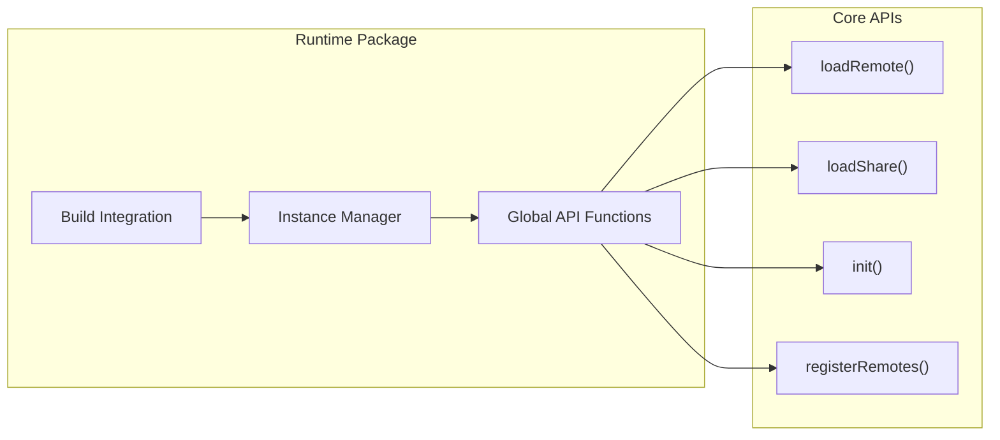
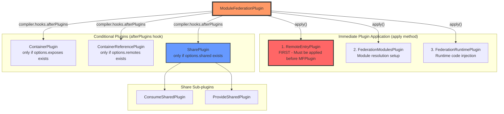
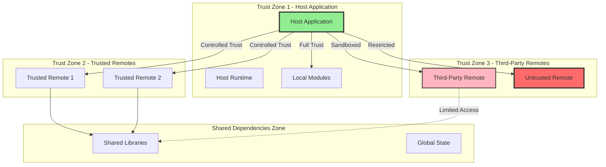

# Module Federation Architecture Overview

Module Federation is a sophisticated runtime and build-time system that enables dynamic code sharing between independent JavaScript applications. This document provides a comprehensive overview based on the actual implementation, designed to help bundler teams understand the architecture and implement Module Federation support.

## Table of Contents
- [Core Architecture](#core-architecture)
- [Package Architecture](#package-architecture)
- [Runtime Layers](#runtime-layers)
- [Build-Time Integration](#build-time-integration)
- [Key Integration Points](#key-integration-points)
- [Architecture Diagrams](#architecture-diagrams)
- [Security Architecture](#security-architecture)

## Core Architecture

Module Federation consists of a **layered package architecture** that enables dynamic module sharing across different bundlers and environments:


## Package Architecture

### 1. Foundation Layer

#### **@module-federation/sdk**
- **Purpose**: Foundation layer providing types, utilities, and cross-platform support
- **Key Components**:
  - **Type Definitions**: Complete TypeScript types for all Module Federation configurations
  - **Cross-Platform Utilities**: `isBrowserEnv`, `loadScript`, `createScript`, DOM manipulation
  - **Path Handling**: `normalizeWebpackPath` for cross-bundler compatibility
  - **Name Encoding/Decoding**: Safe filename generation (`decodeName`, `encodeName`)
  - **Manifest Processing**: `generateSnapshotFromManifest`, snapshot utilities
  - **Environment Detection**: Runtime environment detection and logging
  - **Module Federation Config**: `createModuleFederationConfig` helper
  - **Utilities**: `inferAutoPublicPath`, `parseEntry`, `simpleJoinRemoteEntry`

#### **@module-federation/error-codes**
- **Purpose**: Centralized error handling and reporting
- **Dependencies**: None (pure foundation package)
- **Key Components**:
  - **Error Code Registry**: Standardized error codes (e.g., `RUNTIME_004`, `RUNTIME_007`)
  - **Error Descriptions**: Human-readable error descriptions (`runtimeDescMap`)
  - **Short Error Messages**: `getShortErrorMsg` for concise error reporting
  - **Runtime Integration**: Used throughout the runtime for consistent error handling

### 2. Core Runtime Layer

#### **@module-federation/runtime-core**
- **Purpose**: Bundler-agnostic core runtime logic
- **Dependencies**: `@module-federation/sdk`, `@module-federation/error-codes`
- **Key Components**:
  - **`ModuleFederation` class**: Central orchestrator with plugin system
  - **`RemoteHandler`**: Remote module loading, caching, and error handling
  - **`SharedHandler`**: Shared dependency resolution and version negotiation
  - **`SnapshotHandler`**: Snapshot optimization for performance
  - **`Module` wrapper**: Individual module management with lifecycle hooks
  - **Hook System**: Extensible plugin architecture (sync/async/waterfall hooks)
  - **Global State Management**: Multi-instance coordination and shared state
  - **Error Handling**: Integration with `@module-federation/error-codes`
  - **Caching System**: Module and remote entry caching strategies

### 3. Runtime Convenience Layer

#### **@module-federation/runtime**
- **Purpose**: Convenience layer with singleton patterns and simplified APIs
- **Dependencies**: `@module-federation/runtime-core`, `@module-federation/sdk`, `@module-federation/error-codes`
- **Key Components**:
  - **Global Instance Management**: Singleton pattern with automatic discovery
  - **Simplified API**: Function-based interface (`loadRemote`, `loadShare`, `init`, `registerRemotes`)
  - **Build Identifier Integration**: Automatic build version handling
  - **Instance Lifecycle**: Automatic instance creation and management
  - **Convenience Exports**: Re-exports of runtime-core with additional helpers
  - **Global Plugin Registration**: Easy plugin setup across all instances
  - **TypeScript Support**: Full type safety for all operations

### 4. Bundler Adapter Layer

#### **@module-federation/webpack-bundler-runtime**
- **Purpose**: Webpack-specific runtime bridge
- **Dependencies**: `@module-federation/runtime`, `@module-federation/sdk`
- **Key Components**:
  - **`Federation` Bridge Object**: Integrates with webpack's `__webpack_require__.federation`
  - **Share Scope Integration**: `attachShareScopeMap` for webpack's sharing system
  - **Container Operations**: `initContainerEntry` for container initialization
  - **Remote Loading**: Integration with webpack's chunk loading system
  - **Module Consumption**: Bridge to webpack's module cache and resolution
  - **Runtime Integration**: Seamless bridging between webpack runtime and federation core

### 5. Build-Time Integration Layer

#### **@module-federation/enhanced**
- **Purpose**: Webpack build-time integration and code generation
- **Dependencies**: Full workspace ecosystem including `@module-federation/error-codes`, `@module-federation/sdk`, `@module-federation/dts-plugin`, `@module-federation/data-prefetch`, `@module-federation/managers`, `@module-federation/manifest`, `@module-federation/rspack`
- **Key Components**:
  - **`ModuleFederationPlugin`**: Main orchestrator with two-phase plugin application
  - **`RemoteEntryPlugin`**: Entry point modification (applied first)
  - **`FederationModulesPlugin`**: Module resolution and federation setup
  - **`FederationRuntimePlugin`**: Runtime code injection and configuration
  - **`ContainerPlugin`**: Container creation and module exposure (conditional)
  - **`ContainerReferencePlugin`**: Remote module reference handling (conditional)
  - **`SharePlugin`**: Shared dependency coordination (conditional)
  - **Additional Plugins**: DTS generation, data prefetch, manifest generation
  - **Schema Validation**: Runtime configuration validation

## Global State Structure

The runtime maintains a global state object accessible via `globalThis.__FEDERATION__`:

```typescript
interface Federation {
  __GLOBAL_PLUGIN__: Array<ModuleFederationRuntimePlugin>;
  __DEBUG_CONSTRUCTOR_VERSION__?: string;
  moduleInfo: GlobalModuleInfo;  // Snapshot registry
  __DEBUG_CONSTRUCTOR__?: typeof ModuleFederation;
  __INSTANCES__: Array<ModuleFederation>;  // All federation instances
  __SHARE__: GlobalShareScopeMap;  // Global share scopes
  __MANIFEST_LOADING__: Record<string, Promise<ModuleInfo>>;
  __PRELOADED_MAP__: Map<string, boolean>;  // Preload tracking
}

// Additional global state
global.__GLOBAL_LOADING_REMOTE_ENTRY__: Record<
  string,
  Promise<RemoteEntryExports | void>
>;  // Remote entry loading cache
```

**Key Global State Features**:
- **Multi-Instance Support**: Multiple federation instances can coexist
- **Snapshot Registry**: Global module information for optimization
- **Share Scope Management**: Cross-instance shared dependency coordination
- **Loading State Tracking**: Prevents duplicate remote entry loading
- **Plugin System**: Global plugins that apply to all instances
- **Debug Support**: Development-time debugging utilities

## Runtime Architecture

### Runtime Core (Bundler Agnostic)


**Key Responsibilities**:
- **Environment Agnostic**: Works in browser, Node.js, and other JavaScript environments
- **Instance Management**: Explicit instance creation and management
- **Plugin System**: Full hook system with sync/async and waterfall patterns
- **Module Loading**: Core logic for remote and shared module loading
- **Version Resolution**: Sophisticated version negotiation algorithms

### Runtime Convenience Layer



**Key Features**:
- **Singleton Management**: Global instance with automatic discovery
- **Simplified API**: Function-based interface for common operations
- **Build Integration**: Support for build-time identifier injection
- **Developer Experience**: Convenience functions for common patterns

### Bundler Runtime Bridge


**Bundler Bridge Pattern**:
```typescript
// Pattern for any bundler
interface BundlerRuntimeBridge {
  runtime: typeof coreRuntime;        // Core runtime reference
  instance?: ModuleFederation;        // Runtime instance
  bundlerRuntime: {                   // Bundler-specific implementations
    remotes: (options) => Promise<Module>;
    consumes: (options) => Promise<Module>;
    initializeSharing: (scope) => Promise<boolean>;
  };
  attachShareScopeMap: (bundlerRequire) => void;
}
```

## Build-Time Integration

### Plugin Orchestration Pattern



### Critical Webpack Integration Points

```typescript
// Key hooks used by Module Federation plugins
interface WebpackIntegrationPoints {
  // Plugin coordination
  'compiler.hooks.afterPlugins': 'Two-phase plugin application - ensures conditional plugins applied after core setup';
  
  // Module resolution interception  
  'normalModuleFactory.hooks.factorize': 'Intercepts module requests before creation for federation modules';
  'normalModuleFactory.hooks.module': 'Processes modules after creation, handles remote/shared modules';
  
  // Build process integration
  'compiler.hooks.make': 'Creates container entries and federation dependencies';
  'compiler.hooks.thisCompilation': 'Sets up dependency factories for federation dependencies';
  
  // Runtime code injection
  'compilation.hooks.runtimeRequirementInTree': 'Adds federation runtime requirements to chunks';
  'compilation.addRuntimeModule': 'Injects federation runtime modules into webpack bundle';
  
  // Entry point handling
  'compiler.hooks.entryOption': 'RemoteEntryPlugin modifies webpack entry configuration';
}
```

## Key Integration Points

### For Bundler Teams Implementing Module Federation

#### 1. **SDK Integration**
```typescript
import { 
  ModuleFederationPluginOptions,
  normalizeWebpackPath,
  createLogger,
  generateSnapshotFromManifest 
} from '@module-federation/sdk';

// Use SDK types and utilities for consistent integration
```

#### 2. **Runtime Core Integration**
```typescript
import { ModuleFederation } from '@module-federation/runtime-core';

// Create bundler-specific runtime bridge
const bundlerRuntime = {
  remotes: (options) => /* bundler-specific remote loading */,
  consumes: (options) => /* bundler-specific shared consumption */,
  // ... other bundler-specific implementations
};
```

#### 3. **Plugin Architecture Pattern**
- **Central Orchestrator**: One main plugin that coordinates all federation functionality
- **Specialized Plugins**: Separate plugins for containers, remotes, and sharing
- **Hook-Based Integration**: Use bundler's hook system for proper timing
- **Runtime Injection**: Ability to inject runtime code into bundles

#### 4. **Required Bundler Capabilities**
- **Module Resolution Interception**: Ability to intercept and redirect module requests
- **Custom Dependency Types**: Support for federation-specific dependencies
- **Runtime Module Injection**: System for adding runtime behavior
- **Asset Management**: Control over chunk creation and naming
- **External Module Support**: Handling of external/remote references

## Architecture Diagrams

### Complete System Architecture


### Module Loading Flow


### Snapshot Optimization System


Import map entry preservation is controlled separately via `FEDERATION_OPTIMIZE_NO_IMPORTMAP`, allowing builds that do not use import maps to tree-shake that logic from runtime-core.

### Share Scope Management


## Security Architecture

Module Federation's distributed architecture introduces unique security considerations that bundler implementers must understand and address. This section outlines the critical security aspects, trust boundaries, and implementation requirements for secure module federation.

### 1. **Content Security Policy (CSP) Considerations**

Module Federation's dynamic loading of remote code presents significant challenges for Content Security Policy implementation:

#### **Dynamic Script Loading Requirements**
```typescript
// CSP must allow dynamic script loading for remote entries
// Required CSP directives:
'script-src': [
  "'self'",
  "'unsafe-eval'",  // Required for webpack's dynamic imports
  ...trustedRemoteDomains,  // All remote hosts
  "'nonce-' + nonceValue"  // Recommended for additional security
]
```

#### **CSP Implementation Strategies**
- **Nonce-Based CSP**: Use unique nonces for each remote entry script
- **Hash-Based CSP**: Pre-calculate hashes for known remote entries (limited applicability)
- **Domain Allowlisting**: Maintain strict allowlists of trusted remote origins
- **CSP Reporting**: Implement CSP violation reporting to detect potential attacks

```typescript
// Example CSP configuration for Module Federation
const cspConfig = {
  'script-src': [
    "'self'",
    "'nonce-abc123'",
    'https://trusted-remote-1.example.com',
    'https://trusted-remote-2.example.com'
  ],
  'connect-src': [
    "'self'",
    ...trustedRemoteAPIs
  ],
  'report-uri': '/csp-violation-report'
};
```

#### **Runtime CSP Validation**
```typescript
// Implement runtime CSP compliance checking
const validateRemoteOrigin = (remoteUrl: string): boolean => {
  const allowedOrigins = getCSPAllowedOrigins();
  const remoteOrigin = new URL(remoteUrl).origin;
  return allowedOrigins.includes(remoteOrigin);
};
```

### 2. **Trust Boundaries and Security Zones**

Module Federation operates across multiple trust boundaries that must be clearly defined and enforced:



#### **Trust Boundary Implementation**
```typescript
interface RemoteTrustConfig {
  origin: string;
  trustLevel: 'full' | 'controlled' | 'sandboxed' | 'restricted';
  allowedExports: string[];
  cspPolicy: string;
  integrityCheck: boolean;
  isolationLevel: 'none' | 'iframe' | 'worker';
}

const validateTrustBoundary = (remote: RemoteTrustConfig, requestedModule: string): boolean => {
  // Validate trust level allows the requested operation
  if (remote.trustLevel === 'restricted' && !remote.allowedExports.includes(requestedModule)) {
    throw new SecurityError('Module not in allowlist for restricted remote');
  }
  
  // Validate origin matches expected
  if (!validateOrigin(remote.origin)) {
    throw new SecurityError('Remote origin validation failed');
  }
  
  return true;
};
```

### 3. **Secure Federation Practices**

#### **Remote Authentication and Authorization**
```typescript
// Implement remote authentication before loading
const secureRemoteLoader = {
  async loadRemote(remoteName: string, moduleName: string) {
    // 1. Authenticate the remote
    const authToken = await authenticateRemote(remoteName);
    
    // 2. Authorize the specific module access
    await authorizeModuleAccess(remoteName, moduleName, authToken);
    
    // 3. Load with integrity checking
    return await loadRemoteWithIntegrity(remoteName, moduleName, {
      authToken,
      integrityHash: await getModuleHash(remoteName, moduleName)
    });
  }
};
```

#### **Subresource Integrity (SRI) Implementation**
```typescript
// Implement SRI for remote entries
const loadRemoteWithSRI = async (remoteUrl: string, expectedHash: string) => {
  const script = document.createElement('script');
  script.src = remoteUrl;
  script.integrity = `sha384-${expectedHash}`;
  script.crossOrigin = 'anonymous';
  
  return new Promise((resolve, reject) => {
    script.onload = resolve;
    script.onerror = () => reject(new SecurityError('SRI validation failed'));
    document.head.appendChild(script);
  });
};
```

#### **Secure Configuration Management**
```typescript
// Secure remote configuration
interface SecureRemoteConfig {
  name: string;
  url: string;
  publicKey: string;  // For signature verification
  allowedModules: string[];
  maxCacheTime: number;
  requireAuth: boolean;
  cspNonce?: string;
}

const validateRemoteConfig = (config: SecureRemoteConfig): boolean => {
  // Validate URL is HTTPS in production
  if (isProduction() && !config.url.startsWith('https://')) {
    throw new SecurityError('Remote URLs must use HTTPS in production');
  }
  
  // Validate public key format
  if (!isValidPublicKey(config.publicKey)) {
    throw new SecurityError('Invalid public key format');
  }
  
  return true;
};
```

### 4. **Input Validation and Sanitization**

Strict input validation is crucial for preventing injection attacks:

#### **Remote Entry Validation**
```typescript
const validateRemoteEntry = (remoteEntry: any): boolean => {
  // Validate structure
  if (typeof remoteEntry !== 'object' || !remoteEntry.get || !remoteEntry.init) {
    throw new SecurityError('Invalid remote entry structure');
  }
  
  // Validate exposed modules
  const exposedModules = Object.keys(remoteEntry.modules || {});
  exposedModules.forEach(moduleName => {
    if (!isValidModuleName(moduleName)) {
      throw new SecurityError(`Invalid module name: ${moduleName}`);
    }
  });
  
  return true;
};

const isValidModuleName = (name: string): boolean => {
  // Allow only alphanumeric, dash, underscore, and forward slash
  const validPattern = /^[a-zA-Z0-9/_-]+$/;
  return validPattern.test(name) && !name.includes('..');
};
```

#### **Shared Dependency Validation**
```typescript
const validateSharedDependency = (packageName: string, version: string): boolean => {
  // Validate package name format
  if (!isValidPackageName(packageName)) {
    throw new SecurityError(`Invalid package name: ${packageName}`);
  }
  
  // Validate version format (semver)
  if (!isValidSemverVersion(version)) {
    throw new SecurityError(`Invalid version: ${version}`);
  }
  
  // Check against known vulnerable versions
  if (isVulnerableVersion(packageName, version)) {
    throw new SecurityError(`Vulnerable package version: ${packageName}@${version}`);
  }
  
  return true;
};
```

### 5. **Cross-Origin Security Implications**

#### **CORS Configuration**
```typescript
// Proper CORS setup for remote loading
const corsConfig = {
  // Be restrictive with allowed origins
  'Access-Control-Allow-Origin': trustedOrigins,
  'Access-Control-Allow-Methods': 'GET, POST',
  'Access-Control-Allow-Headers': 'Content-Type, Authorization',
  'Access-Control-Allow-Credentials': 'true',
  // Prevent CSRF attacks
  'Access-Control-Max-Age': '86400'
};
```

#### **PostMessage Security**
```typescript
// Secure communication between federated modules
const securePostMessage = {
  send(targetOrigin: string, data: any) {
    // Validate target origin
    if (!trustedOrigins.includes(targetOrigin)) {
      throw new SecurityError('Untrusted target origin');
    }
    
    // Sanitize data
    const sanitizedData = sanitizeMessageData(data);
    
    window.postMessage(sanitizedData, targetOrigin);
  },
  
  receive(event: MessageEvent) {
    // Validate origin
    if (!trustedOrigins.includes(event.origin)) {
      console.warn('Ignoring message from untrusted origin:', event.origin);
      return;
    }
    
    // Validate message structure
    if (!isValidMessageStructure(event.data)) {
      console.warn('Invalid message structure received');
      return;
    }
    
    // Process message
    processSecureMessage(event.data);
  }
};
```

### 6. **Runtime Security Validations**

#### **Module Isolation and Sandboxing**
```typescript
// Implement module isolation for untrusted remotes
class SecureModuleLoader {
  private isolationStrategies = {
    iframe: this.loadInIframe,
    worker: this.loadInWorker,
    vm: this.loadInVM
  };
  
  async loadIsolatedModule(remoteConfig: SecureRemoteConfig, moduleName: string) {
    const isolationLevel = this.determineIsolationLevel(remoteConfig.trustLevel);
    const strategy = this.isolationStrategies[isolationLevel];
    
    return await strategy(remoteConfig, moduleName);
  }
  
  private async loadInIframe(config: SecureRemoteConfig, moduleName: string) {
    // Create sandboxed iframe for untrusted code
    const iframe = document.createElement('iframe');
    iframe.sandbox = 'allow-scripts allow-same-origin';
    iframe.src = `${config.url}?module=${encodeURIComponent(moduleName)}`;
    
    // Implement secure communication channel
    return new Promise((resolve, reject) => {
      const messageHandler = (event: MessageEvent) => {
        if (event.source === iframe.contentWindow && 
            event.origin === new URL(config.url).origin) {
          resolve(event.data);
          window.removeEventListener('message', messageHandler);
        }
      };
      
      window.addEventListener('message', messageHandler);
      document.body.appendChild(iframe);
    });
  }
}
```

#### **Runtime Security Monitoring**
```typescript
// Implement security monitoring and alerting
class SecurityMonitor {
  private securityEvents: SecurityEvent[] = [];
  
  logSecurityEvent(event: SecurityEvent) {
    this.securityEvents.push({
      ...event,
      timestamp: Date.now(),
      userAgent: navigator.userAgent,
      url: window.location.href
    });
    
    // Alert on suspicious patterns
    if (this.detectSuspiciousActivity(event)) {
      this.triggerSecurityAlert(event);
    }
  }
  
  private detectSuspiciousActivity(event: SecurityEvent): boolean {
    // Detect rapid failure attempts
    const recentFailures = this.securityEvents
      .filter(e => e.type === 'validation_failure' && 
                   Date.now() - e.timestamp < 60000)
      .length;
    
    return recentFailures > 5;
  }
  
  private triggerSecurityAlert(event: SecurityEvent) {
    // Send security alert to monitoring system
    fetch('/api/security-alert', {
      method: 'POST',
      headers: { 'Content-Type': 'application/json' },
      body: JSON.stringify({
        event,
        severity: 'high',
        timestamp: Date.now()
      })
    });
  }
}
```

### 7. **Security Best Practices for Bundler Implementers**

#### **Essential Security Checklist**
- ✅ **CSP Compliance**: Ensure CSP policies support dynamic loading while maintaining security
- ✅ **HTTPS Enforcement**: Require HTTPS for all remote entries in production
- ✅ **Origin Validation**: Implement strict origin validation for all remote resources
- ✅ **Input Sanitization**: Validate and sanitize all remote inputs and configurations
- ✅ **Integrity Checking**: Implement SRI or equivalent integrity verification
- ✅ **Trust Boundaries**: Clearly define and enforce trust levels for different remotes
- ✅ **Error Handling**: Implement secure error handling that doesn't leak sensitive information
- ✅ **Monitoring**: Add security event logging and monitoring capabilities
- ✅ **Sandboxing**: Provide isolation mechanisms for untrusted code
- ✅ **Version Control**: Implement secure version negotiation and validation

#### **Security Configuration Example**
```typescript
// Comprehensive security configuration
const securityConfig: ModuleFederationSecurityConfig = {
  // CSP settings
  csp: {
    enforceHttps: true,
    allowedOrigins: ['https://trusted-app-1.com', 'https://trusted-app-2.com'],
    nonce: generateNonce(),
    reportUri: '/csp-violations'
  },
  
  // Trust levels
  remotes: {
    'trusted-app-1': {
      trustLevel: 'full',
      integrityCheck: false,
      isolation: 'none'
    },
    'partner-app': {
      trustLevel: 'controlled',
      integrityCheck: true,
      isolation: 'none',
      allowedModules: ['Header', 'Footer']
    },
    'third-party-widget': {
      trustLevel: 'sandboxed',
      integrityCheck: true,
      isolation: 'iframe',
      allowedModules: ['Widget']
    }
  },
  
  // Security monitoring
  monitoring: {
    enabled: true,
    alertThreshold: 5,
    reportEndpoint: '/api/security-events'
  },
  
  // Shared dependency security
  shared: {
    vulnerabilityCheck: true,
    allowedVersions: {
      'react': '^18.0.0',
      'lodash': '^4.17.21'
    }
  }
};
```

### 8. **Security Testing and Validation**

#### **Security Test Suite**
```typescript
// Security-focused test cases for Module Federation
describe('Module Federation Security', () => {
  test('should reject untrusted origins', async () => {
    const maliciousRemote = {
      name: 'malicious-app',
      url: 'http://malicious-site.com/remoteEntry.js'
    };
    
    await expect(loadRemote(maliciousRemote))
      .rejects
      .toThrow('Untrusted origin');
  });
  
  test('should validate module names', () => {
    const invalidModuleNames = [
      '../../../etc/passwd',
      '<script>alert("xss")</script>',
      'module\x00name'
    ];
    
    invalidModuleNames.forEach(name => {
      expect(() => validateModuleName(name))
        .toThrow('Invalid module name');
    });
  });
  
  test('should enforce CSP compliance', () => {
    const cspPolicy = generateCSPPolicy();
    expect(cspPolicy).toContain("'nonce-");
    expect(cspPolicy).not.toContain("'unsafe-inline'");
  });
});
```

### 9. **Common Security Vulnerabilities and Mitigations**

| Vulnerability | Description | Mitigation |
|---------------|-------------|------------|
| **XSS via Remote Code** | Malicious remote modules inject scripts | Implement CSP, input validation, sandboxing |
| **CSRF Attacks** | Cross-site requests to load malicious remotes | Use CSRF tokens, validate origins, implement SameSite cookies |
| **Dependency Confusion** | Malicious packages with similar names to trusted ones | Implement package name validation, use private registries |
| **Man-in-the-Middle** | Remote entries intercepted and modified | Enforce HTTPS, implement SRI, use certificate pinning |
| **Prototype Pollution** | Malicious remotes modify JavaScript prototypes | Implement object freezing, use safe deserialization |
| **Resource Exhaustion** | Malicious remotes consume excessive resources | Implement resource limits, monitoring, timeouts |
| **Information Disclosure** | Sensitive data leaked through error messages | Implement secure error handling, sanitize error responses |

This security architecture provides a comprehensive foundation for implementing secure Module Federation. Bundler teams should adapt these practices to their specific implementation while maintaining the core security principles outlined above.

## Key Architectural Principles

### 1. **Layered Package Architecture**
- Clear separation between build-time and runtime concerns
- Foundation layer (SDK + error-codes) provides cross-platform utilities
- Runtime-core offers bundler-agnostic logic
- Bundler-specific adapters handle platform integration
- Convenience layer provides simplified APIs

### 2. **Two-Phase Plugin Application Strategy**
- **Phase 1 (Immediate)**: Core plugins applied during `apply()` method
  - `RemoteEntryPlugin` (must be first)
  - `FederationModulesPlugin` 
  - `FederationRuntimePlugin`
- **Phase 2 (afterPlugins hook)**: Conditional plugins based on configuration
  - `ContainerPlugin` (only if `exposes` exists)
  - `ContainerReferencePlugin` (only if `remotes` exists)
  - `SharePlugin` (only if `shared` exists)

### 3. **Global State Management**
- Centralized state via `globalThis.__FEDERATION__`
- Multi-instance coordination and shared resource management
- Global snapshot registry for performance optimization
- Prevents duplicate loading of remote entries and modules

### 4. **Performance Optimization Systems**
- **Snapshot System**: Global module information for intelligent loading decisions
- **Caching Strategies**: Module cache, remote entry cache, preload tracking
- **Lazy Loading**: On-demand remote module loading with error handling
- **Version Negotiation**: Sophisticated shared dependency resolution

### 5. **Error Handling & Developer Experience**
- Centralized error codes via `@module-federation/error-codes`
- Comprehensive TypeScript support across all packages
- Rich debugging capabilities with debug constructors
- Hook system for extensibility and customization
- Multiple API layers catering to different developer needs

## Implementation Strategy for Other Bundlers

To implement Module Federation support in your bundler:

1. **Foundation Setup**: 
   - Use `@module-federation/sdk` for types and cross-platform utilities
   - Integrate `@module-federation/error-codes` for consistent error reporting
   - Set up global state management following the established patterns

2. **Runtime Integration**: 
   - Create a bundler-specific runtime bridge following the `webpack-bundler-runtime` pattern
   - Integrate with `@module-federation/runtime-core` for core logic
   - Implement bundler-specific module loading and resolution

3. **Build-Time Plugins**: 
   - Implement the two-phase plugin application strategy
   - Create main orchestrator plugin that coordinates all federation functionality
   - Build specialized plugins for containers, remotes, and sharing
   - Ensure proper integration with bundler's module resolution system

4. **Performance Features**:
   - Implement snapshot optimization system for better performance
   - Add caching strategies for modules and remote entries
   - Support global state coordination for multi-instance scenarios

5. **Testing & Validation**: 
   - Test against existing Module Federation applications
   - Ensure compatibility with the established API surface
   - Validate error handling and edge cases

This architecture enables Module Federation to work across different bundlers while maintaining a consistent developer experience and runtime behavior.

## Related Documentation

For detailed implementation guidance, see:
- [Plugin Architecture](./plugin-architecture.md) - Core plugin system design
- [Runtime Architecture](./runtime-architecture.md) - Runtime behavior and lifecycle
- [Implementation Guide](./implementation-guide.md) - Step-by-step implementation instructions
- [SDK Reference](./sdk-reference.md) - Complete API documentation and interfaces
- [Manifest Specification](./manifest-specification.md) - Manifest file formats and schemas
- [Error Handling Specification](./error-handling-specification.md) - Comprehensive error handling patterns
- [Advanced Topics](./advanced-topics.md) - Production-ready patterns and optimizations

## Next Steps

- Review the actual source code in `/packages/` for implementation details
- Study `@module-federation/enhanced` for webpack build-time integration patterns
- Examine `@module-federation/runtime-core` for bundler-agnostic runtime logic
- Check `@module-federation/sdk` for available utilities and type definitions
- Look at `@module-federation/webpack-bundler-runtime` for bundler bridge patterns
