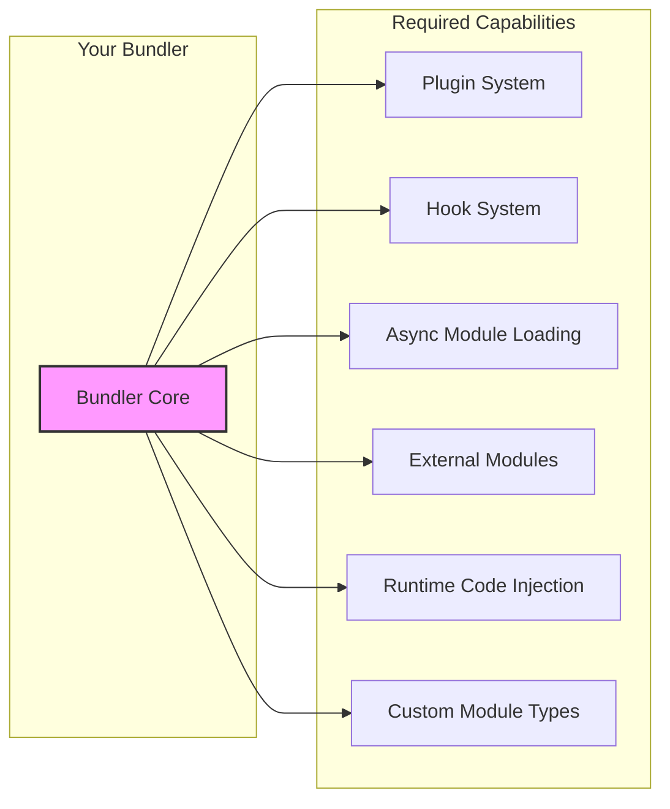
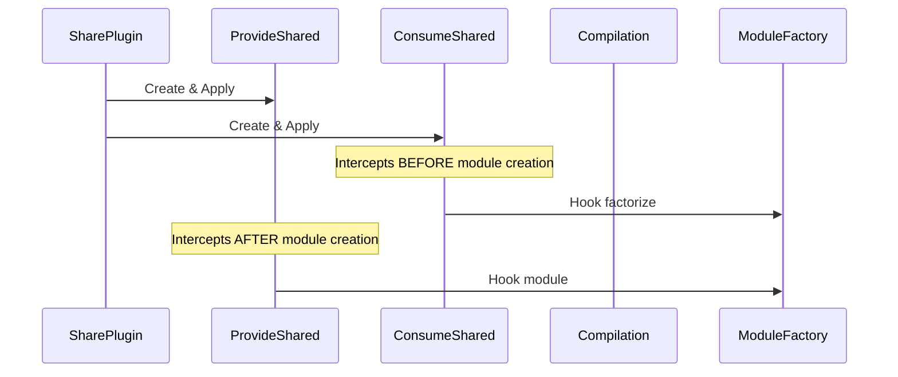
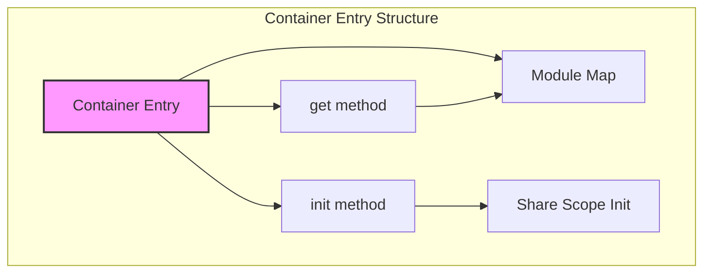
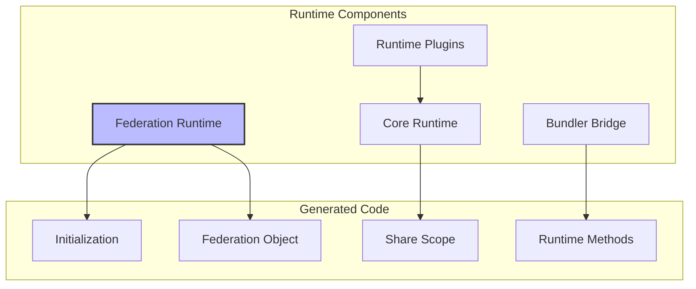
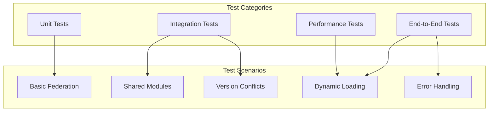
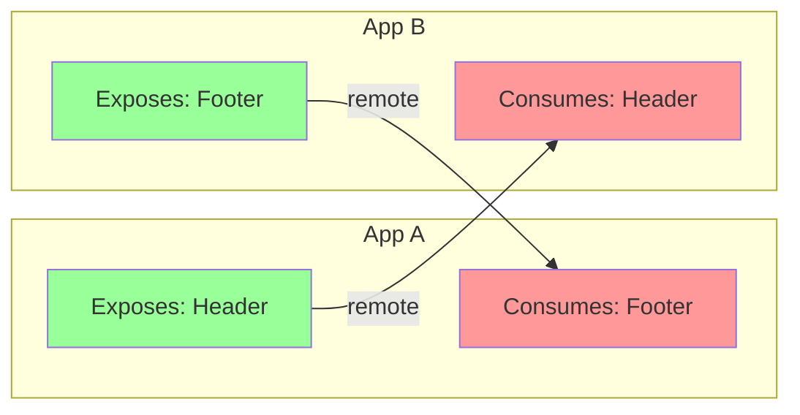
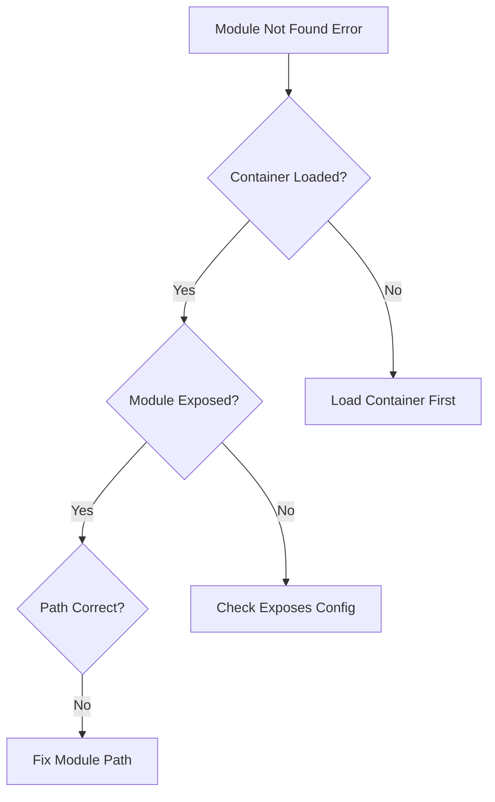

# Module Federation Implementation Guide

This guide provides step-by-step instructions for bundler teams to implement Module Federation in their build tools. It covers the essential components, integration points, and best practices.

## Table of Contents
- [Prerequisites](#prerequisites)
- [Implementation Steps](#implementation-steps)
- [Core Components Implementation](#core-components-implementation)
- [Runtime Integration](#runtime-integration)
- [Testing and Validation](#testing-and-validation)
- [Common Patterns](#common-patterns)
- [Troubleshooting](#troubleshooting)

## Prerequisites

Before implementing Module Federation, ensure your bundler supports:



### Minimum Requirements Checklist

- [ ] **Plugin System**: Ability to add plugins that modify compilation
- [ ] **Compilation Hooks**: Access to module resolution and creation
- [ ] **Module Factory**: Ability to create custom module types
- [ ] **Runtime Generation**: Ability to inject runtime code
- [ ] **Async Loading**: Support for dynamic imports
- [ ] **External References**: Support for external module references

## Implementation Steps

### Step 1: Create the Main Plugin

```typescript
// module-federation-plugin.ts
import { 
  ModuleFederationPluginOptions,
  normalizeFederationOptions 
} from '@module-federation/sdk';

export class ModuleFederationPlugin {
  private options: NormalizedOptions;
  
  constructor(options: ModuleFederationPluginOptions) {
    // Validate and normalize options
    this.options = normalizeFederationOptions(options);
  }
  
  apply(compiler: YourBundlerCompiler) {
    // Step 1: Apply runtime plugin first
    new FederationRuntimePlugin(this.options).apply(compiler);
    
    // Step 2: Apply feature plugins based on configuration
    compiler.hooks.afterPlugins.tap('ModuleFederation', () => {
      if (this.options.exposes) {
        new ContainerPlugin(this.options).apply(compiler);
      }
      
      if (this.options.remotes) {
        new ContainerReferencePlugin(this.options).apply(compiler);
      }
      
      // SharePlugin is always applied
      new SharePlugin(this.options).apply(compiler);
    });
  }
}
```

### Step 2: Implement Container Plugin

The Container Plugin creates the container entry point for exposed modules:

```typescript
// container-plugin.ts
export class ContainerPlugin {
  apply(compiler: YourBundlerCompiler) {
    compiler.hooks.make.tapAsync('ContainerPlugin', async (compilation) => {
      // Create container entry dependency
      const dep = new ContainerEntryDependency(
        this.options.name,
        this.options.exposes,
        this.options.shareScope
      );
      
      // Add as entry point
      await compilation.addEntry({
        name: this.options.name,
        filename: this.options.filename,
        dependency: dep
      });
    });
    
    // Register module factories
    compiler.hooks.compilation.tap('ContainerPlugin', (compilation) => {
      compilation.dependencyFactories.set(
        ContainerEntryDependency,
        new ContainerEntryModuleFactory()
      );
    });
  }
}
```

### Step 3: Implement Share Plugin



```typescript
// share-plugin.ts
export class SharePlugin {
  apply(compiler: YourBundlerCompiler) {
    const providedModules = this.normalizeProvided(this.options.shared);
    const consumedModules = this.normalizeConsumed(this.options.shared);
    
    new ProvideSharedPlugin({
      provides: providedModules,
      shareScope: this.options.shareScope
    }).apply(compiler);
    
    new ConsumeSharedPlugin({
      consumes: consumedModules,
      shareScope: this.options.shareScope
    }).apply(compiler);
  }
}

// consume-shared-plugin.ts
export class ConsumeSharedPlugin {
  apply(compiler: YourBundlerCompiler) {
    compiler.hooks.compilation.tap('ConsumeSharedPlugin', 
      (compilation, { normalModuleFactory }) => {
        
        // CRITICAL: Hook BEFORE module creation
        normalModuleFactory.hooks.factorize.tapPromise(
          'ConsumeSharedPlugin',
          async (resolveData) => {
            if (this.consumes.has(resolveData.request)) {
              // Return custom module instead of normal module
              return new ConsumeSharedModule(
                resolveData.request,
                this.consumes.get(resolveData.request)
              );
            }
            return undefined; // Continue normal flow
          }
        );
      }
    );
  }
}
```

### Step 4: Implement Container Reference Plugin

```typescript
// container-reference-plugin.ts
export class ContainerReferencePlugin {
  apply(compiler: YourBundlerCompiler) {
    // Convert remotes to external references
    const externals = this.remoteToExternals(this.options.remotes);
    
    // Use your bundler's external plugin
    new YourExternalsPlugin({
      type: this.options.remoteType || 'script',
      externals
    }).apply(compiler);
    
    // Add remote loading runtime
    compiler.hooks.compilation.tap('ContainerReferencePlugin', 
      (compilation) => {
        compilation.hooks.runtimeRequirementInTree
          .for(RuntimeGlobals.loadScript)
          .tap('ContainerReferencePlugin', (chunk) => {
            compilation.addRuntimeModule(chunk, new RemoteLoadingRuntime());
          });
      }
    );
  }
  
  private remoteToExternals(remotes: Record<string, RemoteConfig>) {
    const externals: Record<string, External> = {};
    
    for (const [name, config] of Object.entries(remotes)) {
      externals[name] = {
        [config.externalType]: config.external
      };
    }
    
    return externals;
  }
}
```

## Core Components Implementation

### Container Entry Module



```typescript
// container-entry-module.ts
export class ContainerEntryModule extends Module {
  constructor(
    private name: string,
    private exposes: Record<string, ExposeConfig>,
    private shareScope: string
  ) {
    super('container-entry');
  }
  
  getSource() {
    return `
      var moduleMap = {
        ${Object.entries(this.exposes)
          .map(([key, config]) => `
            "${key}": () => {
              return __bundler_require__.e("${config.chunkName}")
                .then(() => () => __bundler_require__("${config.import}"));
            }
          `)
          .join(',\n')}
      };
      
      var get = (module, getScope) => {
        __bundler_require__.R = getScope;
        getScope = Object.prototype.hasOwnProperty.call(moduleMap, module)
          ? moduleMap[module]()
          : Promise.resolve().then(() => {
              throw new Error('Module not found: ' + module);
            });
        __bundler_require__.R = undefined;
        return getScope;
      };
      
      var init = (shareScope, initScope) => {
        if (!__bundler_require__.S) return;
        var name = "${this.shareScope}";
        var oldScope = __bundler_require__.S[name];
        if (oldScope && oldScope !== shareScope) 
          throw new Error("Container initialization failed");
        __bundler_require__.S[name] = shareScope;
        return __bundler_require__.I(name, initScope);
      };
      
      // Export container interface
      __bundler_require__.d(exports, {
        get: () => get,
        init: () => init
      });
    `;
  }
}
```

### Consume Shared Module

```typescript
// consume-shared-module.ts
export class ConsumeSharedModule extends Module {
  constructor(
    private request: string,
    private options: ConsumeSharedOptions
  ) {
    super('consume-shared');
  }
  
  getSource() {
    return `
      module.exports = __bundler_require__.federation.consumes({
        shareKey: "${this.options.shareKey}",
        shareScope: "${this.options.shareScope}",
        requiredVersion: "${this.options.requiredVersion}",
        singleton: ${this.options.singleton},
        strictVersion: ${this.options.strictVersion},
        fallback: ${this.options.fallback ? 
          `() => __bundler_require__("${this.options.fallback}")` : 
          'undefined'
        }
      });
    `;
  }
}
```

### Provide Shared Module

```typescript
// provide-shared-module.ts
export class ProvideSharedModule extends Module {
  constructor(
    private request: string,
    private options: ProvideSharedOptions,
    private resolvedModule: string
  ) {
    super('provide-shared');
  }
  
  getSource() {
    return `
      var versionCheckCallback = (version, requiredVersion) => {
        return __bundler_require__.federation.satisfies(
          version, 
          requiredVersion
        );
      };
      
      var getModule = ${this.options.eager ? 
        `() => __bundler_require__("${this.resolvedModule}")` :
        `() => __bundler_require__.e("${this.options.chunkName}")
          .then(() => () => __bundler_require__("${this.resolvedModule}"))`
      };
      
      var moduleToShare = {
        get: getModule,
        version: "${this.options.version}",
        scope: ["${this.options.shareScope}"],
        shareConfig: {
          eager: ${this.options.eager},
          requiredVersion: "${this.options.requiredVersion}",
          strictVersion: ${this.options.strictVersion},
          singleton: ${this.options.singleton},
          version: "${this.options.version}"
        }
      };
      
      __bundler_require__.federation.S["${this.options.shareScope}"]["${this.options.shareKey}"] = moduleToShare;
    `;
  }
}
```

## Runtime Integration

### Federation Runtime Module



```typescript
// federation-runtime-plugin.ts
export class FederationRuntimePlugin {
  apply(compiler: YourBundlerCompiler) {
    compiler.hooks.compilation.tap('FederationRuntimePlugin', 
      (compilation) => {
        // Add runtime requirement
        compilation.hooks.runtimeRequirementInTree
          .for(RuntimeGlobals.federation)
          .tap('FederationRuntimePlugin', (chunk) => {
            compilation.addRuntimeModule(
              chunk, 
              new FederationRuntimeModule(this.options)
            );
          });
        
        // Ensure share scopes are initialized
        compilation.hooks.runtimeRequirementInTree
          .for(RuntimeGlobals.shareScopeMap)
          .tap('FederationRuntimePlugin', (chunk) => {
            compilation.addRuntimeModule(
              chunk,
              new ShareScopeMapModule()
            );
          });
      }
    );
  }
}

// federation-runtime-module.ts
export class FederationRuntimeModule extends RuntimeModule {
  generate() {
    return `
      // Import core runtime
      var ModuleFederation = __bundler_require__("${RUNTIME_PATH}");
      
      // Import bundler runtime bridge
      var bundlerRuntime = __bundler_require__("${BUNDLER_RUNTIME_PATH}");
      
      // Create federation instance
      var federation = ModuleFederation.getInstance();
      
      // Initialize with options
      federation.init(${JSON.stringify(this.options)});
      
      // Load runtime plugins
      ${this.options.runtimePlugins.map(plugin => `
        __bundler_require__("${plugin}").then(module => {
          federation.registerPlugin(module.default || module);
        });
      `).join('\n')}
      
      // Expose federation object
      __bundler_require__.federation = {
        runtime: federation,
        ...bundlerRuntime
      };
    `;
  }
}
```

### Bundler Runtime Bridge Implementation

```typescript
// bundler-runtime.ts
export const bundlerRuntime = {
  // Load remote module
  remotes: async (options) => {
    const { id, remote } = options;
    
    // Load remote entry if not loaded
    if (!window[remote.scope]) {
      await __bundler_require__.e(remote.chunkId);
    }
    
    // Get container
    const container = window[remote.scope];
    
    // Initialize if needed
    if (!container.__initialized) {
      await container.init(__bundler_require__.S[remote.shareScope]);
      container.__initialized = true;
    }
    
    // Get module
    return container.get(id);
  },
  
  // Consume shared module
  consumes: async (options) => {
    const { shareKey, shareScope, requiredVersion } = options;
    
    // Check share scope
    const scope = __bundler_require__.S[shareScope];
    if (!scope || !scope[shareKey]) {
      // Load fallback or throw
      if (options.fallback) {
        return options.fallback();
      }
      throw new Error(`Shared module ${shareKey} not found`);
    }
    
    // Find compatible version
    const versions = Object.keys(scope[shareKey]);
    const version = findVersion(versions, requiredVersion);
    
    if (!version) {
      throw new Error(
        `No compatible version found for ${shareKey}@${requiredVersion}`
      );
    }
    
    // Return module getter
    return scope[shareKey][version].get();
  },
  
  // Initialize sharing
  initializeSharing: async (scopeName = 'default') => {
    // Create scope if not exists
    if (!__bundler_require__.S) {
      __bundler_require__.S = {};
    }
    
    if (!__bundler_require__.S[scopeName]) {
      __bundler_require__.S[scopeName] = {};
    }
    
    // Run share scope initialization
    if (__bundler_require__.I) {
      await __bundler_require__.I(scopeName);
    }
  },
  
  // Version utilities
  satisfies: (version, requirement) => {
    return satisfiesVersionRequirement(version, requirement);
  }
};
```

## Testing and Validation

### Test Suite Structure



### Basic Federation Test

```typescript
// __tests__/basic-federation.test.ts
describe('Basic Module Federation', () => {
  it('should expose modules correctly', async () => {
    const config = {
      name: 'testApp',
      filename: 'remoteEntry.js',
      exposes: {
        './Button': './src/Button.js'
      }
    };
    
    const result = await build(config);
    
    // Check container entry exists
    expect(result.assets).toContain('remoteEntry.js');
    
    // Check container has correct interface
    const container = await loadContainer(result.path, 'testApp');
    expect(container).toHaveProperty('init');
    expect(container).toHaveProperty('get');
    
    // Check exposed module can be loaded
    await container.init({});
    const moduleFactory = await container.get('./Button');
    const module = moduleFactory();
    expect(module).toBeDefined();
  });
  
  it('should consume remote modules', async () => {
    const hostConfig = {
      name: 'host',
      remotes: {
        remote: 'remote@http://localhost:3001/remoteEntry.js'
      }
    };
    
    // Mock remote loading
    mockRemote('remote', {
      './Button': () => ({ default: 'Button Component' })
    });
    
    const result = await build(hostConfig);
    const app = await runApp(result);
    
    // Test remote loading
    const Button = await app.import('remote/Button');
    expect(Button.default).toBe('Button Component');
  });
});
```

### Shared Module Test

```typescript
describe('Shared Modules', () => {
  it('should share singleton modules', async () => {
    const configs = [
      {
        name: 'app1',
        shared: {
          react: { singleton: true, version: '18.0.0' }
        }
      },
      {
        name: 'app2',
        shared: {
          react: { singleton: true, version: '18.0.0' }
        }
      }
    ];
    
    const [app1, app2] = await Promise.all(configs.map(build));
    
    // Load both apps
    const runtime1 = await loadApp(app1);
    const runtime2 = await loadApp(app2);
    
    // Get React from both
    const react1 = await runtime1.loadShared('react');
    const react2 = await runtime2.loadShared('react');
    
    // Should be the same instance
    expect(react1).toBe(react2);
  });
  
  it('should handle version conflicts', async () => {
    const shareScope = createShareScope();
    
    // Register different versions
    shareScope.register('react', '17.0.0', getReact17);
    shareScope.register('react', '18.0.0', getReact18);
    
    // Request compatible version
    const react17 = await shareScope.get('react', '^17.0.0');
    expect(react17.version).toBe('17.0.0');
    
    const react18 = await shareScope.get('react', '^18.0.0');
    expect(react18.version).toBe('18.0.0');
    
    // Request incompatible version
    await expect(
      shareScope.get('react', '^16.0.0')
    ).rejects.toThrow('No compatible version');
  });
});
```

### Validation Checklist

- [ ] **Container Entry**: Verify `get` and `init` methods work correctly
- [ ] **Remote Loading**: Test dynamic remote loading
- [ ] **Share Scope**: Validate version negotiation
- [ ] **Error Handling**: Test missing modules, version conflicts
- [ ] **Performance**: Measure loading times, bundle sizes
- [ ] **Hot Reload**: Ensure HMR works with federation

## Common Patterns

### Pattern 1: Bidirectional Hosts



```typescript
// App A config
{
  name: 'appA',
  exposes: {
    './Header': './src/Header'
  },
  remotes: {
    appB: 'appB@http://localhost:3002/remoteEntry.js'
  }
}

// App B config
{
  name: 'appB',
  exposes: {
    './Footer': './src/Footer'
  },
  remotes: {
    appA: 'appA@http://localhost:3001/remoteEntry.js'
  }
}
```

### Pattern 2: Shared Libraries

```typescript
// Shared library configuration
{
  name: 'sharedLib',
  exposes: {
    './utils': './src/utils',
    './components': './src/components',
    './hooks': './src/hooks'
  },
  shared: {
    react: { singleton: true },
    'react-dom': { singleton: true }
  }
}

// Consumer configuration
{
  name: 'consumer',
  remotes: {
    lib: 'sharedLib@http://cdn.example.com/remoteEntry.js'
  },
  shared: {
    react: { singleton: true },
    'react-dom': { singleton: true }
  }
}
```

### Pattern 3: Dynamic Remote Loading

```typescript
// Dynamic remote loading utility
async function loadRemoteComponent(
  remoteName: string,
  remoteUrl: string,
  modulePath: string
) {
  // Register remote dynamically
  await __bundler_require__.federation.registerRemote({
    name: remoteName,
    entry: remoteUrl
  });
  
  // Load component
  const module = await __bundler_require__.federation.loadRemote(
    `${remoteName}/${modulePath}`
  );
  
  return module;
}

// Usage
const Button = await loadRemoteComponent(
  'dynamicRemote',
  'https://cdn.example.com/remoteEntry.js',
  './Button'
);
```

## Troubleshooting

### Common Issues and Solutions

#### Issue 1: Module Not Found



**Solution:**
```typescript
// Debug helper
function debugModuleFederation() {
  console.log('Available containers:', Object.keys(window));
  console.log('Share scopes:', __bundler_require__.S);
  
  // Check specific container
  const container = window['myApp'];
  if (container) {
    console.log('Container methods:', Object.keys(container));
  }
}
```

#### Issue 2: Version Conflicts

**Symptoms:**
- Singleton violation errors
- Incompatible version errors
- Multiple React instances

**Solution:**
```typescript
// Version debugging
function debugVersions() {
  const shareScope = __bundler_require__.S.default;
  
  Object.entries(shareScope).forEach(([pkg, versions]) => {
    console.log(`Package: ${pkg}`);
    Object.entries(versions).forEach(([version, info]) => {
      console.log(`  Version: ${version}, Loaded: ${info.loaded}`);
    });
  });
}

// Strict singleton configuration
{
  shared: {
    react: {
      singleton: true,
      strictVersion: true,
      requiredVersion: '18.0.0'
    }
  }
}
```

#### Issue 3: Runtime Errors

**Debug Steps:**
1. Check console for federation errors
2. Verify runtime is loaded
3. Check network tab for failed requests
4. Validate configuration

```typescript
// Runtime error handler
window.addEventListener('error', (event) => {
  if (event.error?.message?.includes('federation')) {
    console.error('Federation Error:', {
      message: event.error.message,
      stack: event.error.stack,
      federationState: {
        containers: Object.keys(window).filter(k => 
          window[k]?.get && window[k]?.init
        ),
        shareScopes: Object.keys(__bundler_require__.S || {})
      }
    });
  }
});
```

### Performance Optimization Tips

1. **Preload Critical Remotes**
```typescript
// Preload remote entries
const preloadRemotes = ['app1', 'app2'].map(name => 
  fetch(`http://localhost:${3000 + i}/remoteEntry.js`)
);
await Promise.all(preloadRemotes);
```

2. **Use Module Federation Manifest**
```typescript
// Load with manifest for better caching
const manifest = await fetch('/mf-manifest.json').then(r => r.json());
const remoteUrl = manifest.remotes[remoteName].entry;
```

3. **Implement Retry Logic**
```typescript
async function loadWithRetry(loader, retries = 3) {
  for (let i = 0; i < retries; i++) {
    try {
      return await loader();
    } catch (error) {
      if (i === retries - 1) throw error;
      await new Promise(r => setTimeout(r, 1000 * (i + 1)));
    }
  }
}
```

## Next Steps

- Review [Advanced Topics](./advanced-topics.md) for complex scenarios
- Check [Architecture Overview](./architecture-overview.md) for system understanding
- See [SDK Reference](./sdk-reference.md) for all available types and utilities