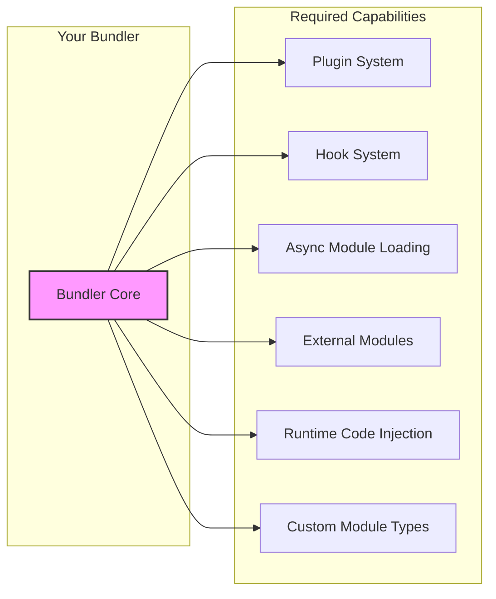
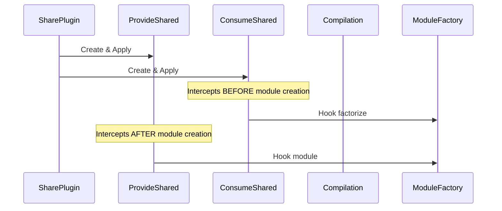
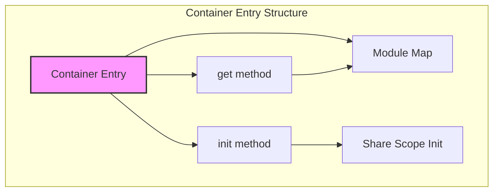
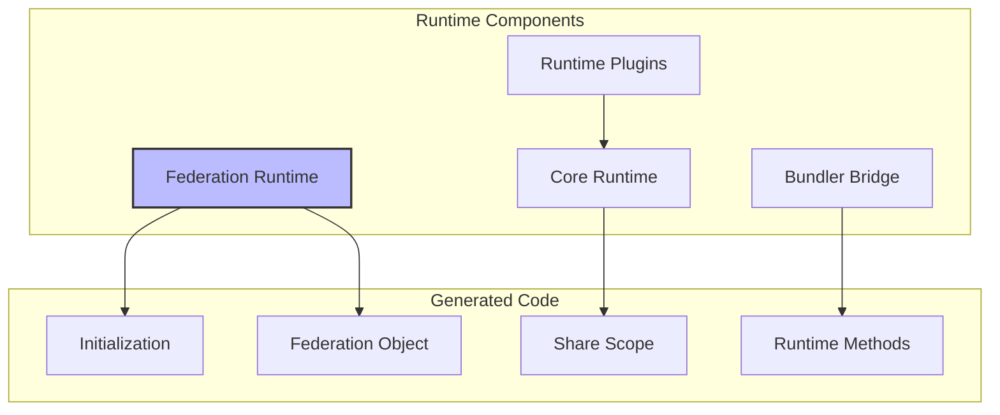
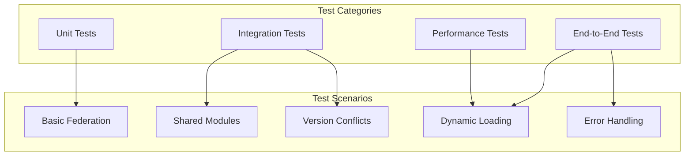
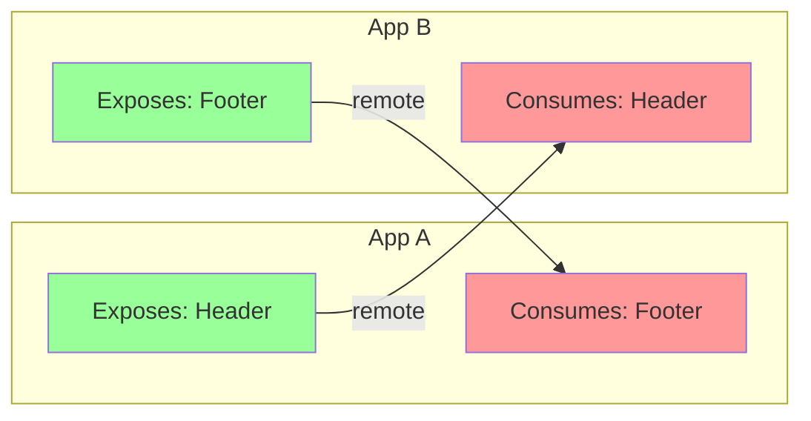
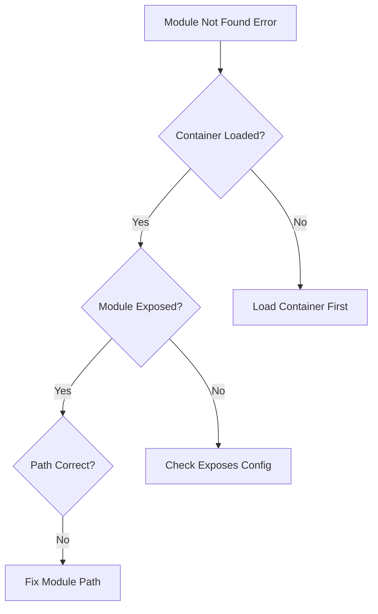

# Module Federation Implementation Guide

This guide provides step-by-step instructions for bundler teams to implement Module Federation in their build tools. It covers the essential components, integration points, and best practices.

## Table of Contents
- [Prerequisites](#prerequisites)
- [Implementation Steps](#implementation-steps)
- [Core Components Implementation](#core-components-implementation)
- [Runtime Integration](#runtime-integration)
- [Testing and Validation](#testing-and-validation)
- [Common Patterns](#common-patterns)
- [Troubleshooting](#troubleshooting)

## Prerequisites

Before implementing Module Federation, ensure your bundler supports:

### JSON Schema Validation

Module Federation uses JSON Schema validation instead of custom normalization functions. Set up validation using:

```typescript
// utils.ts - Schema Validation Setup
import { normalizeWebpackPath } from '@module-federation/sdk/normalize-webpack-path';

const memoize = require(
  normalizeWebpackPath('webpack/lib/util/memoize')
) as typeof import('webpack/lib/util/memoize');

const getValidate = memoize(() => require('schema-utils').validate);

export const createSchemaValidation = (
  check: ((value: any) => boolean) | undefined,
  getSchema: () => any,
  options: any,
) => {
  getSchema = memoize(getSchema);
  return (value) => {
    if (check && !check(value)) {
      getValidate()(getSchema(), value, options);
    }
  };
};
```

### Required Bundler Capabilities



### Minimum Requirements Checklist

- [ ] **Plugin System**: Ability to add plugins that modify compilation
- [ ] **Compilation Hooks**: Access to module resolution and creation
- [ ] **Module Factory**: Ability to create custom module types
- [ ] **Runtime Generation**: Ability to inject runtime code
- [ ] **Async Loading**: Support for dynamic imports
- [ ] **External References**: Support for external module references

## Implementation Steps

### Step 1: Create the Main Plugin

```typescript
// module-federation-plugin.ts
import { 
  moduleFederationPlugin
} from '@module-federation/sdk';
import { createSchemaValidation } from './utils';

// Create schema validation using actual webpack pattern
const validate = createSchemaValidation(
  require('./schemas/container/ModuleFederationPlugin.check.js').validate,
  () => require('./schemas/container/ModuleFederationPlugin').default,
  {
    name: 'Module Federation Plugin',
    baseDataPath: 'options',
  },
);

export class ModuleFederationPlugin {
  private options: moduleFederationPlugin.ModuleFederationPluginOptions;
  
  constructor(options: moduleFederationPlugin.ModuleFederationPluginOptions) {
    // Validate options using JSON schema validation
    validate(options);
    this.options = options;
  }
  
  apply(compiler: YourBundlerCompiler) {
    // Step 1: Apply RemoteEntryPlugin first (must be before ModuleFederationPlugin)
    new RemoteEntryPlugin(this.options).apply(compiler);
    
    // Step 2: Apply FederationModulesPlugin to set up hooks
    new FederationModulesPlugin().apply(compiler);
    
    // Step 3: Apply FederationRuntimePlugin
    new FederationRuntimePlugin(this.options).apply(compiler);
    
    // Step 4: Apply feature plugins based on configuration after other plugins
    compiler.hooks.afterPlugins.tap('ModuleFederation', () => {
      if (this.options.exposes) {
        new ContainerPlugin(this.options).apply(compiler);
      }
      
      if (this.options.remotes) {
        new ContainerReferencePlugin(this.options).apply(compiler);
      }
      
      if (this.options.shared) {
        new SharePlugin(this.options).apply(compiler);
      }
    });
  }
}
```

### Step 2: Implement Container Plugin

Container Plugin with patchChunkSplit functionality:

```typescript
// container-plugin.ts
export class ContainerPlugin {
  // Static method for patching chunk splitting
  static patchChunkSplit(compiler: YourBundlerCompiler, containerName: string) {
    // Patches webpack's chunk splitting to work with federation
    // This is called automatically when useContainerPlugin is true
  }
  
  apply(compiler: YourBundlerCompiler) {
    compiler.hooks.make.tapAsync('ContainerPlugin', async (compilation) => {
      // Create container entry dependency
      const dep = new ContainerEntryDependency(
        this.options.name,
        this.options.exposes,
        this.options.shareScope
      );
      
      // Use addInclude instead of addEntry for proper dependency handling
      compilation.addInclude(
        compiler.context,
        dep,
        { name: this.options.name },
        (err, module) => {
          if (err) throw err;
          // Handle successful container creation
        }
      );
    });
    
    // Register module factories with proper dependency registration
    compiler.hooks.compilation.tap('ContainerPlugin', (compilation) => {
      compilation.dependencyFactories.set(
        ContainerEntryDependency,
        compilation.normalModuleFactory
      );
      compilation.dependencyTemplates.set(
        ContainerEntryDependency,
        new ContainerEntryDependency.Template()
      );
    });
  }
}
```

### Step 3: Implement Share Plugin



```typescript
// share-plugin.ts
export class SharePlugin {
  apply(compiler: YourBundlerCompiler) {
    const providedModules = this.normalizeProvided(this.options.shared);
    const consumedModules = this.normalizeConsumed(this.options.shared);
    
    new ProvideSharedPlugin({
      provides: providedModules,
      shareScope: this.options.shareScope
    }).apply(compiler);
    
    new ConsumeSharedPlugin({
      consumes: consumedModules,
      shareScope: this.options.shareScope
    }).apply(compiler);
  }
}

// consume-shared-plugin.ts
export class ConsumeSharedPlugin {
  apply(compiler: YourBundlerCompiler) {
    compiler.hooks.compilation.tap('ConsumeSharedPlugin', 
      (compilation, { normalModuleFactory }) => {
        
        // CRITICAL: Hook BEFORE module creation
        normalModuleFactory.hooks.factorize.tapPromise(
          'ConsumeSharedPlugin', 
          async (resolveData) => {
            const request = resolveData.request;
            if (this.isSharedModule(request)) {
              // Return ConsumeSharedModule instead of normal module
              return new ConsumeSharedModule({
                shareKey: this.getShareKey(request),
                shareScope: this.options.shareScope,
                requiredVersion: this.getRequiredVersion(request),
                strictVersion: this.getStrictVersion(request),
                singleton: this.getSingleton(request),
                fallback: this.getFallback(request)
              });
            }
            return undefined; // Continue normal flow
          }
        );
      }
    );
  }
}
```

### Step 4: Implement Container Reference Plugin

```typescript
// container-reference-plugin.ts
export class ContainerReferencePlugin {
  apply(compiler: YourBundlerCompiler) {
    // Convert remotes to external references
    const externals = this.remoteToExternals(this.options.remotes);
    
    // Use your bundler's external plugin
    new YourExternalsPlugin({
      type: this.options.remoteType || 'script',
      externals
    }).apply(compiler);
    
    // Add remote loading runtime
    compiler.hooks.compilation.tap('ContainerReferencePlugin', 
      (compilation) => {
        compilation.hooks.runtimeRequirementInTree
          .for(RuntimeGlobals.loadScript)
          .tap('ContainerReferencePlugin', (chunk) => {
            compilation.addRuntimeModule(chunk, new RemoteLoadingRuntime());
          });
      }
    );
  }
  
  private remoteToExternals(remotes: Record<string, RemoteConfig>) {
    const externals: Record<string, External> = {};
    
    for (const [name, config] of Object.entries(remotes)) {
      externals[name] = {
        [config.externalType]: config.external
      };
    }
    
    return externals;
  }
}
```

## All Module Federation Plugins

Module Federation uses these plugins (7 total):

1. **RemoteEntryPlugin** - Creates remote entry points for containers
2. **FederationModulesPlugin** - Sets up compilation hooks for federation
3. **FederationRuntimePlugin** - Injects federation runtime code  
4. **ContainerPlugin** - Creates container entries for exposed modules
5. **ContainerReferencePlugin** - Handles remote container references
6. **SharePlugin** - Manages shared dependencies (uses ProvideSharedPlugin + ConsumeSharedPlugin)
7. **Additional Plugins**:
   - **EmbedFederationRuntimePlugin** - Embeds runtime in compilation
   - **HoistContainerReferencesPlugin** - Optimizes container references
   - **StartupChunkDependenciesPlugin** - Handles async startup dependencies

### Missing Plugin Implementations

```typescript
// remote-entry-plugin.ts
export class RemoteEntryPlugin {
  apply(compiler: YourBundlerCompiler) {
    // Creates remote entry points and manages container loading
    // Must be applied BEFORE ModuleFederationPlugin
  }
}

// embed-federation-runtime-plugin.ts  
export class EmbedFederationRuntimePlugin {
  apply(compiler: YourBundlerCompiler) {
    // Embeds federation runtime directly in the bundle
  }
}

// hoist-container-references-plugin.ts
export class HoistContainerReferencesPlugin {
  apply(compiler: YourBundlerCompiler) {
    // Optimizes container reference loading
  }
}

// startup-chunk-dependencies-plugin.ts
export class StartupChunkDependenciesPlugin {
  apply(compiler: YourBundlerCompiler) {
    // Handles async startup for containers
    // Used when experiments.asyncStartup is enabled
  }
}
```

## Core Components Implementation

### Container Entry Module



```typescript
// container-entry-module.ts
export class ContainerEntryModule extends Module {
  constructor(
    private name: string,
    private exposes: Record<string, ExposeConfig>,
    private shareScope: string
  ) {
    super('container-entry');
  }
  
  getSource() {
    const { RuntimeGlobals } = require(
      normalizeWebpackPath('webpack')
    ) as typeof import('webpack');
    
    return `
      var moduleMap = {
        ${Object.entries(this.exposes)
          .map(([key, config]) => `
            ${JSON.stringify(key)}: () => {
              return ${RuntimeGlobals.ensureChunk}(${JSON.stringify(config.chunkName)})
                .then(() => () => ${RuntimeGlobals.require}(${JSON.stringify(config.import)}));
            }
          `)
          .join(',\n')}
      };
      
      var get = (module, getScope) => {
        ${RuntimeGlobals.currentRemoteGetScope} = getScope;
        getScope = Object.prototype.hasOwnProperty.call(moduleMap, module)
          ? moduleMap[module]()
          : Promise.resolve().then(() => {
              throw new ContainerModuleNotFoundError(module);
            });
        ${RuntimeGlobals.currentRemoteGetScope} = undefined;
        return getScope;
      };
      
      var init = (shareScope, initScope) => {
        if (!${RuntimeGlobals.shareScopeMap}) return;
        var name = ${JSON.stringify(this.shareScope)};
        var oldScope = ${RuntimeGlobals.shareScopeMap}[name];
        if (oldScope && oldScope !== shareScope) 
          throw new ContainerInitializationError('Container initialization failed');
        ${RuntimeGlobals.shareScopeMap}[name] = shareScope;
        return ${RuntimeGlobals.initializeSharing}(name, initScope);
      };
      
      // Export container interface
      ${RuntimeGlobals.definePropertyGetters}(exports, {
        get: () => get,
        init: () => init
      });
    `;
  }
}
```

### Consume Shared Module

```typescript
// consume-shared-module.ts
const { ModuleDependency } = require(
  normalizeWebpackPath('webpack/lib/dependencies/ModuleDependency')
) as typeof import('webpack/lib/dependencies/ModuleDependency');

const { WebpackError } = require(
  normalizeWebpackPath('webpack')
) as typeof import('webpack');

export class ConsumeSharedModule extends Module {
  constructor(private options: ConsumeSharedOptions) {
    super('consume-shared', null);
    this.options = options;
  }
  
  identifier() {
    return `consume-shared|${this.options.shareKey}|${this.options.shareScope}`;
  }
  
  readableIdentifier() {
    return `consume shared module (${this.options.shareKey})`;
  }
  
  build(options, compilation, resolver, fs, callback) {
    this.buildMeta = {};
    this.buildInfo = {
      cacheable: true,
      strict: true,
      exportsType: 'dynamic'
    };
    callback();
  }
  
  codeGeneration({ runtimeTemplate, chunkGraph, moduleGraph }) {
    const sources = new Map();
    const runtimeRequirements = new Set();
    
    runtimeRequirements.add('__webpack_require__');
    runtimeRequirements.add('__webpack_require__.federation');
    
    const source = `
      module.exports = __webpack_require__.federation.bundlerRuntime.consumes({
        shareKey: ${JSON.stringify(this.options.shareKey)},
        shareScope: ${JSON.stringify(this.options.shareScope)},
        requiredVersion: ${JSON.stringify(this.options.requiredVersion)},
        singleton: ${this.options.singleton},
        strictVersion: ${this.options.strictVersion},
        fallback: ${this.options.fallback ? 
          `() => __webpack_require__(${JSON.stringify(this.options.fallback)})` : 
          'undefined'
        }
      });
    `;
    
    sources.set('javascript', new RawSource(source));
    
    return { sources, runtimeRequirements };
  }
}
```

### Provide Shared Module

```typescript
// provide-shared-module.ts
export class ProvideSharedModule extends Module {
  constructor(
    private request: string,
    private options: ProvideSharedOptions,
    private resolvedModule: string
  ) {
    super('provide-shared');
  }
  
  getSource() {
    return `
      const { RuntimeGlobals } = require(
        normalizeWebpackPath('webpack')
      ) as typeof import('webpack');
      
      var versionCheckCallback = (version, requiredVersion) => {
        return ${RuntimeGlobals.require}.federation.bundlerRuntime.satisfies(
          version, 
          requiredVersion
        );
      };
      
      var getModule = ${this.options.eager ? 
        `() => ${RuntimeGlobals.require}(${JSON.stringify(this.resolvedModule)})` :
        `() => ${RuntimeGlobals.ensureChunk}(${JSON.stringify(this.options.chunkName)})
          .then(() => () => ${RuntimeGlobals.require}(${JSON.stringify(this.resolvedModule)}))`
      };
      
      var moduleToShare = {
        get: getModule,
        version: ${JSON.stringify(this.options.version)},
        scope: [${JSON.stringify(this.options.shareScope)}],
        shareConfig: {
          eager: ${this.options.eager},
          requiredVersion: ${JSON.stringify(this.options.requiredVersion)},
          strictVersion: ${this.options.strictVersion},
          singleton: ${this.options.singleton},
          version: ${JSON.stringify(this.options.version)}
        }
      };
      
      ${RuntimeGlobals.shareScopeMap}[${JSON.stringify(this.options.shareScope)}][${JSON.stringify(this.options.shareKey)}] = moduleToShare;
    `;
  }
}
```

## Runtime Integration

### Federation Runtime Module



```typescript
// federation-runtime-plugin.ts  
export class FederationRuntimePlugin {
  private entryFilePath: string = '';
  
  apply(compiler: YourBundlerCompiler) {
    // Set up runtime entry - can be virtual or file-based
    this.entryFilePath = this.getFilePath(compiler);
    
    // Support both virtual and file-based runtime entries
    if (!this.options?.virtualRuntimeEntry) {
      this.ensureFile(compiler);
    }
    
    // Register runtime dependency
    this.prependEntry(compiler);
    
    // Inject runtime module
    this.injectRuntime(compiler);
  }
  
  getFilePath(compiler: YourBundlerCompiler): string {
    if (this.options?.virtualRuntimeEntry) {
      // Use base64 encoded virtual entry
      return `data:text/javascript;charset=utf-8;base64,${btoa(
        this.getTemplate(compiler, this.options)
      )}`;
    } else {
      // Create physical file in temp directory
      const hash = createHash(this.getTemplate(compiler, this.options));
      return path.join(TEMP_DIR, `entry.${hash}.js`);
    }
  }
  
  prependEntry(compiler: YourBundlerCompiler) {
    compiler.hooks.thisCompilation.tap(
      'FederationRuntimePlugin',
      (compilation) => {
        // Register federation runtime dependency factory
        compilation.dependencyFactories.set(
          FederationRuntimeDependency,
          compilation.normalModuleFactory
        );
        
        compilation.dependencyTemplates.set(
          FederationRuntimeDependency,
          new ModuleDependency.Template()
        );
      }
    );
    
    compiler.hooks.make.tapAsync(
      'FederationRuntimePlugin',
      (compilation, callback) => {
        const dependency = new FederationRuntimeDependency(this.entryFilePath);
        
        // Use addInclude for proper dependency handling
        compilation.addInclude(
          compiler.context,
          dependency,
          { name: undefined },
          (err, module) => {
            if (err) return callback(err);
            callback();
          }
        );
      }
    );
  }
}

// federation-runtime-module.ts
const { RuntimeModule, RuntimeGlobals, Template } = require(
  normalizeWebpackPath('webpack')
) as typeof import('webpack');

export class FederationRuntimeModule extends RuntimeModule {
  constructor(
    runtimeRequirements: ReadonlySet<string>,
    containerName: string,
    initOptions: any
  ) {
    super('federation runtime', RuntimeModule.STAGE_NORMAL - 1);
    this.runtimeRequirements = runtimeRequirements;
    this.containerName = containerName;
    this.initOptions = initOptions;
  }
  
  generate() {
    const federationGlobal = getFederationGlobalScope(RuntimeGlobals);
    
    return Template.asString([
      `// Federation Runtime Module`,
      `var ${federationGlobal} = ${federationGlobal} || {};`,
      `${federationGlobal}.runtime = __bundler_require__("${RUNTIME_PATH}");`,
      `${federationGlobal}.initOptions = ${JSON.stringify(this.initOptions)};`,
      
      // Initialize federation runtime
      `if (!${federationGlobal}.instance) {`,
      Template.indent([
        `${federationGlobal}.instance = ${federationGlobal}.runtime.init(${federationGlobal}.initOptions);`
      ]),
      `}`,
      
      // Attach to webpack require
      `__bundler_require__.federation = ${federationGlobal};`,
      
      // Add share scope attachment
      `if (${federationGlobal}.attachShareScopeMap) {`,
      Template.indent([
        `${federationGlobal}.attachShareScopeMap(__bundler_require__);`
      ]),
      `}`,
    ]);
  }
}
```

### Bundler Runtime Bridge Implementation

```typescript
// bundler-runtime.ts - Based on actual webpack-bundler-runtime structure
const federation = {
  runtime, // Core runtime from @module-federation/runtime
  instance: undefined,
  initOptions: undefined,
  bundlerRuntime: {
    remotes,        // Remote loading utilities
    consumes,       // Shared consumption utilities  
    I: initializeSharing,  // Share scope initialization
    S: {},          // Share scopes object
    installInitialConsumes, // Install initial shared modules
    initContainerEntry,     // Container entry initialization
  },
  attachShareScopeMap,      // Attach share scope to webpack require
  bundlerRuntimeOptions: {},
};

// Individual bundler runtime functions
const remotes = async (options) => {
  // Implementation for loading remote modules
  // Handles container loading, initialization, and module retrieval
};

const consumes = async (options) => {
  // Implementation for consuming shared modules
  // Handles share scope lookup, version resolution, fallbacks
};

const initializeSharing = async (scopeName = 'default') => {
  // Implementation for share scope initialization
};

const installInitialConsumes = () => {
  // Install eager shared modules at startup
};

const initContainerEntry = (shareScope, initScope) => {
  // Initialize container entry points
};

const attachShareScopeMap = (webpackRequire) => {
  // Attach share scopes to webpack's require function
  webpackRequire.S = federation.bundlerRuntime.S;
  webpackRequire.I = federation.bundlerRuntime.I;
};

export default federation;
```

## Testing and Validation

### Test Suite Structure



### Basic Federation Test

```typescript
// __tests__/basic-federation.test.ts
describe('Basic Module Federation', () => {
  it('should expose modules correctly', async () => {
    const config = {
      name: 'testApp',
      filename: 'remoteEntry.js',
      exposes: {
        './Button': './src/Button.js'
      }
    };
    
    const result = await build(config);
    
    // Check container entry exists
    expect(result.assets).toContain('remoteEntry.js');
    
    // Check container has correct interface
    const container = await loadContainer(result.path, 'testApp');
    expect(container).toHaveProperty('init');
    expect(container).toHaveProperty('get');
    
    // Check exposed module can be loaded
    await container.init({});
    const moduleFactory = await container.get('./Button');
    const module = moduleFactory();
    expect(module).toBeDefined();
  });
  
  it('should consume remote modules', async () => {
    const hostConfig = {
      name: 'host',
      remotes: {
        remote: 'remote@http://localhost:3001/remoteEntry.js'
      }
    };
    
    // Mock remote loading
    mockRemote('remote', {
      './Button': () => ({ default: 'Button Component' })
    });
    
    const result = await build(hostConfig);
    const app = await runApp(result);
    
    // Test remote loading
    const Button = await app.import('remote/Button');
    expect(Button.default).toBe('Button Component');
  });
});
```

### Shared Module Test

```typescript
describe('Shared Modules', () => {
  it('should share singleton modules', async () => {
    const configs = [
      {
        name: 'app1',
        shared: {
          react: { singleton: true, version: '18.0.0' }
        }
      },
      {
        name: 'app2',
        shared: {
          react: { singleton: true, version: '18.0.0' }
        }
      }
    ];
    
    const [app1, app2] = await Promise.all(configs.map(build));
    
    // Load both apps
    const runtime1 = await loadApp(app1);
    const runtime2 = await loadApp(app2);
    
    // Get React from both
    const react1 = await runtime1.loadShared('react');
    const react2 = await runtime2.loadShared('react');
    
    // Should be the same instance
    expect(react1).toBe(react2);
  });
  
  it('should handle version conflicts', async () => {
    const shareScope = createShareScope();
    
    // Register different versions
    shareScope.register('react', '17.0.0', getReact17);
    shareScope.register('react', '18.0.0', getReact18);
    
    // Request compatible version
    const react17 = await shareScope.get('react', '^17.0.0');
    expect(react17.version).toBe('17.0.0');
    
    const react18 = await shareScope.get('react', '^18.0.0');
    expect(react18.version).toBe('18.0.0');
    
    // Request incompatible version
    await expect(
      shareScope.get('react', '^16.0.0')
    ).rejects.toThrow('No compatible version');
  });
});
```

### Validation Checklist

- [ ] **Container Entry**: Verify `get` and `init` methods work correctly
- [ ] **Remote Loading**: Test dynamic remote loading
- [ ] **Share Scope**: Validate version negotiation
- [ ] **Error Handling**: Test missing modules, version conflicts
- [ ] **Performance**: Measure loading times, bundle sizes
- [ ] **Hot Reload**: Ensure HMR works with federation

## Common Patterns

### Pattern 1: Bidirectional Hosts



```typescript
// App A config
{
  name: 'appA',
  exposes: {
    './Header': './src/Header'
  },
  remotes: {
    appB: 'appB@http://localhost:3002/remoteEntry.js'
  }
}

// App B config
{
  name: 'appB',
  exposes: {
    './Footer': './src/Footer'
  },
  remotes: {
    appA: 'appA@http://localhost:3001/remoteEntry.js'
  }
}
```

### Pattern 2: Shared Libraries

```typescript
// Shared library configuration
{
  name: 'sharedLib',
  exposes: {
    './utils': './src/utils',
    './components': './src/components',
    './hooks': './src/hooks'
  },
  shared: {
    react: { singleton: true },
    'react-dom': { singleton: true }
  }
}

// Consumer configuration
{
  name: 'consumer',
  remotes: {
    lib: 'sharedLib@http://cdn.example.com/remoteEntry.js'
  },
  shared: {
    react: { singleton: true },
    'react-dom': { singleton: true }
  }
}
```

### Pattern 3: Dynamic Remote Loading

```typescript
// Dynamic remote loading utility
async function loadRemoteComponent(
  remoteName: string,
  remoteUrl: string,
  modulePath: string
) {
  // Register remote dynamically
  await __bundler_require__.federation.registerRemote({
    name: remoteName,
    entry: remoteUrl
  });
  
  // Load component
  const module = await __bundler_require__.federation.loadRemote(
    `${remoteName}/${modulePath}`
  );
  
  return module;
}

// Usage
const Button = await loadRemoteComponent(
  'dynamicRemote',
  'https://cdn.example.com/remoteEntry.js',
  './Button'
);
```

## Troubleshooting

### Common Issues and Solutions

#### Issue 1: Module Not Found



**Solution:**
```typescript
// Debug helper
function debugModuleFederation() {
  console.log('Available containers:', Object.keys(window));
  console.log('Share scopes:', __bundler_require__.S);
  
  // Check specific container
  const container = window['myApp'];
  if (container) {
    console.log('Container methods:', Object.keys(container));
  }
}
```

#### Issue 2: Version Conflicts

**Symptoms:**
- Singleton violation errors
- Incompatible version errors
- Multiple React instances

**Solution:**
```typescript
// Version debugging
function debugVersions() {
  const shareScope = __bundler_require__.S.default;
  
  Object.entries(shareScope).forEach(([pkg, versions]) => {
    console.log(`Package: ${pkg}`);
    Object.entries(versions).forEach(([version, info]) => {
      console.log(`  Version: ${version}, Loaded: ${info.loaded}`);
    });
  });
}

// Strict singleton configuration
{
  shared: {
    react: {
      singleton: true,
      strictVersion: true,
      requiredVersion: '18.0.0'
    }
  }
}
```

#### Issue 3: Runtime Errors

**Debug Steps:**
1. Check console for federation errors
2. Verify runtime is loaded
3. Check network tab for failed requests
4. Validate configuration

```typescript
// Runtime error handler with webpack error classes
const { WebpackError } = require(
  normalizeWebpackPath('webpack')
) as typeof import('webpack');

class FederationRuntimeError extends WebpackError {
  constructor(message: string, details?: any) {
    super(message);
    this.name = 'FederationRuntimeError';
    this.details = details;
  }
}

class SharedModuleNotFoundError extends WebpackError {
  constructor(shareKey: string, shareScope: string) {
    super(`Shared module '${shareKey}' not found in scope '${shareScope}'`);
    this.name = 'SharedModuleNotFoundError';
  }
}

class ContainerNotFoundError extends WebpackError {
  constructor(containerName: string) {
    super(`Container '${containerName}' not found or not initialized`);
    this.name = 'ContainerNotFoundError';
  }
}

// Runtime error handler
window.addEventListener('error', (event) => {
  if (event.error?.message?.includes('federation')) {
    console.error('Federation Error:', {
      message: event.error.message,
      stack: event.error.stack,
      federationState: {
        containers: Object.keys(window).filter(k => 
          window[k]?.get && window[k]?.init
        ),
        shareScopes: Object.keys(__webpack_require__.S || {})
      }
    });
  }
});
```

### Performance Optimization Tips

1. **Preload Critical Remotes**
```typescript
// Preload remote entries
const preloadRemotes = ['app1', 'app2'].map(name => 
  fetch(`http://localhost:${3000 + i}/remoteEntry.js`)
);
await Promise.all(preloadRemotes);
```

2. **Use Module Federation Manifest**
```typescript
// Load with manifest for better caching
const manifest = await fetch('/mf-manifest.json').then(r => r.json());
const remoteUrl = manifest.remotes[remoteName].entry;
```

3. **Implement Retry Logic**
```typescript
async function loadWithRetry(loader, retries = 3) {
  for (let i = 0; i < retries; i++) {
    try {
      return await loader();
    } catch (error) {
      if (i === retries - 1) throw error;
      await new Promise(r => setTimeout(r, 1000 * (i + 1)));
    }
  }
}
```

## Bundler-Specific Integration Examples

This section provides concrete implementation examples for integrating Module Federation with different bundlers. Each example shows the specific patterns and considerations for that bundler's architecture.

### Vite Integration

Vite's plugin architecture is built around Rollup plugins with additional hooks for development server integration.

#### Plugin Architecture Integration

```typescript
// vite-module-federation-plugin.ts
import type { Plugin, ResolvedConfig } from 'vite';
import { ModuleFederationPlugin } from './base-plugin';

export function viteFederationPlugin(
  options: ModuleFederationPluginOptions
): Plugin {
  let config: ResolvedConfig;
  const federationPlugin = new ModuleFederationPlugin(options);
  
  return {
    name: 'vite-module-federation',
    enforce: 'pre', // Run before other plugins
    
    configResolved(resolvedConfig) {
      config = resolvedConfig;
    },
    
    buildStart(opts) {
      // Initialize federation during build start
      return federationPlugin.buildStart.call(this, opts);
    },
    
    resolveId(id, importer) {
      // Handle federation module resolution
      if (federationPlugin.shouldInterceptResolve(id)) {
        return federationPlugin.resolveId(id, importer);
      }
      return null;
    },
    
    load(id) {
      // Load federation modules
      if (federationPlugin.isFederationModule(id)) {
        return federationPlugin.load(id);
      }
      return null;
    },
    
    generateBundle(opts, bundle) {
      // Generate federation assets
      return federationPlugin.generateBundle(opts, bundle);
    },
    
    // Vite-specific: Handle HMR for federation modules
    handleHotUpdate(ctx) {
      if (federationPlugin.shouldHandleHMR(ctx.file)) {
        return federationPlugin.handleHotUpdate(ctx);
      }
    },
    
    // Vite-specific: Configure development server
    configureServer(server) {
      // Add middleware for serving remote entries
      server.middlewares.use('/remoteEntry.js', (req, res, next) => {
        if (req.method === 'GET') {
          const remoteEntry = federationPlugin.generateRemoteEntry();
          res.setHeader('Content-Type', 'application/javascript');
          res.end(remoteEntry);
        } else {
          next();
        }
      });
      
      // Handle federation module requests
      server.middlewares.use('/__federation', (req, res, next) => {
        const modulePath = req.url?.slice(13); // Remove /__federation
        if (modulePath) {
          const moduleContent = federationPlugin.getExposedModule(modulePath);
          if (moduleContent) {
            res.setHeader('Content-Type', 'application/javascript');
            res.end(moduleContent);
            return;
          }
        }
        next();
      });
    }
  };
}
```

#### Module Resolution Integration

```typescript
// vite-federation-resolver.ts
export class ViteFederationResolver {
  constructor(private options: ModuleFederationPluginOptions) {}
  
  resolveId(id: string, importer?: string) {
    // Handle remote module resolution
    if (this.isRemoteModule(id)) {
      return this.resolveRemoteModule(id);
    }
    
    // Handle shared module resolution
    if (this.isSharedModule(id)) {
      return this.resolveSharedModule(id);
    }
    
    return null;
  }
  
  private isRemoteModule(id: string): boolean {
    const remotes = this.options.remotes || {};
    return Object.keys(remotes).some(remote => 
      id.startsWith(`${remote}/`)
    );
  }
  
  private resolveRemoteModule(id: string) {
    const [remoteName, modulePath] = id.split('/');
    const remoteConfig = this.options.remotes?.[remoteName];
    
    if (!remoteConfig) {
      throw new Error(`Remote "${remoteName}" not found in configuration`);
    }
    
    // Return virtual module ID for remote
    return {
      id: `virtual:federation-remote:${id}`,
      external: false
    };
  }
  
  private resolveSharedModule(id: string) {
    const sharedConfig = this.options.shared?.[id];
    
    if (!sharedConfig) {
      return null;
    }
    
    // Return virtual module ID for shared
    return {
      id: `virtual:federation-shared:${id}`,
      external: false
    };
  }
}
```

#### Asset Handling Specifics

```typescript
// vite-federation-assets.ts
export class ViteFederationAssets {
  constructor(private config: ResolvedConfig) {}
  
  generateRemoteEntry(): string {
    const { base, build } = this.config;
    
    return `
      // Vite-specific remote entry
      const moduleMap = {
        ${Object.entries(this.options.exposes || {})
          .map(([key, path]) => {
            const chunkName = this.getChunkName(path);
            const assetPath = `${base}${build.assetsDir}/${chunkName}`;
            
            return `"${key}": () => import("${assetPath}")`;
          })
          .join(',\n        ')}
      };
      
      const get = (module) => {
        return moduleMap[module] ? moduleMap[module]() : 
          Promise.reject(new Error(\`Module "\${module}" not found\`));
      };
      
      const init = (shareScope) => {
        // Vite-specific share scope initialization
        if (!window.__VITE_FEDERATION_SHARE_SCOPE__) {
          window.__VITE_FEDERATION_SHARE_SCOPE__ = {};
        }
        Object.assign(window.__VITE_FEDERATION_SHARE_SCOPE__, shareScope);
        return Promise.resolve();
      };
      
      export { get, init };
    `;
  }
  
  handleAssetGeneration(bundle: OutputBundle) {
    // Process each exposed module
    Object.entries(this.options.exposes || {}).forEach(([key, path]) => {
      const chunk = this.findChunkForModule(bundle, path);
      if (chunk && chunk.type === 'chunk') {
        // Add federation metadata to chunk
        chunk.viteMetadata = {
          ...chunk.viteMetadata,
          federation: {
            exposed: true,
            key,
            path
          }
        };
      }
    });
  }
}
```

#### Development Server Integration

```typescript
// vite-federation-dev-server.ts
export class ViteFederationDevServer {
  constructor(
    private server: ViteDevServer,
    private options: ModuleFederationPluginOptions
  ) {}
  
  setupMiddleware() {
    // Serve remote entry during development
    this.server.middlewares.use('/remoteEntry.js', async (req, res) => {
      const remoteEntry = await this.generateDevRemoteEntry();
      res.setHeader('Content-Type', 'application/javascript');
      res.setHeader('Cache-Control', 'no-cache');
      res.end(remoteEntry);
    });
    
    // Handle exposed module requests
    this.server.middlewares.use('/__vite_federation', async (req, res) => {
      const modulePath = req.url?.slice(18); // Remove /__vite_federation
      if (modulePath && this.isExposedModule(modulePath)) {
        const moduleContent = await this.generateExposedModule(modulePath);
        res.setHeader('Content-Type', 'application/javascript');
        res.end(moduleContent);
      } else {
        res.statusCode = 404;
        res.end('Module not found');
      }
    });
  }
  
  private async generateDevRemoteEntry(): Promise<string> {
    const exposedModules = Object.entries(this.options.exposes || {});
    
    return `
      // Development remote entry for Vite
      const moduleMap = {
        ${exposedModules.map(([key, path]) => `
          "${key}": () => import("/__vite_federation${path}")
        `).join(',\n        ')}
      };
      
      const get = async (module) => {
        const factory = moduleMap[module];
        if (!factory) {
          throw new Error(\`Module "\${module}" not exposed\`);
        }
        return factory();
      };
      
      const init = (shareScope) => {
        if (!window.__VITE_DEV_FEDERATION__) {
          window.__VITE_DEV_FEDERATION__ = { shareScope: {} };
        }
        Object.assign(window.__VITE_DEV_FEDERATION__.shareScope, shareScope);
        return Promise.resolve();
      };
      
      window["${this.options.name}"] = { get, init };
    `;
  }
}
```

### Rollup Integration

Rollup's plugin system is more straightforward, focusing on the build process with hooks for different compilation phases.

#### Plugin Architecture Integration

```typescript
// rollup-module-federation-plugin.ts
import type { Plugin, OutputBundle, RenderedChunk } from 'rollup';

export function rollupFederationPlugin(
  options: ModuleFederationPluginOptions
): Plugin {
  const federationModules = new Map<string, string>();
  const remoteModules = new Set<string>();
  
  return {
    name: 'rollup-module-federation',
    
    buildStart(opts) {
      // Validate options and initialize federation state
      this.validateOptions(options);
      this.initializeFederationState();
    },
    
    resolveId(id, importer) {
      // Handle federation module resolution
      if (this.isRemoteModule(id)) {
        const remoteId = `federation-remote:${id}`;
        remoteModules.add(id);
        return remoteId;
      }
      
      if (this.isSharedModule(id)) {
        const sharedId = `federation-shared:${id}`;
        return sharedId;
      }
      
      return null;
    },
    
    load(id) {
      // Generate virtual modules for federation
      if (id.startsWith('federation-remote:')) {
        const originalId = id.slice(18); // Remove prefix
        return this.generateRemoteModule(originalId);
      }
      
      if (id.startsWith('federation-shared:')) {
        const originalId = id.slice(18); // Remove prefix
        return this.generateSharedModule(originalId);
      }
      
      return null;
    },
    
    generateBundle(opts, bundle) {
      // Generate remote entry if this is a container
      if (options.exposes) {
        this.generateRemoteEntryChunk(bundle);
      }
      
      // Add federation runtime
      this.addFederationRuntime(bundle);
      
      // Process exposed modules
      this.processExposedModules(bundle);
    },
    
    writeBundle(opts, bundle) {
      // Post-process federation assets
      this.postProcessFederationAssets(opts, bundle);
    }
  };
}
```

#### Module Resolution Integration

```typescript
// rollup-federation-resolver.ts
export class RollupFederationResolver {
  constructor(private options: ModuleFederationPluginOptions) {}
  
  generateRemoteModule(remoteId: string): string {
    const [remoteName, modulePath] = remoteId.split('/');
    const remoteConfig = this.options.remotes?.[remoteName];
    
    if (!remoteConfig) {
      throw new Error(`Remote "${remoteName}" not configured`);
    }
    
    return `
      // Rollup remote module: ${remoteId}
      const loadRemote = async () => {
        // Load remote container
        if (!window["${remoteName}"]) {
          await this.loadRemoteContainer("${remoteName}", "${remoteConfig.url}");
        }
        
        const container = window["${remoteName}"];
        if (!container) {
          throw new Error('Remote container failed to load');
        }
        
        // Initialize if needed
        if (!container._initialized) {
          await container.init(window.__FEDERATION_SHARED__ || {});
          container._initialized = true;
        }
        
        // Get module
        const factory = await container.get("${modulePath}");
        return factory();
      };
      
      export default loadRemote;
      export const __federation_remote = true;
    `;
  }
  
  generateSharedModule(moduleId: string): string {
    const sharedConfig = this.options.shared?.[moduleId];
    
    if (!sharedConfig) {
      throw new Error(`Shared module "${moduleId}" not configured`);
    }
    
    return `
      // Rollup shared module: ${moduleId}
      const getSharedModule = () => {
        const shareScope = window.__FEDERATION_SHARED__ || {};
        const shared = shareScope["${moduleId}"];
        
        if (shared) {
          return shared.get();
        }
        
        // Fallback to local version
        ${sharedConfig.import ? 
          `return import("${sharedConfig.import}");` :
          `throw new Error('Shared module "${moduleId}" not available');`
        }
      };
      
      export default getSharedModule;
      export const __federation_shared = true;
    `;
  }
}
```

#### Asset Handling Specifics

```typescript
// rollup-federation-assets.ts
export class RollupFederationAssets {
  generateRemoteEntryChunk(bundle: OutputBundle) {
    const exposedModules = this.options.exposes || {};
    const remoteEntryCode = this.generateRemoteEntryCode(exposedModules, bundle);
    
    // Add remote entry chunk to bundle
    bundle['remoteEntry.js'] = {
      type: 'chunk',
      isEntry: true,
      name: 'remoteEntry',
      fileName: 'remoteEntry.js',
      code: remoteEntryCode,
      map: null,
      sourcemapFileName: null,
      preliminaryFileName: 'remoteEntry.js',
      facadeModuleId: null,
      isDynamicEntry: false,
      isImplicitEntry: false,
      implicitlyLoadedBefore: [],
      importedBindings: {},
      imports: [],
      exports: ['get', 'init'],
      modules: {},
      referencedFiles: []
    };
  }
  
  private generateRemoteEntryCode(
    exposedModules: Record<string, string>,
    bundle: OutputBundle
  ): string {
    const moduleEntries = Object.entries(exposedModules).map(([key, path]) => {
      const chunk = this.findChunkForModule(bundle, path);
      const chunkFileName = chunk?.fileName || `${key}.js`;
      
      return `
        "${key}": () => import("./${chunkFileName}")
          .then(module => () => module)
      `;
    });
    
    return `
      // Rollup Remote Entry
      const moduleMap = {
        ${moduleEntries.join(',\n        ')}
      };
      
      const get = async (module) => {
        const factory = moduleMap[module];
        if (!factory) {
          throw new Error(\`Module "\${module}" not exposed\`);
        }
        return factory();
      };
      
      const init = (shareScope) => {
        if (!window.__FEDERATION_SHARED__) {
          window.__FEDERATION_SHARED__ = {};
        }
        Object.assign(window.__FEDERATION_SHARED__, shareScope);
        return Promise.resolve();
      };
      
      export { get, init };
    `;
  }
  
  processExposedModules(bundle: OutputBundle) {
    // Mark exposed modules in bundle metadata
    Object.entries(this.options.exposes || {}).forEach(([key, path]) => {
      const chunk = this.findChunkForModule(bundle, path);
      if (chunk && chunk.type === 'chunk') {
        // Add federation metadata
        (chunk as any).federationMeta = {
          exposed: true,
          key,
          originalPath: path
        };
      }
    });
  }
}
```

#### Build Output Requirements

```typescript
// rollup-federation-output.ts
export class RollupFederationOutput {
  constructor(private options: ModuleFederationPluginOptions) {}
  
  configureOutput(outputOptions: OutputOptions): OutputOptions {
    return {
      ...outputOptions,
      
      // Ensure proper format for federation
      format: 'system', // or 'amd', 'umd' for broader compatibility
      
      // Configure external handling
      external: (id) => {
        if (this.isRemoteModule(id)) {
          return true; // Mark remotes as external
        }
        return false;
      },
      
      // Configure globals for externals
      globals: (id) => {
        if (this.isRemoteModule(id)) {
          const [remoteName] = id.split('/');
          return `window["${remoteName}"]`;
        }
        return id;
      },
      
      // Ensure proper chunk naming
      chunkFileNames: (chunkInfo) => {
        // Use federation-friendly names
        if (chunkInfo.name && this.isExposedModule(chunkInfo.name)) {
          return `federation-[name]-[hash].js`;
        }
        return '[name]-[hash].js';
      },
      
      // Configure entry point naming
      entryFileNames: (chunkInfo) => {
        if (chunkInfo.name === 'remoteEntry') {
          return 'remoteEntry.js';
        }
        return '[name].js';
      }
    };
  }
  
  generateManifest(bundle: OutputBundle): FederationManifest {
    const manifest: FederationManifest = {
      name: this.options.name || 'unknown',
      remoteEntry: 'remoteEntry.js',
      shared: {},
      exposes: {},
      remotes: this.options.remotes || {}
    };
    
    // Add exposed modules to manifest
    Object.entries(this.options.exposes || {}).forEach(([key, path]) => {
      const chunk = this.findChunkForModule(bundle, path);
      if (chunk) {
        manifest.exposes[key] = {
          file: chunk.fileName,
          requires: chunk.imports || []
        };
      }
    });
    
    // Add shared modules to manifest
    Object.entries(this.options.shared || {}).forEach(([key, config]) => {
      manifest.shared[key] = {
        version: config.version || '0.0.0',
        singleton: config.singleton || false,
        eager: config.eager || false
      };
    });
    
    return manifest;
  }
}
```

### esbuild Integration

esbuild's plugin system is more limited but highly performant, requiring creative solutions for complex transformations.

#### Plugin Architecture Integration

```typescript
// esbuild-module-federation-plugin.ts
import type { Plugin, BuildOptions } from 'esbuild';

export function esbuildFederationPlugin(
  options: ModuleFederationPluginOptions
): Plugin {
  return {
    name: 'esbuild-module-federation',
    setup(build) {
      const { onResolve, onLoad, initialOptions } = build;
      
      // Configure external handling for remotes
      this.configureExternals(build, options);
      
      // Handle remote module resolution
      onResolve({ filter: /^[^\/]+\/.*/ }, (args) => {
        if (this.isRemoteModule(args.path, options)) {
          return {
            path: args.path,
            namespace: 'federation-remote'
          };
        }
        return undefined;
      });
      
      // Handle shared module resolution
      onResolve({ filter: /.*/ }, (args) => {
        if (this.isSharedModule(args.path, options)) {
          return {
            path: args.path,
            namespace: 'federation-shared'
          };
        }
        return undefined;
      });
      
      // Load remote modules
      onLoad({ filter: /.*/, namespace: 'federation-remote' }, (args) => {
        return {
          contents: this.generateRemoteModule(args.path, options),
          loader: 'js'
        };
      });
      
      // Load shared modules
      onLoad({ filter: /.*/, namespace: 'federation-shared' }, (args) => {
        return {
          contents: this.generateSharedModule(args.path, options),
          loader: 'js'
        };
      });
      
      // Generate remote entry
      if (options.exposes) {
        this.setupRemoteEntryGeneration(build, options);
      }
    }
  };
}
```

#### Module Resolution Integration

```typescript
// esbuild-federation-resolver.ts
export class EsbuildFederationResolver {
  constructor(private options: ModuleFederationPluginOptions) {}
  
  generateRemoteModule(remotePath: string): string {
    const [remoteName, modulePath] = remotePath.split('/');
    const remoteConfig = this.options.remotes?.[remoteName];
    
    if (!remoteConfig) {
      throw new Error(`Remote "${remoteName}" not configured`);
    }
    
    return `
      // esbuild remote module: ${remotePath}
      const loadRemoteModule = async () => {
        // Dynamic import for remote container
        const containerUrl = "${remoteConfig.url || remoteConfig}";
        
        // Load remote container script
        if (!window["${remoteName}"]) {
          await new Promise((resolve, reject) => {
            const script = document.createElement('script');
            script.src = containerUrl;
            script.onload = resolve;
            script.onerror = reject;
            document.head.appendChild(script);
          });
        }
        
        const container = window["${remoteName}"];
        if (!container) {
          throw new Error(\`Remote container "\${remoteName}" failed to load\`);
        }
        
        // Initialize container
        await container.init(window.__FEDERATION_SHARED_SCOPE__ || {});
        
        // Get module
        const factory = await container.get("${modulePath}");
        return factory();
      };
      
      export default loadRemoteModule();
    `;
  }
  
  generateSharedModule(moduleId: string): string {
    const sharedConfig = this.options.shared?.[moduleId];
    
    if (!sharedConfig) {
      return `throw new Error('Shared module "${moduleId}" not configured');`;
    }
    
    return `
      // esbuild shared module: ${moduleId}
      const loadSharedModule = () => {
        const shareScope = window.__FEDERATION_SHARED_SCOPE__ || {};
        const sharedModule = shareScope["${moduleId}"];
        
        if (sharedModule && sharedModule.loaded) {
          return sharedModule.get();
        }
        
        // Load from share scope or fallback
        if (sharedModule) {
          return sharedModule.get();
        }
        
        // Local fallback
        ${sharedConfig.import ? 
          `return import("${sharedConfig.import}");` :
          `throw new Error('Shared module "${moduleId}" not available');`
        }
      };
      
      export default loadSharedModule();
    `;
  }
}
```

#### Asset Handling Specifics

```typescript
// esbuild-federation-assets.ts
export class EsbuildFederationAssets {
  constructor(private options: ModuleFederationPluginOptions) {}
  
  setupRemoteEntryGeneration(build: PluginBuild) {
    // Add virtual remote entry to entry points
    build.onResolve({ filter: /^__federation_remote_entry__$/ }, () => {
      return {
        path: '__federation_remote_entry__',
        namespace: 'federation-entry'
      };
    });
    
    build.onLoad({ filter: /.*/, namespace: 'federation-entry' }, () => {
      return {
        contents: this.generateRemoteEntryContent(),
        loader: 'js'
      };
    });
    
    // Add remote entry to entry points
    const originalEntryPoints = build.initialOptions.entryPoints || {};
    build.initialOptions.entryPoints = {
      ...originalEntryPoints,
      remoteEntry: '__federation_remote_entry__'
    };
  }
  
  private generateRemoteEntryContent(): string {
    const exposedModules = this.options.exposes || {};
    
    return `
      // esbuild Remote Entry
      const moduleMap = {
        ${Object.entries(exposedModules).map(([key, path]) => `
          "${key}": () => import("${path}")
            .then(module => () => module)
        `).join(',\n        ')}
      };
      
      const get = async (module) => {
        const factory = moduleMap[module];
        if (!factory) {
          throw new Error(\`Module "\${module}" not exposed\`);
        }
        return factory();
      };
      
      const init = (shareScope) => {
        if (!window.__FEDERATION_SHARED_SCOPE__) {
          window.__FEDERATION_SHARED_SCOPE__ = {};
        }
        Object.assign(window.__FEDERATION_SHARED_SCOPE__, shareScope);
        return Promise.resolve();
      };
      
      // Register container globally
      window["${this.options.name}"] = { get, init };
      
      export { get, init };
    `;
  }
  
  configureExternals(build: PluginBuild) {
    // Mark remote modules as external
    const remotes = Object.keys(this.options.remotes || {});
    const remotePattern = new RegExp(`^(${remotes.join('|')})/`);
    
    build.onResolve({ filter: remotePattern }, (args) => {
      return {
        path: args.path,
        external: true
      };
    });
  }
}
```

#### Development Server Integration

```typescript
// esbuild-federation-dev-server.ts
export class EsbuildFederationDevServer {
  constructor(private options: ModuleFederationPluginOptions) {}
  
  setupDevServer(serveOptions: ServeOptions): ServeOptions {
    return {
      ...serveOptions,
      
      // Add custom handling for federation assets
      onRequest: (args) => {
        if (args.path === '/remoteEntry.js') {
          return this.serveRemoteEntry();
        }
        
        if (args.path.startsWith('/__federation/')) {
          const modulePath = args.path.slice(14);
          return this.serveExposedModule(modulePath);
        }
        
        return undefined;
      }
    };
  }
  
  private serveRemoteEntry(): ServeOnRequestArgs {
    const remoteEntryContent = this.generateDevRemoteEntry();
    
    return {
      contents: remoteEntryContent,
      headers: {
        'Content-Type': 'application/javascript',
        'Cache-Control': 'no-cache'
      }
    };
  }
  
  private generateDevRemoteEntry(): string {
    const exposedModules = this.options.exposes || {};
    
    return `
      // esbuild Dev Remote Entry
      const moduleMap = {
        ${Object.entries(exposedModules).map(([key, path]) => `
          "${key}": () => fetch("/__federation${path}")
            .then(response => response.text())
            .then(code => {
              const module = eval(code);
              return () => module;
            })
        `).join(',\n        ')}
      };
      
      const get = async (module) => {
        const factory = moduleMap[module];
        if (!factory) {
          throw new Error(\`Module "\${module}" not exposed\`);
        }
        return factory();
      };
      
      const init = (shareScope) => {
        window.__FEDERATION_DEV_SHARED__ = {
          ...(window.__FEDERATION_DEV_SHARED__ || {}),
          ...shareScope
        };
        return Promise.resolve();
      };
      
      window["${this.options.name}"] = { get, init };
    `;
  }
}
```

#### Runtime Bridge Implementation

```typescript
// esbuild-federation-runtime.ts
export class EsbuildFederationRuntime {
  constructor(private options: ModuleFederationPluginOptions) {}
  
  generateRuntimeBridge(): string {
    return `
      // esbuild Federation Runtime Bridge
      (function() {
        if (typeof window === 'undefined') return;
        
        // Initialize federation runtime
        if (!window.__FEDERATION_RUNTIME__) {
          window.__FEDERATION_RUNTIME__ = {
            shareScope: {},
            containers: {},
            
            // Register remote container
            registerRemote(name, container) {
              this.containers[name] = container;
            },
            
            // Load remote module
            async loadRemote(remotePath) {
              const [remoteName, modulePath] = remotePath.split('/');
              const container = this.containers[remoteName];
              
              if (!container) {
                throw new Error(\`Remote "\${remoteName}" not registered\`);
              }
              
              if (!container._initialized) {
                await container.init(this.shareScope);
                container._initialized = true;
              }
              
              const factory = await container.get(modulePath);
              return factory();
            },
            
            // Register shared module
            registerShared(name, version, factory) {
              if (!this.shareScope[name]) {
                this.shareScope[name] = {};
              }
              
              this.shareScope[name][version] = {
                loaded: false,
                get: factory
              };
            },
            
            // Get shared module
            async getShared(name, requiredVersion) {
              const shared = this.shareScope[name];
              if (!shared) {
                throw new Error(\`Shared module "\${name}" not found\`);
              }
              
              // Simple version resolution (enhance as needed)
              const availableVersions = Object.keys(shared);
              const version = availableVersions.find(v => 
                this.satisfiesVersion(v, requiredVersion)
              ) || availableVersions[0];
              
              if (!version) {
                throw new Error(\`No compatible version of "\${name}" found\`);
              }
              
              return shared[version].get();
            },
            
            // Simple semver check
            satisfiesVersion(available, required) {
              // Implement proper semver logic here
              return available === required || required === '*';
            }
          };
        }
        
        // Expose runtime globally
        window.__federation__ = window.__FEDERATION_RUNTIME__;
        
        // Register this container if configured
        ${this.options.name ? `
          const containerName = "${this.options.name}";
          if (window[containerName]) {
            window.__FEDERATION_RUNTIME__.registerRemote(
              containerName, 
              window[containerName]
            );
          }
        ` : ''}
      })();
    `;
  }
  
  injectRuntime(build: PluginBuild) {
    // Add runtime injection to all entry points
    build.onLoad({ filter: /.*/, namespace: 'file' }, async (args) => {
      if (this.isEntryPoint(args.path)) {
        const originalContents = await fs.readFile(args.path, 'utf8');
        const runtimeBridge = this.generateRuntimeBridge();
        
        return {
          contents: `${runtimeBridge}\n${originalContents}`,
          loader: 'js'
        };
      }
      
      return undefined;
    });
  }
}
```

### Common Integration Patterns

#### Universal Remote Loading

```typescript
// universal-remote-loader.ts
export class UniversalRemoteLoader {
  static async loadRemote(
    remoteName: string, 
    modulePath: string,
    remoteEntry?: string
  ) {
    // Auto-detect bundler environment
    const bundlerEnv = this.detectBundlerEnvironment();
    
    switch (bundlerEnv) {
      case 'webpack':
        return this.loadWebpackRemote(remoteName, modulePath);
      
      case 'vite':
        return this.loadViteRemote(remoteName, modulePath, remoteEntry);
      
      case 'rollup':
        return this.loadRollupRemote(remoteName, modulePath, remoteEntry);
      
      case 'esbuild':
        return this.loadEsbuildRemote(remoteName, modulePath, remoteEntry);
      
      default:
        return this.loadGenericRemote(remoteName, modulePath, remoteEntry);
    }
  }
  
  private static detectBundlerEnvironment(): string {
    if (typeof __webpack_require__ !== 'undefined') {
      return 'webpack';
    }
    
    if (typeof import.meta?.hot !== 'undefined') {
      return 'vite';
    }
    
    if (typeof window !== 'undefined' && window.__ROLLUP_FEDERATION__) {
      return 'rollup';
    }
    
    if (typeof window !== 'undefined' && window.__ESBUILD_FEDERATION__) {
      return 'esbuild';
    }
    
    return 'generic';
  }
  
  private static async loadWebpackRemote(remoteName: string, modulePath: string) {
    const container = window[remoteName];
    if (!container) {
      throw new Error(`Remote "${remoteName}" not loaded`);
    }
    
    await container.init(__webpack_share_scopes__.default);
    const factory = await container.get(modulePath);
    return factory();
  }
  
  private static async loadViteRemote(
    remoteName: string, 
    modulePath: string, 
    remoteEntry?: string
  ) {
    if (!window[remoteName] && remoteEntry) {
      await this.loadScript(remoteEntry);
    }
    
    const container = window[remoteName];
    if (!container) {
      throw new Error(`Remote "${remoteName}" failed to load`);
    }
    
    await container.init(window.__VITE_FEDERATION_SHARE_SCOPE__ || {});
    const factory = await container.get(modulePath);
    return factory();
  }
}
```

#### Shared Module Synchronization

```typescript
// shared-sync.ts
export class SharedModuleSync {
  static syncSharedModules(bundlerType: string, shareScope: any) {
    switch (bundlerType) {
      case 'webpack':
        return this.syncWebpackShared(shareScope);
      
      case 'vite':
        return this.syncViteShared(shareScope);
      
      case 'rollup':
        return this.syncRollupShared(shareScope);
      
      case 'esbuild':
        return this.syncEsbuildShared(shareScope);
    }
  }
  
  private static syncWebpackShared(shareScope: any) {
    if (typeof __webpack_share_scopes__ !== 'undefined') {
      Object.assign(__webpack_share_scopes__.default, shareScope);
    }
  }
  
  private static syncViteShared(shareScope: any) {
    if (!window.__VITE_FEDERATION_SHARE_SCOPE__) {
      window.__VITE_FEDERATION_SHARE_SCOPE__ = {};
    }
    Object.assign(window.__VITE_FEDERATION_SHARE_SCOPE__, shareScope);
  }
  
  private static syncRollupShared(shareScope: any) {
    if (!window.__FEDERATION_SHARED__) {
      window.__FEDERATION_SHARED__ = {};
    }
    Object.assign(window.__FEDERATION_SHARED__, shareScope);
  }
  
  private static syncEsbuildShared(shareScope: any) {
    if (!window.__FEDERATION_SHARED_SCOPE__) {
      window.__FEDERATION_SHARED_SCOPE__ = {};
    }
    Object.assign(window.__FEDERATION_SHARED_SCOPE__, shareScope);
  }
}
```

## Related Documentation

For comprehensive understanding, see:
- [Architecture Overview](./architecture-overview.md) - System understanding and component relationships
- [Plugin Architecture](./plugin-architecture.md) - Build-time plugin system details
- [Runtime Architecture](./runtime-architecture.md) - Runtime behavior and lifecycle
- [SDK Reference](./sdk-reference.md) - All available types, interfaces, and utilities
- [Manifest Specification](./manifest-specification.md) - Manifest generation and validation
- [Error Handling Specification](./error-handling-specification.md) - Implementation error patterns
- [Advanced Topics](./advanced-topics.md) - Complex scenarios and production considerations