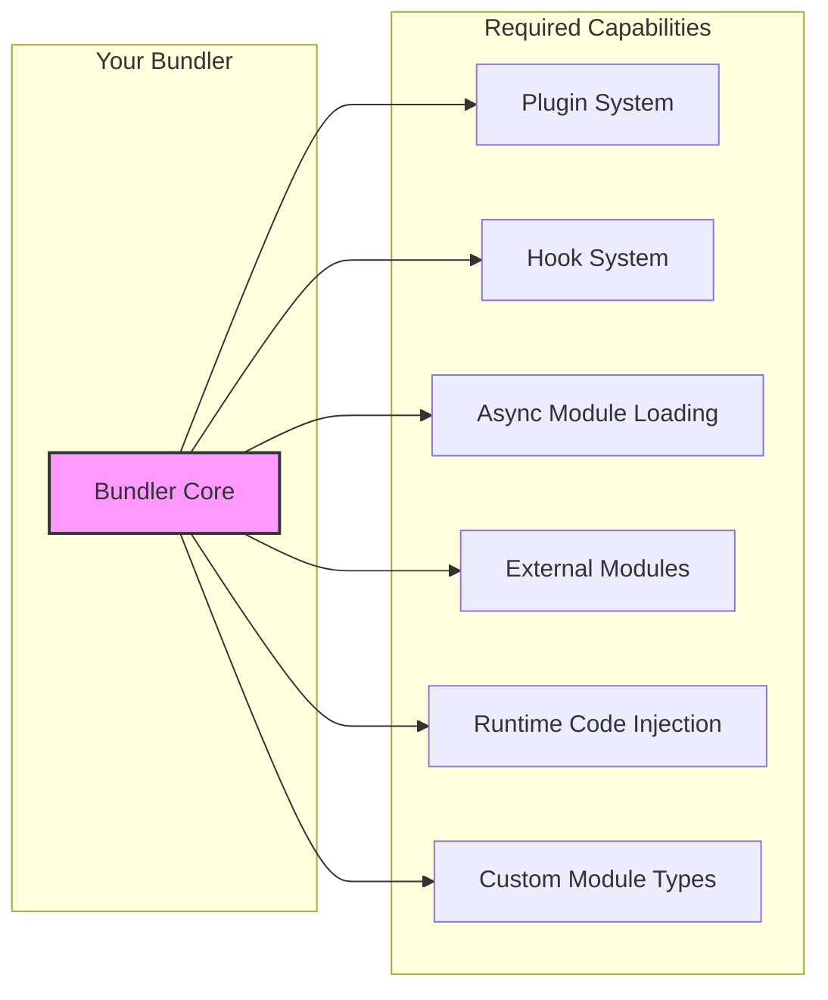
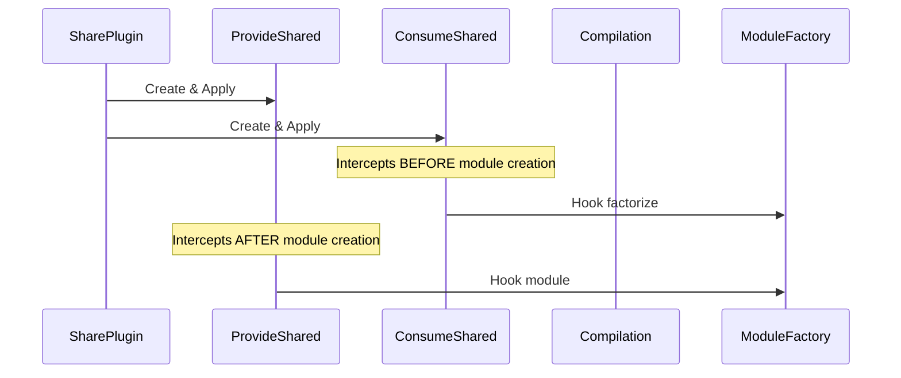
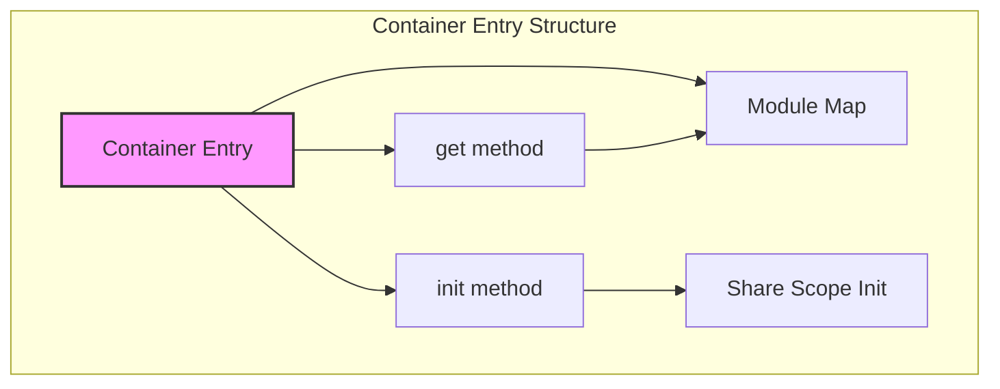
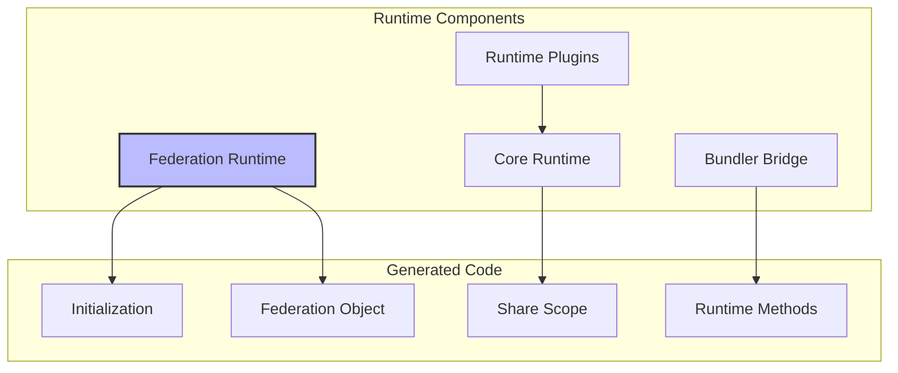

# Module Federation Implementation Guide

This guide provides implementation guidance for teams adding or maintaining Module Federation integrations in this monorepo. It applies to webpack-compatible compiler plugins, Rsbuild/Rspress, Esbuild, Metro, framework adapters, manifest/type tooling, runtime plugins, and example applications.

## Table of Contents

- [Prerequisites](#prerequisites)
- [Implementation Steps](#implementation-steps)
- [Source-Backed Plugin Orchestration](#source-backed-plugin-orchestration)
- [Core Components Implementation](#core-components-implementation)
- [Runtime Integration](#runtime-integration)
- [Extended Implementation Topics](#extended-implementation-topics)

## Implementation Scope

Choose the target layer before adding code:

Use `architecture-overview.md` for the canonical repo-wide package taxonomy. This table is a local implementation routing aid: it helps decide where behavior belongs before selecting package-specific commands or fixtures.

| Target | Preferred package area | Implementation shape |
| --- | --- | --- |
| Shared config/types/utilities | `@module-federation/sdk` | Add stable primitives, manifest/snapshot/stat types, environment helpers, or config helpers that are not tied to one bundler lifecycle. |
| Runtime behavior | `runtime-core`, `runtime`, `webpack-bundler-runtime`, `runtime-tools` | Add lifecycle hooks, remote/share/snapshot loading behavior, singleton APIs, or bundler runtime bridges. |
| Webpack/Rspack compiler behavior | `enhanced`, `rspack` | Add/adjust container, reference, sharing, runtime module, schema, tree-shaking, or startup plugins. |
| Rsbuild/Rspress/Esbuild/Metro behavior | `rsbuild-plugin`, `rspress-plugin`, `esbuild`, `metro-core`, metro adapter packages | Wrap the core container/runtime contract in platform hooks, resolvers, serializers, dev-server middleware, or CLI commands. |
| Framework behavior | `nextjs-mf`, `node`, `modern-js`, `modern-js-v3`, bridge packages, `storybook-addon` | Compose existing build/runtime packages with framework-specific lifecycle, SSR, rendering, router, or server concerns. |
| Metadata/type behavior | `manifest`, `managers`, `dts-plugin`, `third-party-dts-extractor`, `typescript`, `cli` | Normalize config, emit/consume manifests and stats, generate/serve type declarations, or expose CLI/scaffold workflows. |
| Validation surface | `apps/*`, `packages/playground`, `apps/website-new`, `treeshake-*` | Add examples, e2e fixtures, or docs/playground integration that prove the behavior. |

Keep the build/runtime boundary explicit: build plugins generate or reference remote entries, manifests, share metadata, runtime modules, and type artifacts; runtime packages load, initialize, negotiate, cache, and observe those artifacts.

## Prerequisites

Before implementing Module Federation, ensure your bundler supports:

### JSON Schema Validation

Module Federation uses JSON Schema validation instead of custom normalization functions. Set up validation using:

```typescript
// utils.ts - Schema Validation Setup
import { normalizeWebpackPath } from '@module-federation/sdk/normalize-webpack-path';

const memoize = require(
  normalizeWebpackPath('webpack/lib/util/memoize')
) as typeof import('webpack/lib/util/memoize');

const getValidate = memoize(() => require('schema-utils').validate);

export const createSchemaValidation = (
  check: ((value: any) => boolean) | undefined,
  getSchema: () => any,
  options: any,
) => {
  getSchema = memoize(getSchema);
  return (value) => {
    if (check && !check(value)) {
      getValidate()(getSchema(), value, options);
    }
  };
};
```

### Required Bundler Capabilities


```mermaid
graph LR
    subgraph "Required Capabilities"
        Plugins[Plugin System]
        Hooks[Hook System]
        Async[Async Module Loading]
        External[External Modules]
        Runtime[Runtime Code Injection]
        ModuleTypes[Custom Module Types]
    end

    subgraph "Your Bundler"
        YourBundler[Bundler Core]
    end

    YourBundler --> Plugins
    YourBundler --> Hooks
    YourBundler --> Async
    YourBundler --> External
    YourBundler --> Runtime
    YourBundler --> ModuleTypes

    style YourBundler fill:#f9f,stroke:#333,stroke-width:2px
```

### Minimum Requirements Checklist

- [ ] **Plugin System**: Ability to add plugins that modify compilation
- [ ] **Compilation Hooks**: Access to module resolution and creation
- [ ] **Module Factory**: Ability to create custom module types
- [ ] **Runtime Generation**: Ability to inject runtime code
- [ ] **Async Loading**: Support for dynamic imports
- [ ] **External References**: Support for external module references

## Implementation Steps

### Step 1: Create the Main Plugin

```typescript
// module-federation-plugin.ts
import {
  moduleFederationPlugin
} from '@module-federation/sdk';
import { createSchemaValidation } from './utils';

// Create schema validation using the webpack-style schema pattern.
const validate = createSchemaValidation(
  require('./schemas/container/ModuleFederationPlugin.check.js').validate,
  () => require('./schemas/container/ModuleFederationPlugin').default,
  {
    name: 'Module Federation Plugin',
    baseDataPath: 'options',
  },
);

export class ModuleFederationPlugin {
  private options: moduleFederationPlugin.ModuleFederationPluginOptions;

  constructor(options: moduleFederationPlugin.ModuleFederationPluginOptions) {
    // Validate options using JSON schema validation
    validate(options);
    this.options = options;
  }

  apply(compiler: YourBundlerCompiler) {
    // Step 1: Apply RemoteEntryPlugin first (must be before ModuleFederationPlugin)
    new RemoteEntryPlugin(this.options).apply(compiler);

    // Step 2: Apply FederationModulesPlugin to set up hooks
    new FederationModulesPlugin().apply(compiler);

    // Step 3: Apply FederationRuntimePlugin
    new FederationRuntimePlugin(this.options).apply(compiler);

    // Step 4: Apply feature plugins based on configuration after other plugins
    compiler.hooks.afterPlugins.tap('ModuleFederation', () => {
      if (this.options.exposes) {
        new ContainerPlugin(this.options).apply(compiler);
      }

      if (this.options.remotes) {
        new ContainerReferencePlugin(this.options).apply(compiler);
      }

      if (this.options.shared) {
        new SharePlugin(this.options).apply(compiler);
      }
    });
  }
}
```

### Step 2: Implement Container Plugin

Container Plugin with patchChunkSplit functionality:

```typescript
// container-plugin.ts
export class ContainerPlugin {
  // Static method for patching chunk splitting
  static patchChunkSplit(compiler: YourBundlerCompiler, containerName: string) {
    // Patches webpack's chunk splitting to work with federation
    // This is called automatically when useContainerPlugin is true
  }

  apply(compiler: YourBundlerCompiler) {
    compiler.hooks.make.tapAsync('ContainerPlugin', async (compilation) => {
      // Create container entry dependency
      const dep = new ContainerEntryDependency(
        this.options.name,
        this.options.exposes,
        this.options.shareScope
      );

      // Use addInclude instead of addEntry for proper dependency handling
      compilation.addInclude(
        compiler.context,
        dep,
        { name: this.options.name },
        (err, module) => {
          if (err) throw err;
          // Handle successful container creation
        }
      );
    });

    // Register module factories with proper dependency registration
    compiler.hooks.compilation.tap('ContainerPlugin', (compilation) => {
      compilation.dependencyFactories.set(
        ContainerEntryDependency,
        compilation.normalModuleFactory
      );
      compilation.dependencyTemplates.set(
        ContainerEntryDependency,
        new ContainerEntryDependency.Template()
      );
    });
  }
}
```

### Step 3: Implement Share Plugin


```mermaid
sequenceDiagram
    participant SharePlugin
    participant ProvideShared
    participant ConsumeShared
    participant Compilation
    participant ModuleFactory

    SharePlugin->>ProvideShared: Create & Apply
    SharePlugin->>ConsumeShared: Create & Apply

    Note over ConsumeShared: Intercepts BEFORE module creation
    ConsumeShared->>ModuleFactory: Hook factorize

    Note over ProvideShared: Intercepts AFTER module creation
    ProvideShared->>ModuleFactory: Hook module
```

```typescript
// share-plugin.ts
export class SharePlugin {
  apply(compiler: YourBundlerCompiler) {
    const providedModules = this.normalizeProvided(this.options.shared);
    const consumedModules = this.normalizeConsumed(this.options.shared);

    new ProvideSharedPlugin({
      provides: providedModules,
      shareScope: this.options.shareScope
    }).apply(compiler);

    new ConsumeSharedPlugin({
      consumes: consumedModules,
      shareScope: this.options.shareScope
    }).apply(compiler);
  }
}

// consume-shared-plugin.ts
export class ConsumeSharedPlugin {
  apply(compiler: YourBundlerCompiler) {
    compiler.hooks.compilation.tap('ConsumeSharedPlugin',
      (compilation, { normalModuleFactory }) => {

        // Intercept before normal module creation.
        normalModuleFactory.hooks.factorize.tapPromise(
          'ConsumeSharedPlugin',
          async (resolveData) => {
            const request = resolveData.request;
            if (this.isSharedModule(request)) {
              // Return ConsumeSharedModule instead of normal module
              return new ConsumeSharedModule({
                shareKey: this.getShareKey(request),
                shareScope: this.options.shareScope,
                requiredVersion: this.getRequiredVersion(request),
                strictVersion: this.getStrictVersion(request),
                singleton: this.getSingleton(request),
                fallback: this.getFallback(request)
              });
            }
            return undefined; // Continue normal flow
          }
        );
      }
    );
  }
}
```

### Step 4: Implement Container Reference Plugin

```typescript
// container-reference-plugin.ts
export class ContainerReferencePlugin {
  apply(compiler: YourBundlerCompiler) {
    // Convert remotes to external references
    const externals = this.remoteToExternals(this.options.remotes);

    // Use your bundler's external plugin
    new YourExternalsPlugin({
      type: this.options.remoteType || 'script',
      externals
    }).apply(compiler);

    // Add remote loading runtime
    compiler.hooks.compilation.tap('ContainerReferencePlugin',
      (compilation) => {
        compilation.hooks.runtimeRequirementInTree
          .for(RuntimeGlobals.loadScript)
          .tap('ContainerReferencePlugin', (chunk) => {
            compilation.addRuntimeModule(chunk, new RemoteLoadingRuntime());
          });
      }
    );
  }

  private remoteToExternals(remotes: Record<string, RemoteConfig>) {
    const externals: Record<string, External> = {};

    for (const [name, config] of Object.entries(remotes)) {
      externals[name] = {
        [config.externalType]: config.external
      };
    }

    return externals;
  }
}
```

## Source-Backed Plugin Orchestration

The webpack-compatible path is not a fixed "7 plugin" inventory. `packages/enhanced/src/lib/container/ModuleFederationPlugin.ts` composes always-on, option-gated, and feature-specific plugins:

| Phase | Plugin or package | When it runs | Role |
| --- | --- | --- | --- |
| Entry setup | `RemoteEntryPlugin` from `@module-federation/rspack` | Always, before federation hooks | Creates remote entry infrastructure shared by enhanced and rspack integration. |
| Hook setup | `FederationModulesPlugin` | Always | Registers compilation hooks consumed by container/reference/share/runtime modules. |
| Runtime and metadata | `DtsPlugin`, `FederationRuntimePlugin`, `StatsPlugin` | DTS unless `dts === false`; runtime always; stats unless manifest is disabled | Adds type runtime plugins, injects federation runtime behavior, and emits manifest/stat metadata. |
| Startup support | `StartupChunkDependenciesPlugin` | `experiments.asyncStartup` | Coordinates async startup chunk dependencies. |
| Container/reference/share | `ContainerPlugin`, `ContainerReferencePlugin`, `TreeShakingSharedPlugin`, `SharePlugin` | Inside `afterPlugins`, gated by `exposes`, `remotes`, and `shared` | Creates exposes, remotes, tree-shaking-aware shared modules, and share providers/consumers. |

For a new bundler integration, mirror the phase model rather than copying class names blindly: establish entry/runtime hooks first, add metadata/type emission only when the platform can serve those artifacts, then gate container, remote, and share behavior from normalized options.

## Core Components Implementation

### Container Entry Module


```mermaid
flowchart TD
    subgraph "Container Entry Structure"
        Entry[Container Entry]
        Init[init method]
        Get[get method]
        ModuleMap[Module Map]
        ShareInit[Share Scope Init]
    end

    Entry --> Init
    Entry --> Get
    Entry --> ModuleMap
    Init --> ShareInit
    Get --> ModuleMap

    style Entry fill:#f9f,stroke:#333,stroke-width:2px
```

```typescript
// container-entry-module.ts
export class ContainerEntryModule extends Module {
  constructor(
    private name: string,
    private exposes: Record<string, ExposeConfig>,
    private shareScope: string
  ) {
    super('container-entry');
  }

  getSource() {
    const { RuntimeGlobals } = require(
      normalizeWebpackPath('webpack')
    ) as typeof import('webpack');

    return `
      var moduleMap = {
        ${Object.entries(this.exposes)
          .map(([key, config]) => `
            ${JSON.stringify(key)}: () => {
              return ${RuntimeGlobals.ensureChunk}(${JSON.stringify(config.chunkName)})
                .then(() => () => ${RuntimeGlobals.require}(${JSON.stringify(config.import)}));
            }
          `)
          .join(',\n')}
      };

      var get = (module, getScope) => {
        ${RuntimeGlobals.currentRemoteGetScope} = getScope;
        getScope = Object.prototype.hasOwnProperty.call(moduleMap, module)
          ? moduleMap[module]()
          : Promise.resolve().then(() => {
              throw new ContainerModuleNotFoundError(module);
            });
        ${RuntimeGlobals.currentRemoteGetScope} = undefined;
        return getScope;
      };

      var init = (shareScope, initScope) => {
        if (!${RuntimeGlobals.shareScopeMap}) return;
        var name = ${JSON.stringify(this.shareScope)};
        var oldScope = ${RuntimeGlobals.shareScopeMap}[name];
        if (oldScope && oldScope !== shareScope)
          throw new ContainerInitializationError('Container initialization failed');
        ${RuntimeGlobals.shareScopeMap}[name] = shareScope;
        return ${RuntimeGlobals.initializeSharing}(name, initScope);
      };

      // Export container interface
      ${RuntimeGlobals.definePropertyGetters}(exports, {
        get: () => get,
        init: () => init
      });
    `;
  }
}
```

### Consume Shared Module

```typescript
// consume-shared-module.ts
const { ModuleDependency } = require(
  normalizeWebpackPath('webpack/lib/dependencies/ModuleDependency')
) as typeof import('webpack/lib/dependencies/ModuleDependency');

const { WebpackError } = require(
  normalizeWebpackPath('webpack')
) as typeof import('webpack');

export class ConsumeSharedModule extends Module {
  constructor(private options: ConsumeSharedOptions) {
    super('consume-shared', null);
    this.options = options;
  }

  identifier() {
    return `consume-shared|${this.options.shareKey}|${this.options.shareScope}`;
  }

  readableIdentifier() {
    return `consume shared module (${this.options.shareKey})`;
  }

  build(options, compilation, resolver, fs, callback) {
    this.buildMeta = {};
    this.buildInfo = {
      cacheable: true,
      strict: true,
      exportsType: 'dynamic'
    };
    callback();
  }

  codeGeneration({ runtimeTemplate, chunkGraph, moduleGraph }) {
    const sources = new Map();
    const runtimeRequirements = new Set();

    runtimeRequirements.add('__webpack_require__');
    runtimeRequirements.add('__webpack_require__.federation');

    const source = `
      module.exports = __webpack_require__.federation.bundlerRuntime.consumes({
        shareKey: ${JSON.stringify(this.options.shareKey)},
        shareScope: ${JSON.stringify(this.options.shareScope)},
        requiredVersion: ${JSON.stringify(this.options.requiredVersion)},
        singleton: ${this.options.singleton},
        strictVersion: ${this.options.strictVersion},
        fallback: ${this.options.fallback ?
          `() => __webpack_require__(${JSON.stringify(this.options.fallback)})` :
          'undefined'
        }
      });
    `;

    sources.set('javascript', new RawSource(source));

    return { sources, runtimeRequirements };
  }
}
```

### Provide Shared Module

```typescript
// provide-shared-module.ts
export class ProvideSharedModule extends Module {
  constructor(
    private request: string,
    private options: ProvideSharedOptions,
    private resolvedModule: string
  ) {
    super('provide-shared');
  }

  getSource() {
    return `
      const { RuntimeGlobals } = require(
        normalizeWebpackPath('webpack')
      ) as typeof import('webpack');

      var versionCheckCallback = (version, requiredVersion) => {
        return ${RuntimeGlobals.require}.federation.bundlerRuntime.satisfies(
          version,
          requiredVersion
        );
      };

      var getModule = ${this.options.eager ?
        `() => ${RuntimeGlobals.require}(${JSON.stringify(this.resolvedModule)})` :
        `() => ${RuntimeGlobals.ensureChunk}(${JSON.stringify(this.options.chunkName)})
          .then(() => () => ${RuntimeGlobals.require}(${JSON.stringify(this.resolvedModule)}))`
      };

      var moduleToShare = {
        get: getModule,
        version: ${JSON.stringify(this.options.version)},
        scope: [${JSON.stringify(this.options.shareScope)}],
        shareConfig: {
          eager: ${this.options.eager},
          requiredVersion: ${JSON.stringify(this.options.requiredVersion)},
          strictVersion: ${this.options.strictVersion},
          singleton: ${this.options.singleton},
          version: ${JSON.stringify(this.options.version)}
        }
      };

      ${RuntimeGlobals.shareScopeMap}[${JSON.stringify(this.options.shareScope)}][${JSON.stringify(this.options.shareKey)}] = moduleToShare;
    `;
  }
}
```

## Runtime Integration

### Federation Runtime Module


```mermaid
graph TB
    subgraph "Runtime Components"
        FedRuntime[Federation Runtime]
        BundlerBridge[Bundler Bridge]
        CoreRuntime[Core Runtime]
        Plugins[Runtime Plugins]
    end

    subgraph "Generated Code"
        InitCode[Initialization]
        FedObject[Federation Object]
        ShareScope[Share Scope]
        Methods[Runtime Methods]
    end

    FedRuntime --> InitCode
    FedRuntime --> FedObject
    BundlerBridge --> Methods
    CoreRuntime --> ShareScope
    Plugins --> CoreRuntime

    style FedRuntime fill:#bbf,stroke:#333,stroke-width:2px
```

```typescript
// federation-runtime-plugin.ts
export class FederationRuntimePlugin {
  private entryFilePath: string = '';

  apply(compiler: YourBundlerCompiler) {
    // Set up runtime entry - can be virtual or file-based
    this.entryFilePath = this.getFilePath(compiler);

    // Support both virtual and file-based runtime entries
    if (!this.options?.virtualRuntimeEntry) {
      this.ensureFile(compiler);
    }

    // Register runtime dependency
    this.prependEntry(compiler);

    // Inject runtime module
    this.injectRuntime(compiler);
  }

  getFilePath(compiler: YourBundlerCompiler): string {
    if (this.options?.virtualRuntimeEntry) {
      // Use base64 encoded virtual entry
      return `data:text/javascript;charset=utf-8;base64,${btoa(
        this.getTemplate(compiler, this.options)
      )}`;
    } else {
      // Create physical file in temp directory
      const hash = createHash(this.getTemplate(compiler, this.options));
      return path.join(TEMP_DIR, `entry.${hash}.js`);
    }
  }

  prependEntry(compiler: YourBundlerCompiler) {
    compiler.hooks.thisCompilation.tap(
      'FederationRuntimePlugin',
      (compilation) => {
        // Register federation runtime dependency factory
        compilation.dependencyFactories.set(
          FederationRuntimeDependency,
          compilation.normalModuleFactory
        );

        compilation.dependencyTemplates.set(
          FederationRuntimeDependency,
          new ModuleDependency.Template()
        );
      }
    );

    compiler.hooks.make.tapAsync(
      'FederationRuntimePlugin',
      (compilation, callback) => {
        const dependency = new FederationRuntimeDependency(this.entryFilePath);

        // Use addInclude for proper dependency handling
        compilation.addInclude(
          compiler.context,
          dependency,
          { name: undefined },
          (err, module) => {
            if (err) return callback(err);
            callback();
          }
        );
      }
    );
  }
}

// federation-runtime-module.ts
const { RuntimeModule, RuntimeGlobals, Template } = require(
  normalizeWebpackPath('webpack')
) as typeof import('webpack');

export class FederationRuntimeModule extends RuntimeModule {
  constructor(
    runtimeRequirements: ReadonlySet<string>,
    containerName: string,
    initOptions: any
  ) {
    super('federation runtime', RuntimeModule.STAGE_NORMAL - 1);
    this.runtimeRequirements = runtimeRequirements;
    this.containerName = containerName;
    this.initOptions = initOptions;
  }

  generate() {
    const federationGlobal = getFederationGlobalScope(RuntimeGlobals);

    return Template.asString([
      `// Federation Runtime Module`,
      `var ${federationGlobal} = ${federationGlobal} || {};`,
      `${federationGlobal}.runtime = __bundler_require__("${RUNTIME_PATH}");`,
      `${federationGlobal}.initOptions = ${JSON.stringify(this.initOptions)};`,

      // Initialize federation runtime
      `if (!${federationGlobal}.instance) {`,
      Template.indent([
        `${federationGlobal}.instance = ${federationGlobal}.runtime.init(${federationGlobal}.initOptions);`
      ]),
      `}`,

      // Attach to webpack require
      `__bundler_require__.federation = ${federationGlobal};`,

      // Add share scope attachment
      `if (${federationGlobal}.attachShareScopeMap) {`,
      Template.indent([
        `${federationGlobal}.attachShareScopeMap(__bundler_require__);`
      ]),
      `}`,
    ]);
  }
}
```

### Bundler Runtime Bridge Implementation

```typescript
// bundler-runtime.ts - webpack-bundler-runtime structure
const federation = {
  runtime, // Core runtime from @module-federation/runtime
  instance: undefined,
  initOptions: undefined,
  bundlerRuntime: {
    remotes,        // Remote loading utilities
    consumes,       // Shared consumption utilities
    I: initializeSharing,  // Share scope initialization
    S: {},          // Share scopes object
    installInitialConsumes, // Install initial shared modules
    initContainerEntry,     // Container entry initialization
  },
  attachShareScopeMap,      // Attach share scope to webpack require
  bundlerRuntimeOptions: {},
};

// Individual bundler runtime functions
const remotes = async (options) => {
  // Implementation for loading remote modules
  // Handles container loading, initialization, and module retrieval
};

const consumes = async (options) => {
  // Implementation for consuming shared modules
  // Handles share scope lookup, version resolution, fallbacks
};

const initializeSharing = async (scopeName = 'default') => {
  // Implementation for share scope initialization
};

const installInitialConsumes = () => {
  // Install eager shared modules at startup
};

const initContainerEntry = (shareScope, initScope) => {
  // Initialize container entry points
};

const attachShareScopeMap = (webpackRequire) => {
  // Attach share scopes to webpack's require function
  webpackRequire.S = federation.bundlerRuntime.S;
  webpackRequire.I = federation.bundlerRuntime.I;
};

export default federation;
```

## Extended Implementation Topics

- [Implementation Validation](./implementation-validation.md)
- [Implementation Patterns and Troubleshooting](./implementation-patterns.md)
- [Vite and Rollup Integration Examples](./bundler-integration-vite-rollup.md)
- [Esbuild and Common Bundler Integration Examples](./bundler-integration-esbuild-patterns.md)

## Related Documentation

For related architecture details, see:
- [Architecture Overview](./architecture-overview.md) - System understanding and component relationships
- [Plugin Architecture](./plugin-architecture.md) - Build-time plugin system details
- [Runtime Architecture](./runtime-architecture.md) - Runtime behavior and lifecycle
- [Shared Tree-Shaking Architecture](./shared-tree-shaking-architecture.md) - Build, runtime, and re-shake flow for shared dependency pruning
- [SDK Reference](./sdk-reference.md) - All available types, interfaces, and utilities
- [Manifest Specification](./manifest-specification.md) - Manifest generation and validation
- [Error Handling Specification](./error-handling-specification.md) - Implementation error patterns
- [Advanced Topics](./advanced-topics.md) - Complex scenarios and production considerations
