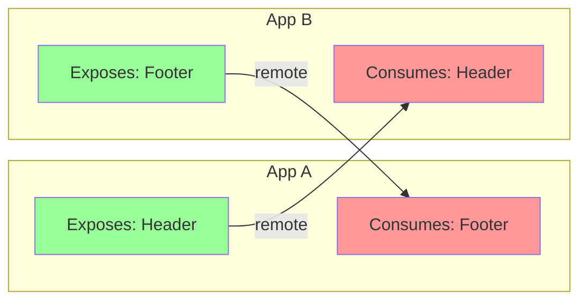
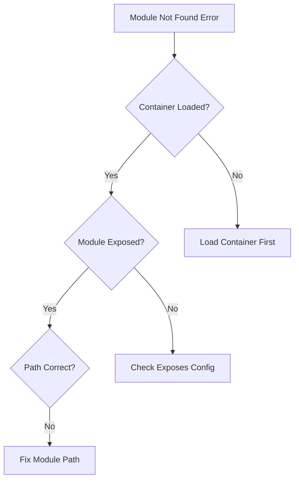

# Module Federation Implementation Patterns and Troubleshooting

This document owns common implementation patterns and troubleshooting guidance. Use [implementation-guide.md](./implementation-guide.md) as the implementation index.

## Common Patterns

### Pattern 1: Bidirectional Hosts



```typescript
// App A config
{
  name: 'appA',
  exposes: {
    './Header': './src/Header'
  },
  remotes: {
    appB: 'appB@http://localhost:3002/remoteEntry.js'
  }
}

// App B config
{
  name: 'appB',
  exposes: {
    './Footer': './src/Footer'
  },
  remotes: {
    appA: 'appA@http://localhost:3001/remoteEntry.js'
  }
}
```

### Pattern 2: Shared Libraries

```typescript
// Shared library configuration
{
  name: 'sharedLib',
  exposes: {
    './utils': './src/utils',
    './components': './src/components',
    './hooks': './src/hooks'
  },
  shared: {
    react: { singleton: true },
    'react-dom': { singleton: true }
  }
}

// Consumer configuration
{
  name: 'consumer',
  remotes: {
    lib: 'sharedLib@http://cdn.example.com/remoteEntry.js'
  },
  shared: {
    react: { singleton: true },
    'react-dom': { singleton: true }
  }
}
```

### Pattern 3: Dynamic Remote Loading

```typescript
// Dynamic remote loading utility
async function loadRemoteComponent(
  remoteName: string,
  remoteUrl: string,
  modulePath: string
) {
  // Register remote dynamically
  __bundler_require__.federation.instance.registerRemotes([
    {
      name: remoteName,
      entry: remoteUrl
    }
  ]);

  // Load component
  const module = await __bundler_require__.federation.instance.loadRemote(
    `${remoteName}/${modulePath}`
  );

  return module;
}

// Usage
const Button = await loadRemoteComponent(
  'dynamicRemote',
  'https://cdn.example.com/remoteEntry.js',
  './Button'
);
```

## Troubleshooting

### Common Issues and Solutions

#### Issue 1: Module Not Found



**Solution:**
```typescript
// Debug helper
function debugModuleFederation() {
  console.log('Available containers:', Object.keys(window));
  console.log('Share scopes:', __bundler_require__.S);

  // Check specific container
  const container = window['myApp'];
  if (container) {
    console.log('Container methods:', Object.keys(container));
  }
}
```

#### Issue 2: Version Conflicts

**Symptoms:**
- Singleton violation errors
- Incompatible version errors
- Multiple React instances

**Solution:**
```typescript
// Version debugging
function debugVersions() {
  const shareScope = __bundler_require__.S.default;

  Object.entries(shareScope).forEach(([pkg, versions]) => {
    console.log(`Package: ${pkg}`);
    Object.entries(versions).forEach(([version, info]) => {
      console.log(`  Version: ${version}, Loaded: ${info.loaded}`);
    });
  });
}

// Strict singleton configuration
{
  shared: {
    react: {
      singleton: true,
      strictVersion: true,
      requiredVersion: '18.0.0'
    }
  }
}
```

#### Issue 3: Runtime Errors

**Debug Steps:**
1. Check console for federation errors
2. Verify runtime is loaded
3. Check network tab for failed requests
4. Validate configuration

```typescript
// Runtime error handler with webpack error classes
const { WebpackError } = require(
  normalizeWebpackPath('webpack')
) as typeof import('webpack');

class FederationRuntimeError extends WebpackError {
  constructor(message: string, details?: any) {
    super(message);
    this.name = 'FederationRuntimeError';
    this.details = details;
  }
}

class SharedModuleNotFoundError extends WebpackError {
  constructor(shareKey: string, shareScope: string) {
    super(`Shared module '${shareKey}' not found in scope '${shareScope}'`);
    this.name = 'SharedModuleNotFoundError';
  }
}

class ContainerNotFoundError extends WebpackError {
  constructor(containerName: string) {
    super(`Container '${containerName}' not found or not initialized`);
    this.name = 'ContainerNotFoundError';
  }
}

// Runtime error handler
window.addEventListener('error', (event) => {
  if (event.error?.message?.includes('federation')) {
    console.error('Federation Error:', {
      message: event.error.message,
      stack: event.error.stack,
      federationState: {
        containers: Object.keys(window).filter(k =>
          window[k]?.get && window[k]?.init
        ),
        shareScopes: Object.keys(__webpack_require__.S || {})
      }
    });
  }
});
```

### Performance Optimization Tips

1. **Preload Critical Remotes**
```typescript
// Preload remote entries
const preloadRemotes = ['app1', 'app2'].map((name, i) =>
  fetch(`http://localhost:${3001 + i}/remoteEntry.js`)
);
await Promise.all(preloadRemotes);
```

2. **Use Module Federation Manifest**
```typescript
// Load with manifest for better caching
// manifest.remotes is an array of remote records, not a keyed object
const manifest = await fetch('/mf-manifest.json').then(r => r.json());
const remoteUrl = manifest.remotes.find(r => r.alias === remoteName)?.entry;
```

3. **Implement Retry Logic**
```typescript
async function loadWithRetry(loader, retries = 3) {
  for (let i = 0; i < retries; i++) {
    try {
      return await loader();
    } catch (error) {
      if (i === retries - 1) throw error;
      await new Promise(r => setTimeout(r, 1000 * (i + 1)));
    }
  }
}
```
