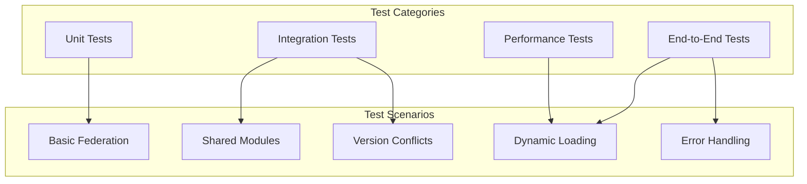

# Module Federation Implementation Validation

This document owns implementation-level test examples and validation checklists. Use [implementation-guide.md](./implementation-guide.md) as the implementation index.

## Testing and Validation

### Test Suite Structure



### Basic Federation Test

```typescript
// __tests__/basic-federation.test.ts
describe('Basic Module Federation', () => {
  it('should expose modules correctly', async () => {
    const config = {
      name: 'testApp',
      filename: 'remoteEntry.js',
      exposes: {
        './Button': './src/Button.js'
      }
    };

    const result = await build(config);

    // Check container entry exists
    expect(result.assets).toContain('remoteEntry.js');

    // Check container has correct interface
    const container = await loadContainer(result.path, 'testApp');
    expect(container).toHaveProperty('init');
    expect(container).toHaveProperty('get');

    // Check exposed module can be loaded
    await container.init({});
    const moduleFactory = await container.get('./Button');
    const module = moduleFactory();
    expect(module).toBeDefined();
  });

  it('should consume remote modules', async () => {
    const hostConfig = {
      name: 'host',
      remotes: {
        remote: 'remote@http://localhost:3001/remoteEntry.js'
      }
    };

    // Mock remote loading
    mockRemote('remote', {
      './Button': () => ({ default: 'Button Component' })
    });

    const result = await build(hostConfig);
    const app = await runApp(result);

    // Test remote loading
    const Button = await app.import('remote/Button');
    expect(Button.default).toBe('Button Component');
  });
});
```

### Shared Module Test

```typescript
describe('Shared Modules', () => {
  it('should share singleton modules', async () => {
    const configs = [
      {
        name: 'app1',
        shared: {
          react: { singleton: true, version: '18.0.0' }
        }
      },
      {
        name: 'app2',
        shared: {
          react: { singleton: true, version: '18.0.0' }
        }
      }
    ];

    const [app1, app2] = await Promise.all(configs.map(build));

    // Load both apps
    const runtime1 = await loadApp(app1);
    const runtime2 = await loadApp(app2);

    // Get React from both
    const react1 = await runtime1.loadShared('react');
    const react2 = await runtime2.loadShared('react');

    // Should be the same instance
    expect(react1).toBe(react2);
  });

  it('should handle version conflicts', async () => {
    const shareScope = createShareScope();

    // Register different versions
    shareScope.register('react', '17.0.0', getReact17);
    shareScope.register('react', '18.0.0', getReact18);

    // Request compatible version
    const react17 = await shareScope.get('react', '^17.0.0');
    expect(react17.version).toBe('17.0.0');

    const react18 = await shareScope.get('react', '^18.0.0');
    expect(react18.version).toBe('18.0.0');

    // Request incompatible version
    await expect(
      shareScope.get('react', '^16.0.0')
    ).rejects.toThrow('No compatible version');
  });
});
```

### Validation Checklist

- [ ] **Container Entry**: Verify `get` and `init` methods work correctly
- [ ] **Remote Loading**: Test dynamic remote loading
- [ ] **Share Scope**: Validate version negotiation
- [ ] **Error Handling**: Test missing modules, version conflicts
- [ ] **Performance**: Measure loading times, bundle sizes
- [ ] **Hot Reload**: Ensure HMR works with federation
