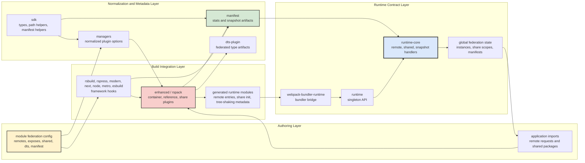
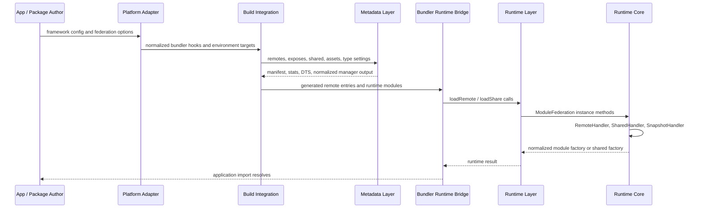
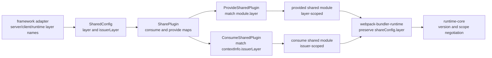

# Layer Architecture

Module Federation is organized as a one-way contract pipeline. Authoring and framework adapters normalize configuration, build integrations generate bundler artifacts and metadata, runtime bridges translate bundler calls, and `runtime-core` owns remote and shared dependency semantics.

## Table of Contents

- [Ownership Layers](#ownership-layers)
- [Layer Interaction Flow](#layer-interaction-flow)
- [Layer Handoff Sequence](#layer-handoff-sequence)
- [Layer-Aware Sharing](#layer-aware-sharing)
- [Layer Boundary Rules](#layer-boundary-rules)
- [Related Documentation](#related-documentation)

## Ownership Layers

| Layer | Packages | Responsibility |
| --- | --- | --- |
| Foundation and legacy utilities | `sdk`, `error-codes`, `utilities`, `core` | Shared types, manifest/snapshot helpers, environment utilities, React helper utilities, normalized webpack-path access, canonical error formatting, and legacy/simple runtime compatibility surfaces. |
| Runtime contract | `runtime-core`, `runtime`, `webpack-bundler-runtime`, `runtime-tools` | Container-compatible loading, shared dependency negotiation, instance/global state, runtime hooks, and webpack runtime bridging. |
| Build integrations | `enhanced`, `rspack`, `rsbuild-plugin`, `rspress-plugin`, `esbuild`, `metro`, Metro adapter packages | Convert bundler/framework config into remote entries, container references, share providers/consumers, manifests, runtime modules, Metro/Rock/RNEF/RNC-CLI behavior, and platform-specific loading. |
| Platform adapters | `nextjs-mf`, `node`, `modern-js`, `modern-js-v3`, bridge packages, `storybook-addon`, native-federation packages | Bind the build/runtime contract to framework lifecycles, SSR/server execution, React/Vue bridge rendering, native federation validation/type flows, Storybook, and application-specific conventions. |
| Metadata and type tooling | `manifest`, `managers`, `dts-plugin`, `third-party-dts-extractor`, `typescript`, `cli`, `create-module-federation` | Generate and consume manifests/stats, derive normalized config, publish/consume federated types, and expose CLI/scaffolding flows. |
| Observability and resilience | `observability-plugin`, `retry-plugin`, `devtools` | Runtime visibility, retry/fallback behavior, dependency graph UI, and browser extension/debugging surfaces. |
| Validation and product surfaces | `apps/*`, `playground`, `website-new`, `treeshake-*`, `assemble-release-plan`, `webpack/` | Examples, e2e fixtures, docs/playground delivery, federated tree-shaking services/UI, release planning, and compatibility fixtures. |

The central design rule is that lower layers receive normalized contracts rather than framework or bundler internals. Build integrations may inspect webpack, Rspack, Metro, or framework-specific state, but runtime packages should only see runtime records, manifests, snapshots, share scopes, hooks, and container-compatible factories.

## Layer Interaction Flow

## Layer Handoff Sequence

## Layer-Aware Sharing

Shared `layer` and `issuerLayer` are build-time routing hints. They let framework integrations, especially Next.js and SSR-capable adapters, keep server/client or framework-specific sharing boundaries separate while still emitting ordinary shared records for the runtime.

Use layer fields when a bundler/framework has separate compilation surfaces that should not accidentally consume each other's shared implementation. Do not use them as a runtime policy replacement: runtime-core still sees normalized shared candidates and resolves them through scope, version, singleton, and strategy semantics.

## Layer Boundary Rules

- Build integrations may inspect bundler-specific objects, but they should emit normalized runtime data, manifest records, or generated runtime modules before crossing into runtime packages.
- Runtime packages should negotiate remotes and shared dependencies through `runtime-core` handlers and hooks. Platform adapters can add loading mechanics, but they should not invent a different container or share-scope contract.
- Metadata packages should describe artifacts and normalized config; they should not embed framework lifecycle policy.
- Runtime features that span layers, such as shared tree shaking, should keep build analysis in build packages and runtime selection in `runtime-core`.

## Related Documentation

- [Architecture Overview](./architecture-overview.md)
- [Plugin Architecture](./plugin-architecture.md)
- [Runtime Architecture](./runtime-architecture.md)
- [Shared Tree-Shaking Architecture](./shared-tree-shaking-architecture.md)
- [Manifest Specification](./manifest-specification.md)
