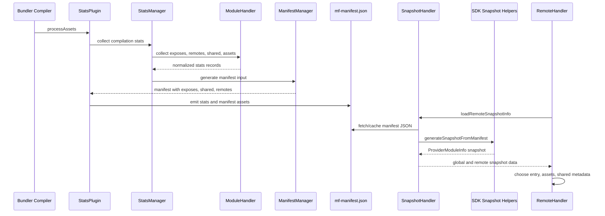

# Module Federation Manifest Specification

This document defines the manifest architecture used by the current Module Federation monorepo. Manifests are produced and consumed by `@module-federation/manifest`, `@module-federation/managers`, `@module-federation/sdk`, `@module-federation/dts-plugin`, build integrations such as enhanced/rspack/rsbuild/rspress/metro, and runtime snapshot loading in `runtime-core`.

## Table of Contents
- [Overview](#overview)
- [Federation Manifest Schema](#federation-manifest-schema)
- [MF Stats Schema](#mf-stats-schema)
- [Shared Dependency Schema](#shared-dependency-schema)
- [Examples](#examples)
- [Validation](#validation)

## Manifest Ownership

Use `architecture-overview.md` for the canonical repo-wide package taxonomy. This section only maps manifest production and consumption responsibilities.

| Layer | Package(s) | Manifest responsibility |
| --- | --- | --- |
| Type and utility source | `@module-federation/sdk` | Defines manifest, stats, and snapshot types plus `generateSnapshotFromManifest` and `inferAutoPublicPath`. |
| Build metadata generation | `@module-federation/manifest` | Uses `ManifestManager`, `StatsManager`, `StatsPlugin`, and `ModuleHandler` to collect build stats, exposed modules, remote metadata, shared dependency data, and assets. |
| Option normalization | `@module-federation/managers` | Normalizes remotes, containers, shared config, package metadata, and base plugin options before manifest/stat emission. |
| Type metadata | `@module-federation/dts-plugin` | Publishes and consumes type artifacts that manifests and runtime type hints can point to. |
| Runtime consumption | `@module-federation/runtime-core` | `SnapshotHandler` reads manifest data and converts it into remote snapshots for loading, preloading, and version decisions. |
| Platform integrations | `enhanced`, `rspack`, `rsbuild-plugin`, `rspress-plugin`, `metro`, `nextjs-mf`, `node`, `modern-js` | Decide when and where manifests are generated, served, rewritten, or fetched for each build/runtime environment. |

The manifest is an interoperability artifact, not a replacement for the remote container contract. A remote still needs a loadable entry with `init` and `get`; the manifest makes the entry discoverable, enriches it with asset/type/shared metadata, and gives the runtime enough information to preload or resolve snapshots safely.

### Manifest Production and Consumption Flow

Manifest data crosses three ownership boundaries: build-time collection, artifact publication, and runtime snapshot consumption. The build integration owns compiler hooks and asset emission; the manifest package owns stats-to-manifest shaping; runtime-core owns fetching, caching, and converting manifests into remote snapshot data.



Recent architecture changes make this flow more important than the raw schema alone: DTS metadata may point to zip/API type URLs, platform adapters may merge browser and node manifests, and Metro/Rsbuild/Modern integrations may generate or rewrite manifests in environment-specific ways. Keep docs about manifest fields tied to SDK types and the producing/consuming package that owns each field.

## Overview

Module Federation uses several manifest files to coordinate runtime behavior:

1. **`mf-manifest.json`** - The manifest emitted per build and consumed at runtime (`ManifestFileName` constant, `Manifest` type)
2. **`mf-stats.json`** - Richer build stats emitted alongside the manifest (`StatsFileName` constant, `Stats` type)
3. **`federation-manifest.json`** - Legacy manifest file name (`FederationModuleManifest` constant); same `Manifest` schema

These manifests enable:
- Runtime module discovery and loading
- Version negotiation for shared dependencies
- Performance optimization through preloading
- Cross-bundler interoperability

## Federation Manifest Schema

Both `mf-manifest.json` and the legacy `federation-manifest.json` follow the SDK `Manifest` type (`packages/sdk/src/types/manifest.ts`), emitted by `ManifestManager` in `@module-federation/manifest`:

```typescript
interface Manifest<
  T = BasicStatsMetaData,
  K = ManifestRemoteCommonInfo,
> {
  /**
   * Unique identifier for this federated build
   */
  id: string;

  /**
   * Container name
   */
  name: string;

  /**
   * Metadata about the build and environment
   */
  metaData: StatsMetaData<T>;

  /**
   * Shared dependencies provided by this build
   */
  shared: ManifestShared[];

  /**
   * Remotes this build consumes
   */
  remotes: ManifestRemote<K>[];

  /**
   * Modules exposed by this build
   */
  exposes: ManifestExpose[];
}

interface BasicStatsMetaData {
  /** Container name */
  name: string;
  /** Global variable the remote entry registers on */
  globalName: string;
  /** Build identifiers */
  buildInfo: StatsBuildInfo;
  /** Remote entry file location and format */
  remoteEntry: ResourceInfo;
  /** Server-side remote entry (SSR builds only) */
  ssrRemoteEntry?: ResourceInfo;
  /** Type declaration artifacts produced by the DTS plugin */
  types?: MetaDataTypes;
  /** Module type, e.g. 'app' */
  type: string;
  /** Version of the build plugin that produced the manifest */
  pluginVersion?: string;
}

/**
 * metaData carries either a static publicPath or a serialized getPublicPath function
 */
type StatsMetaData<T = BasicStatsMetaData> =
  | (T & { getPublicPath: string })
  | (T & { publicPath: string; ssrPublicPath?: string });

interface StatsBuildInfo {
  /** Build identifier for cache busting */
  buildVersion: string;
  /** Build name */
  buildName: string;
  /** Build hash */
  hash?: string;
}

interface ResourceInfo {
  /** Path relative to the public path */
  path: string;
  /** File name */
  name: string;
  /** Remote entry format, e.g. 'global', 'module', 'commonjs-module' */
  type: RemoteEntryType;
}

interface MetaDataTypes {
  /** Path to the type declaration entry */
  path: string;
  /** Type declaration entry file name */
  name: string;
  /** API types file name */
  api: string;
  /** Zipped types archive file name */
  zip: string;
}

interface ManifestShared {
  /** Identifier, e.g. '<container>:<package>' */
  id: string;
  /** Package name */
  name: string;
  /** Provided version */
  version: string;
  /** Singleton requirement */
  singleton: boolean;
  /** Required version range */
  requiredVersion: string;
  /** Build hash for the shared module */
  hash: string;
  /** Sync/async js and css assets */
  assets: StatsAssets;
  /** Fallback entry for tree-shaken shared modules */
  fallback?: string;
  fallbackName?: string;
  fallbackType?: RemoteEntryType;
}

interface ManifestRemoteCommonInfo {
  /** Container name of the consumed remote */
  federationContainerName: string;
  /** Consumed module name */
  moduleName: string;
  /** Alias used by the consumer */
  alias: string;
}

/**
 * Each remote record carries either an `entry` URL or a `version`
 */
type ManifestRemote<T = ManifestRemoteCommonInfo> =
  | ({ entry: string } & T)
  | ({ version: string } & T);

type ManifestExpose = Pick<
  StatsExpose,
  'assets' | 'id' | 'name' | 'path'
>;

interface StatsAssets {
  js: {
    sync: string[];
    async: string[];
  };
  css: {
    sync: string[];
    async: string[];
  };
}
```

## MF Stats Schema

The stats file (`mf-stats.json`) is emitted alongside the manifest by `StatsManager` and shares the same top-level shape (`Stats` type in `packages/sdk/src/types/stats.ts`), but keeps extra build-analysis fields that the manifest strips:

```typescript
interface Stats<T = BasicStatsMetaData, K = StatsRemoteVal> {
  /** Build identifier */
  id: string;
  /** Container name */
  name: string;
  /** Same metadata shape as the manifest */
  metaData: StatsMetaData<T>;
  /** Shared dependencies with usage analysis */
  shared: StatsShared[];
  /** Consumed remotes with usage analysis */
  remotes: StatsRemote<K>[];
  /** Exposed modules with source file info */
  exposes: StatsExpose[];
}

interface StatsExpose {
  /** Identifier, e.g. '<container>:<expose name>' */
  id: string;
  /** Expose name without the './' prefix */
  name: string;
  /** Expose path, e.g. './Button' */
  path?: string;
  /** Source file of the exposed module */
  file: string;
  /** Shared packages this expose requires */
  requires: string[];
  /** Sync/async js and css assets */
  assets: StatsAssets;
  /** Build hash */
  hash?: string;
}

interface StatsRemoteVal {
  /** Consumed module name */
  moduleName: string;
  /** Container name of the consumed remote */
  federationContainerName: string;
  /** Container name of the consumer */
  consumingFederationContainerName: string;
  /** Alias used by the consumer */
  alias: string;
  /** Modules that use this remote */
  usedIn: string[];
}

/**
 * Each remote record carries either an `entry` URL or a `version`
 */
type StatsRemote<T = StatsRemoteVal> =
  | ({ entry: string } & T)
  | ({ version: string } & T);
```

## Shared Dependency Schema

There is no separate shared-dependency manifest file; shared information lives in the `shared` arrays of `mf-manifest.json` (`ManifestShared`) and `mf-stats.json` (`StatsShared`). The stats variant adds usage analysis on top of the manifest fields:

```typescript
interface StatsShared {
  /** Identifier, e.g. '<container>:<package>' */
  id: string;
  /** Package name */
  name: string;
  /** Provided version */
  version: string;
  /** Singleton requirement */
  singleton: boolean;
  /** Required version range */
  requiredVersion: string;
  /** Build hash for the shared module */
  hash: string;
  /** Sync/async js and css assets */
  assets: StatsAssets;
  /** Direct shared dependencies of this package */
  deps: string[];
  /** Modules that use this shared package */
  usedIn: string[];
  /** Export names used from the shared module */
  usedExports: string[];
  /** Fallback entry for tree-shaken shared modules */
  fallback: string;
  fallbackName: string;
  fallbackType: RemoteEntryType;
}
```

## Examples

### MF Manifest Example

```json
{
  "id": "shell",
  "name": "shell",
  "metaData": {
    "name": "shell",
    "type": "app",
    "buildInfo": {
      "buildVersion": "2.1.0",
      "buildName": "shell"
    },
    "remoteEntry": {
      "name": "remoteEntry.js",
      "path": "",
      "type": "global"
    },
    "types": {
      "path": "",
      "name": "",
      "zip": "@mf-types.zip",
      "api": "@mf-types.d.ts"
    },
    "globalName": "shell",
    "pluginVersion": "0.17.0",
    "publicPath": "https://cdn.example.com/shell/"
  },
  "shared": [
    {
      "id": "shell:react",
      "name": "react",
      "version": "18.2.0",
      "singleton": true,
      "requiredVersion": "^18.0.0",
      "hash": "6bef1d6f6b04e0c8",
      "assets": {
        "js": {
          "sync": ["__federation_shared_react.js"],
          "async": []
        },
        "css": {
          "sync": [],
          "async": []
        }
      }
    }
  ],
  "remotes": [
    {
      "federationContainerName": "header",
      "moduleName": "Nav",
      "alias": "header",
      "entry": "https://cdn.example.com/header/mf-manifest.json"
    }
  ],
  "exposes": [
    {
      "id": "shell:Header",
      "name": "Header",
      "path": "./Header",
      "assets": {
        "js": {
          "sync": ["__federation_expose_Header.js"],
          "async": ["header-lazy.js"]
        },
        "css": {
          "sync": ["header.css"],
          "async": []
        }
      }
    }
  ]
}
```

### MF Stats Example

```json
{
  "id": "shell",
  "name": "shell",
  "metaData": {
    "name": "shell",
    "type": "app",
    "buildInfo": {
      "buildVersion": "2.1.0",
      "buildName": "shell"
    },
    "remoteEntry": {
      "name": "remoteEntry.js",
      "path": "",
      "type": "global"
    },
    "globalName": "shell",
    "publicPath": "https://cdn.example.com/shell/"
  },
  "shared": [
    {
      "id": "shell:react",
      "name": "react",
      "version": "18.2.0",
      "singleton": true,
      "requiredVersion": "^18.0.0",
      "hash": "6bef1d6f6b04e0c8",
      "assets": {
        "js": {
          "sync": ["__federation_shared_react.js"],
          "async": []
        },
        "css": {
          "sync": [],
          "async": []
        }
      },
      "deps": [],
      "usedIn": ["src/App.tsx"]
    }
  ],
  "remotes": [
    {
      "federationContainerName": "header",
      "moduleName": "Nav",
      "consumingFederationContainerName": "shell",
      "alias": "header",
      "usedIn": ["src/App.tsx"],
      "entry": "https://cdn.example.com/header/mf-manifest.json"
    }
  ],
  "exposes": [
    {
      "id": "shell:Header",
      "name": "Header",
      "path": "./Header",
      "file": "src/components/Header.tsx",
      "requires": ["react"],
      "assets": {
        "js": {
          "sync": ["__federation_expose_Header.js"],
          "async": ["header-lazy.js"]
        },
        "css": {
          "sync": ["header.css"],
          "async": []
        }
      }
    }
  ]
}
```

## Validation

### JSON Schema Validation

Bundler implementers should validate manifests using JSON Schema:

```javascript
// JSON Schema for mf-manifest.json validation
const manifestSchema = {
  "$schema": "http://json-schema.org/draft-07/schema#",
  "type": "object",
  "required": ["id", "name", "metaData", "shared", "remotes", "exposes"],
  "properties": {
    "id": {
      "type": "string",
      "minLength": 1
    },
    "name": {
      "type": "string",
      "minLength": 1
    },
    "metaData": {
      "type": "object",
      "required": ["name", "globalName", "buildInfo", "remoteEntry", "type"],
      "properties": {
        "name": {
          "type": "string"
        },
        "globalName": {
          "type": "string"
        },
        "buildInfo": {
          "type": "object",
          "required": ["buildVersion"],
          "properties": {
            "buildVersion": {
              "type": "string"
            },
            "buildName": {
              "type": "string"
            }
          }
        },
        "remoteEntry": {
          "type": "object",
          "required": ["name", "path", "type"]
        },
        "publicPath": {
          "type": "string"
        },
        "getPublicPath": {
          "type": "string"
        }
      }
    },
    "remotes": {
      "type": "array",
      "items": {
        "type": "object",
        "required": ["federationContainerName", "moduleName", "alias"],
        "properties": {
          "federationContainerName": {
            "type": "string"
          },
          "entry": {
            "type": "string"
          },
          "version": {
            "type": "string"
          }
        }
      }
    }
  }
};
```

### Runtime Validation

```typescript
// Runtime manifest validation
// (SnapshotHandler in runtime-core treats metaData, exposes, and shared as required)
export function validateManifest(manifest: any): Manifest {
  // Type guards and validation logic
  if (!manifest.id || typeof manifest.id !== 'string') {
    throw new Error('Invalid manifest: missing or invalid id');
  }

  const missingRequiredFields = [
    !manifest.metaData && 'metaData',
    !manifest.exposes && 'exposes',
    !manifest.shared && 'shared',
  ].filter(Boolean);
  if (missingRequiredFields.length > 0) {
    throw new Error(
      `Invalid manifest: missing required fields: ${missingRequiredFields.join(', ')}`,
    );
  }

  // Validate remotes
  if (manifest.remotes) {
    manifest.remotes.forEach((remote: any, index: number) => {
      if (
        !remote.federationContainerName ||
        !('entry' in remote || 'version' in remote)
      ) {
        throw new Error(
          `Invalid remote at index ${index}: missing federationContainerName or entry/version`,
        );
      }
    });
  }

  return manifest as Manifest;
}
```

### Manifest Generation Guidelines

When generating manifests, bundlers should:

1. **Include Complete Metadata**: Always populate name, buildInfo.buildVersion, and publicPath (or getPublicPath)
2. **Validate URLs**: Ensure all entry points and asset URLs are valid
3. **Calculate Sizes**: Include accurate size information for optimization
4. **Handle Assets**: List all associated CSS, JS, and other assets
5. **Version Consistency**: Ensure version information is consistent across manifests
6. **Security**: Validate and sanitize all user-provided configuration

### Best Practices

1. **Versioning**: Use semantic versioning with build identifiers
2. **Caching**: Include buildVersion for effective cache busting
3. **Asset Organization**: Group related assets logically
4. **Size Optimization**: Include size information for preloading decisions
5. **Error Handling**: Provide fallback mechanisms for missing manifests
6. **Development vs Production**: Include different optimization levels
7. **Cross-Origin**: Configure CORS headers for manifest files

This manifest specification keeps metadata exchange consistent across Module Federation implementations and bundler integrations.

## Related Documentation

For implementation and usage context, see:
- [Architecture Overview](./architecture-overview.md) - System architecture and manifest role
- [Plugin Architecture](./plugin-architecture.md) - Build-time manifest generation
- [Runtime Architecture](./runtime-architecture.md) - Runtime manifest consumption
- [Implementation Guide](./implementation-guide.md) - Manifest generation in bundler implementations
- [SDK Reference](./sdk-reference.md) - Manifest-related types and utilities
- [Error Handling Specification](./error-handling-specification.md) - Manifest validation and error handling
- [Advanced Topics](./advanced-topics.md) - Production manifest optimization
