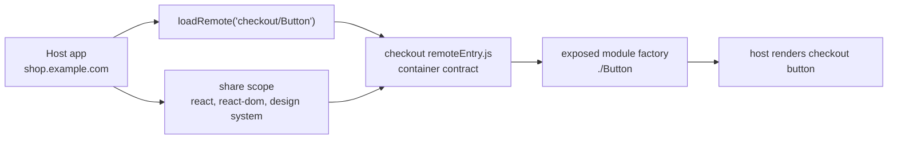
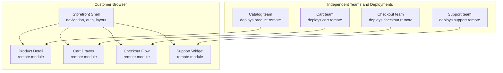
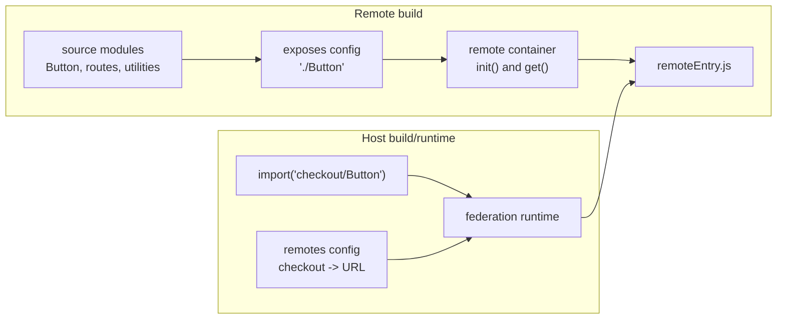
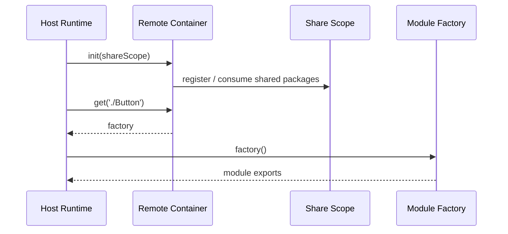
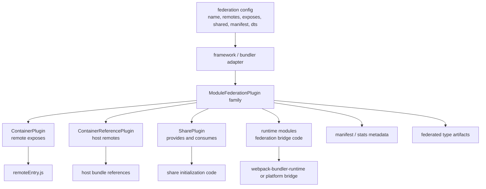
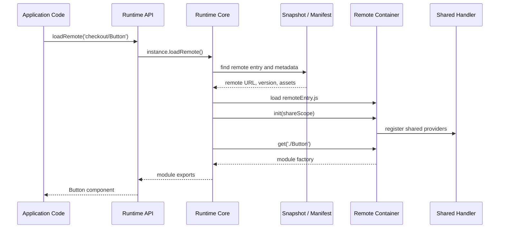
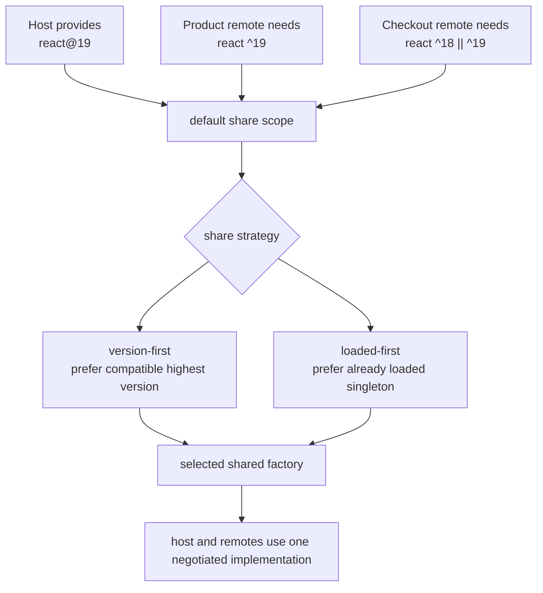
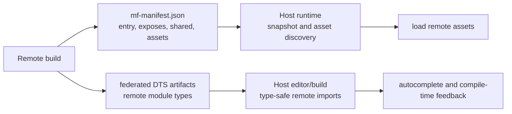
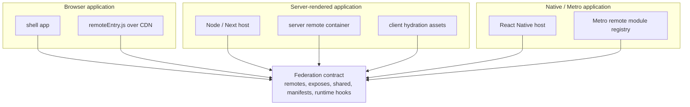
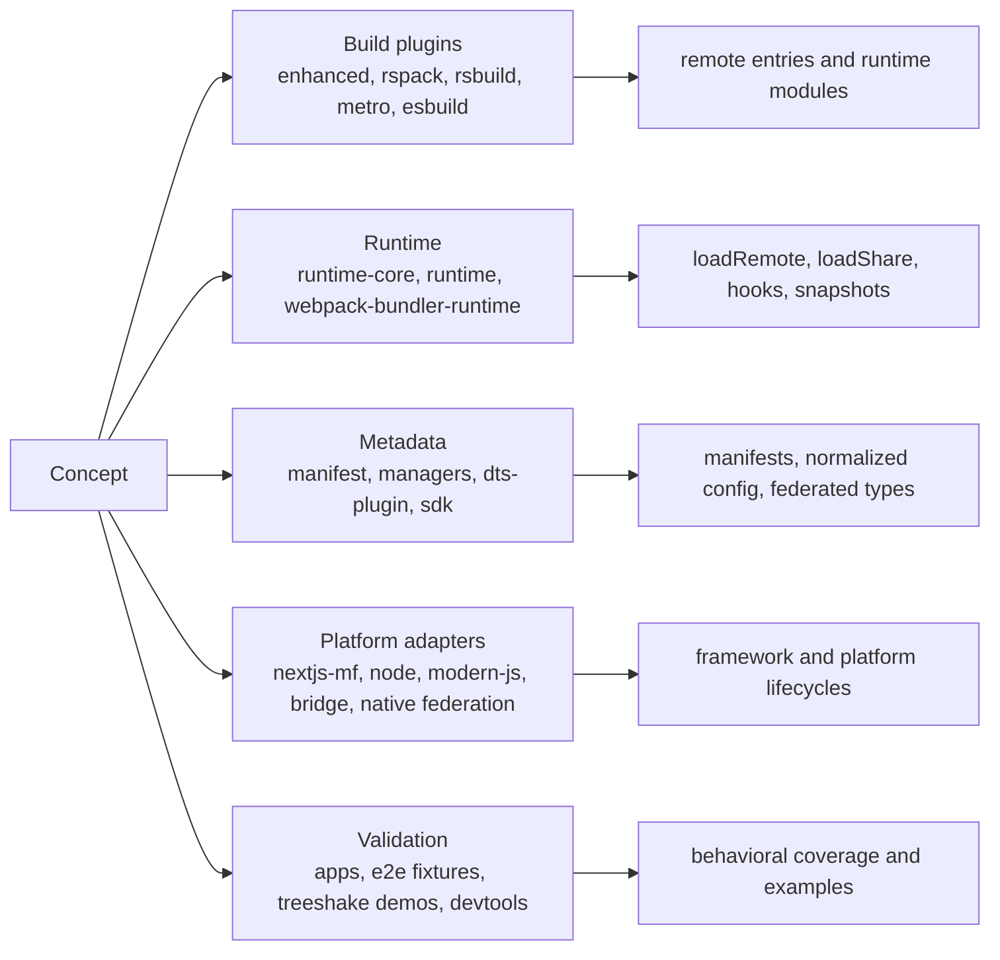

# Module Federation Explained

Module Federation lets independently built JavaScript applications share code at runtime. One application can load another application's modules after deployment, while both applications keep their own build, release, and ownership boundaries.

In this repository, Module Federation is not only a webpack plugin. It is a layered system: build plugins create containers and runtime metadata, manifests describe deployed applications, runtime packages load remote modules and shared dependencies, and platform adapters make the same contract work in browsers, servers, React Native, Next.js, Modern.js, Rsbuild, Rspack, Metro, and other hosts.

## Table of Contents

- [The Short Version](#the-short-version)
- [Real-World Scenario: Commerce Shell](#real-world-scenario-commerce-shell)
- [Core Concepts](#core-concepts)
- [What Happens at Build Time](#what-happens-at-build-time)
- [What Happens at Runtime](#what-happens-at-runtime)
- [Shared Dependencies](#shared-dependencies)
- [Manifests and Type Artifacts](#manifests-and-type-artifacts)
- [Platform Scenarios](#platform-scenarios)
- [How This Maps to the Repository](#how-this-maps-to-the-repository)
- [Where to Go Next](#where-to-go-next)

## The Short Version

A host application asks for code by name, such as `checkout/Button`. The host runtime finds the deployed checkout remote, initializes its container with the current share scope, asks the container for the exposed module, and executes the returned module factory.

The core contract is small:

- A remote exposes modules.
- A host consumes remotes.
- A container provides `init` and `get`.
- A share scope coordinates dependencies that should not be duplicated accidentally.
- A manifest can describe where deployed assets, types, and metadata live.

## Real-World Scenario: Commerce Shell

Module Federation is useful when several teams own different product areas but customers experience one application.

Each team can deploy independently as long as the remote keeps the exposed module contract the shell expects. The shell can compose those remotes without rebuilding every team into one deployment unit.

## Core Concepts

### Host, Remote, Expose, and Container

The remote build turns selected source modules into exposed factories. The host does not need those source files at build time; it needs a remote name, an exposed module request, and a way to locate the remote entry or manifest at runtime.

### Container Contract

The container contract is why Module Federation can work across framework adapters and bundlers: build integrations may differ, but the runtime exchange is still container initialization plus module factory lookup.

## What Happens at Build Time

Build integrations convert application config into assets and metadata that the runtime can understand.

Build-time code is allowed to know about webpack, Rspack, Metro, Rsbuild, or framework hooks. Runtime code should receive normalized records and container-compatible factories instead of raw bundler internals.

## What Happens at Runtime

Runtime loading resolves the remote, loads metadata or entry assets, initializes the container, negotiates sharing, and returns the requested module.

The host can use the convenience API from `@module-federation/runtime`, while `@module-federation/runtime-core` owns the actual remote, shared, snapshot, and hook behavior.

## Shared Dependencies

Shared dependencies let independently built applications agree on packages such as React, React DOM, routing libraries, or design systems.

Sharing is not just deduplication. It is runtime negotiation with version, singleton, required-version, strategy, scope, and fallback behavior. Advanced features such as shared tree shaking still pass through the same resolver instead of bypassing the share contract.

## Manifests and Type Artifacts

Manifests and type artifacts make the runtime and developer experience more explicit.

The manifest is runtime-oriented metadata. DTS artifacts are developer-oriented metadata. Both allow a host to consume a remote with less implicit knowledge about the remote's build output.

## Platform Scenarios

The same federation contract can appear in different deployment shapes.

Platform adapters handle the environment-specific lifecycle: browser script loading, server execution, Next.js server/client separation, Metro module registration, or framework route/data lifecycles. The shared architectural goal is to keep those platform concerns outside `runtime-core`.

## How This Maps to the Repository

Use this document as the conceptual entry point. Use the deeper architecture docs when you need package ownership, hook timing, runtime lifecycle, manifests, or advanced features.

## Where to Go Next

- [Architecture Overview](./architecture-overview.md) for the repository-wide package map.
- [Layer Architecture](./layers-architecture.md) for ownership boundaries and layer handoff diagrams.
- [Runtime Loading Contract](./runtime-loading-contract.md) for the detailed `loadRemote` and container lifecycle.
- [Runtime Architecture](./runtime-architecture.md) for runtime-core, runtime, global state, and hooks.
- [Plugin Architecture](./plugin-architecture.md) for build-time container, remote, and share plugins.
- [Manifest Specification](./manifest-specification.md) for manifest and snapshot metadata.
- [Shared Tree-Shaking Architecture](./shared-tree-shaking-architecture.md) for shared dependency pruning flows.
