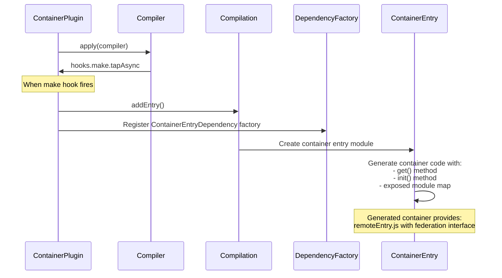
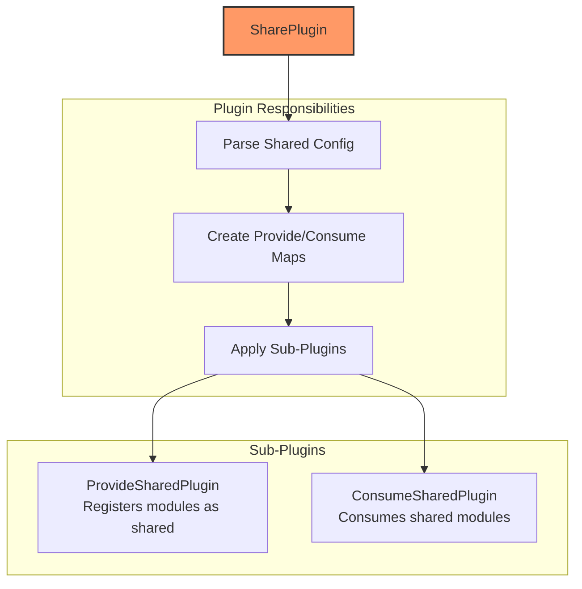
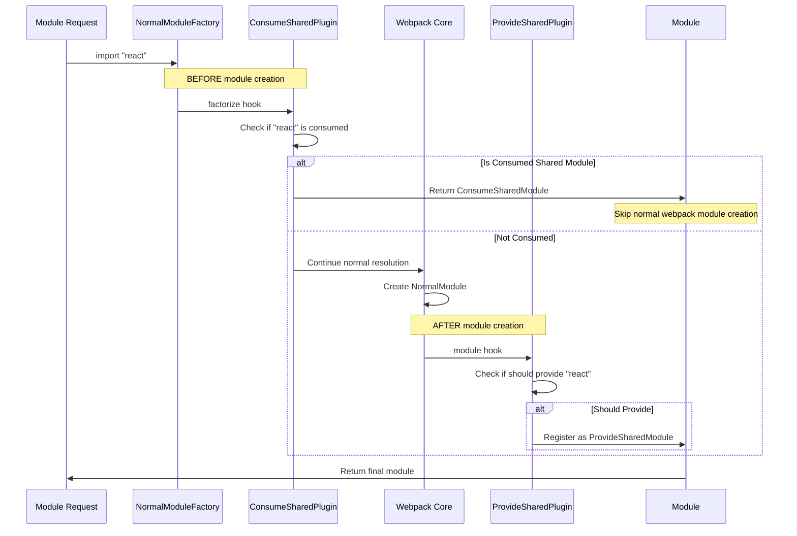
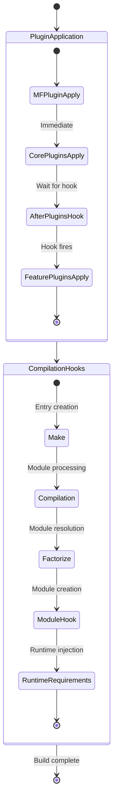

# Module Federation Plugin Architecture

This document provides a comprehensive guide to the Module Federation plugin system based on the actual webpack implementation, detailing how plugins interact with webpack during build time and the patterns other bundler teams need to implement for similar functionality.

## Table of Contents
- [Plugin Overview](#plugin-overview)
- [ModuleFederationPlugin Orchestration](#modulefederationplugin-orchestration)
- [Core Plugin Implementation](#core-plugin-implementation)
- [Webpack Integration Patterns](#webpack-integration-patterns)
- [Hook Timing and Interception](#hook-timing-and-interception)
- [Bundler Integration Requirements](#bundler-integration-requirements)

## Plugin Overview

Module Federation's plugin architecture in the `@module-federation/enhanced` package consists of a main orchestrator plugin that coordinates specialized sub-plugins:

```mermaid
graph TB
    subgraph "Enhanced Package"
        MFP[ModuleFederationPlugin<br/>Main Orchestrator]
    end
    
    subgraph "Core Plugins - Applied Immediately (in order)"
        REP[RemoteEntryPlugin<br/>@module-federation/rspack]
        FMP[FederationModulesPlugin<br/>Hook Provider]
        FRP[FederationRuntimePlugin]
    end
    
    subgraph "Feature Plugins - Applied via afterPlugins Hook"
        CP[ContainerPlugin<br/>if options.exposes]
        CRP[ContainerReferencePlugin<br/>if options.remotes]
        SP[SharePlugin<br/>always applied]
    end
    
    subgraph "Share System"
        CSP[ConsumeSharedPlugin]
        PSP[ProvideSharedPlugin]
    end
    
    subgraph "Additional Plugins (exists but not in main flow)"
        HCP[HoistContainerReferencesPlugin]
        EFRP[EmbedFederationRuntimePlugin]
    end
    
    MFP -->|"First"| REP
    MFP -->|"Second"| FMP  
    MFP -->|"Third"| FRP
    MFP -->|"afterPlugins hook"| CP
    MFP -->|"afterPlugins hook"| CRP
    MFP -->|"afterPlugins hook"| SP
    
    SP --> CSP
    SP --> PSP
    
    style MFP fill:#f96,stroke:#333,stroke-width:4px
    style REP fill:#96f,stroke:#333,stroke-width:2px
    style SP fill:#69f,stroke:#333,stroke-width:2px
```

## ModuleFederationPlugin Orchestration

Based on the actual implementation in `/packages/enhanced/src/lib/container/ModuleFederationPlugin.ts`, the main plugin follows this pattern:

### Plugin Structure

```typescript
// Actual ModuleFederationPlugin implementation pattern (packages/enhanced/src/lib/container/ModuleFederationPlugin.ts)
class ModuleFederationPlugin {
  constructor(private options: ModuleFederationPluginOptions) {}
  
  apply(compiler: Compiler) {
    // Phase 1: Apply core plugins immediately - FIXED ORDER
    // 1. RemoteEntryPlugin MUST be first (from @module-federation/rspack package)
    (new RemoteEntryPlugin(options) as unknown as WebpackPluginInstance).apply(compiler);
    
    // 2. FederationModulesPlugin - provides hooks for other plugins
    new FederationModulesPlugin().apply(compiler);
    
    // 3. FederationRuntimePlugin
    new FederationRuntimePlugin(options).apply(compiler);
    
    // Phase 2: Apply feature plugins after all plugins are registered
    compiler.hooks.afterPlugins.tap('ModuleFederationPlugin', () => {
      // Apply container plugin if exposes are configured
      if (useContainerPlugin) {
        new ContainerPlugin({
          name: options.name!,
          library,
          filename: options.filename,
          runtime: options.runtime,
          shareScope: options.shareScope,
          exposes: options.exposes!,
          runtimePlugins: options.runtimePlugins,
        }).apply(compiler);
      }
      
      // Apply container reference plugin if remotes are configured
      if (options.remotes && Object.keys(options.remotes).length > 0) {
        new ContainerReferencePlugin({
          remoteType,
          shareScope: options.shareScope,
          remotes: options.remotes,
        }).apply(compiler);
      }
      
      // SharePlugin is always applied (if options.shared exists)
      if (options.shared) {
        new SharePlugin({
          shared: options.shared,
          shareScope: options.shareScope,
        }).apply(compiler);
      }
    });
    
    // Phase 3: Webpack configuration patching
    this._patchBundlerConfig(compiler);
  }
}
```

### Critical Timing Pattern

The `afterPlugins` hook timing is crucial because:
1. **Dependency Resolution**: Ensures all user plugins are registered first
2. **Configuration Access**: Allows reading final webpack configuration
3. **Plugin Coordination**: Prevents conflicts with other webpack plugins

## Core Plugin Implementation

### ContainerPlugin - Creating Exposed Module Containers



**Key Webpack Hooks Used**:
```typescript
class ContainerPlugin {
  apply(compiler: Compiler) {
    // Hook into module creation phase
    compiler.hooks.make.tapAsync('ContainerPlugin', (compilation, callback) => {
      // Create container entry dependency
      const dep = new ContainerEntryDependency(
        this.options.name,
        this.options.exposes,
        this.options.shareScope
      );
      
      // Add as compilation entry point
      compilation.addEntry(
        compilation.options.context || compiler.context,
        dep,
        {
          name: this.options.name,
          filename: this.options.filename,
          library: this.options.library
        },
        callback
      );
    });
    
    // Register dependency factory for container entry
    compiler.hooks.compilation.tap('ContainerPlugin', (compilation) => {
      compilation.dependencyFactories.set(
        ContainerEntryDependency,
        compilation.normalModuleFactory
      );
    });
  }
}
```

### ContainerReferencePlugin - Consuming Remote Modules

```typescript
// CORRECTED: No remoteToExternals method exists - externals are built inline
class ContainerReferencePlugin {
  apply(compiler: Compiler) {
    // Apply FederationRuntimePlugin
    new FederationRuntimePlugin().apply(compiler);
    
    // Build remote externals inline (NOT via remoteToExternals method)
    const remoteExternals: Record<string, string> = {};
    for (const [key, config] of remotes) {
      let i = 0;
      for (const external of config.external) {
        if (typeof external === 'string' && external.startsWith('internal ')) {
          continue;
        }
        remoteExternals[
          `webpack/container/reference/${key}${i ? `/fallback-${i}` : ''}`
        ] = external;
        i++;
      }
    }
    
    // Apply webpack's ExternalsPlugin for remote handling
    const Externals = compiler.webpack.ExternalsPlugin || ExternalsPlugin;
    new Externals(remoteType, remoteExternals).apply(compiler);
    
    // Hook into module resolution for remote modules
    compiler.hooks.compilation.tap('ContainerReferencePlugin', 
      (compilation, { normalModuleFactory }) => {
        
        // Register dependency factories
        compilation.dependencyFactories.set(
          RemoteToExternalDependency,
          normalModuleFactory,
        );
        compilation.dependencyFactories.set(
          FallbackItemDependency,
          normalModuleFactory,
        );
        compilation.dependencyFactories.set(
          FallbackDependency,
          new FallbackModuleFactory(),
        );
        
        const hooks = FederationModulesPlugin.getCompilationHooks(compilation);
        
        normalModuleFactory.hooks.factorize.tap(
          'ContainerReferencePlugin',
          (data) => {
            if (!data.request.includes('!')) {
              for (const [key, config] of remotes) {
                if (
                  data.request.startsWith(`${key}`) &&
                  (data.request.length === key.length ||
                    data.request.charCodeAt(key.length) === slashCode)
                ) {
                  const remoteModule = new RemoteModule(
                    data.request,
                    config.external.map((external: any, i: any) =>
                      external.startsWith('internal ')
                        ? external.slice(9)
                        : `webpack/container/reference/${key}${
                            i ? `/fallback-${i}` : ''
                          }`,
                    ),
                    `.${data.request.slice(key.length)}`,
                    config.shareScope,
                  );
                  hooks.addRemoteDependency.call(remoteModule);
                  return remoteModule;
                }
              }
            }
          }
        );
        
        // Runtime requirements handling
        compilation.hooks.runtimeRequirementInTree
          .for(compiler.webpack.RuntimeGlobals.ensureChunkHandlers)
          .tap('ContainerReferencePlugin', (chunk, set) => {
            set.add(compiler.webpack.RuntimeGlobals.module);
            set.add(compiler.webpack.RuntimeGlobals.moduleFactoriesAddOnly);
            set.add(compiler.webpack.RuntimeGlobals.hasOwnProperty);
            set.add(compiler.webpack.RuntimeGlobals.initializeSharing);
            set.add(compiler.webpack.RuntimeGlobals.shareScopeMap);
            compilation.addRuntimeModule(chunk, new RemoteRuntimeModule());
          });
      }
    );
  }
}
```

### SharePlugin - Coordinating Shared Dependencies



```typescript
// CORRECTED: SharePlugin uses parseOptions utility, not parseSharedConfig method
class SharePlugin {
  constructor(options: SharePluginOptions) {
    // Uses parseOptions utility from '../container/options'
    const sharedOptions: [string, SharedConfig][] = parseOptions(
      options.shared,
      (item, key) => {
        if (typeof item !== 'string')
          throw new Error('Unexpected array in shared');
        const config: SharedConfig =
          item === key || !isRequiredVersion(item)
            ? {
                import: item,
              }
            : {
                import: key,
                requiredVersion: item,
              };
        return config;
      },
      (item) => item,
    );
    
    // Build consumes and provides arrays
    const consumes: Record<string, ConsumesConfig>[] = sharedOptions.map(
      ([key, options]) => ({
        [key]: {
          import: options.import,
          shareKey: options.shareKey || key,
          shareScope: options.shareScope,
          requiredVersion: options.requiredVersion,
          strictVersion: options.strictVersion,
          singleton: options.singleton,
          packageName: options.packageName,
          eager: options.eager,
          issuerLayer: options.issuerLayer,
          layer: options.layer,
          request: options.request || key,
          include: options.include,
          exclude: options.exclude,
        },
      }),
    );
    
    const provides: Record<string, ProvidesConfig>[] = sharedOptions
      .filter(([, options]) => options.import !== false)
      .map(([key, options]) => ({
        [options.import || key]: {
          shareKey: options.shareKey || key,
          shareScope: options.shareScope,
          version: options.version,
          eager: options.eager,
          requiredVersion: options.requiredVersion,
          strictVersion: options.strictVersion,
          singleton: options.singleton,
          layer: options.layer,
          request: options.request || options.import || key,
          include: options.include,
          exclude: options.exclude,
        },
      }));

    this._shareScope = options.shareScope || 'default';
    this._consumes = consumes;
    this._provides = provides;
  }
  
  apply(compiler: Compiler) {
    // Set webpack path environment variable
    process.env['FEDERATION_WEBPACK_PATH'] =
      process.env['FEDERATION_WEBPACK_PATH'] || getWebpackPath(compiler);

    // Apply consume shared plugin
    new ConsumeSharedPlugin({
      shareScope: this._shareScope,
      consumes: this._consumes,
    }).apply(compiler);
    
    // Apply provide shared plugin
    new ProvideSharedPlugin({
      shareScope: this._shareScope,
      provides: this._provides,
    }).apply(compiler);
  }
}
```

## Webpack Integration Patterns

### Module Resolution Interception

The key pattern for Module Federation is intercepting webpack's module resolution at two critical points:



### Critical Hook Implementation

```typescript
// CORRECTED: ConsumeSharedPlugin uses thisCompilation and createModule hooks
class ConsumeSharedPlugin {
  apply(compiler: Compiler) {
    new FederationRuntimePlugin().apply(compiler);
    
    // CORRECTED: Uses thisCompilation hook, not compilation
    compiler.hooks.thisCompilation.tap(
      'ConsumeSharedPlugin',
      (compilation: Compilation, { normalModuleFactory }) => {
        // Register dependency factories
        compilation.dependencyFactories.set(
          ConsumeSharedFallbackDependency,
          normalModuleFactory,
        );
        
        // Resolve matched configs promise
        const promise = resolveMatchedConfigs(compilation, this._consumes).then(
          ({ resolved, unresolved, prefixed }) => {
            resolvedConsumes = resolved;
            unresolvedConsumes = unresolved;
            prefixedConsumes = prefixed;
          },
        );
        
        // CRITICAL: Hook factorize to intercept before module creation
        normalModuleFactory.hooks.factorize.tapPromise(
          'ConsumeSharedPlugin',
          async (resolveData: ResolveData): Promise<Module | undefined> => {
            const { context, request, dependencies, contextInfo } = resolveData;
            return promise.then(() => {
              if (
                dependencies[0] instanceof ConsumeSharedFallbackDependency ||
                dependencies[0] instanceof ProvideForSharedDependency
              ) {
                return;
              }
              const match = unresolvedConsumes.get(
                createLookupKeyForSharing(request, contextInfo.issuerLayer),
              );

              if (match !== undefined) {
                return createConsumeSharedModule(context, request, match);
              }
              // Handle prefixed matches...
              return;
            });
          },
        );
        
        // ADDED: Missing createModule hook
        normalModuleFactory.hooks.createModule.tapPromise(
          'ConsumeSharedPlugin',
          ({ resource }, { context, dependencies }) => {
            if (
              dependencies[0] instanceof ConsumeSharedFallbackDependency ||
              dependencies[0] instanceof ProvideForSharedDependency
            ) {
              return Promise.resolve();
            }
            if (resource) {
              const options = resolvedConsumes.get(resource);
              if (options !== undefined) {
                return createConsumeSharedModule(context, resource, options);
              }
            }
            return Promise.resolve();
          },
        );
      }
    );
  }
}

// CORRECTED: ProvideSharedPlugin uses compilation hook for module processing and finishMake for dependency addition
class ProvideSharedPlugin {
  apply(compiler: Compiler) {
    new FederationRuntimePlugin().apply(compiler);
    
    const compilationData: WeakMap<Compilation, ResolvedProvideMap> = new WeakMap();
    
    compiler.hooks.compilation.tap(
      'ProvideSharedPlugin',
      (compilation: Compilation, { normalModuleFactory }) => {
        const resolvedProvideMap: ResolvedProvideMap = new Map();
        // ... build provide maps
        
        compilationData.set(compilation, resolvedProvideMap);
        
        // Hook module to inspect created modules
        normalModuleFactory.hooks.module.tap(
          'ProvideSharedPlugin',
          (module, { resource, resourceResolveData }, resolveData) => {
            const moduleLayer = module.layer;
            const lookupKey = createLookupKeyForSharing(
              resource || '',
              moduleLayer || undefined,
            );

            if (resource && resolvedProvideMap.has(lookupKey)) {
              return module;
            }
            
            const { request } = resolveData;
            const requestKey = createLookupKeyForSharing(
              request,
              moduleLayer || undefined,
            );
            const config = matchProvides.get(requestKey);
            if (config !== undefined && resource) {
              this.provideSharedModule(
                compilation,
                resolvedProvideMap,
                request,
                config,
                resource,
                resourceResolveData,
              );
              resolveData.cacheable = false;
            }
            
            return module;
          }
        );
        
        // Register dependency factories
        compilation.dependencyFactories.set(
          ProvideForSharedDependency,
          normalModuleFactory,
        );
        compilation.dependencyFactories.set(
          ProvideSharedDependency,
          new ProvideSharedModuleFactory(),
        );
      }
    );
    
    // ADDED: Missing finishMake hook for adding provide shared dependencies
    compiler.hooks.finishMake.tapPromise(
      'ProvideSharedPlugin',
      async (compilation: Compilation) => {
        const resolvedProvideMap = compilationData.get(compilation);
        if (!resolvedProvideMap) return;

        await Promise.all(
          Array.from(
            resolvedProvideMap,
            ([resourceKey, { config, version, resource }]) => {
              return new Promise<void>((resolve, reject) => {
                compilation.addInclude(
                  compiler.context,
                  new ProvideSharedDependency(
                    config.shareScope!,
                    config.shareKey!,
                    version || false,
                    resource || resourceKey,
                    config.eager!,
                    config.requiredVersion!,
                    config.strictVersion!,
                    config.singleton!,
                    config.layer,
                  ),
                  {
                    name: undefined,
                  },
                  (err?: WebpackErrorType | null | undefined) => {
                    if (err) {
                      return reject(err);
                    }
                    resolve();
                  },
                );
              });
            },
          ),
        );
      },
    );
  }
}
```

## Hook Timing and Interception

### Webpack Plugin Lifecycle Integration



### Essential Webpack Hooks for Federation

```typescript
interface EssentialWebpackHooks {
  // Plugin coordination
  'compiler.hooks.afterPlugins': 'Coordinate plugin application order';
  
  // Entry point creation
  'compiler.hooks.make': 'Create container entries and federation dependencies';
  
  // Module resolution interception
  'normalModuleFactory.hooks.factorize': 'Intercept module requests BEFORE creation';
  'normalModuleFactory.hooks.createModule': 'Create modules during resolution';
  'normalModuleFactory.hooks.module': 'Process modules AFTER creation';
  
  // Compilation setup
  'compiler.hooks.compilation': 'Register dependency factories and basic setup';
  'compiler.hooks.thisCompilation': 'Register dependency factories and templates';
  
  // Dependency management
  'compiler.hooks.finishMake': 'Add provide shared dependencies to compilation';
  
  // Runtime code injection
  'compilation.hooks.runtimeRequirementInTree': 'Add federation runtime requirements';
  'compilation.hooks.additionalTreeRuntimeRequirements': 'Add runtime requirements to chunks';
  'compilation.addRuntimeModule': 'Inject federation runtime modules';
  
  // Optimization integration
  'compiler.hooks.compilation': 'Access optimization configuration';
}
```

## Bundler Integration Requirements

### Required Bundler Capabilities

For other bundlers to support Module Federation, they need these core capabilities:

#### 1. **Plugin System with Lifecycle Hooks**
```typescript
interface BundlerPluginSystem {
  // Equivalent to webpack's plugin application
  onPluginsRegistered: Hook;
  
  // Equivalent to webpack's make hook
  onEntryCreation: AsyncHook;
  
  // Equivalent to webpack's compilation hook
  onCompilationStart: Hook;
  
  // Module resolution hooks
  onModuleFactorize: AsyncHook<[ResolveData]>;
  onModuleCreated: Hook<[Module, CreateData, ResolveData]>;
  
  // Runtime injection
  onRuntimeRequirement: Hook<[Chunk, RuntimeRequirement]>;
}
```

#### 2. **Module Factory System**
```typescript
interface BundlerModuleFactory {
  // Create different module types
  createModule(type: string, options: any): Module;
  
  // Register custom module factories
  registerModuleFactory(dependency: Function, factory: ModuleFactory): void;
  
  // Register module templates for code generation
  registerModuleTemplate(dependency: Function, template: Template): void;
}
```

#### 3. **Entry Point Management**
```typescript
interface BundlerEntrySystem {
  // Add new entry points dynamically
  addEntry(context: string, dependency: Dependency, options: EntryOptions): Promise<void>;
  
  // Control entry point compilation
  setEntryOptions(name: string, options: { filename?: string; library?: LibraryOptions }): void;
}
```

#### 4. **External Module Support**
```typescript
interface BundlerExternalSystem {
  // Mark modules as external (not bundled)
  addExternal(request: string, config: ExternalConfig): void;
  
  // Handle external module loading at runtime
  generateExternalLoader(external: ExternalConfig): string;
}
```

#### 5. **Runtime Code Injection**
```typescript
interface BundlerRuntimeSystem {
  // Add runtime modules to chunks
  addRuntimeModule(chunk: Chunk, module: RuntimeModule): void;
  
  // Add runtime requirements
  addRuntimeRequirement(chunk: Chunk, requirement: string): void;
  
  // Generate runtime code
  generateRuntimeCode(requirements: Set<string>): string;
}
```

### Implementation Pattern for Other Bundlers

```typescript
// Example pattern for Vite/Rollup/ESBuild
class ModuleFederationBundlerPlugin {
  apply(bundler: Bundler) {
    // Phase 1: Apply core plugins immediately  
    new BundlerFederationRuntimePlugin(this.options).apply(bundler);
    
    // Phase 2: Apply feature plugins after all plugins registered
    bundler.hooks.afterPlugins.tap('ModuleFederation', () => {
      if (this.options.exposes) {
        new BundlerContainerPlugin(this.options).apply(bundler);
      }
      
      if (this.options.remotes) {
        new BundlerRemotePlugin(this.options).apply(bundler);
      }
      
      // Always apply sharing
      new BundlerSharePlugin(this.options).apply(bundler);
    });
  }
}

// Bundler-specific container plugin
class BundlerContainerPlugin {
  apply(bundler: Bundler) {
    // Hook into bundler's entry creation
    bundler.hooks.generateBundle.tap('Container', (bundle) => {
      // Generate container entry file
      bundle['remoteEntry.js'] = this.generateContainerEntry();
    });
  }
  
  private generateContainerEntry(): string {
    return `
      // Bundler-specific container implementation
      const moduleMap = ${JSON.stringify(this.generateModuleMap())};
      
      const get = (module) => {
        return ${this.getBundlerModuleLoader()}(moduleMap[module]);
      };
      
      const init = (shareScope) => {
        // Initialize with bundler's share scope system
        return ${this.getBundlerShareInitializer()}(shareScope);
      };
      
      export { get, init };
    `;
  }
}
```

### Integration Checklist for Bundler Teams

- [ ] **Plugin coordination system** - Equivalent to webpack's afterPlugins hook
- [ ] **Module resolution interception** - Before and after module creation hooks  
- [ ] **Custom module types** - Support for federation-specific modules
- [ ] **Entry point management** - Dynamic entry creation and configuration
- [ ] **External module handling** - Mark modules as external/remote
- [ ] **Runtime code injection** - Inject federation runtime into bundles
- [ ] **Chunk optimization control** - Prevent federation assets from being split
- [ ] **Share scope integration** - Runtime sharing system
- [ ] **Error handling** - Graceful fallbacks for federation failures
- [ ] **Development support** - HMR and development server integration

## Additional Plugin Components

### FederationModulesPlugin - Hook Provider

```typescript
// FederationModulesPlugin serves as a hook provider for other federation plugins
class FederationModulesPlugin {
  static getCompilationHooks(compilation: Compilation): CompilationHooks {
    let hooks = compilationHooksMap.get(compilation);
    if (hooks === undefined) {
      hooks = {
        addContainerEntryDependency: new SyncHook(['dependency']),
        addFederationRuntimeDependency: new SyncHook(['dependency']),
        addRemoteDependency: new SyncHook(['dependency']),
      };
      compilationHooksMap.set(compilation, hooks);
    }
    return hooks;
  }
  
  apply(compiler: Compiler) {
    compiler.hooks.compilation.tap(
      'FederationModulesPlugin',
      (compilation: Compilation, { normalModuleFactory }) => {
        // Just provides hooks for other plugins to use
        const hooks = FederationModulesPlugin.getCompilationHooks(compilation);
      },
    );
  }
}
```

### FederationRuntimeDependency

```typescript
// Simple dependency type for federation runtime modules
class FederationRuntimeDependency extends ModuleDependency {
  constructor(request: string) {
    super(request);
  }

  override get type() {
    return 'federation runtime dependency';
  }
}
```

### Additional Available Plugins

The enhanced package also includes:
- `HoistContainerReferencesPlugin` - For hoisting container references
- `EmbedFederationRuntimePlugin` - For embedding federation runtime

These plugins exist but are not part of the main ModuleFederationPlugin flow.

## Key Implementation Insights

1. **Plugin Order is Critical**: RemoteEntryPlugin MUST be applied first, followed by FederationModulesPlugin, then FederationRuntimePlugin
2. **RemoteEntryPlugin Source**: Comes from `@module-federation/rspack` package, not local enhanced package
3. **Three-Phase Hook Usage**: factorize (before), createModule (during), module (after) hooks for complete module control
4. **SharePlugin Uses parseOptions**: Uses the `parseOptions` utility function, not a custom `parseSharedConfig` method
5. **No remoteToExternals Method**: ContainerReferencePlugin builds externals inline, doesn't have a separate method
6. **Missing Hooks Matter**: thisCompilation, finishMake, and createModule hooks are essential for proper operation
7. **FederationModulesPlugin is Hook Provider**: Only provides hooks for other plugins, doesn't do heavy processing
8. **Configuration Patching**: Direct webpack config modification prevents optimization conflicts  
9. **Runtime Integration**: Federation runtime must be injected into webpack's module system
10. **Dependency Management**: Custom dependency types enable federation-specific behavior
11. **Webpack Coupling**: Tightly coupled to webpack's internal APIs and lifecycle

This architecture provides a robust foundation for implementing Module Federation in any bundler that supports similar plugin and module systems.

## Related Documentation

For comprehensive understanding, see:
- [Architecture Overview](./architecture-overview.md) - High-level system architecture
- [Runtime Architecture](./runtime-architecture.md) - Runtime behavior and lifecycle hooks
- [Implementation Guide](./implementation-guide.md) - Practical implementation steps
- [SDK Reference](./sdk-reference.md) - Plugin interfaces and types
- [Manifest Specification](./manifest-specification.md) - Build-time manifest generation
- [Error Handling Specification](./error-handling-specification.md) - Error patterns and plugin error handling
- [Advanced Topics](./advanced-topics.md) - Production plugin patterns and performance considerations