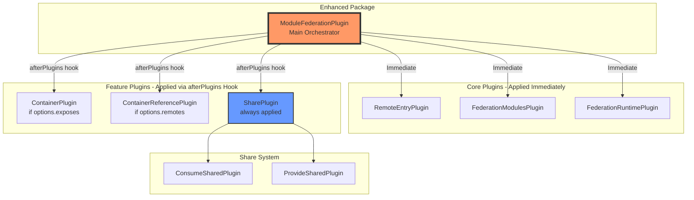
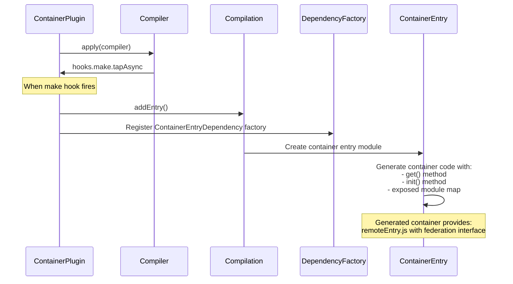
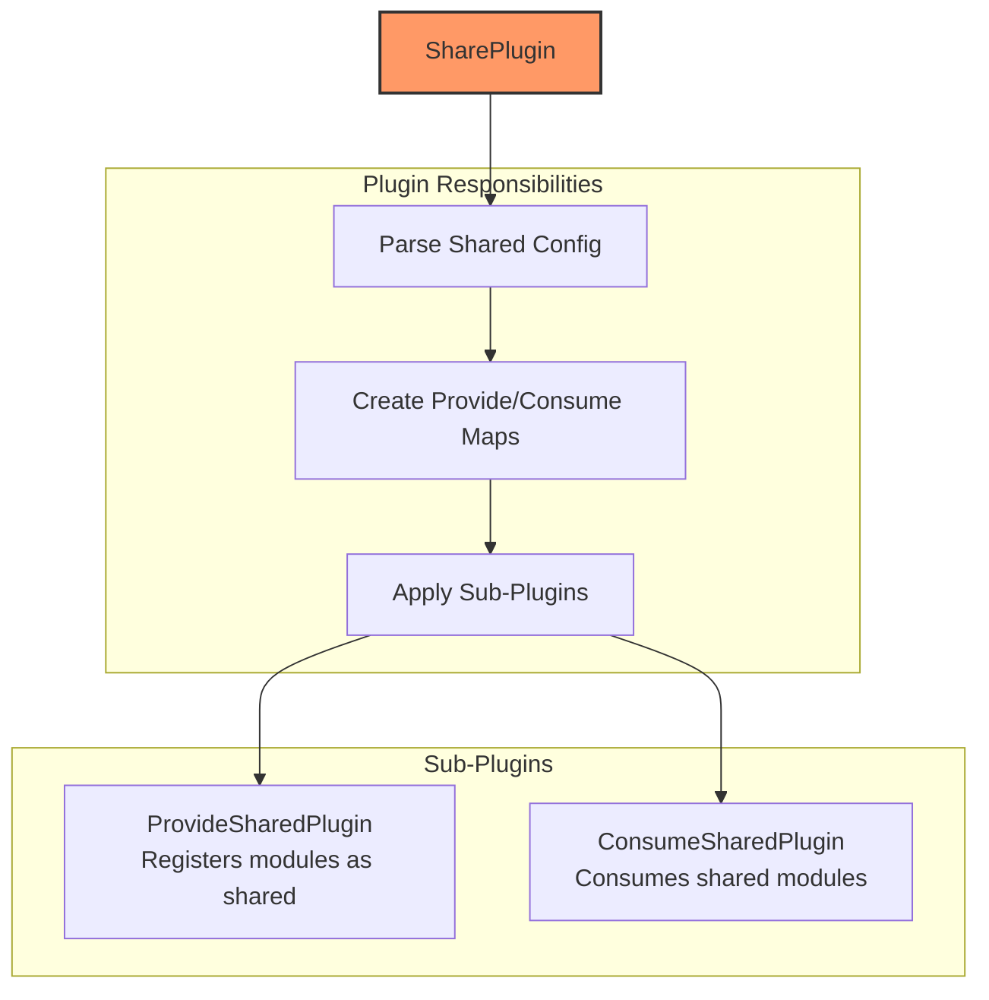
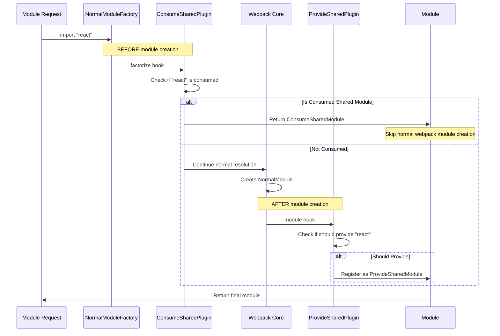
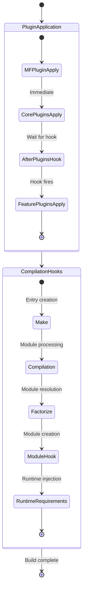

# Module Federation Plugin Architecture

This document provides a comprehensive guide to the Module Federation plugin system based on the actual webpack implementation, detailing how plugins interact with webpack during build time and the patterns other bundler teams need to implement for similar functionality.

## Table of Contents
- [Plugin Overview](#plugin-overview)
- [ModuleFederationPlugin Orchestration](#modulefederationplugin-orchestration)
- [Core Plugin Implementation](#core-plugin-implementation)
- [Webpack Integration Patterns](#webpack-integration-patterns)
- [Hook Timing and Interception](#hook-timing-and-interception)
- [Bundler Integration Requirements](#bundler-integration-requirements)

## Plugin Overview

Module Federation's plugin architecture in the `@module-federation/enhanced` package consists of a main orchestrator plugin that coordinates specialized sub-plugins:



## ModuleFederationPlugin Orchestration

Based on the actual implementation in `/packages/enhanced/src/lib/container/ModuleFederationPlugin.ts`, the main plugin follows this pattern:

### Plugin Structure

```typescript
// Actual ModuleFederationPlugin implementation pattern
class ModuleFederationPlugin {
  constructor(private options: ModuleFederationPluginOptions) {}
  
  apply(compiler: Compiler) {
    // Phase 1: Apply core plugins immediately
    new RemoteEntryPlugin().apply(compiler);
    new FederationModulesPlugin().apply(compiler);  
    new FederationRuntimePlugin(this.options).apply(compiler);
    
    // Phase 2: Apply feature plugins after all plugins are registered
    compiler.hooks.afterPlugins.tap('ModuleFederationPlugin', () => {
      // Apply container plugin if exposes are configured
      if (this.options.exposes && Object.keys(this.options.exposes).length > 0) {
        new ContainerPlugin({
          name: this.options.name,
          library: this.options.library,
          filename: this.options.filename,
          exposes: this.options.exposes,
          shareScope: this.options.shareScope
        }).apply(compiler);
      }
      
      // Apply container reference plugin if remotes are configured
      if (this.options.remotes && Object.keys(this.options.remotes).length > 0) {
        new ContainerReferencePlugin({
          remoteType: this.options.library?.type || 'var',
          remotes: this.options.remotes,
          shareScope: this.options.shareScope
        }).apply(compiler);
      }
      
      // SharePlugin is always applied
      new SharePlugin({
        shared: this.options.shared || {},
        shareScope: this.options.shareScope || 'default'
      }).apply(compiler);
    });
    
    // Phase 3: Webpack configuration patching
    this.patchWebpackConfig(compiler);
  }
  
  private patchWebpackConfig(compiler: Compiler) {
    // Prevent federation containers from being split by webpack optimizations
    if (compiler.options.optimization?.splitChunks) {
      const splitChunks = compiler.options.optimization.splitChunks;
      if (typeof splitChunks === 'object' && splitChunks.cacheGroups) {
        splitChunks.cacheGroups.federation = {
          test: /container-entry/,
          name: false,
          chunks: 'all',
          enforce: true
        };
      }
    }
  }
}
```

### Critical Timing Pattern

The `afterPlugins` hook timing is crucial because:
1. **Dependency Resolution**: Ensures all user plugins are registered first
2. **Configuration Access**: Allows reading final webpack configuration
3. **Plugin Coordination**: Prevents conflicts with other webpack plugins

## Core Plugin Implementation

### ContainerPlugin - Creating Exposed Module Containers



**Key Webpack Hooks Used**:
```typescript
class ContainerPlugin {
  apply(compiler: Compiler) {
    // Hook into module creation phase
    compiler.hooks.make.tapAsync('ContainerPlugin', (compilation, callback) => {
      // Create container entry dependency
      const dep = new ContainerEntryDependency(
        this.options.name,
        this.options.exposes,
        this.options.shareScope
      );
      
      // Add as compilation entry point
      compilation.addEntry(
        compilation.options.context || compiler.context,
        dep,
        {
          name: this.options.name,
          filename: this.options.filename,
          library: this.options.library
        },
        callback
      );
    });
    
    // Register dependency factory for container entry
    compiler.hooks.compilation.tap('ContainerPlugin', (compilation) => {
      compilation.dependencyFactories.set(
        ContainerEntryDependency,
        compilation.normalModuleFactory
      );
    });
  }
}
```

### ContainerReferencePlugin - Consuming Remote Modules

```typescript
class ContainerReferencePlugin {
  apply(compiler: Compiler) {
    // Convert remotes to webpack externals
    const externals = this.remoteToExternals(this.options.remotes);
    
    // Apply webpack's ExternalsPlugin for remote handling
    new ExternalsPlugin(this.options.remoteType, externals).apply(compiler);
    
    // Hook into module resolution for remote modules
    compiler.hooks.compilation.tap('ContainerReferencePlugin', 
      (compilation, { normalModuleFactory }) => {
        
        normalModuleFactory.hooks.factorize.tap(
          'ContainerReferencePlugin',
          (resolveData) => {
            // Check if request is for a remote module
            if (this.isRemoteRequest(resolveData.request)) {
              // Create RemoteModule instead of normal module
              return new RemoteModule(
                resolveData.request,
                this.getRemoteConfig(resolveData.request)
              );
            }
          }
        );
      }
    );
  }
  
  private remoteToExternals(remotes: Record<string, string>) {
    const externals: Record<string, ExternalItemValue> = {};
    
    Object.entries(remotes).forEach(([name, config]) => {
      // Parse remote configuration (name@url format)
      const [remoteName, remoteUrl] = config.split('@');
      
      externals[name] = {
        external: remoteUrl || remoteName,
        type: this.options.remoteType
      };
    });
    
    return externals;
  }
}
```

### SharePlugin - Coordinating Shared Dependencies



```typescript
class SharePlugin {
  apply(compiler: Compiler) {
    // Parse shared configuration into provides and consumes
    const { provides, consumes } = this.parseSharedConfig(this.options.shared);
    
    // Apply provide shared plugin
    new ProvideSharedPlugin({
      provides,
      shareScope: this.options.shareScope
    }).apply(compiler);
    
    // Apply consume shared plugin  
    new ConsumeSharedPlugin({
      consumes,
      shareScope: this.options.shareScope
    }).apply(compiler);
  }
  
  private parseSharedConfig(shared: SharedConfig) {
    const provides = new Map();
    const consumes = new Map();
    
    Object.entries(shared).forEach(([key, config]) => {
      // Every shared module can be both provided and consumed
      provides.set(key, this.normalizeSharedItem(config));
      consumes.set(key, this.normalizeSharedItem(config));
    });
    
    return { provides, consumes };
  }
}
```

## Webpack Integration Patterns

### Module Resolution Interception

The key pattern for Module Federation is intercepting webpack's module resolution at two critical points:



### Critical Hook Implementation

```typescript
// ConsumeSharedPlugin - Intercepts BEFORE module creation
class ConsumeSharedPlugin {
  apply(compiler: Compiler) {
    compiler.hooks.compilation.tap('ConsumeSharedPlugin', 
      (compilation, { normalModuleFactory }) => {
        
        // CRITICAL: Hook factorize to intercept before module creation
        normalModuleFactory.hooks.factorize.tapPromise(
          'ConsumeSharedPlugin',
          async (resolveData) => {
            const request = resolveData.request;
            
            if (this.consumes.has(request)) {
              const config = this.consumes.get(request);
              
              // Return custom module - prevents normal module creation
              return new ConsumeSharedModule({
                context: resolveData.context,
                shareScope: config.shareScope,
                shareKey: config.shareKey,
                requiredVersion: config.requiredVersion,
                singleton: config.singleton,
                strictVersion: config.strictVersion,
                fallback: config.fallback
              });
            }
            
            // Return undefined to continue normal webpack flow
            return undefined;
          }
        );
      }
    );
  }
}

// ProvideSharedPlugin - Intercepts AFTER module creation
class ProvideSharedPlugin {
  apply(compiler: Compiler) {
    compiler.hooks.compilation.tap('ProvideSharedPlugin',
      (compilation, { normalModuleFactory }) => {
        
        // Hook module to inspect created modules
        normalModuleFactory.hooks.module.tap(
          'ProvideSharedPlugin',
          (module, createData, resolveData) => {
            const request = resolveData.request;
            
            if (this.provides.has(request) && createData.resource) {
              const config = this.provides.get(request);
              
              // Register module in share scope
              this.registerSharedModule(
                compilation,
                request,
                config,
                createData.resource
              );
              
              // Mark resolve data as non-cacheable
              resolveData.cacheable = false;
            }
            
            return module; // Always return the module
          }
        );
      }
    );
  }
}
```

## Hook Timing and Interception

### Webpack Plugin Lifecycle Integration



### Essential Webpack Hooks for Federation

```typescript
interface EssentialWebpackHooks {
  // Plugin coordination
  'compiler.hooks.afterPlugins': 'Coordinate plugin application order';
  
  // Entry point creation
  'compiler.hooks.make': 'Create container entries and federation dependencies';
  
  // Module resolution interception
  'normalModuleFactory.hooks.factorize': 'Intercept module requests BEFORE creation';
  'normalModuleFactory.hooks.module': 'Process modules AFTER creation';
  
  // Compilation setup
  'compiler.hooks.thisCompilation': 'Register dependency factories and templates';
  
  // Runtime code injection
  'compilation.hooks.runtimeRequirementInTree': 'Add federation runtime requirements';
  'compilation.addRuntimeModule': 'Inject federation runtime modules';
  
  // Optimization integration
  'compiler.hooks.compilation': 'Access optimization configuration';
}
```

## Bundler Integration Requirements

### Required Bundler Capabilities

For other bundlers to support Module Federation, they need these core capabilities:

#### 1. **Plugin System with Lifecycle Hooks**
```typescript
interface BundlerPluginSystem {
  // Equivalent to webpack's plugin application
  onPluginsRegistered: Hook;
  
  // Equivalent to webpack's make hook
  onEntryCreation: AsyncHook;
  
  // Equivalent to webpack's compilation hook
  onCompilationStart: Hook;
  
  // Module resolution hooks
  onModuleFactorize: AsyncHook<[ResolveData]>;
  onModuleCreated: Hook<[Module, CreateData, ResolveData]>;
  
  // Runtime injection
  onRuntimeRequirement: Hook<[Chunk, RuntimeRequirement]>;
}
```

#### 2. **Module Factory System**
```typescript
interface BundlerModuleFactory {
  // Create different module types
  createModule(type: string, options: any): Module;
  
  // Register custom module factories
  registerModuleFactory(dependency: Function, factory: ModuleFactory): void;
  
  // Register module templates for code generation
  registerModuleTemplate(dependency: Function, template: Template): void;
}
```

#### 3. **Entry Point Management**
```typescript
interface BundlerEntrySystem {
  // Add new entry points dynamically
  addEntry(context: string, dependency: Dependency, options: EntryOptions): Promise<void>;
  
  // Control entry point compilation
  setEntryOptions(name: string, options: { filename?: string; library?: LibraryOptions }): void;
}
```

#### 4. **External Module Support**
```typescript
interface BundlerExternalSystem {
  // Mark modules as external (not bundled)
  addExternal(request: string, config: ExternalConfig): void;
  
  // Handle external module loading at runtime
  generateExternalLoader(external: ExternalConfig): string;
}
```

#### 5. **Runtime Code Injection**
```typescript
interface BundlerRuntimeSystem {
  // Add runtime modules to chunks
  addRuntimeModule(chunk: Chunk, module: RuntimeModule): void;
  
  // Add runtime requirements
  addRuntimeRequirement(chunk: Chunk, requirement: string): void;
  
  // Generate runtime code
  generateRuntimeCode(requirements: Set<string>): string;
}
```

### Implementation Pattern for Other Bundlers

```typescript
// Example pattern for Vite/Rollup/ESBuild
class ModuleFederationBundlerPlugin {
  apply(bundler: Bundler) {
    // Phase 1: Apply core plugins immediately  
    new BundlerFederationRuntimePlugin(this.options).apply(bundler);
    
    // Phase 2: Apply feature plugins after all plugins registered
    bundler.hooks.afterPlugins.tap('ModuleFederation', () => {
      if (this.options.exposes) {
        new BundlerContainerPlugin(this.options).apply(bundler);
      }
      
      if (this.options.remotes) {
        new BundlerRemotePlugin(this.options).apply(bundler);
      }
      
      // Always apply sharing
      new BundlerSharePlugin(this.options).apply(bundler);
    });
  }
}

// Bundler-specific container plugin
class BundlerContainerPlugin {
  apply(bundler: Bundler) {
    // Hook into bundler's entry creation
    bundler.hooks.generateBundle.tap('Container', (bundle) => {
      // Generate container entry file
      bundle['remoteEntry.js'] = this.generateContainerEntry();
    });
  }
  
  private generateContainerEntry(): string {
    return `
      // Bundler-specific container implementation
      const moduleMap = ${JSON.stringify(this.generateModuleMap())};
      
      const get = (module) => {
        return ${this.getBundlerModuleLoader()}(moduleMap[module]);
      };
      
      const init = (shareScope) => {
        // Initialize with bundler's share scope system
        return ${this.getBundlerShareInitializer()}(shareScope);
      };
      
      export { get, init };
    `;
  }
}
```

### Integration Checklist for Bundler Teams

- [ ] **Plugin coordination system** - Equivalent to webpack's afterPlugins hook
- [ ] **Module resolution interception** - Before and after module creation hooks  
- [ ] **Custom module types** - Support for federation-specific modules
- [ ] **Entry point management** - Dynamic entry creation and configuration
- [ ] **External module handling** - Mark modules as external/remote
- [ ] **Runtime code injection** - Inject federation runtime into bundles
- [ ] **Chunk optimization control** - Prevent federation assets from being split
- [ ] **Share scope integration** - Runtime sharing system
- [ ] **Error handling** - Graceful fallbacks for federation failures
- [ ] **Development support** - HMR and development server integration

## Key Implementation Insights

1. **Timing is Critical**: The `afterPlugins` hook ensures proper plugin coordination
2. **Two-Phase Interception**: Factorize (before) and module (after) hooks enable complete control
3. **Configuration Patching**: Direct webpack config modification prevents optimization conflicts  
4. **Runtime Integration**: Federation runtime must be injected into webpack's module system
5. **Dependency Management**: Custom dependency types enable federation-specific behavior

This architecture provides a robust foundation for implementing Module Federation in any bundler that supports similar plugin and module systems.

## Next Steps

- Review [Runtime Architecture](./runtime-architecture.md) for runtime implementation details
- Check [SDK Reference](./sdk-reference.md) for types and utilities
- Follow [Implementation Guide](./implementation-guide.md) for step-by-step integration
- Study [Advanced Topics](./advanced-topics.md) for optimization strategies