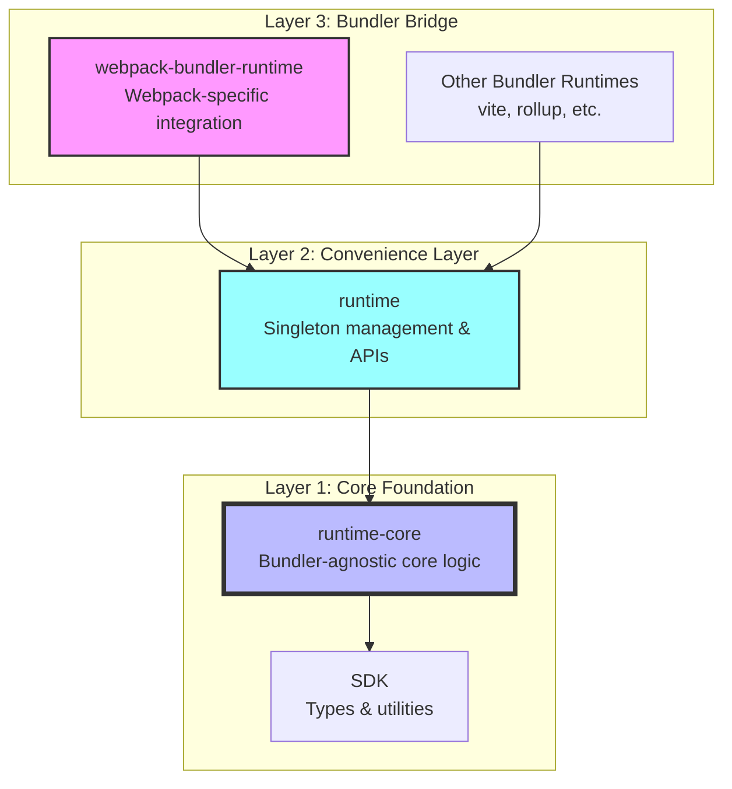
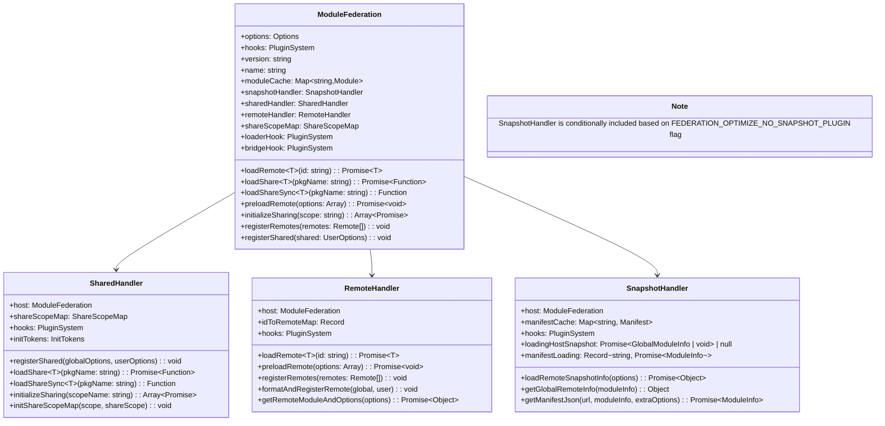
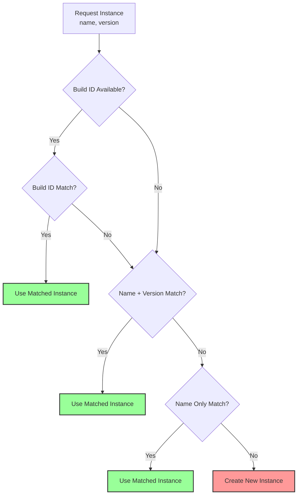
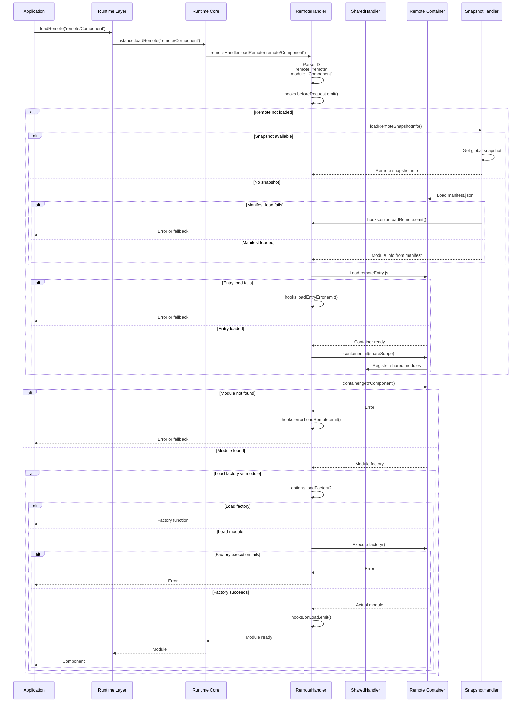

# Module Federation Runtime Architecture

This document details the actual runtime architecture of Module Federation based on the real implementation, explaining how the three runtime layers work together to enable dynamic module sharing.

## Table of Contents
- [Runtime Package Structure](#runtime-package-structure)
- [Runtime Core Architecture](#runtime-core-architecture)
- [Runtime Convenience Layer](#runtime-convenience-layer)
- [Webpack Bundler Runtime Bridge](#webpack-bundler-runtime-bridge)
- [Global Instance Management](#global-instance-management)
- [Hook System Implementation](#hook-system-implementation)
- [Module Loading Architecture](#module-loading-architecture)

## Runtime Package Structure

Module Federation's runtime consists of three distinct packages that build upon each other:



### Package Dependencies

```typescript
// @module-federation/webpack-bundler-runtime depends on runtime
import * as runtime from '@module-federation/runtime';

// @module-federation/runtime depends on runtime-core
import { ModuleFederation, type UserOptions } from '@module-federation/runtime-core';

// @module-federation/runtime-core depends on SDK
import { loadScript, loadScriptNode } from '@module-federation/sdk';
```

## Runtime Core Architecture

### Core ModuleFederation Class

The foundation of the runtime system is the `ModuleFederation` class in `@module-federation/runtime-core`:

### Conditional Feature Inclusion

The `SnapshotHandler` is conditionally included based on the `FEDERATION_OPTIMIZE_NO_SNAPSHOT_PLUGIN` build-time flag:

```typescript
// Declared in core.ts with DefinePlugin
declare const FEDERATION_OPTIMIZE_NO_SNAPSHOT_PLUGIN: boolean;
const USE_SNAPSHOT =
  typeof FEDERATION_OPTIMIZE_NO_SNAPSHOT_PLUGIN === 'boolean'
    ? !FEDERATION_OPTIMIZE_NO_SNAPSHOT_PLUGIN
    : true; // Default to true (use snapshot) when not explicitly defined
```

When `FEDERATION_OPTIMIZE_NO_SNAPSHOT_PLUGIN` is `true`, snapshot functionality is disabled for smaller bundle sizes.

Import map entry preservation is controlled by the `FEDERATION_OPTIMIZE_NO_IMPORTMAP` build-time flag:

```typescript
// Declared in remote/index.ts with DefinePlugin
declare const FEDERATION_OPTIMIZE_NO_IMPORTMAP: boolean;
const USE_IMPORTMAP =
  typeof FEDERATION_OPTIMIZE_NO_IMPORTMAP === 'boolean'
    ? !FEDERATION_OPTIMIZE_NO_IMPORTMAP
    : true; // Default to true (enable import map support)
```

When `FEDERATION_OPTIMIZE_NO_IMPORTMAP` is `true`, import map-specific handling is tree-shaken from runtime-core.



### Handler Responsibilities

#### SharedHandler - Dependency Resolution
```typescript
// Actual implementation responsibilities
class SharedHandler {
  // 1. Register shared dependencies in global share scope
  registerShared(globalOptions: Options, userOptions: UserOptions) {
    // Maps shared configs to shareScopeMap
    // Handles version resolution strategies
    // Sets up eager/singleton constraints
  }
  
  // 2. Load shared modules with version negotiation
  async loadShare<T>(pkgName: string, extraOptions = {}): Promise<false | (() => T)> {
    // Resolves best version from available providers
    // Handles singleton conflicts
    // Supports fallback mechanisms
    // Implements both version-first and loaded-first strategies
  }
  
  // 3. Synchronous loading for build-time scenarios
  loadShareSync<T>(pkgName: string, extraOptions = {}): () => T | never {
    // Synchronous version of loadShare
    // Throws errors instead of returning Promise rejections
    // Used for server-side rendering and build-time resolution
  }
  
  // 4. Initialize sharing across multiple containers
  initializeSharing(shareScopeName = 'default', extraOptions = {}): Array<Promise<void>> {
    // Sets up share scope coordination
    // Handles cross-container sharing
    // Returns array of initialization promises
  }
}
```

#### RemoteHandler - Module Loading
```typescript
class RemoteHandler {
  // 1. Load remote modules with proper resolution
  async loadRemote<T>(id: string, options = {}): Promise<T | null> {
    // Parses remote ID (remoteName/modulePath)
    // Loads remote entry if not cached
    // Initializes container with share scope
    // Returns module factory or actual module
  }
  
  // 2. Preload remote assets for performance
  async preloadRemote(preloadOptions: Array<PreloadRemoteArgs>): Promise<void> {
    // Loads remote entries in parallel
    // Preloads specified modules
    // Handles preload failures gracefully
  }
  
  // 3. Register and validate remote configurations
  registerRemotes(remotes: Remote[], options = { force: false }): void {
    // Normalizes remote configurations
    // Validates remote entry URLs
    // Updates idToRemoteMap for resolution
  }
  
  // 4. Format remotes during initialization
  formatAndRegisterRemote(globalOptions: Options, userOptions: UserOptions) {
    // Processes raw remote configuration
    // Handles different remote formats (URL, alias, etc.)
    // Sets up remote metadata for loading
  }
  
  // 5. Remove registered remote (private method)
  private removeRemote(remote: Remote): void {
    // Removes remote from host.options.remotes array
    // Clears module cache entries for the remote
    // Handles cleanup of loaded remote modules
    // Used internally when force-registering existing remotes
  }
}
```

## Runtime Convenience Layer

The `@module-federation/runtime` package provides singleton management and simplified APIs:

### Singleton Pattern Implementation
```typescript
// Actual singleton implementation in runtime package
import { ModuleFederation, getGlobalFederationConstructor, setGlobalFederationInstance } from '@module-federation/runtime-core';

let FederationInstance: ModuleFederation | null = null;

export function createInstance(options: UserOptions) {
  const ModuleFederationConstructor = getGlobalFederationConstructor() || ModuleFederation;
  return new ModuleFederationConstructor(options);
}

export function init(options: UserOptions): ModuleFederation {
  const instance = getGlobalFederationInstance(options.name, options.version);
  if (!instance) {
    FederationInstance = createInstance(options);
    setGlobalFederationInstance(FederationInstance);
    return FederationInstance;
  } else {
    instance.initOptions(options);
    if (!FederationInstance) {
      FederationInstance = instance;
    }
    return instance;
  }
}

// Convenience methods that delegate to singleton
export function loadRemote<T>(...args: Parameters<ModuleFederation['loadRemote']>): Promise<T | null> {
  assert(FederationInstance, 'Federation instance not initialized');
  return FederationInstance.loadRemote<T>(...args);
}

export function loadShare<T>(...args: Parameters<ModuleFederation['loadShare']>): Promise<false | (() => T | undefined)> {
  assert(FederationInstance, 'Federation instance not initialized');
  return FederationInstance.loadShare<T>(...args);
}
```

### Build Identifier Integration
```typescript
// Build identifier support for instance resolution
export function getBuilderId(): string {
  //@ts-ignore
  return typeof FEDERATION_BUILD_IDENTIFIER !== 'undefined'
    ? //@ts-ignore
      FEDERATION_BUILD_IDENTIFIER
    : '';
}

export function getGlobalFederationInstance(
  name: string,
  version: string | undefined,
): ModuleFederation | undefined {
  const buildId = getBuilderId();
  return CurrentGlobal.__FEDERATION__.__INSTANCES__.find((GMInstance) => {
    // Priority 1: Build ID match (most specific)
    if (buildId && GMInstance.options.id === buildId) {
      return true;
    }
    
    // Priority 2: Exact name match without version (both undefined)
    if (GMInstance.options.name === name && !GMInstance.options.version && !version) {
      return true;
    }
    
    // Priority 3: Name + version exact match
    if (GMInstance.options.name === name && version && GMInstance.options.version === version) {
      return true;
    }
    return false;
  });
}
```

## Webpack Bundler Runtime Bridge

The `@module-federation/webpack-bundler-runtime` creates a bridge between webpack's runtime and Module Federation:

### Federation Object Structure
```typescript
// Actual webpack bundler runtime implementation
import * as runtime from '@module-federation/runtime';

const federation: Federation = {
  runtime,                    // Reference to convenience runtime
  instance: undefined,        // Will hold the ModuleFederation instance
  initOptions: undefined,     // Initialization options
  bundlerRuntime: {          // Webpack-specific implementations
    remotes,                 // Remote module loading
    consumes,                // Shared module consumption
    I: initializeSharing,    // Share scope initialization
    S: {},                   // Share scope registry
    installInitialConsumes,  // Initial consumption setup
    initContainerEntry,      // Container initialization
  },
  attachShareScopeMap,       // Share scope attachment
  bundlerRuntimeOptions: {}, // Bundler-specific options
};
```

### Webpack Integration Functions

```typescript
// webpack-bundler-runtime/src/remotes.ts
export const remotes = (options: RemotesOptions) => {
  const { chunkId, promises, chunkMapping, idToExternalAndNameMapping, webpackRequire, idToRemoteMap } = options;
  
  // Handle webpack's chunk mapping system
  if (webpackRequire.o(chunkMapping, chunkId)) {
    chunkMapping[chunkId].forEach((id: string) => {
      let getScope = webpackRequire.R;
      if (!getScope) getScope = [];
      
      const data = idToExternalAndNameMapping[id];
      const remoteInfo = idToRemoteMap[id];
      
      // Integration with Module Federation runtime
      const loadRemoteWithWebpackContext = async () => {
        const module = await webpackRequire.federation.instance.loadRemote(id, {
          loadFactory: false,
          from: 'build'
        });
        return module;
      };
      
      promises.push(loadRemoteWithWebpackContext());
    });
  }
};

// webpack-bundler-runtime/src/consumes.ts  
export const consumes = (options: ConsumeOptions) => {
  const { installedModules, moduleToHandlerMapping, webpackRequire } = options;
  
  Object.keys(moduleToHandlerMapping).forEach((moduleId) => {
    const handlers = moduleToHandlerMapping[moduleId];
    
    handlers.forEach((handler) => {
      const { shareKey, getter, shareInfo } = handler;
      
      // Use Module Federation runtime for shared module loading
      const loadSharedModule = async () => {
        const sharedModule = await webpackRequire.federation.instance.loadShare(shareKey);
        if (sharedModule) {
          return sharedModule();
        }
        // Fallback to getter
        return getter();
      };
      
      installedModules[moduleId] = loadSharedModule;
    });
  });
};
```

## Global Instance Management

### Federation Global Object
```typescript
// Global federation state structure
export interface Federation {
  __GLOBAL_PLUGIN__: Array<ModuleFederationRuntimePlugin>;
  __DEBUG_CONSTRUCTOR_VERSION__?: string;
  __DEBUG_CONSTRUCTOR__?: typeof ModuleFederation;
  __INSTANCES__: Array<ModuleFederation>;
  __SHARE__: GlobalShareScopeMap;
  __MANIFEST_LOADING__: Record<string, Promise<ModuleInfo>>;
  __PRELOADED_MAP__: Map<string, boolean>;
  moduleInfo: GlobalModuleInfo;
}

// Global access patterns
export const CurrentGlobal = typeof globalThis === 'object' ? globalThis : window;

// Initialize global federation object
if (!CurrentGlobal.__FEDERATION__) {
  CurrentGlobal.__FEDERATION__ = {
    __GLOBAL_PLUGIN__: [],
    __INSTANCES__: [],
    moduleInfo: {},
    __SHARE__: {},
    __MANIFEST_LOADING__: {},
    __PRELOADED_MAP__: new Map(),
  };
}
```

### Instance Resolution Strategy


## Hook System Implementation

### Hook Types and Implementation
```typescript
// Actual hook system from runtime-core
export class SyncHook<T, K> {
  listeners = new Set<Callback<T, K>>();
  
  emit(...data: ArgsType<T>): void | K {
    let result;
    if (this.listeners.size > 0) {
      this.listeners.forEach((fn) => {
        result = fn(...data);
      });
    }
    return result;
  }
  
  on(fn: Callback<T, K>): void {
    this.listeners.add(fn);
  }
}

export class AsyncHook<T, ExternalEmitReturnType = CallbackReturnType> extends SyncHook<T, ExternalEmitReturnType> {
  override emit(...data: ArgsType<T>): Promise<void | false | ExternalEmitReturnType> {
    const ls = Array.from(this.listeners);
    if (ls.length > 0) {
      let i = 0;
      const call = (prev?: any): any => {
        if (prev === false) {
          return false; // Abort process
        } else if (i < ls.length) {
          return Promise.resolve(ls[i++].apply(null, data)).then(call);
        } else {
          return prev;
        }
      };
      return call();
    }
    return Promise.resolve();
  }
}

export class SyncWaterfallHook<T> extends SyncHook<T, ArgsType<T>[0]> {
  override emit(...data: ArgsType<T>): ArgsType<T>[0] {
    if (this.listeners.size > 0) {
      this.listeners.forEach((fn) => {
        data[0] = fn(...data) || data[0];
      });
    }
    return data[0];
  }
}

export class AsyncWaterfallHook<T> extends AsyncHook<T, ArgsType<T>[0]> {
  override emit(...data: ArgsType<T>): Promise<ArgsType<T>[0]> {
    const ls = Array.from(this.listeners);
    if (ls.length > 0) {
      let i = 0;
      const call = (prev: ArgsType<T>[0]): Promise<ArgsType<T>[0]> => {
        if (i < ls.length) {
          data[0] = prev;
          return Promise.resolve(ls[i++].apply(null, data)).then((result) =>
            call(result || prev),
          );
        } else {
          return Promise.resolve(prev);
        }
      };
      return call(data[0]);
    }
    return Promise.resolve(data[0]);
  }
}
```

### Complete Hook Lifecycle

#### Core ModuleFederation Hooks
```typescript
hooks = new PluginSystem({
  beforeInit: new SyncWaterfallHook<[{
    userOptions: UserOptions;
    options: Options;
    origin: ModuleFederation;
    shareInfo: ShareInfos;
  }]>('beforeInit'),
  
  init: new SyncHook<[{ options: Options; origin: ModuleFederation; }], void>('init'),
  
  beforeInitContainer: new AsyncWaterfallHook<[{
    shareScope: ShareScopeMap[string];
    initScope: InitScope;
    remoteEntryInitOptions: RemoteEntryInitOptions;
    remoteInfo: RemoteInfo;
    origin: ModuleFederation;
  }]>('beforeInitContainer'),
  
  initContainer: new AsyncWaterfallHook<[{
    shareScope: ShareScopeMap[string];
    initScope: InitScope;
    remoteEntryInitOptions: RemoteEntryInitOptions;
    remoteInfo: RemoteInfo;
    remoteEntryExports: RemoteEntryExports;
    origin: ModuleFederation;
    id: string;
    remoteSnapshot?: ModuleInfo;
  }]>('initContainer'),
});
```

#### Loader Hook System
```typescript
loaderHook = new PluginSystem({
  getModuleInfo: new SyncHook<[{ target: Record<string, any>; key: any; }], { value: any | undefined; key: string } | void>('getModuleInfo'),
  createScript: new SyncHook<[{ url: string; attrs?: Record<string, any>; }], CreateScriptHookReturn>('createScript'),
  createLink: new SyncHook<[{ url: string; attrs?: Record<string, any>; }], HTMLLinkElement | void>('createLink'),
  fetch: new AsyncHook<[string, RequestInit], Promise<Response> | void | false>('fetch'),
  loadEntryError: new AsyncHook<[{
    remoteInfo: RemoteInfo;
    error: any;
  }], Promise<(() => Promise<RemoteEntryExports | undefined>) | undefined>>('loadEntryError'),
  getModuleFactory: new AsyncHook<[{
    remoteEntryExports: RemoteEntryExports;
    expose: string;
    moduleInfo: Remote;
  }], Promise<(() => Promise<Module>) | undefined>>('getModuleFactory'),
});
```

#### Bridge Hook System
```typescript
bridgeHook = new PluginSystem({
  beforeBridgeRender: new SyncHook<[Record<string, any>], void | Record<string, any>>('beforeBridgeRender'),
  afterBridgeRender: new SyncHook<[Record<string, any>], void | Record<string, any>>('afterBridgeRender'),
  beforeBridgeDestroy: new SyncHook<[Record<string, any>], void | Record<string, any>>('beforeBridgeDestroy'),
  afterBridgeDestroy: new SyncHook<[Record<string, any>], void | Record<string, any>>('afterBridgeDestroy'),
});
```

#### SharedHandler Hooks
```typescript
hooks = new PluginSystem({
  beforeLoadShare: new AsyncWaterfallHook<{
    pkgName: string;
    shareInfo?: Partial<Shared>;
    shared: Options['shared'];
    origin: ModuleFederation;
  }>('beforeLoadShare'),
  
  loadShare: new AsyncHook<[ModuleFederation, string, ShareInfos]>('loadShare'),
  
  afterResolve: new AsyncWaterfallHook<{
    id: string;
    pkgName: string;
    version?: string;
    scope: ShareScopeMap[string];
    shareInfo: Shared;
    resolver?: (sharedOptions: ShareInfos[string]) => Shared;
    origin: ModuleFederation;
  }>('afterResolve'),
  
  resolveShare: new SyncWaterfallHook<{
    shareScopeMap: ShareScopeMap;
    scope: ShareScopeMap[string];
    pkgName: string;
    version: string;
    GlobalFederation: ModuleFederation;
    resolver?: (sharedOptions: ShareInfos[string]) => Shared;
  }>('resolveShare'),
  
  initContainerShareScopeMap: new SyncWaterfallHook<{
    shareScope: ShareScopeMap[string];
    options: Options;
    origin: ModuleFederation;
  }>('initContainerShareScopeMap'),
});
```

#### RemoteHandler Hooks
```typescript
hooks = new PluginSystem({
  beforeRegisterRemote: new SyncWaterfallHook<{ remote: Remote; origin: ModuleFederation; }>('beforeRegisterRemote'),
  registerRemote: new SyncWaterfallHook<{ remote: Remote; origin: ModuleFederation; }>('registerRemote'),
  beforeRequest: new AsyncWaterfallHook<{ id: string; options: Options; origin: ModuleFederation; }>('beforeRequest'),
  
  onLoad: new AsyncHook<[{
    id: string;
    expose: string;
    pkgNameOrAlias: string;
    remote: Remote;
    options: ModuleOptions;
    origin: ModuleFederation;
    exposeModule: any;
    exposeModuleFactory: any;
    moduleInstance: Module;
  }], void>('onLoad'),
  
  handlePreloadModule: new SyncHook<[{
    id: string;
    name: string;
    remoteSnapshot: ModuleInfo;
    preloadOptions: PreloadRemoteArgs;
  }], void>('handlePreloadModule'),
  
  errorLoadRemote: new AsyncHook<[{
    id: string;
    error: any;
    from: 'runtime';
    lifecycle: 'beforeRequest' | 'afterResolve';
    origin: ModuleFederation;
  }], Promise<any> | void>('errorLoadRemote'),
  
  beforePreloadRemote: new AsyncHook<[{ preloadOptions: PreloadRemoteArgs[]; options: Options; origin: ModuleFederation; }], void>('beforePreloadRemote'),
  
  generatePreloadAssets: new AsyncHook<[{
    origin: ModuleFederation;
    preloadOptions: PreloadRemoteArgs[];
    remote: Remote;
    remoteInfo: RemoteInfo;
    remoteSnapshot: ModuleInfo;
    globalSnapshot: GlobalModuleInfo;
  }], PreloadAssets[]>('generatePreloadAssets'),
  
  afterPreloadRemote: new AsyncHook<[{ preloadOptions: PreloadRemoteArgs[]; options: Options; origin: ModuleFederation; }], void>('afterPreloadRemote'),
  
  loadEntry: new AsyncHook<[{
    remoteInfo: RemoteInfo;
    remoteEntryExports?: RemoteEntryExports;
    moduleInfo: Remote;
  }], Promise<RemoteEntryExports | void>>('loadEntry'),
});
```

#### SnapshotHandler Hooks (conditional)
```typescript
hooks = new PluginSystem({
  beforeLoadRemoteSnapshot: new AsyncHook<[{
    options: Options;
    moduleInfo: Remote;
  }], void>('beforeLoadRemoteSnapshot'),
  
  loadGlobalSnapshot: new AsyncWaterfallHook<{
    options: Options;
    moduleInfo: Remote;
    hostGlobalSnapshot: GlobalModuleInfo[string] | undefined;
    globalSnapshot: ReturnType<typeof getGlobalSnapshot>;
    remoteSnapshot?: GlobalModuleInfo[string] | undefined;
  }>('loadGlobalSnapshot'),
  
  loadRemoteSnapshot: new AsyncWaterfallHook<{
    options: Options;
    moduleInfo: Remote;
    manifestJson?: Manifest;
    manifestUrl?: string;
    remoteSnapshot: ModuleInfo;
    from: 'global' | 'manifest';
  }>('loadRemoteSnapshot'),
  
  afterLoadSnapshot: new AsyncWaterfallHook<{
    id?: string;
    host: ModuleFederation;
    options: Options;
    moduleInfo: Remote;
    remoteSnapshot: ModuleInfo;
  }>('afterLoadSnapshot'),
});
```

### Plugin System Architecture
```typescript
// Plugin system manages different hook types
export class PluginSystem<T extends Record<string, any>> {
  lifecycle: T;
  lifecycleKeys: Array<keyof T>;
  registerPlugins: Record<string, Plugin<T>> = {};

  constructor(lifecycle: T) {
    this.lifecycle = lifecycle;
    this.lifecycleKeys = Object.keys(lifecycle);
  }

  applyPlugin(plugin: Plugin<T>, instance: ModuleFederation): void {
    const pluginName = plugin.name;
    if (!this.registerPlugins[pluginName]) {
      this.registerPlugins[pluginName] = plugin;
      plugin.apply?.(instance);

      // Register plugin methods with corresponding lifecycle hooks
      Object.keys(this.lifecycle).forEach((key) => {
        const pluginLife = plugin[key as string];
        if (pluginLife) {
          this.lifecycle[key].on(pluginLife);
        }
      });
    }
  }
}
```

## Module Loading Architecture

### Complete Loading Sequence with Error Handling


### Version Resolution in Shared Loading with Error Handling
```mermaid  
flowchart TD
    LoadShare[loadShare('react')]
    BeforeHook[hooks.beforeLoadShare.emit]
    CheckScope{In Share Scope?}
    GetVersions[Get Available Versions]
    Strategy{Resolution Strategy}
    VersionFirst[Version-First Strategy]
    LoadedFirst[Loaded-First Strategy]
    SelectVersion[Select Best Version]
    CheckSingleton{Is Singleton?}
    CheckLoaded{Already Loaded?}
    CheckCustom{Custom Resolver?}
    UseResolver[Apply Custom Resolution]
    LoadModule[Load Module]
    UseCached[Use Cached Instance]
    ThrowError[Throw Singleton Error]
    FallbackCheck{Has Fallback?}
    LoadFallback[Load Fallback Module]
    ResolveHook[hooks.resolveShare.emit]
    LoadHook[hooks.loadShare.emit]
    ReturnModule[Return Module]
    ReturnFalse[Return false]
    
    LoadShare --> BeforeHook
    BeforeHook --> CheckScope
    CheckScope -->|"Yes"| GetVersions
    CheckScope -->|"No"| FallbackCheck
    GetVersions --> CheckCustom
    CheckCustom -->|"Yes"| UseResolver
    CheckCustom -->|"No"| Strategy
    UseResolver --> ResolveHook
    Strategy -->|"version-first"| VersionFirst
    Strategy -->|"loaded-first"| LoadedFirst
    VersionFirst --> SelectVersion
    LoadedFirst --> SelectVersion
    SelectVersion --> ResolveHook
    ResolveHook --> CheckSingleton
    CheckSingleton -->|"Yes"| CheckLoaded
    CheckSingleton -->|"No"| LoadModule
    CheckLoaded -->|"Yes, Compatible"| UseCached  
    CheckLoaded -->|"Yes, Version Match"| UseCached
    CheckLoaded -->|"No, Version Match"| LoadModule
    CheckLoaded -->|"No, Version Conflict"| ThrowError
    LoadModule --> LoadHook
    LoadHook --> ReturnModule
    UseCached --> ReturnModule
    ThrowError --> FallbackCheck
    FallbackCheck -->|"Yes"| LoadFallback
    FallbackCheck -->|"No"| ReturnFalse
    LoadFallback --> ReturnModule
    
    style SelectVersion fill:#ff9,stroke:#333,stroke-width:2px
    style ThrowError fill:#f99,stroke:#333,stroke-width:2px
    style ReturnModule fill:#9f9,stroke:#333,stroke-width:2px
    style ReturnFalse fill:#f99,stroke:#333,stroke-width:2px
    style ResolveHook fill:#9ff,stroke:#333,stroke-width:2px
```

### Semver Resolution Algorithm
```typescript
// Comprehensive semver implementation with error handling
export function satisfy(version: string, range: string): boolean {
  if (!version) {
    return false;
  }

  // Extract version details once with validation
  const extractedVersion = extractComparator(version);
  if (!extractedVersion) {
    // If the version string is invalid, it can't satisfy any range
    return false;
  }

  // Split the range by || to handle OR conditions
  const orRanges = range.split('||');

  for (const orRange of orRanges) {
    const trimmedOrRange = orRange.trim();
    if (!trimmedOrRange) {
      // An empty range string signifies wildcard *, satisfy any valid version
      return true;
    }

    // Handle simple wildcards explicitly before complex parsing
    if (trimmedOrRange === '*' || trimmedOrRange === 'x') {
      return true;
    }

    try {
      // Apply parsing logic with error handling
      const parsedSubRange = parseRange(trimmedOrRange);
      
      if (!parsedSubRange.trim()) {
        // If parsing results in empty string, treat as wildcard match
        return true;
      }

      const parsedComparatorString = parsedSubRange
        .split(' ')
        .map((rangeVersion) => parseComparatorString(rangeVersion))
        .join(' ');

      if (!parsedComparatorString.trim()) {
        return true;
      }

      // Split the sub-range by space for implicit AND conditions
      const comparators = parsedComparatorString
        .split(/\s+/)
        .map((comparator) => parseGTE0(comparator))
        .filter(Boolean);

      if (comparators.length === 0) {
        continue;
      }

      let subRangeSatisfied = true;
      for (const comparator of comparators) {
        const extractedComparator = extractComparator(comparator);

        // If any part of the AND sub-range is invalid, the sub-range is not satisfied
        if (!extractedComparator) {
          subRangeSatisfied = false;
          break;
        }

        // Check if the version satisfies this specific comparator
        if (!compare(rangeAtom, versionAtom)) {
          subRangeSatisfied = false;
          break;
        }
      }

      if (subRangeSatisfied) {
        return true;
      }
    } catch (e) {
      // Log error and treat this sub-range as unsatisfied
      console.error(`[semver] Error processing range part "${trimmedOrRange}":`, e);
      continue;
    }
  }

  return false;
}

export function isLegallyVersion(version: string): boolean {
  const semverRegex =
    /^(0|[1-9]\d*)\.(0|[1-9]\d*)\.(0|[1-9]\d*)(-[0-9A-Za-z-]+(\.[0-9A-Za-z-]+)*)?(\+[0-9A-Za-z-]+(\.[0-9A-Za-z-]+)*)?$/;
  return semverRegex.test(version);
}
```

## Integration Patterns for Other Bundlers

### Required Runtime Integration
```typescript
// Pattern for other bundlers to integrate with runtime
interface BundlerRuntimeIntegration {
  // 1. Create bundler-specific runtime bridge
  createBundlerRuntime(): {
    runtime: typeof runtime;
    instance?: ModuleFederation;
    bundlerRuntime: {
      remotes: (options: BundlerRemoteOptions) => Promise<any>;
      consumes: (options: BundlerConsumeOptions) => Promise<any>;
      initializeSharing: (scope: string) => Promise<boolean>;
    };
  };
  
  // 2. Integrate with bundler's module system
  attachToModule system(bundlerRequire: any, federation: any): void;
  
  // 3. Handle bundler-specific loading patterns
  loadBundlerModule(moduleId: string): Promise<any>;
  manageBundlerCache(moduleId: string, module: any): void;
}

// Example for Vite
class ViteBundlerRuntime implements BundlerRuntimeIntegration {
  createBundlerRuntime() {
    return {
      runtime,
      instance: undefined,
      bundlerRuntime: {
        remotes: async (options) => {
          // Use Vite's dynamic import system
          const module = await import(/* @vite-ignore */ options.url);
          return module.get(options.modulePath);
        },
        consumes: async (options) => {
          // Check Vite's module registry
          const shared = await this.viteRuntime.loadShared(options.shareKey);
          return shared || options.fallback();
        },
        initializeSharing: async (scope) => {
          // Initialize Vite's sharing system
          return this.viteRuntime.initSharing(scope);
        }
      }
    };
  }
}
```

## Build-Time vs Runtime Boundary

### Build-Time Responsibilities
The build-time layer handles:
- **DefinePlugin Integration**: Defines `FEDERATION_BUILD_IDENTIFIER`, `FEDERATION_OPTIMIZE_NO_SNAPSHOT_PLUGIN`, and `FEDERATION_OPTIMIZE_NO_IMPORTMAP` flags
- **Bundle Generation**: Creates remote entry files and module manifests  
- **Static Analysis**: Determines shared dependencies and remote configurations
- **Code Splitting**: Separates remote modules from host bundles
- **Type Generation**: Creates TypeScript definitions for federated modules

### Runtime Responsibilities  
The runtime layer handles:
- **Dynamic Loading**: Loads remote entries and modules on-demand
- **Version Resolution**: Negotiates shared dependency versions at runtime
- **Instance Management**: Creates and manages ModuleFederation instances
- **Share Scope Coordination**: Synchronizes shared modules across containers
- **Error Handling**: Manages loading failures and fallback mechanisms
- **Hook Execution**: Runs plugin hooks during module lifecycle events

### Critical Integration Points
```typescript
// Build-time defines these globals, runtime consumes them
declare const FEDERATION_BUILD_IDENTIFIER: string;
declare const FEDERATION_OPTIMIZE_NO_SNAPSHOT_PLUGIN: boolean;
declare const FEDERATION_OPTIMIZE_NO_IMPORTMAP: boolean;

// Runtime uses build-time generated information
const buildId = getBuilderId(); // Reads FEDERATION_BUILD_IDENTIFIER
const useSnapshot = !FEDERATION_OPTIMIZE_NO_SNAPSHOT_PLUGIN; // Feature flag
const useImportMap = !FEDERATION_OPTIMIZE_NO_IMPORTMAP; // Feature flag

// Build-time generates manifest, runtime consumes it
const manifest = await fetch('./federation-manifest.json');
const moduleInfo = generateSnapshotFromManifest(manifest);
```

## Key Architectural Insights

1. **Three-Layer Architecture**: Runtime-core provides bundler-agnostic logic, runtime adds convenience patterns, bundler-runtime bridges with specific bundlers

2. **Sophisticated Instance Management**: Multiple resolution strategies using build IDs, names, and versions for multi-instance scenarios

3. **Comprehensive Hook System**: Four hook types (sync, async, waterfall variants) enable extensive customization throughout the loading process

4. **Advanced Version Resolution**: Full semver-compatible resolution with support for complex range expressions and multiple resolution strategies

5. **Handler-Based Architecture**: SharedHandler and RemoteHandler encapsulate specific concerns with clear responsibilities

6. **Global State Coordination**: Centralized global object manages instances, plugins, and shared state across the entire federation

7. **Clear Build/Runtime Separation**: Build-time focuses on static analysis and bundle generation, runtime handles dynamic loading and coordination

This architecture enables Module Federation to work consistently across different bundlers while providing the flexibility needed for complex micro-frontend scenarios.

## Container Contract Specification

All Module Federation remote containers must implement this exact interface for cross-bundler compatibility:

### Remote Container Interface

```typescript
interface RemoteContainer {
  /**
   * Initialize the container with the provided share scope
   * MUST be called before any get() operations
   * @param shareScope - The share scope map for dependency resolution
   * @returns Promise that resolves when initialization is complete
   */
  init(shareScope: ShareScopeMap): Promise<void>;
  
  /**
   * Get a module from the container
   * @param moduleName - The exposed module name (e.g., './Component')
   * @returns Promise that resolves to a module factory function
   */
  get(moduleName: string): Promise<ModuleFactory>;
  
  /**
   * Optional: Get available modules list
   * @returns Array of exposed module names
   */
  getModules?(): string[];
}

interface ModuleFactory {
  (): Promise<any> | any;
}

interface ShareScopeMap {
  [scopeName: string]: {
    [packageName: string]: {
      [version: string]: {
        get: () => Promise<any>;
        loaded?: 1;
        from: string;
        eager: boolean;
      };
    };
  };
}
```

### Container Implementation Requirements

#### 1. **Entry Point Structure**
Every remote entry file must expose a container object:

```javascript
// remoteEntry.js - Required structure
var __webpack_require__ = /* bundler-specific require */;
var moduleMap = {
  "./Component": () => __webpack_require__("./src/Component"),
  "./utils": () => __webpack_require__("./src/utils")
};

// Container implementation
var container = {
  init: function(shareScope) {
    return new Promise((resolve) => {
      // Initialize shared dependencies
      if (!this._initialized) {
        this._shareScope = shareScope;
        this._initialized = true;
      }
      resolve();
    });
  },
  
  get: function(module) {
    return new Promise((resolve, reject) => {
      if (!this._initialized) {
        reject(new Error("Container not initialized"));
        return;
      }
      
      var moduleFactory = moduleMap[module];
      if (!moduleFactory) {
        reject(new Error(`Module "${module}" not found`));
        return;
      }
      
      resolve(moduleFactory);
    });
  }
};

// Required global exposure
if (typeof globalThis !== 'undefined') {
  globalThis[REMOTE_NAME] = container;
}
```

#### 2. **Share Scope Integration**
Containers must properly integrate with the share scope system:

```typescript
// Container initialization with share scope
const container = {
  init: async (shareScope: ShareScopeMap) => {
    // Register shared dependencies
    Object.keys(sharedConfig).forEach(pkgName => {
      const config = sharedConfig[pkgName];
      const scopeName = config.shareScope || 'default';
      
      if (!shareScope[scopeName]) {
        shareScope[scopeName] = {};
      }
      
      if (!shareScope[scopeName][pkgName]) {
        shareScope[scopeName][pkgName] = {};
      }
      
      shareScope[scopeName][pkgName][config.version] = {
        get: () => import(config.import || pkgName),
        loaded: config.eager ? 1 : undefined,
        from: REMOTE_NAME,
        eager: config.eager
      };
    });
  }
};
```

#### 3. **Error Handling Contract**
Containers must implement consistent error handling:

```typescript
interface ContainerError extends Error {
  code: string;
  module?: string;
  container?: string;
}

// Standard error codes
const CONTAINER_ERRORS = {
  NOT_INITIALIZED: 'CONTAINER_NOT_INITIALIZED',
  MODULE_NOT_FOUND: 'MODULE_NOT_FOUND', 
  INIT_FAILED: 'CONTAINER_INIT_FAILED',
  LOAD_FAILED: 'MODULE_LOAD_FAILED'
} as const;
```

#### 4. **Module Factory Contract**
Module factories must follow this pattern:

```typescript
// Module factory implementation
const moduleFactory = () => {
  return new Promise((resolve, reject) => {
    try {
      // For ES modules
      const module = __webpack_require__("./src/Component");
      resolve(module);
    } catch (error) {
      reject(new ContainerError({
        code: 'MODULE_LOAD_FAILED',
        message: `Failed to load module: ${error.message}`,
        module: './Component',
        container: REMOTE_NAME
      }));
    }
  });
};
```

### Container Discovery Protocol

Containers must be discoverable through one of these methods:

#### 1. **Global Variable (Default)**
```javascript
// Container exposed as global variable
globalThis.remoteApp = container;
```

#### 2. **Module Export**
```javascript
// Container exposed as module export
export default container;
```

#### 3. **AMD/UMD**
```javascript
// Container exposed via AMD/UMD
if (typeof define === 'function' && define.amd) {
  define([], () => container);
} else if (typeof module !== 'undefined' && module.exports) {
  module.exports = container;
}
```

### Validation and Testing

Bundler implementers should validate container compliance:

```typescript
// Container validation utility
export async function validateContainer(
  container: any, 
  expectedModules: string[]
): Promise<boolean> {
  // 1. Check required methods exist
  if (typeof container.init !== 'function' || 
      typeof container.get !== 'function') {
    throw new Error('Container missing required methods');
  }
  
  // 2. Test initialization
  await container.init({});
  
  // 3. Test module retrieval
  for (const moduleName of expectedModules) {
    const factory = await container.get(moduleName);
    if (typeof factory !== 'function') {
      throw new Error(`Invalid module factory for ${moduleName}`);
    }
  }
  
  return true;
}
```

This container contract ensures that all Module Federation implementations can interoperate regardless of the underlying bundler technology.

## Related Documentation

For comprehensive understanding, see:
- [Architecture Overview](./architecture-overview.md) - System architecture and component relationships
- [Plugin Architecture](./plugin-architecture.md) - Build-time integration patterns
- [Implementation Guide](./implementation-guide.md) - Bundler integration steps
- [SDK Reference](./sdk-reference.md) - Runtime interfaces, types, and utilities
- [Manifest Specification](./manifest-specification.md) - Runtime manifest consumption patterns
- [Error Handling Specification](./error-handling-specification.md) - Runtime error patterns and recovery
- [Advanced Topics](./advanced-topics.md) - Runtime optimization and debugging strategies