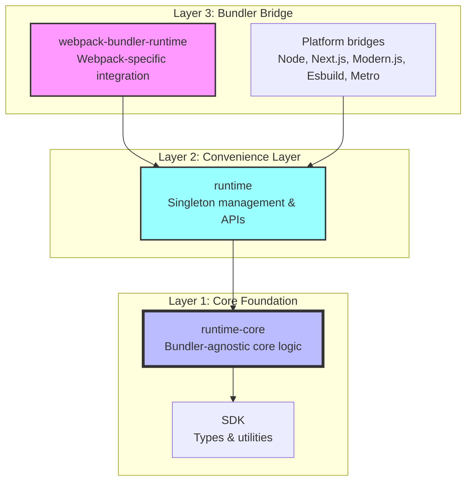
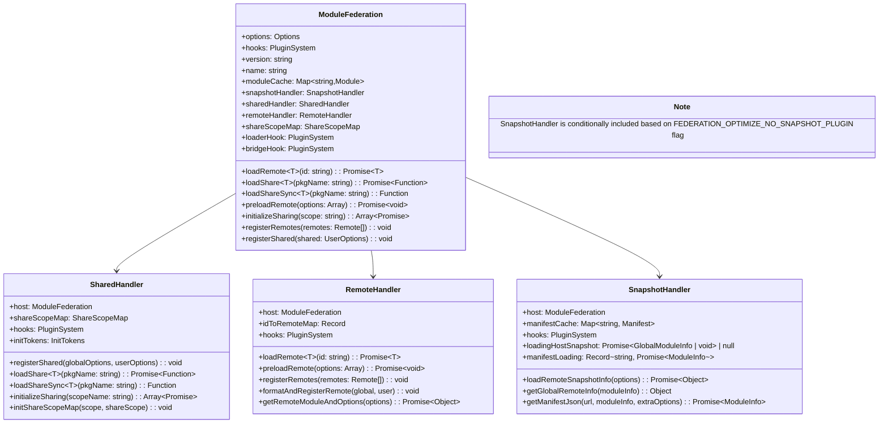
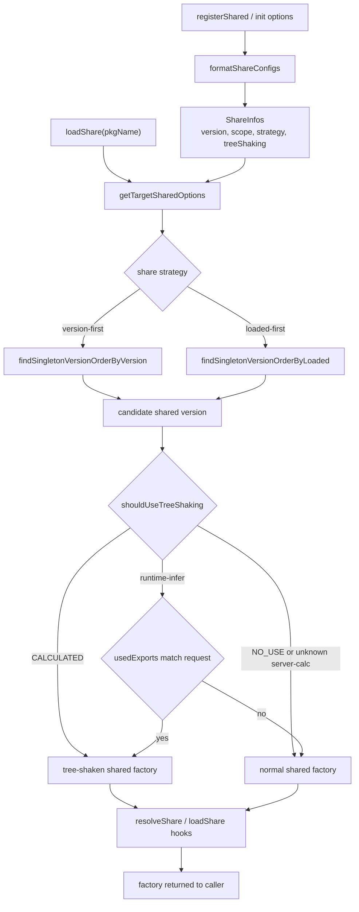
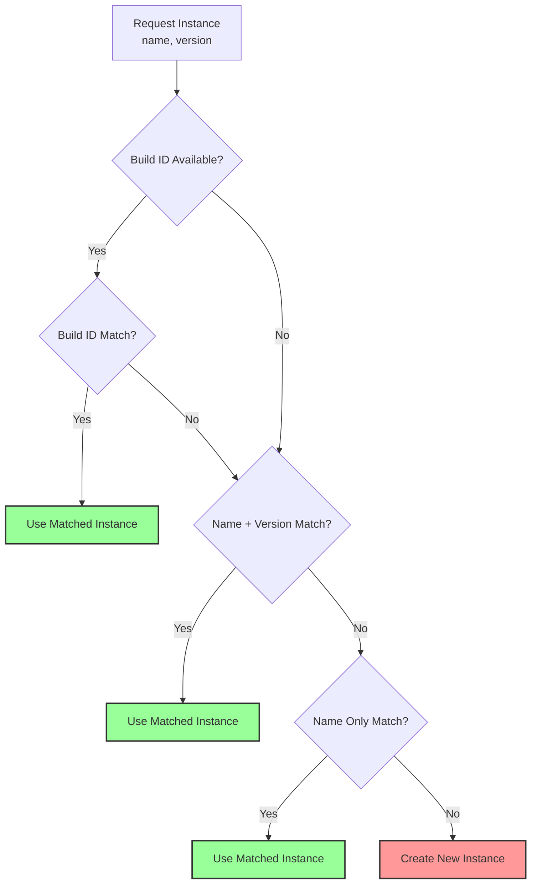

# Module Federation Runtime Architecture

This document details the current runtime architecture of Module Federation, explaining how runtime-core, the singleton runtime package, webpack-bundler-runtime, runtime plugins, and platform adapters cooperate to preserve the container contract across browser, Node, Next.js, Modern.js, Rsbuild/Rspress, Esbuild, Metro, and bridge-based rendering flows.

## Table of Contents

- [Runtime Package Structure](#runtime-package-structure)
- [Runtime Core Architecture](#runtime-core-architecture)
- [Runtime Convenience Layer](#runtime-convenience-layer)
- [Webpack Bundler Runtime Bridge](#webpack-bundler-runtime-bridge)
- [Global Instance Management](#global-instance-management)
- [Hook System Implementation](#hook-system-implementation)
- [Runtime Loading and Container Contract](#runtime-loading-and-container-contract)
- [Runtime Boundaries](#runtime-boundaries)

## Runtime Boundaries

Runtime code is intentionally split by responsibility:

Use `architecture-overview.md` for the canonical repo-wide package taxonomy. This section only defines runtime ownership boundaries and the contract each runtime-facing layer must preserve.

| Boundary | Primary package(s) | Owns | Does not own |
| --- | --- | --- | --- |
| Core loading semantics | `@module-federation/runtime-core` | `ModuleFederation`, `RemoteHandler`, `SharedHandler`, optional `SnapshotHandler`, plugin hooks, share scopes, module cache, global federation state. | Bundler module factories, framework routing, filesystem chunk loading, or build-time config parsing. |
| Convenience API | `@module-federation/runtime` | Singleton/global APIs such as `init`, `loadRemote`, `loadShare`, `registerRemotes`, and instance discovery by build id/name/version. | Bundler-specific runtime glue. |
| Webpack bridge | `@module-federation/webpack-bundler-runtime` | `__webpack_require__.federation`, remote and consume chunk handlers, share scope attachment, initial consumes, and container entry initialization. | Build-time plugin orchestration. |
| Runtime helper layer | `@module-federation/runtime-tools` and runtime plugins | Additional runtime adapters and cross-package helpers layered over `runtime` and `webpack-bundler-runtime`. | Core policy that belongs in runtime-core. |
| Platform runtimes | `@module-federation/node`, `nextjs-mf`, `modern-js`, `rsbuild-plugin`, `metro`, bridge packages | Environment-specific loading, SSR/server concerns, router/render bridges, filesystem or Metro request behavior. | Redefining the container contract. |

The invariant across all layers is the remote container interface: a remote entry must be loadable, initialized with a share scope, and queried with `get(expose)`. Build integrations can generate different assets, but runtime-core sees normalized remote/share/snapshot data.

## Runtime Package Structure

Module Federation's runtime consists of three distinct packages that build upon each other:


```mermaid
graph TB
    subgraph "Layer 3: Bundler Bridge"
        WebpackBR[webpack-bundler-runtime<br/>Webpack-specific integration]
        OtherBR[Platform bridges<br/>Node, Next.js, Modern.js, Esbuild, Metro]
    end

    subgraph "Layer 2: Convenience Layer"
        Runtime[runtime<br/>Singleton management & APIs]
    end

    subgraph "Layer 1: Core Foundation"
        RuntimeCore[runtime-core<br/>Bundler-agnostic core logic]
        SDK[SDK<br/>Types & utilities]
    end

    WebpackBR --> Runtime
    OtherBR --> Runtime
    Runtime --> RuntimeCore
    RuntimeCore --> SDK

    style RuntimeCore fill:#bbf,stroke:#333,stroke-width:4px
    style Runtime fill:#9ff,stroke:#333,stroke-width:2px
    style WebpackBR fill:#f9f,stroke:#333,stroke-width:2px
```

### Package Dependencies

```typescript
// @module-federation/webpack-bundler-runtime depends on runtime
import * as runtime from '@module-federation/runtime';

// @module-federation/runtime depends on runtime-core
import { ModuleFederation, type UserOptions } from '@module-federation/runtime-core';

// @module-federation/runtime-core depends on SDK
import { loadScript, loadScriptNode } from '@module-federation/sdk';
```

## Runtime Core Architecture

### Core ModuleFederation Class

The foundation of the runtime system is the `ModuleFederation` class in `@module-federation/runtime-core`:

### Conditional Feature Inclusion

The `SnapshotHandler` is conditionally included based on the `FEDERATION_OPTIMIZE_NO_SNAPSHOT_PLUGIN` build-time flag:

```typescript
// Declared in core.ts with DefinePlugin
declare const FEDERATION_OPTIMIZE_NO_SNAPSHOT_PLUGIN: boolean;
const USE_SNAPSHOT =
  typeof FEDERATION_OPTIMIZE_NO_SNAPSHOT_PLUGIN === 'boolean'
    ? !FEDERATION_OPTIMIZE_NO_SNAPSHOT_PLUGIN
    : true; // Default to true (use snapshot) when not explicitly defined
```

When `FEDERATION_OPTIMIZE_NO_SNAPSHOT_PLUGIN` is `true`, snapshot functionality is disabled for smaller bundle sizes.


```mermaid
classDiagram
    class ModuleFederation {
        +options: Options
        +hooks: PluginSystem
        +version: string
        +name: string
        +moduleCache: Map~string,Module~
        +snapshotHandler: SnapshotHandler
        +sharedHandler: SharedHandler
        +remoteHandler: RemoteHandler
        +shareScopeMap: ShareScopeMap
        +loaderHook: PluginSystem
        +bridgeHook: PluginSystem

        +loadRemote~T~(id: string): Promise~T~
        +loadShare~T~(pkgName: string): Promise~Function~
        +loadShareSync~T~(pkgName: string): Function
        +preloadRemote(options: Array): Promise~void~
        +initializeSharing(scope: string): Array~Promise~
        +registerRemotes(remotes: Remote[]): void
        +registerShared(shared: UserOptions): void
    }

    class SharedHandler {
        +host: ModuleFederation
        +shareScopeMap: ShareScopeMap
        +hooks: PluginSystem
        +initTokens: InitTokens

        +registerShared(globalOptions, userOptions): void
        +loadShare~T~(pkgName: string): Promise~Function~
        +loadShareSync~T~(pkgName: string): Function
        +initializeSharing(scopeName: string): Array~Promise~
        +initShareScopeMap(scope, shareScope): void
    }

    class RemoteHandler {
        +host: ModuleFederation
        +idToRemoteMap: Record
        +hooks: PluginSystem

        +loadRemote~T~(id: string): Promise~T~
        +preloadRemote(options: Array): Promise~void~
        +registerRemotes(remotes: Remote[]): void
        +formatAndRegisterRemote(global, user): void
        +getRemoteModuleAndOptions(options): Promise~Object~
    }

    class SnapshotHandler {
        +host: ModuleFederation
        +manifestCache: Map~string, Manifest~
        +hooks: PluginSystem
        +loadingHostSnapshot: Promise~GlobalModuleInfo | void~ | null
        +manifestLoading: Record~string, Promise~ModuleInfo~~

        +loadRemoteSnapshotInfo(options): Promise~Object~
        +getGlobalRemoteInfo(moduleInfo): Object
        +getManifestJson(url, moduleInfo, extraOptions): Promise~ModuleInfo~
    }

    Note: SnapshotHandler is conditionally included based on FEDERATION_OPTIMIZE_NO_SNAPSHOT_PLUGIN flag

    ModuleFederation --> SharedHandler
    ModuleFederation --> RemoteHandler
    ModuleFederation --> SnapshotHandler
```

### Handler Responsibilities

#### SharedHandler - Dependency Resolution
```typescript
// Actual implementation responsibilities
class SharedHandler {
  // 1. Register shared dependencies in global share scope
  registerShared(globalOptions: Options, userOptions: UserOptions) {
    // Maps shared configs to shareScopeMap
    // Handles version resolution strategies
    // Sets up eager/singleton constraints
  }

  // 2. Load shared modules with version negotiation
  async loadShare<T>(pkgName: string, extraOptions = {}): Promise<false | (() => T)> {
    // Resolves best version from available providers
    // Handles singleton conflicts
    // Supports fallback mechanisms
    // Implements both version-first and loaded-first strategies
  }

  // 3. Synchronous loading for build-time scenarios
  loadShareSync<T>(pkgName: string, extraOptions = {}): () => T | never {
    // Synchronous version of loadShare
    // Throws errors instead of returning Promise rejections
    // Used for server-side rendering and build-time resolution
  }

  // 4. Initialize sharing across multiple containers
  initializeSharing(shareScopeName = 'default', extraOptions = {}): Array<Promise<void>> {
    // Sets up share scope coordination
    // Handles cross-container sharing
    // Returns array of initialization promises
  }
}
```

#### Shared Tree-Shaking Resolution

Runtime-core does not analyze the module graph. It receives normalized shared records with optional `treeShaking` metadata and decides whether a tree-shaken candidate is valid for a specific `loadShare` request. The build layer may have produced `usedExports`, fallback factories, or manifest snapshot fields, but the runtime decision still happens inside the same shared resolver that enforces version, singleton, and strategy rules.


```mermaid
flowchart TD
    Register["registerShared / init options"] --> Format["formatShareConfigs"]
    Format --> ShareInfo["ShareInfos<br/>version, scope, strategy, treeShaking"]
    Load["loadShare(pkgName)"] --> Target["getTargetSharedOptions"]
    ShareInfo --> Target
    Target --> Strategy{"share strategy"}
    Strategy -->|"version-first"| VersionOrder["findSingletonVersionOrderByVersion"]
    Strategy -->|"loaded-first"| LoadedOrder["findSingletonVersionOrderByLoaded"]
    VersionOrder --> Candidate["candidate shared version"]
    LoadedOrder --> Candidate
    Candidate --> UseTree{"shouldUseTreeShaking"}
    UseTree -->|"NO_USE or unknown server-calc"| Normal["normal shared factory"]
    UseTree -->|"CALCULATED"| Pruned["tree-shaken shared factory"]
    UseTree -->|"runtime-infer"| MatchExports{"usedExports match request"}
    MatchExports -->|"yes"| Pruned
    MatchExports -->|"no"| Normal
    Pruned --> Hooks["resolveShare / loadShare hooks"]
    Normal --> Hooks
    Hooks --> Return["factory returned to caller"]
```

The decision inputs map directly to `TreeShakingArgs`: `mode` distinguishes `server-calc` from `runtime-infer`, `status` distinguishes calculated/no-use/unknown states, `usedExports` describes the export subset, and `get` or `lib` provides the candidate factory. `formatShare` defaults tree-shaking mode to `server-calc` when tree-shaking metadata exists, and rejects the invalid combination of `eager: true` with a tree-shaking mode. If a tree-shaken candidate cannot satisfy the requested version or export subset, runtime-core falls back to the normal shared candidate search instead of failing the load immediately.

#### RemoteHandler - Module Loading
```typescript
class RemoteHandler {
  // 1. Load remote modules with proper resolution
  async loadRemote<T>(id: string, options = {}): Promise<T | null> {
    // Parses remote ID (remoteName/modulePath)
    // Loads remote entry if not cached
    // Initializes container with share scope
    // Returns module factory or actual module
  }

  // 2. Preload remote assets for performance
  async preloadRemote(preloadOptions: Array<PreloadRemoteArgs>): Promise<void> {
    // Loads remote entries in parallel
    // Preloads specified modules
    // Handles preload failures gracefully
  }

  // 3. Register and validate remote configurations
  registerRemotes(remotes: Remote[], options = { force: false }): void {
    // Normalizes remote configurations
    // Validates remote entry URLs
    // Updates idToRemoteMap for resolution
  }

  // 4. Format remotes during initialization
  formatAndRegisterRemote(globalOptions: Options, userOptions: UserOptions) {
    // Processes raw remote configuration
    // Handles different remote formats (URL, alias, etc.)
    // Sets up remote metadata for loading
  }

  // 5. Remove registered remote (private method)
  private removeRemote(remote: Remote): void {
    // Removes remote from host.options.remotes array
    // Clears module cache entries for the remote
    // Handles cleanup of loaded remote modules
    // Used internally when force-registering existing remotes
  }
}
```

## Runtime Convenience Layer

The `@module-federation/runtime` package provides singleton management and simplified APIs:

### Singleton Pattern Implementation
```typescript
// Actual singleton implementation in runtime package
import { ModuleFederation, getGlobalFederationConstructor, setGlobalFederationInstance } from '@module-federation/runtime-core';

let FederationInstance: ModuleFederation | null = null;

export function createInstance(options: UserOptions) {
  const ModuleFederationConstructor = getGlobalFederationConstructor() || ModuleFederation;
  return new ModuleFederationConstructor(options);
}

export function init(options: UserOptions): ModuleFederation {
  const instance = getGlobalFederationInstance(options.name, options.version);
  if (!instance) {
    FederationInstance = createInstance(options);
    setGlobalFederationInstance(FederationInstance);
    return FederationInstance;
  } else {
    instance.initOptions(options);
    if (!FederationInstance) {
      FederationInstance = instance;
    }
    return instance;
  }
}

// Convenience methods that delegate to singleton
export function loadRemote<T>(...args: Parameters<ModuleFederation['loadRemote']>): Promise<T | null> {
  assert(FederationInstance, 'Federation instance not initialized');
  return FederationInstance.loadRemote<T>(...args);
}

export function loadShare<T>(...args: Parameters<ModuleFederation['loadShare']>): Promise<false | (() => T | undefined)> {
  assert(FederationInstance, 'Federation instance not initialized');
  return FederationInstance.loadShare<T>(...args);
}
```

### Build Identifier Integration
```typescript
// Build identifier support for instance resolution
export function getBuilderId(): string {
  //@ts-ignore
  return typeof FEDERATION_BUILD_IDENTIFIER !== 'undefined'
    ? //@ts-ignore
      FEDERATION_BUILD_IDENTIFIER
    : '';
}

export function getGlobalFederationInstance(
  name: string,
  version: string | undefined,
): ModuleFederation | undefined {
  const buildId = getBuilderId();
  return CurrentGlobal.__FEDERATION__.__INSTANCES__.find((GMInstance) => {
    // Priority 1: Build ID match (most specific)
    if (buildId && GMInstance.options.id === buildId) {
      return true;
    }

    // Priority 2: Exact name match without version (both undefined)
    if (GMInstance.options.name === name && !GMInstance.options.version && !version) {
      return true;
    }

    // Priority 3: Name + version exact match
    if (GMInstance.options.name === name && version && GMInstance.options.version === version) {
      return true;
    }
    return false;
  });
}
```

## Webpack Bundler Runtime Bridge

The `@module-federation/webpack-bundler-runtime` creates a bridge between webpack's runtime and Module Federation:

### Federation Object Structure
```typescript
// Actual webpack bundler runtime implementation
import * as runtime from '@module-federation/runtime';

const federation: Federation = {
  runtime,                    // Reference to convenience runtime
  instance: undefined,        // Will hold the ModuleFederation instance
  initOptions: undefined,     // Initialization options
  bundlerRuntime: {          // Webpack-specific implementations
    remotes,                 // Remote module loading
    consumes,                // Shared module consumption
    I: initializeSharing,    // Share scope initialization
    S: {},                   // Share scope registry
    installInitialConsumes,  // Initial consumption setup
    initContainerEntry,      // Container initialization
  },
  attachShareScopeMap,       // Share scope attachment
  bundlerRuntimeOptions: {}, // Bundler-specific options
};
```

### Webpack Integration Functions

```typescript
// webpack-bundler-runtime/src/remotes.ts
export const remotes = (options: RemotesOptions) => {
  const { chunkId, promises, chunkMapping, idToExternalAndNameMapping, webpackRequire, idToRemoteMap } = options;

  // Handle webpack's chunk mapping system
  if (webpackRequire.o(chunkMapping, chunkId)) {
    chunkMapping[chunkId].forEach((id: string) => {
      let getScope = webpackRequire.R;
      if (!getScope) getScope = [];

      const data = idToExternalAndNameMapping[id];
      const remoteInfo = idToRemoteMap[id];

      // Integration with Module Federation runtime
      const loadRemoteWithWebpackContext = async () => {
        const module = await webpackRequire.federation.instance.loadRemote(id, {
          loadFactory: false,
          from: 'build'
        });
        return module;
      };

      promises.push(loadRemoteWithWebpackContext());
    });
  }
};

// webpack-bundler-runtime/src/consumes.ts
export const consumes = (options: ConsumeOptions) => {
  const { installedModules, moduleToHandlerMapping, webpackRequire } = options;

  Object.keys(moduleToHandlerMapping).forEach((moduleId) => {
    const handlers = moduleToHandlerMapping[moduleId];

    handlers.forEach((handler) => {
      const { shareKey, getter, shareInfo } = handler;

      // Use Module Federation runtime for shared module loading
      const loadSharedModule = async () => {
        const sharedModule = await webpackRequire.federation.instance.loadShare(shareKey);
        if (sharedModule) {
          return sharedModule();
        }
        // Fallback to getter
        return getter();
      };

      installedModules[moduleId] = loadSharedModule;
    });
  });
};
```

## Global Instance Management

### Federation Global Object
```typescript
// Global federation state structure
export interface Federation {
  __GLOBAL_PLUGIN__: Array<ModuleFederationRuntimePlugin>;
  __DEBUG_CONSTRUCTOR_VERSION__?: string;
  __DEBUG_CONSTRUCTOR__?: typeof ModuleFederation;
  __INSTANCES__: Array<ModuleFederation>;
  __SHARE__: GlobalShareScopeMap;
  __MANIFEST_LOADING__: Record<string, Promise<ModuleInfo>>;
  __PRELOADED_MAP__: Map<string, boolean>;
  moduleInfo: GlobalModuleInfo;
}

// Global access patterns
export const CurrentGlobal = typeof globalThis === 'object' ? globalThis : window;

// Initialize global federation object
if (!CurrentGlobal.__FEDERATION__) {
  CurrentGlobal.__FEDERATION__ = {
    __GLOBAL_PLUGIN__: [],
    __INSTANCES__: [],
    moduleInfo: {},
    __SHARE__: {},
    __MANIFEST_LOADING__: {},
    __PRELOADED_MAP__: new Map(),
  };
}
```

### Instance Resolution Strategy

```mermaid
flowchart TD
    Request[Request Instance<br/>name, version]

    BuildIdCheck{Build ID Available?}
    BuildIdMatch{Build ID Match?}
    UseInstance1[Use Matched Instance]

    NameVersionCheck{Name + Version Match?}
    UseInstance2[Use Matched Instance]

    NameOnlyCheck{Name Only Match?}
    UseInstance3[Use Matched Instance]

    CreateNew[Create New Instance]

    Request --> BuildIdCheck
    BuildIdCheck -->|Yes| BuildIdMatch
    BuildIdMatch -->|Yes| UseInstance1
    BuildIdMatch -->|No| NameVersionCheck
    BuildIdCheck -->|No| NameVersionCheck

    NameVersionCheck -->|Yes| UseInstance2
    NameVersionCheck -->|No| NameOnlyCheck

    NameOnlyCheck -->|Yes| UseInstance3
    NameOnlyCheck -->|No| CreateNew

    style UseInstance1 fill:#9f9,stroke:#333,stroke-width:2px
    style UseInstance2 fill:#9f9,stroke:#333,stroke-width:2px
    style UseInstance3 fill:#9f9,stroke:#333,stroke-width:2px
    style CreateNew fill:#f99,stroke:#333,stroke-width:2px
```

## Hook System Implementation

### Hook Types and Implementation
```typescript
// Actual hook system from runtime-core
export class SyncHook<T, K> {
  listeners = new Set<Callback<T, K>>();

  emit(...data: ArgsType<T>): void | K {
    let result;
    if (this.listeners.size > 0) {
      this.listeners.forEach((fn) => {
        result = fn(...data);
      });
    }
    return result;
  }

  on(fn: Callback<T, K>): void {
    this.listeners.add(fn);
  }
}

export class AsyncHook<T, ExternalEmitReturnType = CallbackReturnType> extends SyncHook<T, ExternalEmitReturnType> {
  override emit(...data: ArgsType<T>): Promise<void | false | ExternalEmitReturnType> {
    const ls = Array.from(this.listeners);
    if (ls.length > 0) {
      let i = 0;
      const call = (prev?: any): any => {
        if (prev === false) {
          return false; // Abort process
        } else if (i < ls.length) {
          return Promise.resolve(ls[i++].apply(null, data)).then(call);
        } else {
          return prev;
        }
      };
      return call();
    }
    return Promise.resolve();
  }
}

export class SyncWaterfallHook<T> extends SyncHook<T, ArgsType<T>[0]> {
  override emit(...data: ArgsType<T>): ArgsType<T>[0] {
    if (this.listeners.size > 0) {
      this.listeners.forEach((fn) => {
        data[0] = fn(...data) || data[0];
      });
    }
    return data[0];
  }
}

export class AsyncWaterfallHook<T> extends AsyncHook<T, ArgsType<T>[0]> {
  override emit(...data: ArgsType<T>): Promise<ArgsType<T>[0]> {
    const ls = Array.from(this.listeners);
    if (ls.length > 0) {
      let i = 0;
      const call = (prev: ArgsType<T>[0]): Promise<ArgsType<T>[0]> => {
        if (i < ls.length) {
          data[0] = prev;
          return Promise.resolve(ls[i++].apply(null, data)).then((result) =>
            call(result || prev),
          );
        } else {
          return Promise.resolve(prev);
        }
      };
      return call(data[0]);
    }
    return Promise.resolve(data[0]);
  }
}
```

### Complete Hook Lifecycle

#### Core ModuleFederation Hooks
```typescript
hooks = new PluginSystem({
  beforeInit: new SyncWaterfallHook<[{
    userOptions: UserOptions;
    options: Options;
    origin: ModuleFederation;
    shareInfo: ShareInfos;
  }]>('beforeInit'),

  init: new SyncHook<[{ options: Options; origin: ModuleFederation; }], void>('init'),

  beforeInitContainer: new AsyncWaterfallHook<[{
    shareScope: ShareScopeMap[string];
    initScope: InitScope;
    remoteEntryInitOptions: RemoteEntryInitOptions;
    remoteInfo: RemoteInfo;
    origin: ModuleFederation;
  }]>('beforeInitContainer'),

  initContainer: new AsyncWaterfallHook<[{
    shareScope: ShareScopeMap[string];
    initScope: InitScope;
    remoteEntryInitOptions: RemoteEntryInitOptions;
    remoteInfo: RemoteInfo;
    remoteEntryExports: RemoteEntryExports;
    origin: ModuleFederation;
    id: string;
    remoteSnapshot?: ModuleInfo;
  }]>('initContainer'),
});
```

#### Loader Hook System
```typescript
loaderHook = new PluginSystem({
  getModuleInfo: new SyncHook<[{ target: Record<string, any>; key: any; }], { value: any | undefined; key: string } | void>('getModuleInfo'),
  createScript: new SyncHook<[{
    url: string;
    attrs?: Record<string, any>;
    remoteInfo?: RemoteInfo;
    resourceContext?: ResourceLoadContext;
  }], CreateScriptHookReturn>('createScript'),
  createLink: new SyncHook<[{
    url: string;
    attrs?: Record<string, any>;
    remoteInfo?: RemoteInfo;
    resourceContext?: ResourceLoadContext;
  }], CreateLinkHookReturnDom>('createLink'),
  fetch: new AsyncHook<[string, RequestInit, RemoteInfo?, ResourceLoadContext?], Promise<Response> | void | false>('fetch'),
  loadEntryError: new AsyncHook<[{
    getRemoteEntry: typeof getRemoteEntry;
    origin: ModuleFederation;
    remoteInfo: RemoteInfo;
    remoteEntryExports?: RemoteEntryExports;
    globalLoading: Record<string, Promise<void | RemoteEntryExports> | undefined>;
    uniqueKey: string;
  }], Promise<Promise<RemoteEntryExports | undefined> | undefined>>('loadEntryError'),
  afterLoadEntry: new AsyncHook<[{
    origin: ModuleFederation;
    remoteInfo: RemoteInfo;
    remoteEntryExports?: RemoteEntryExports | false | void;
    error?: unknown;
    recovered?: boolean;
  }], void>('afterLoadEntry'),
  beforeInitRemote: new AsyncHook<[{ id?: string; remoteInfo: RemoteInfo; remoteSnapshot?: ModuleInfo; origin: ModuleFederation; }], void>('beforeInitRemote'),
  afterInitRemote: new AsyncHook<[{ id?: string; remoteInfo: RemoteInfo; remoteSnapshot?: ModuleInfo; remoteEntryExports?: RemoteEntryExports; error?: unknown; cached?: boolean; origin: ModuleFederation; }], void>('afterInitRemote'),
  getModuleFactory: new AsyncHook<[{
    remoteEntryExports: RemoteEntryExports;
    expose: string;
    moduleInfo: Remote;
  }], Promise<(() => Promise<Module>) | undefined>>('getModuleFactory'),
});
```

`remoteInfo` and `resourceContext` let plugins distinguish a manifest fetch from a remote-entry/script/css load and whether the request came from `loadRemote` or `preloadRemote`. Recovery is split across `loadEntryError`, which can supply a replacement remote-entry promise, and `afterLoadEntry`, which observes success, failure, and recovered entry-load states.

#### Bridge Hook System
```typescript
bridgeHook = new PluginSystem({
  beforeBridgeRender: new SyncHook<[Record<string, any>], void | Record<string, any>>('beforeBridgeRender'),
  afterBridgeRender: new SyncHook<[Record<string, any>], void | Record<string, any>>('afterBridgeRender'),
  beforeBridgeDestroy: new SyncHook<[Record<string, any>], void | Record<string, any>>('beforeBridgeDestroy'),
  afterBridgeDestroy: new SyncHook<[Record<string, any>], void | Record<string, any>>('afterBridgeDestroy'),
});
```

#### SharedHandler Hooks
```typescript
hooks = new PluginSystem({
  beforeLoadShare: new AsyncWaterfallHook<{
    pkgName: string;
    shareInfo?: Partial<Shared>;
    shared: Options['shared'];
    origin: ModuleFederation;
  }>('beforeLoadShare'),

  loadShare: new AsyncHook<[ModuleFederation, string, ShareInfos]>('loadShare'),

  afterResolve: new AsyncWaterfallHook<{
    id: string;
    pkgName: string;
    version?: string;
    scope: ShareScopeMap[string];
    shareInfo: Shared;
    resolver?: (sharedOptions: ShareInfos[string]) => Shared;
    origin: ModuleFederation;
  }>('afterResolve'),

  resolveShare: new SyncWaterfallHook<{
    shareScopeMap: ShareScopeMap;
    scope: string;
    pkgName: string;
    version: string;
    shareInfo: Shared;
    GlobalFederation: Federation;
    resolver: () => { shared: Shared; useTreesShaking: boolean } | undefined;
  }>('resolveShare'),

  initContainerShareScopeMap: new SyncWaterfallHook<{
    shareScope: ShareScopeMap[string];
    options: Options;
    origin: ModuleFederation;
  }>('initContainerShareScopeMap'),
});
```

#### RemoteHandler Hooks
```typescript
hooks = new PluginSystem({
  beforeRegisterRemote: new SyncWaterfallHook<{ remote: Remote; origin: ModuleFederation; }>('beforeRegisterRemote'),
  registerRemote: new SyncWaterfallHook<{ remote: Remote; origin: ModuleFederation; }>('registerRemote'),
  beforeRequest: new AsyncWaterfallHook<{ id: string; options: Options; origin: ModuleFederation; }>('beforeRequest'),

  onLoad: new AsyncHook<[{
    id: string;
    expose: string;
    pkgNameOrAlias: string;
    remote: Remote;
    options: ModuleOptions;
    origin: ModuleFederation;
    exposeModule: any;
    exposeModuleFactory: any;
    moduleInstance: Module;
  }], void>('onLoad'),

  handlePreloadModule: new SyncHook<[{
    id: string;
    name: string;
    remoteSnapshot: ModuleInfo;
    preloadOptions: PreloadRemoteArgs;
  }], void>('handlePreloadModule'),

  errorLoadRemote: new AsyncHook<[{
    id: string;
    error: any;
    from: 'runtime';
    lifecycle: 'beforeRequest' | 'afterResolve';
    origin: ModuleFederation;
  }], Promise<any> | void>('errorLoadRemote'),

  beforePreloadRemote: new AsyncHook<[{ preloadOptions: PreloadRemoteArgs[]; options: Options; origin: ModuleFederation; }], void>('beforePreloadRemote'),

  generatePreloadAssets: new AsyncHook<[{
    origin: ModuleFederation;
    preloadOptions: PreloadRemoteArgs[];
    remote: Remote;
    remoteInfo: RemoteInfo;
    remoteSnapshot: ModuleInfo;
    globalSnapshot: GlobalModuleInfo;
  }], PreloadAssets[]>('generatePreloadAssets'),

  afterPreloadRemote: new AsyncHook<[{ preloadOptions: PreloadRemoteArgs[]; options: Options; origin: ModuleFederation; }], void>('afterPreloadRemote'),

  loadEntry: new AsyncHook<[{
    remoteInfo: RemoteInfo;
    remoteEntryExports?: RemoteEntryExports;
    moduleInfo: Remote;
  }], Promise<RemoteEntryExports | void>>('loadEntry'),
});
```

#### SnapshotHandler Hooks (conditional)
```typescript
hooks = new PluginSystem({
  beforeLoadRemoteSnapshot: new AsyncHook<[{
    options: Options;
    moduleInfo: Remote;
  }], void>('beforeLoadRemoteSnapshot'),

  loadGlobalSnapshot: new AsyncWaterfallHook<{
    options: Options;
    moduleInfo: Remote;
    hostGlobalSnapshot: GlobalModuleInfo[string] | undefined;
    globalSnapshot: ReturnType<typeof getGlobalSnapshot>;
    remoteSnapshot?: GlobalModuleInfo[string] | undefined;
  }>('loadGlobalSnapshot'),

  loadRemoteSnapshot: new AsyncWaterfallHook<{
    options: Options;
    moduleInfo: Remote;
    manifestJson?: Manifest;
    manifestUrl?: string;
    remoteSnapshot: ModuleInfo;
    from: 'global' | 'manifest';
  }>('loadRemoteSnapshot'),

  afterLoadSnapshot: new AsyncWaterfallHook<{
    id?: string;
    host: ModuleFederation;
    options: Options;
    moduleInfo: Remote;
    remoteSnapshot: ModuleInfo;
  }>('afterLoadSnapshot'),
});
```

### Plugin System Architecture
```typescript
// Plugin system manages different hook types
export class PluginSystem<T extends Record<string, any>> {
  lifecycle: T;
  lifecycleKeys: Array<keyof T>;
  registerPlugins: Record<string, Plugin<T>> = {};

  constructor(lifecycle: T) {
    this.lifecycle = lifecycle;
    this.lifecycleKeys = Object.keys(lifecycle);
  }

  applyPlugin(plugin: Plugin<T>, instance: ModuleFederation): void {
    const pluginName = plugin.name;
    if (!this.registerPlugins[pluginName]) {
      this.registerPlugins[pluginName] = plugin;
      plugin.apply?.(instance);

      // Register plugin methods with corresponding lifecycle hooks
      Object.keys(this.lifecycle).forEach((key) => {
        const pluginLife = plugin[key as string];
        if (pluginLife) {
          this.lifecycle[key].on(pluginLife);
        }
      });
    }
  }
}
```

## Runtime Loading and Container Contract

Module loading flow, integration patterns, build/runtime boundaries, key runtime insights, and the container validation contract live in [runtime-loading-contract.md](./runtime-loading-contract.md).

## Related Documentation

For comprehensive understanding, see:
- [Architecture Overview](./architecture-overview.md) - System architecture and component relationships
- [Plugin Architecture](./plugin-architecture.md) - Build-time integration patterns
- [Shared Tree-Shaking Architecture](./shared-tree-shaking-architecture.md) - Shared dependency pruning and runtime candidate selection
- [Implementation Guide](./implementation-guide.md) - Bundler integration steps
- [SDK Reference](./sdk-reference.md) - Runtime interfaces, types, and utilities
- [Manifest Specification](./manifest-specification.md) - Runtime manifest consumption patterns
- [Error Handling Specification](./error-handling-specification.md) - Runtime error patterns and recovery
- [Advanced Topics](./advanced-topics.md) - Runtime optimization and debugging strategies
