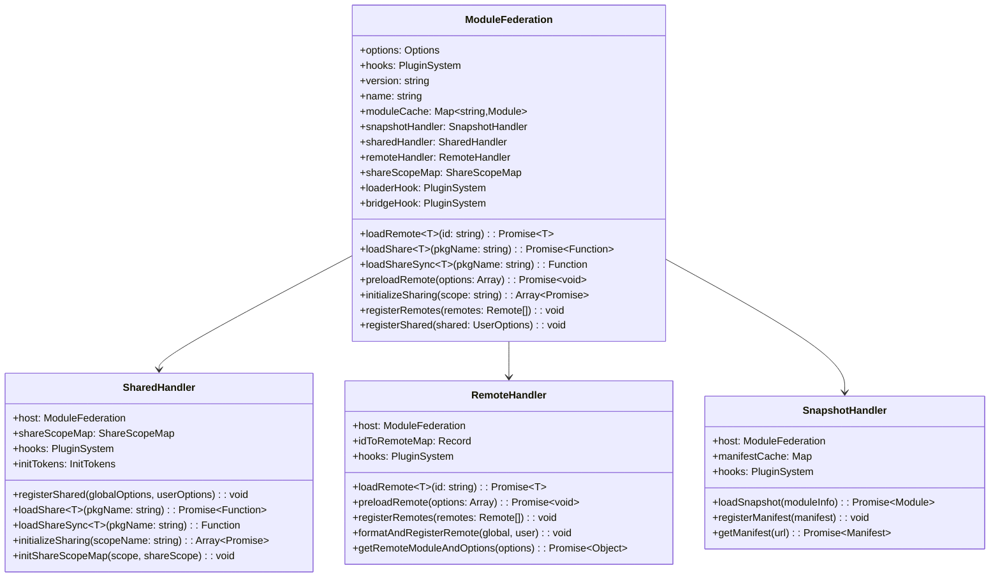

# Module Federation Runtime Architecture

This document details the actual runtime architecture of Module Federation based on the real implementation, explaining how the three runtime layers work together to enable dynamic module sharing.

## Table of Contents
- [Runtime Package Structure](#runtime-package-structure)
- [Runtime Core Architecture](#runtime-core-architecture)
- [Runtime Convenience Layer](#runtime-convenience-layer)
- [Webpack Bundler Runtime Bridge](#webpack-bundler-runtime-bridge)
- [Global Instance Management](#global-instance-management)
- [Hook System Implementation](#hook-system-implementation)
- [Module Loading Architecture](#module-loading-architecture)

## Runtime Package Structure

Module Federation's runtime consists of three distinct packages that build upon each other:


### Package Dependencies

```typescript
// @module-federation/webpack-bundler-runtime depends on runtime
import * as runtime from '@module-federation/runtime';

// @module-federation/runtime depends on runtime-core
import { ModuleFederation, type UserOptions } from '@module-federation/runtime-core';

// @module-federation/runtime-core depends on SDK
import { loadScript, loadScriptNode } from '@module-federation/sdk';
```

## Runtime Core Architecture

### Core ModuleFederation Class

The foundation of the runtime system is the `ModuleFederation` class in `@module-federation/runtime-core`:



### Handler Responsibilities

#### SharedHandler - Dependency Resolution
```typescript
// Actual implementation responsibilities
class SharedHandler {
  // 1. Register shared dependencies in global share scope
  registerShared(globalOptions: Options, userOptions: UserOptions) {
    // Maps shared configs to shareScopeMap
    // Handles version resolution strategies
    // Sets up eager/singleton constraints
  }
  
  // 2. Load shared modules with version negotiation
  async loadShare<T>(pkgName: string, extraOptions = {}): Promise<false | (() => T)> {
    // Resolves best version from available providers
    // Handles singleton conflicts
    // Supports fallback mechanisms
    // Implements both version-first and loaded-first strategies
  }
  
  // 3. Synchronous loading for build-time scenarios
  loadShareSync<T>(pkgName: string, extraOptions = {}): () => T | never {
    // Synchronous version of loadShare
    // Throws errors instead of returning Promise rejections
    // Used for server-side rendering and build-time resolution
  }
  
  // 4. Initialize sharing across multiple containers
  initializeSharing(shareScopeName = 'default', extraOptions = {}): Array<Promise<void>> {
    // Sets up share scope coordination
    // Handles cross-container sharing
    // Returns array of initialization promises
  }
}
```

#### RemoteHandler - Module Loading
```typescript
class RemoteHandler {
  // 1. Load remote modules with proper resolution
  async loadRemote<T>(id: string, options = {}): Promise<T | null> {
    // Parses remote ID (remoteName/modulePath)
    // Loads remote entry if not cached
    // Initializes container with share scope
    // Returns module factory or actual module
  }
  
  // 2. Preload remote assets for performance
  async preloadRemote(preloadOptions: Array<PreloadRemoteArgs>): Promise<void> {
    // Loads remote entries in parallel
    // Preloads specified modules
    // Handles preload failures gracefully
  }
  
  // 3. Register and validate remote configurations
  registerRemotes(remotes: Remote[], options = { force: false }): void {
    // Normalizes remote configurations
    // Validates remote entry URLs
    // Updates idToRemoteMap for resolution
  }
  
  // 4. Format remotes during initialization
  formatAndRegisterRemote(globalOptions: Options, userOptions: UserOptions) {
    // Processes raw remote configuration
    // Handles different remote formats (URL, alias, etc.)
    // Sets up remote metadata for loading
  }
}
```

## Runtime Convenience Layer

The `@module-federation/runtime` package provides singleton management and simplified APIs:

### Singleton Pattern Implementation
```typescript
// Actual singleton implementation in runtime package
import { ModuleFederation, getGlobalFederationConstructor, setGlobalFederationInstance } from '@module-federation/runtime-core';

let FederationInstance: ModuleFederation | null = null;

export function createInstance(options: UserOptions) {
  const ModuleFederationConstructor = getGlobalFederationConstructor() || ModuleFederation;
  return new ModuleFederationConstructor(options);
}

export function init(options: UserOptions): ModuleFederation {
  const instance = getGlobalFederationInstance(options.name, options.version);
  if (!instance) {
    FederationInstance = createInstance(options);
    setGlobalFederationInstance(FederationInstance);
    return FederationInstance;
  } else {
    instance.initOptions(options);
    if (!FederationInstance) {
      FederationInstance = instance;
    }
    return instance;
  }
}

// Convenience methods that delegate to singleton
export function loadRemote<T>(...args: Parameters<ModuleFederation['loadRemote']>): Promise<T | null> {
  assert(FederationInstance, 'Federation instance not initialized');
  return FederationInstance.loadRemote<T>(...args);
}

export function loadShare<T>(...args: Parameters<ModuleFederation['loadShare']>): Promise<false | (() => T | undefined)> {
  assert(FederationInstance, 'Federation instance not initialized');
  return FederationInstance.loadShare<T>(...args);
}
```

### Build Identifier Integration
```typescript
// Build identifier support for instance resolution
export function getBuilderId(): string {
  //@ts-ignore
  return typeof FEDERATION_BUILD_IDENTIFIER !== 'undefined'
    ? //@ts-ignore
      FEDERATION_BUILD_IDENTIFIER
    : '';
}

export function getGlobalFederationInstance(
  name: string,
  version: string | undefined,
): ModuleFederation | undefined {
  const buildId = getBuilderId();
  return CurrentGlobal.__FEDERATION__.__INSTANCES__.find((GMInstance) => {
    // Priority 1: Build ID match (most specific)
    if (buildId && GMInstance.options.id === buildId) {
      return true;
    }
    
    // Priority 2: Name match without version
    if (GMInstance.options.name === name && !GMInstance.options.version && !version) {
      return true;
    }
    
    // Priority 3: Name + version match
    if (GMInstance.options.name === name && version && GMInstance.options.version === version) {
      return true;
    }
    return false;
  });
}
```

## Webpack Bundler Runtime Bridge

The `@module-federation/webpack-bundler-runtime` creates a bridge between webpack's runtime and Module Federation:

### Federation Object Structure
```typescript
// Actual webpack bundler runtime implementation
import * as runtime from '@module-federation/runtime';

const federation: Federation = {
  runtime,                    // Reference to convenience runtime
  instance: undefined,        // Will hold the ModuleFederation instance
  initOptions: undefined,     // Initialization options
  bundlerRuntime: {          // Webpack-specific implementations
    remotes,                 // Remote module loading
    consumes,                // Shared module consumption
    I: initializeSharing,    // Share scope initialization
    S: {},                   // Share scope registry
    installInitialConsumes,  // Initial consumption setup
    initContainerEntry,      // Container initialization
  },
  attachShareScopeMap,       // Share scope attachment
  bundlerRuntimeOptions: {}, // Bundler-specific options
};
```

### Webpack Integration Functions

```typescript
// webpack-bundler-runtime/src/remotes.ts
export const remotes = (options: RemotesOptions) => {
  const { chunkId, promises, chunkMapping, idToExternalAndNameMapping, webpackRequire, idToRemoteMap } = options;
  
  // Handle webpack's chunk mapping system
  if (webpackRequire.o(chunkMapping, chunkId)) {
    chunkMapping[chunkId].forEach((id: string) => {
      let getScope = webpackRequire.R;
      if (!getScope) getScope = [];
      
      const data = idToExternalAndNameMapping[id];
      const remoteInfo = idToRemoteMap[id];
      
      // Integration with Module Federation runtime
      const loadRemoteWithWebpackContext = async () => {
        const module = await webpackRequire.federation.instance.loadRemote(id, {
          loadFactory: false,
          from: 'build'
        });
        return module;
      };
      
      promises.push(loadRemoteWithWebpackContext());
    });
  }
};

// webpack-bundler-runtime/src/consumes.ts  
export const consumes = (options: ConsumeOptions) => {
  const { installedModules, moduleToHandlerMapping, webpackRequire } = options;
  
  Object.keys(moduleToHandlerMapping).forEach((moduleId) => {
    const handlers = moduleToHandlerMapping[moduleId];
    
    handlers.forEach((handler) => {
      const { shareKey, getter, shareInfo } = handler;
      
      // Use Module Federation runtime for shared module loading
      const loadSharedModule = async () => {
        const sharedModule = await webpackRequire.federation.instance.loadShare(shareKey);
        if (sharedModule) {
          return sharedModule();
        }
        // Fallback to getter
        return getter();
      };
      
      installedModules[moduleId] = loadSharedModule;
    });
  });
};
```

## Global Instance Management

### Federation Global Object
```typescript
// Global federation state structure
export interface Federation {
  __GLOBAL_PLUGIN__: Array<ModuleFederationRuntimePlugin>;
  __DEBUG_CONSTRUCTOR_VERSION__?: string;
  __DEBUG_CONSTRUCTOR__?: typeof ModuleFederation;
  __INSTANCES__: Array<ModuleFederation>;
  __SHARE__: GlobalShareScopeMap;
  __MANIFEST_LOADING__: Record<string, Promise<ModuleInfo>>;
  __PRELOADED_MAP__: Map<string, boolean>;
  moduleInfo: GlobalModuleInfo;
}

// Global access patterns
export const CurrentGlobal = typeof globalThis === 'object' ? globalThis : window;

// Initialize global federation object
if (!CurrentGlobal.__FEDERATION__) {
  CurrentGlobal.__FEDERATION__ = {
    __GLOBAL_PLUGIN__: [],
    __INSTANCES__: [],
    moduleInfo: {},
    __SHARE__: {},
    __MANIFEST_LOADING__: {},
    __PRELOADED_MAP__: new Map(),
  };
}
```

### Instance Resolution Strategy


## Hook System Implementation

### Hook Types and Implementation
```typescript
// Actual hook system from runtime-core
export class SyncHook<T, K> {
  listeners = new Set<Callback<T, K>>();
  
  emit(...data: ArgsType<T>): void | K | Promise<any> {
    let result;
    if (this.listeners.size > 0) {
      this.listeners.forEach((fn) => {
        result = fn(...data);
      });
    }
    return result;
  }
  
  on(fn: Callback<T, K>): void {
    this.listeners.add(fn);
  }
}

export class AsyncHook<T, ExternalEmitReturnType = CallbackReturnType> extends SyncHook<T, ExternalEmitReturnType> {
  override emit(...data: ArgsType<T>): Promise<void | false | ExternalEmitReturnType> {
    const ls = Array.from(this.listeners);
    if (ls.length > 0) {
      let i = 0;
      const call = (prev?: any): any => {
        if (prev === false) {
          return false; // Abort process
        } else if (i < ls.length) {
          return Promise.resolve(ls[i++].apply(null, data)).then(call);
        } else {
          return prev;
        }
      };
      return call();
    }
    return Promise.resolve();
  }
}

export class SyncWaterfallHook<T> extends SyncHook<T, ArgsType<T>[0]> {
  override emit(...data: ArgsType<T>): ArgsType<T>[0] {
    if (this.listeners.size > 0) {
      this.listeners.forEach((fn) => {
        data[0] = fn(...data) || data[0];
      });
    }
    return data[0];
  }
}

export class AsyncWaterfallHook<T> extends AsyncHook<T, ArgsType<T>[0]> {
  override emit(...data: ArgsType<T>): Promise<ArgsType<T>[0]> {
    const ls = Array.from(this.listeners);
    if (ls.length > 0) {
      let i = 0;
      const call = (prev: ArgsType<T>[0]): Promise<ArgsType<T>[0]> => {
        if (i < ls.length) {
          data[0] = prev;
          return Promise.resolve(ls[i++].apply(null, data)).then((result) =>
            call(result || prev),
          );
        } else {
          return Promise.resolve(prev);
        }
      };
      return call(data[0]);
    }
    return Promise.resolve(data[0]);
  }
}
```

### Plugin System Architecture
```typescript
// Plugin system manages different hook types
export class PluginSystem<T extends Record<string, any>> {
  lifecycle: T;
  lifecycleKeys: Array<keyof T>;
  registerPlugins: Record<string, Plugin<T>> = {};

  constructor(lifecycle: T) {
    this.lifecycle = lifecycle;
    this.lifecycleKeys = Object.keys(lifecycle);
  }

  applyPlugin(plugin: Plugin<T>, instance: ModuleFederation): void {
    const pluginName = plugin.name;
    if (!this.registerPlugins[pluginName]) {
      this.registerPlugins[pluginName] = plugin;
      plugin.apply?.(instance);

      // Register plugin methods with corresponding lifecycle hooks
      Object.keys(this.lifecycle).forEach((key) => {
        const pluginLife = plugin[key as string];
        if (pluginLife) {
          this.lifecycle[key].on(pluginLife);
        }
      });
    }
  }
}
```

## Module Loading Architecture

### Complete Loading Sequence


### Version Resolution in Shared Loading
```mermaid  
flowchart TD
    LoadShare[loadShare('react')]
    CheckScope{In Share Scope?}
    GetVersions[Get Available Versions]
    Strategy{Resolution Strategy}
    VersionFirst[Version-First Strategy]
    LoadedFirst[Loaded-First Strategy]
    SelectVersion[Select Best Version]
    CheckSingleton{Is Singleton?}
    CheckLoaded{Already Loaded?}
    LoadModule[Load Module]
    UseCached[Use Cached Instance]
    ThrowError[Throw Singleton Error]
    ReturnModule[Return Module]
    
    LoadShare --> CheckScope
    CheckScope -->|Yes| GetVersions
    CheckScope -->|No| ReturnModule
    GetVersions --> Strategy
    Strategy -->|version-first| VersionFirst
    Strategy -->|loaded-first| LoadedFirst
    VersionFirst --> SelectVersion
    LoadedFirst --> SelectVersion
    SelectVersion --> CheckSingleton
    CheckSingleton -->|Yes| CheckLoaded
    CheckSingleton -->|No| LoadModule
    CheckLoaded -->|Yes| UseCached  
    CheckLoaded -->|No, Version Match| LoadModule
    CheckLoaded -->|No, Version Conflict| ThrowError
    LoadModule --> ReturnModule
    UseCached --> ReturnModule
    
    style SelectVersion fill:#ff9,stroke:#333,stroke-width:2px
    style ThrowError fill:#f99,stroke:#333,stroke-width:2px
    style ReturnModule fill:#9f9,stroke:#333,stroke-width:2px
```

### Semver Resolution Algorithm
```typescript
// Comprehensive semver implementation in runtime-core
export function satisfy(version: string, range: string): boolean {
  if (!version) return false;
  
  // Handle OR conditions (||)
  const orRanges = range.split('||');
  for (const orRange of orRanges) {
    const trimmedOrRange = orRange.trim();
    if (!trimmedOrRange || trimmedOrRange === '*' || trimmedOrRange === 'x') {
      return true;
    }
    
    // Parse range with support for:
    // - Hyphen ranges: "1.2.3 - 1.2.4" => ">=1.2.3 <=1.2.4"
    // - Caret ranges: "^1.2.3" => ">=1.2.3 <2.0.0-0"  
    // - Tilde ranges: "~1.2.3" => ">=1.2.3 <1.3.0-0"
    // - X-ranges: "1.2.x" => ">=1.2.0 <1.3.0-0"
    const parsedSubRange = parseRange(trimmedOrRange);
    
    // Handle AND conditions within each OR range
    const comparators = parsedSubRange
      .split(/\s+/)
      .map(comparator => parseGTE0(comparator))
      .filter(Boolean);
      
    let subRangeSatisfied = true;
    for (const comparator of comparators) {
      if (!compareVersion(version, comparator)) {
        subRangeSatisfied = false;
        break;
      }
    }
    
    if (subRangeSatisfied) return true;
  }
  
  return false;
}
```

## Integration Patterns for Other Bundlers

### Required Runtime Integration
```typescript
// Pattern for other bundlers to integrate with runtime
interface BundlerRuntimeIntegration {
  // 1. Create bundler-specific runtime bridge
  createBundlerRuntime(): {
    runtime: typeof runtime;
    instance?: ModuleFederation;
    bundlerRuntime: {
      remotes: (options: BundlerRemoteOptions) => Promise<any>;
      consumes: (options: BundlerConsumeOptions) => Promise<any>;
      initializeSharing: (scope: string) => Promise<boolean>;
    };
  };
  
  // 2. Integrate with bundler's module system
  attachToModule system(bundlerRequire: any, federation: any): void;
  
  // 3. Handle bundler-specific loading patterns
  loadBundlerModule(moduleId: string): Promise<any>;
  manageBundlerCache(moduleId: string, module: any): void;
}

// Example for Vite
class ViteBundlerRuntime implements BundlerRuntimeIntegration {
  createBundlerRuntime() {
    return {
      runtime,
      instance: undefined,
      bundlerRuntime: {
        remotes: async (options) => {
          // Use Vite's dynamic import system
          const module = await import(/* @vite-ignore */ options.url);
          return module.get(options.modulePath);
        },
        consumes: async (options) => {
          // Check Vite's module registry
          const shared = await this.viteRuntime.loadShared(options.shareKey);
          return shared || options.fallback();
        },
        initializeSharing: async (scope) => {
          // Initialize Vite's sharing system
          return this.viteRuntime.initSharing(scope);
        }
      }
    };
  }
}
```

## Key Architectural Insights

1. **Three-Layer Architecture**: Runtime-core provides bundler-agnostic logic, runtime adds convenience patterns, bundler-runtime bridges with specific bundlers

2. **Sophisticated Instance Management**: Multiple resolution strategies using build IDs, names, and versions for multi-instance scenarios

3. **Comprehensive Hook System**: Four hook types (sync, async, waterfall variants) enable extensive customization throughout the loading process

4. **Advanced Version Resolution**: Full semver-compatible resolution with support for complex range expressions and multiple resolution strategies

5. **Handler-Based Architecture**: SharedHandler and RemoteHandler encapsulate specific concerns with clear responsibilities

6. **Global State Coordination**: Centralized global object manages instances, plugins, and shared state across the entire federation

7. **Performance Optimizations**: Preloading, caching, and lazy initialization patterns optimize runtime performance

This architecture enables Module Federation to work consistently across different bundlers while providing the flexibility and performance needed for complex micro-frontend scenarios.

## Next Steps

- Review [Plugin Architecture](./plugin-architecture.md) for build-time integration patterns
- Check [SDK Reference](./sdk-reference.md) for available types and utilities  
- Follow [Implementation Guide](./implementation-guide.md) for bundler integration steps
- Study [Advanced Topics](./advanced-topics.md) for optimization and debugging strategies