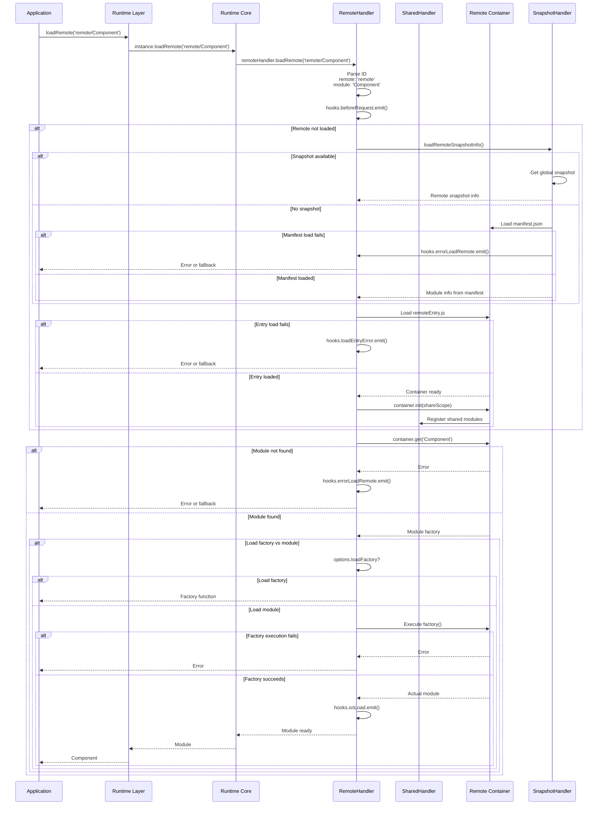

# Module Federation Runtime Loading and Container Contract

This document owns module loading flow, bundler integration patterns, build/runtime boundaries, and the container contract. Use [runtime-architecture.md](./runtime-architecture.md) as the runtime architecture index.

## Module Loading Architecture

### Complete Loading Sequence with Error Handling


### Version Resolution in Shared Loading with Error Handling
```mermaid
flowchart TD
    LoadShare[loadShare('react')]
    BeforeHook[hooks.beforeLoadShare.emit]
    CheckScope{In Share Scope?}
    GetVersions[Get Available Versions]
    Strategy{Resolution Strategy}
    VersionFirst[Version-First Strategy]
    LoadedFirst[Loaded-First Strategy]
    SelectVersion[Select Best Version]
    CheckSingleton{Is Singleton?}
    CheckLoaded{Already Loaded?}
    CheckCustom{Custom Resolver?}
    UseResolver[Apply Custom Resolution]
    LoadModule[Load Module]
    UseCached[Use Cached Instance]
    ThrowError[Throw Singleton Error]
    FallbackCheck{Has Fallback?}
    LoadFallback[Load Fallback Module]
    ResolveHook[hooks.resolveShare.emit]
    LoadHook[hooks.loadShare.emit]
    ReturnModule[Return Module]
    ReturnFalse[Return false]

    LoadShare --> BeforeHook
    BeforeHook --> CheckScope
    CheckScope -->|"Yes"| GetVersions
    CheckScope -->|"No"| FallbackCheck
    GetVersions --> CheckCustom
    CheckCustom -->|"Yes"| UseResolver
    CheckCustom -->|"No"| Strategy
    UseResolver --> ResolveHook
    Strategy -->|"version-first"| VersionFirst
    Strategy -->|"loaded-first"| LoadedFirst
    VersionFirst --> SelectVersion
    LoadedFirst --> SelectVersion
    SelectVersion --> ResolveHook
    ResolveHook --> CheckSingleton
    CheckSingleton -->|"Yes"| CheckLoaded
    CheckSingleton -->|"No"| LoadModule
    CheckLoaded -->|"Yes, Compatible"| UseCached
    CheckLoaded -->|"Yes, Version Match"| UseCached
    CheckLoaded -->|"No, Version Match"| LoadModule
    CheckLoaded -->|"No, Version Conflict"| ThrowError
    LoadModule --> LoadHook
    LoadHook --> ReturnModule
    UseCached --> ReturnModule
    ThrowError --> FallbackCheck
    FallbackCheck -->|"Yes"| LoadFallback
    FallbackCheck -->|"No"| ReturnFalse
    LoadFallback --> ReturnModule

    style SelectVersion fill:#ff9,stroke:#333,stroke-width:2px
    style ThrowError fill:#f99,stroke:#333,stroke-width:2px
    style ReturnModule fill:#9f9,stroke:#333,stroke-width:2px
    style ReturnFalse fill:#f99,stroke:#333,stroke-width:2px
    style ResolveHook fill:#9ff,stroke:#333,stroke-width:2px
```

### Semver Resolution Algorithm
```typescript
// Comprehensive semver implementation with error handling
export function satisfy(version: string, range: string): boolean {
  if (!version) {
    return false;
  }

  // Extract version details once with validation
  const extractedVersion = extractComparator(version);
  if (!extractedVersion) {
    // If the version string is invalid, it can't satisfy any range
    return false;
  }

  // Split the range by || to handle OR conditions
  const orRanges = range.split('||');

  for (const orRange of orRanges) {
    const trimmedOrRange = orRange.trim();
    if (!trimmedOrRange) {
      // An empty range string signifies wildcard *, satisfy any valid version
      return true;
    }

    // Handle simple wildcards explicitly before complex parsing
    if (trimmedOrRange === '*' || trimmedOrRange === 'x') {
      return true;
    }

    try {
      // Apply parsing logic with error handling
      const parsedSubRange = parseRange(trimmedOrRange);

      if (!parsedSubRange.trim()) {
        // If parsing results in empty string, treat as wildcard match
        return true;
      }

      const parsedComparatorString = parsedSubRange
        .split(' ')
        .map((rangeVersion) => parseComparatorString(rangeVersion))
        .join(' ');

      if (!parsedComparatorString.trim()) {
        return true;
      }

      // Split the sub-range by space for implicit AND conditions
      const comparators = parsedComparatorString
        .split(/\s+/)
        .map((comparator) => parseGTE0(comparator))
        .filter(Boolean);

      if (comparators.length === 0) {
        continue;
      }

      let subRangeSatisfied = true;
      for (const comparator of comparators) {
        const extractedComparator = extractComparator(comparator);

        // If any part of the AND sub-range is invalid, the sub-range is not satisfied
        if (!extractedComparator) {
          subRangeSatisfied = false;
          break;
        }

        // Check if the version satisfies this specific comparator
        if (!compare(rangeAtom, versionAtom)) {
          subRangeSatisfied = false;
          break;
        }
      }

      if (subRangeSatisfied) {
        return true;
      }
    } catch (e) {
      // Log error and treat this sub-range as unsatisfied
      console.error(`[semver] Error processing range part "${trimmedOrRange}":`, e);
      continue;
    }
  }

  return false;
}

export function isLegallyVersion(version: string): boolean {
  const semverRegex =
    /^(0|[1-9]\d*)\.(0|[1-9]\d*)\.(0|[1-9]\d*)(-[0-9A-Za-z-]+(\.[0-9A-Za-z-]+)*)?(\+[0-9A-Za-z-]+(\.[0-9A-Za-z-]+)*)?$/;
  return semverRegex.test(version);
}
```

## Integration Patterns for Other Bundlers

### Required Runtime Integration
```typescript
// Pattern for other bundlers to integrate with runtime
interface BundlerRuntimeIntegration {
  // 1. Create bundler-specific runtime bridge
  createBundlerRuntime(): {
    runtime: typeof runtime;
    instance?: ModuleFederation;
    bundlerRuntime: {
      remotes: (options: BundlerRemoteOptions) => Promise<any>;
      consumes: (options: BundlerConsumeOptions) => Promise<any>;
      initializeSharing: (scope: string) => Promise<boolean>;
    };
  };

  // 2. Integrate with bundler's module system
  attachToModule system(bundlerRequire: any, federation: any): void;

  // 3. Handle bundler-specific loading patterns
  loadBundlerModule(moduleId: string): Promise<any>;
  manageBundlerCache(moduleId: string, module: any): void;
}

// Example for Vite
class ViteBundlerRuntime implements BundlerRuntimeIntegration {
  createBundlerRuntime() {
    return {
      runtime,
      instance: undefined,
      bundlerRuntime: {
        remotes: async (options) => {
          // Use Vite's dynamic import system
          const module = await import(/* @vite-ignore */ options.url);
          return module.get(options.modulePath);
        },
        consumes: async (options) => {
          // Check Vite's module registry
          const shared = await this.viteRuntime.loadShared(options.shareKey);
          return shared || options.fallback();
        },
        initializeSharing: async (scope) => {
          // Initialize Vite's sharing system
          return this.viteRuntime.initSharing(scope);
        }
      }
    };
  }
}
```

## Build-Time vs Runtime Boundary

### Build-Time Responsibilities
The build-time layer handles:
- **DefinePlugin Integration**: Defines `FEDERATION_BUILD_IDENTIFIER` and `FEDERATION_OPTIMIZE_NO_SNAPSHOT_PLUGIN` flags
- **Bundle Generation**: Creates remote entry files and module manifests
- **Static Analysis**: Determines shared dependencies and remote configurations
- **Code Splitting**: Separates remote modules from host bundles
- **Type Generation**: Creates TypeScript definitions for federated modules

### Runtime Responsibilities
The runtime layer handles:
- **Dynamic Loading**: Loads remote entries and modules on-demand
- **Version Resolution**: Negotiates shared dependency versions at runtime
- **Instance Management**: Creates and manages ModuleFederation instances
- **Share Scope Coordination**: Synchronizes shared modules across containers
- **Error Handling**: Manages loading failures and fallback mechanisms
- **Hook Execution**: Runs plugin hooks during module lifecycle events

### Critical Integration Points
```typescript
// Build-time defines these globals, runtime consumes them
declare const FEDERATION_BUILD_IDENTIFIER: string;
declare const FEDERATION_OPTIMIZE_NO_SNAPSHOT_PLUGIN: boolean;

// Runtime uses build-time generated information
const buildId = getBuilderId(); // Reads FEDERATION_BUILD_IDENTIFIER
const useSnapshot = !FEDERATION_OPTIMIZE_NO_SNAPSHOT_PLUGIN; // Feature flag

// Build-time generates manifest, runtime consumes it
const manifest = await fetch('./federation-manifest.json');
const moduleInfo = generateSnapshotFromManifest(manifest);
```

## Key Architectural Insights

1. **Three-Layer Architecture**: Runtime-core provides bundler-agnostic logic, runtime adds convenience patterns, bundler-runtime bridges with specific bundlers

2. **Sophisticated Instance Management**: Multiple resolution strategies using build IDs, names, and versions for multi-instance scenarios

3. **Comprehensive Hook System**: Four hook types (sync, async, waterfall variants) enable extensive customization throughout the loading process

4. **Advanced Version Resolution**: Full semver-compatible resolution with support for complex range expressions and multiple resolution strategies

5. **Handler-Based Architecture**: SharedHandler and RemoteHandler encapsulate specific concerns with clear responsibilities

6. **Global State Coordination**: Centralized global object manages instances, plugins, and shared state across the entire federation

7. **Clear Build/Runtime Separation**: Build-time focuses on static analysis and bundle generation, runtime handles dynamic loading and coordination

This architecture enables Module Federation to work consistently across different bundlers while providing the flexibility needed for complex micro-frontend scenarios.

## Container Contract Specification

All Module Federation remote containers must implement this exact interface for cross-bundler compatibility:

### Remote Container Interface

```typescript
interface RemoteContainer {
  /**
   * Initialize the container with the provided share scope
   * MUST be called before any get() operations
   * @param shareScope - The share scope map for dependency resolution
   * @returns Promise that resolves when initialization is complete
   */
  init(shareScope: ShareScopeMap): Promise<void>;

  /**
   * Get a module from the container
   * @param moduleName - The exposed module name (e.g., './Component')
   * @returns Promise that resolves to a module factory function
   */
  get(moduleName: string): Promise<ModuleFactory>;

  /**
   * Optional: Get available modules list
   * @returns Array of exposed module names
   */
  getModules?(): string[];
}

interface ModuleFactory {
  (): Promise<any> | any;
}

interface ShareScopeMap {
  [scopeName: string]: {
    [packageName: string]: {
      [version: string]: {
        get: () => Promise<any>;
        loaded?: 1;
        from: string;
        eager: boolean;
      };
    };
  };
}
```

### Container Implementation Requirements

#### 1. **Entry Point Structure**
Every remote entry file must expose a container object:

```javascript
// remoteEntry.js - Required structure
var __webpack_require__ = /* bundler-specific require */;
var moduleMap = {
  "./Component": () => __webpack_require__("./src/Component"),
  "./utils": () => __webpack_require__("./src/utils")
};

// Container implementation
var container = {
  init: function(shareScope) {
    return new Promise((resolve) => {
      // Initialize shared dependencies
      if (!this._initialized) {
        this._shareScope = shareScope;
        this._initialized = true;
      }
      resolve();
    });
  },

  get: function(module) {
    return new Promise((resolve, reject) => {
      if (!this._initialized) {
        reject(new Error("Container not initialized"));
        return;
      }

      var moduleFactory = moduleMap[module];
      if (!moduleFactory) {
        reject(new Error(`Module "${module}" not found`));
        return;
      }

      resolve(moduleFactory);
    });
  }
};

// Required global exposure
if (typeof globalThis !== 'undefined') {
  globalThis[REMOTE_NAME] = container;
}
```

#### 2. **Share Scope Integration**
Containers must properly integrate with the share scope system:

```typescript
// Container initialization with share scope
const container = {
  init: async (shareScope: ShareScopeMap) => {
    // Register shared dependencies
    Object.keys(sharedConfig).forEach(pkgName => {
      const config = sharedConfig[pkgName];
      const scopeName = config.shareScope || 'default';

      if (!shareScope[scopeName]) {
        shareScope[scopeName] = {};
      }

      if (!shareScope[scopeName][pkgName]) {
        shareScope[scopeName][pkgName] = {};
      }

      shareScope[scopeName][pkgName][config.version] = {
        get: () => import(config.import || pkgName),
        loaded: config.eager ? 1 : undefined,
        from: REMOTE_NAME,
        eager: config.eager
      };
    });
  }
};
```

#### 3. **Error Handling Contract**
Containers must implement consistent error handling:

```typescript
interface ContainerError extends Error {
  code: string;
  module?: string;
  container?: string;
}

// Standard error codes
const CONTAINER_ERRORS = {
  NOT_INITIALIZED: 'CONTAINER_NOT_INITIALIZED',
  MODULE_NOT_FOUND: 'MODULE_NOT_FOUND',
  INIT_FAILED: 'CONTAINER_INIT_FAILED',
  LOAD_FAILED: 'MODULE_LOAD_FAILED'
} as const;
```

#### 4. **Module Factory Contract**
Module factories must follow this pattern:

```typescript
// Module factory implementation
const moduleFactory = () => {
  return new Promise((resolve, reject) => {
    try {
      // For ES modules
      const module = __webpack_require__("./src/Component");
      resolve(module);
    } catch (error) {
      reject(new ContainerError({
        code: 'MODULE_LOAD_FAILED',
        message: `Failed to load module: ${error.message}`,
        module: './Component',
        container: REMOTE_NAME
      }));
    }
  });
};
```

### Container Discovery Protocol

Containers must be discoverable through one of these methods:

#### 1. **Global Variable (Default)**
```javascript
// Container exposed as global variable
globalThis.remoteApp = container;
```

#### 2. **Module Export**
```javascript
// Container exposed as module export
export default container;
```

#### 3. **AMD/UMD**
```javascript
// Container exposed via AMD/UMD
if (typeof define === 'function' && define.amd) {
  define([], () => container);
} else if (typeof module !== 'undefined' && module.exports) {
  module.exports = container;
}
```

### Validation and Testing

Bundler implementers should validate container compliance:

```typescript
// Container validation utility
export async function validateContainer(
  container: any,
  expectedModules: string[]
): Promise<boolean> {
  // 1. Check required methods exist
  if (typeof container.init !== 'function' ||
      typeof container.get !== 'function') {
    throw new Error('Container missing required methods');
  }

  // 2. Test initialization
  await container.init({});

  // 3. Test module retrieval
  for (const moduleName of expectedModules) {
    const factory = await container.get(moduleName);
    if (typeof factory !== 'function') {
      throw new Error(`Invalid module factory for ${moduleName}`);
    }
  }

  return true;
}
```

This container contract ensures that all Module Federation implementations can interoperate regardless of the underlying bundler technology.
