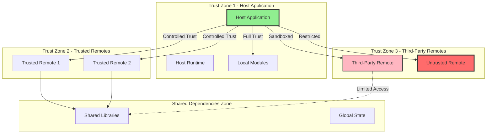

# Module Federation Security Architecture

This document owns security architecture, trust boundaries, runtime security validation, and security testing guidance. [architecture-overview.md](./architecture-overview.md) is the index for repo-wide architecture.

## Security Architecture

Module Federation's distributed architecture introduces unique security considerations that bundler implementers must understand and address. This section outlines the critical security aspects, trust boundaries, and implementation requirements for secure module federation.

### 1. **Content Security Policy (CSP) Considerations**

Module Federation's dynamic loading of remote code presents significant challenges for Content Security Policy implementation:

#### **Dynamic Script Loading Requirements**
```typescript
// CSP must allow dynamic script loading for remote entries
// Required CSP directives:
'script-src': [
  "'self'",
  "'unsafe-eval'",  // Needed for the runtime's new Function paths: manifest
                    // getPublicPath evaluation, ESM entries when
                    // FEDERATION_ALLOW_NEW_FUNCTION is defined, and SystemJS
                    // entry loading inside a System context
  ...trustedRemoteDomains,  // All remote hosts
  "'nonce-' + nonceValue"  // Recommended for additional security
]
```

#### **CSP Implementation Strategies**
- **Nonce-Based CSP**: Use unique nonces for each remote entry script
- **Hash-Based CSP**: Pre-calculate hashes for known remote entries (limited applicability)
- **Domain Allowlisting**: Maintain strict allowlists of trusted remote origins
- **CSP Reporting**: Implement CSP violation reporting to detect potential attacks

```typescript
// Example CSP configuration for Module Federation
const cspConfig = {
  'script-src': [
    "'self'",
    "'nonce-abc123'",
    'https://trusted-remote-1.example.com',
    'https://trusted-remote-2.example.com'
  ],
  'connect-src': [
    "'self'",
    ...trustedRemoteAPIs
  ],
  'report-uri': '/csp-violation-report'
};
```

#### **Runtime CSP Validation**
```typescript
// Implement runtime CSP compliance checking
const validateRemoteOrigin = (remoteUrl: string): boolean => {
  const allowedOrigins = getCSPAllowedOrigins();
  const remoteOrigin = new URL(remoteUrl).origin;
  return allowedOrigins.includes(remoteOrigin);
};
```

### 2. **Trust Boundaries and Security Zones**

Module Federation operates across multiple trust boundaries that must be clearly defined and enforced:



#### **Trust Boundary Implementation**
```typescript
interface RemoteTrustConfig {
  origin: string;
  trustLevel: 'full' | 'controlled' | 'sandboxed' | 'restricted';
  allowedExports: string[];
  cspPolicy: string;
  integrityCheck: boolean;
  isolationLevel: 'none' | 'iframe' | 'worker';
}

const validateTrustBoundary = (remote: RemoteTrustConfig, requestedModule: string): boolean => {
  // Validate trust level allows the requested operation
  if (remote.trustLevel === 'restricted' && !remote.allowedExports.includes(requestedModule)) {
    throw new SecurityError('Module not in allowlist for restricted remote');
  }

  // Validate origin matches expected
  if (!validateOrigin(remote.origin)) {
    throw new SecurityError('Remote origin validation failed');
  }

  return true;
};
```

### 3. **Secure Federation Practices**

#### **Remote Authentication and Authorization**
```typescript
// Implement remote authentication before loading
const secureRemoteLoader = {
  async loadRemote(remoteName: string, moduleName: string) {
    // 1. Authenticate the remote
    const authToken = await authenticateRemote(remoteName);

    // 2. Authorize the specific module access
    await authorizeModuleAccess(remoteName, moduleName, authToken);

    // 3. Load with integrity checking
    return await loadRemoteWithIntegrity(remoteName, moduleName, {
      authToken,
      integrityHash: await getModuleHash(remoteName, moduleName)
    });
  }
};
```

#### **Subresource Integrity (SRI) Implementation**
```typescript
// Implement SRI for remote entries
const loadRemoteWithSRI = async (remoteUrl: string, expectedHash: string) => {
  const script = document.createElement('script');
  script.src = remoteUrl;
  script.integrity = `sha384-${expectedHash}`;
  script.crossOrigin = 'anonymous';

  return new Promise((resolve, reject) => {
    script.onload = resolve;
    script.onerror = () => reject(new SecurityError('SRI validation failed'));
    document.head.appendChild(script);
  });
};
```

#### **Secure Configuration Management**
```typescript
// Secure remote configuration
interface SecureRemoteConfig {
  name: string;
  url: string;
  publicKey: string;  // For signature verification
  allowedModules: string[];
  maxCacheTime: number;
  requireAuth: boolean;
  cspNonce?: string;
}

const validateRemoteConfig = (config: SecureRemoteConfig): boolean => {
  // Validate URL is HTTPS in production
  if (isProduction() && !config.url.startsWith('https://')) {
    throw new SecurityError('Remote URLs must use HTTPS in production');
  }

  // Validate public key format
  if (!isValidPublicKey(config.publicKey)) {
    throw new SecurityError('Invalid public key format');
  }

  return true;
};
```

### 4. **Input Validation and Sanitization**

Strict input validation is crucial for preventing injection attacks:

#### **Remote Entry Validation**
```typescript
const validateRemoteEntry = (remoteEntry: any): boolean => {
  // Validate structure
  if (typeof remoteEntry !== 'object' || !remoteEntry.get || !remoteEntry.init) {
    throw new SecurityError('Invalid remote entry structure');
  }

  // Validate exposed modules
  const exposedModules = Object.keys(remoteEntry.modules || {});
  exposedModules.forEach(moduleName => {
    if (!isValidModuleName(moduleName)) {
      throw new SecurityError(`Invalid module name: ${moduleName}`);
    }
  });

  return true;
};

const isValidModuleName = (name: string): boolean => {
  // Allow only alphanumeric, dash, underscore, and forward slash
  const validPattern = /^[a-zA-Z0-9/_-]+$/;
  return validPattern.test(name) && !name.includes('..');
};
```

#### **Shared Dependency Validation**
```typescript
const validateSharedDependency = (packageName: string, version: string): boolean => {
  // Validate package name format
  if (!isValidPackageName(packageName)) {
    throw new SecurityError(`Invalid package name: ${packageName}`);
  }

  // Validate version format (semver)
  if (!isValidSemverVersion(version)) {
    throw new SecurityError(`Invalid version: ${version}`);
  }

  // Check against known vulnerable versions
  if (isVulnerableVersion(packageName, version)) {
    throw new SecurityError(`Vulnerable package version: ${packageName}@${version}`);
  }

  return true;
};
```

### 5. **Cross-Origin Security Implications**

#### **CORS Configuration**
```typescript
// Proper CORS setup for remote loading
const corsConfig = {
  // Be restrictive with allowed origins
  'Access-Control-Allow-Origin': trustedOrigins,
  'Access-Control-Allow-Methods': 'GET, POST',
  'Access-Control-Allow-Headers': 'Content-Type, Authorization',
  'Access-Control-Allow-Credentials': 'true',
  // Prevent CSRF attacks
  'Access-Control-Max-Age': '86400'
};
```

#### **PostMessage Security**
```typescript
// Secure communication between federated modules
const securePostMessage = {
  send(targetOrigin: string, data: any) {
    // Validate target origin
    if (!trustedOrigins.includes(targetOrigin)) {
      throw new SecurityError('Untrusted target origin');
    }

    // Sanitize data
    const sanitizedData = sanitizeMessageData(data);

    window.postMessage(sanitizedData, targetOrigin);
  },

  receive(event: MessageEvent) {
    // Validate origin
    if (!trustedOrigins.includes(event.origin)) {
      console.warn('Ignoring message from untrusted origin:', event.origin);
      return;
    }

    // Validate message structure
    if (!isValidMessageStructure(event.data)) {
      console.warn('Invalid message structure received');
      return;
    }

    // Process message
    processSecureMessage(event.data);
  }
};
```

### 6. **Runtime Security Validations**

#### **Module Isolation and Sandboxing**
```typescript
// Implement module isolation for untrusted remotes
class SecureModuleLoader {
  private isolationStrategies = {
    iframe: this.loadInIframe,
    worker: this.loadInWorker,
    vm: this.loadInVM
  };

  async loadIsolatedModule(remoteConfig: SecureRemoteConfig, moduleName: string) {
    const isolationLevel = this.determineIsolationLevel(remoteConfig.trustLevel);
    const strategy = this.isolationStrategies[isolationLevel];

    return await strategy(remoteConfig, moduleName);
  }

  private async loadInIframe(config: SecureRemoteConfig, moduleName: string) {
    // Create sandboxed iframe for untrusted code
    const iframe = document.createElement('iframe');
    iframe.sandbox = 'allow-scripts allow-same-origin';
    iframe.src = `${config.url}?module=${encodeURIComponent(moduleName)}`;

    // Implement secure communication channel
    return new Promise((resolve, reject) => {
      const messageHandler = (event: MessageEvent) => {
        if (event.source === iframe.contentWindow &&
            event.origin === new URL(config.url).origin) {
          resolve(event.data);
          window.removeEventListener('message', messageHandler);
        }
      };

      window.addEventListener('message', messageHandler);
      document.body.appendChild(iframe);
    });
  }
}
```

#### **Runtime Security Monitoring**
```typescript
// Implement security monitoring and alerting
class SecurityMonitor {
  private securityEvents: SecurityEvent[] = [];

  logSecurityEvent(event: SecurityEvent) {
    this.securityEvents.push({
      ...event,
      timestamp: Date.now(),
      userAgent: navigator.userAgent,
      url: window.location.href
    });

    // Alert on suspicious patterns
    if (this.detectSuspiciousActivity(event)) {
      this.triggerSecurityAlert(event);
    }
  }

  private detectSuspiciousActivity(event: SecurityEvent): boolean {
    // Detect rapid failure attempts
    const recentFailures = this.securityEvents
      .filter(e => e.type === 'validation_failure' &&
                   Date.now() - e.timestamp < 60000)
      .length;

    return recentFailures > 5;
  }

  private triggerSecurityAlert(event: SecurityEvent) {
    // Send security alert to monitoring system
    fetch('/api/security-alert', {
      method: 'POST',
      headers: { 'Content-Type': 'application/json' },
      body: JSON.stringify({
        event,
        severity: 'high',
        timestamp: Date.now()
      })
    });
  }
}
```

### 7. **Security Best Practices for Bundler Implementers**

#### **Essential Security Checklist**
- ✅ **CSP Compliance**: Ensure CSP policies support dynamic loading while maintaining security
- ✅ **HTTPS Enforcement**: Require HTTPS for all remote entries in production
- ✅ **Origin Validation**: Implement strict origin validation for all remote resources
- ✅ **Input Sanitization**: Validate and sanitize all remote inputs and configurations
- ✅ **Integrity Checking**: Implement SRI or equivalent integrity verification
- ✅ **Trust Boundaries**: Clearly define and enforce trust levels for different remotes
- ✅ **Error Handling**: Implement secure error handling that doesn't leak sensitive information
- ✅ **Monitoring**: Add security event logging and monitoring capabilities
- ✅ **Sandboxing**: Provide isolation mechanisms for untrusted code
- ✅ **Version Control**: Implement secure version negotiation and validation

#### **Security Configuration Example**
```typescript
// Comprehensive security configuration
const securityConfig: ModuleFederationSecurityConfig = {
  // CSP settings
  csp: {
    enforceHttps: true,
    allowedOrigins: ['https://trusted-app-1.com', 'https://trusted-app-2.com'],
    nonce: generateNonce(),
    reportUri: '/csp-violations'
  },

  // Trust levels
  remotes: {
    'trusted-app-1': {
      trustLevel: 'full',
      integrityCheck: false,
      isolation: 'none'
    },
    'partner-app': {
      trustLevel: 'controlled',
      integrityCheck: true,
      isolation: 'none',
      allowedModules: ['Header', 'Footer']
    },
    'third-party-widget': {
      trustLevel: 'sandboxed',
      integrityCheck: true,
      isolation: 'iframe',
      allowedModules: ['Widget']
    }
  },

  // Security monitoring
  monitoring: {
    enabled: true,
    alertThreshold: 5,
    reportEndpoint: '/api/security-events'
  },

  // Shared dependency security
  shared: {
    vulnerabilityCheck: true,
    allowedVersions: {
      'react': '^18.0.0',
      'lodash': '^4.17.21'
    }
  }
};
```

### 8. **Security Testing and Validation**

#### **Security Test Suite**
```typescript
// Security-focused test cases for Module Federation
describe('Module Federation Security', () => {
  test('should reject untrusted origins', async () => {
    const maliciousRemote = {
      name: 'malicious-app',
      url: 'http://malicious-site.com/remoteEntry.js'
    };

    await expect(loadRemote(maliciousRemote))
      .rejects
      .toThrow('Untrusted origin');
  });

  test('should validate module names', () => {
    const invalidModuleNames = [
      '../../../etc/passwd',
      '<script>alert("xss")</script>',
      'module\x00name'
    ];

    invalidModuleNames.forEach(name => {
      expect(() => validateModuleName(name))
        .toThrow('Invalid module name');
    });
  });

  test('should enforce CSP compliance', () => {
    const cspPolicy = generateCSPPolicy();
    expect(cspPolicy).toContain("'nonce-");
    expect(cspPolicy).not.toContain("'unsafe-inline'");
  });
});
```

### 9. **Common Security Vulnerabilities and Mitigations**

| Vulnerability | Description | Mitigation |
|---------------|-------------|------------|
| **XSS via Remote Code** | Malicious remote modules inject scripts | Implement CSP, input validation, sandboxing |
| **CSRF Attacks** | Cross-site requests to load malicious remotes | Use CSRF tokens, validate origins, implement SameSite cookies |
| **Dependency Confusion** | Malicious packages with similar names to trusted ones | Implement package name validation, use private registries |
| **Man-in-the-Middle** | Remote entries intercepted and modified | Enforce HTTPS, implement SRI, use certificate pinning |
| **Prototype Pollution** | Malicious remotes modify JavaScript prototypes | Implement object freezing, use safe deserialization |
| **Resource Exhaustion** | Malicious remotes consume excessive resources | Implement resource limits, monitoring, timeouts |
| **Information Disclosure** | Sensitive data leaked through error messages | Implement secure error handling, sanitize error responses |

This security architecture provides a comprehensive foundation for implementing secure Module Federation. Bundler teams should adapt these practices to their specific implementation while maintaining the core security principles outlined above.
