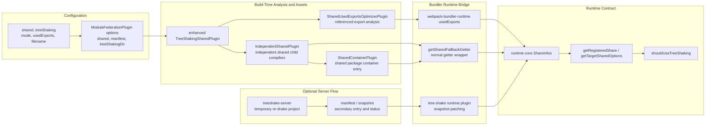
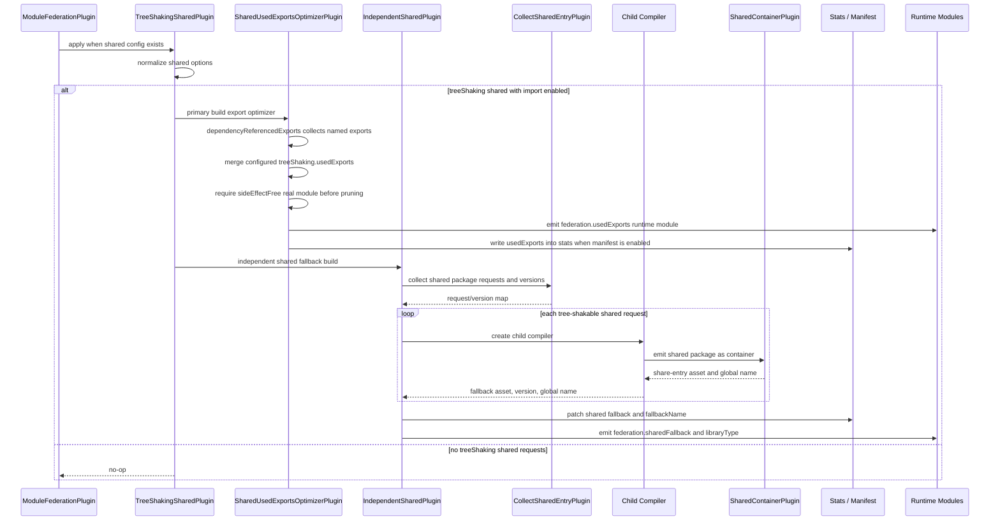
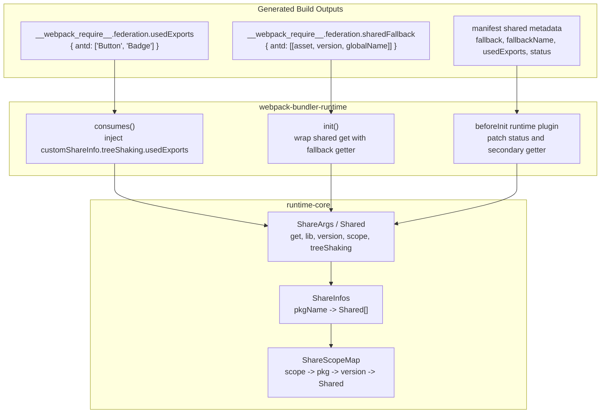
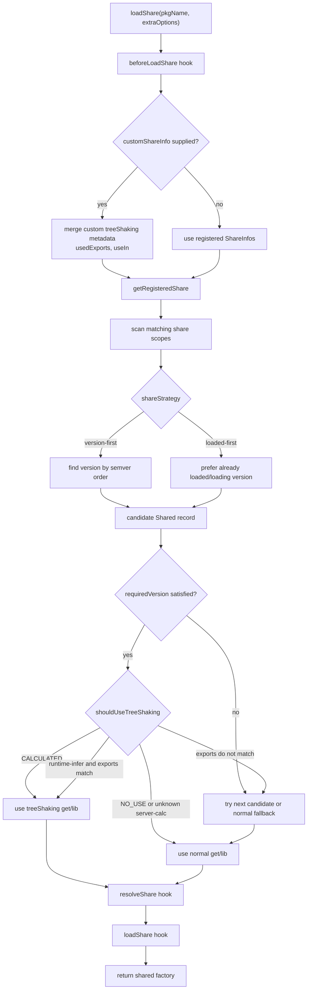
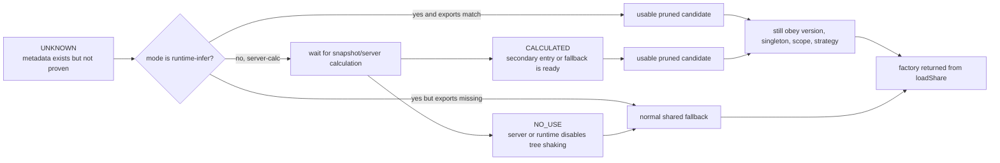
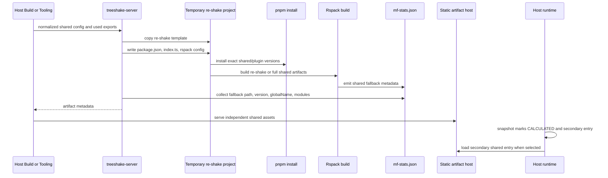
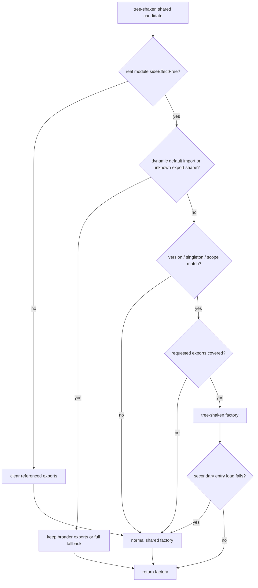

# Shared Tree-Shaking Architecture

Shared dependency tree shaking spans the Module Federation build layer, bundler runtime bridge, runtime-core shared resolver, optional re-shake server flow, and validation fixtures.

## Table of Contents

- [Problem Space](#problem-space)
- [Ownership Map](#ownership-map)
- [Build-Time Pipeline](#build-time-pipeline)
- [Runtime Data Model](#runtime-data-model)
- [Runtime Resolution Flow](#runtime-resolution-flow)
- [Mode Semantics](#mode-semantics)
- [Server-Calculated Re-Shake Flow](#server-calculated-re-shake-flow)
- [Fallback and Safety Rules](#fallback-and-safety-rules)
- [Implementation Index](#implementation-index)
- [Validation](#validation)

## Problem Space

Normal shared dependencies optimize for one loaded implementation per share scope and version rule. That is correct for compatibility, but a large shared package such as a component library can still expose many unused exports. Shared tree shaking adds an optional second path:

1. Build tools discover or receive the exports a host actually uses.
2. Build tools emit independent shared fallback assets for compatible shared packages.
3. Bundler runtime code attaches those fallback assets and used-export records to the federation runtime.
4. Runtime-core decides whether a tree-shaken shared candidate satisfies the same version, singleton, scope, and strategy constraints as a normal shared candidate.
5. If the candidate is not safe, the runtime falls back to the ordinary shared factory.

Tree shaking is a candidate preference, not a new federation contract. The remote container interface, share scopes, and `loadShare` semantics remain the same.

## Ownership Map



## Build-Time Pipeline

The webpack/enhanced implementation has two build-time responsibilities: identify the shared exports that are safe to keep and emit fallback assets that can serve a pruned shared implementation.



`SharedUsedExportsOptimizerPlugin` only prunes when webpack can prove the underlying module is side-effect free. If the package is not safe, it clears the referenced export set and leaves the normal shared implementation available.

## Runtime Data Model

Tree-shaking metadata reaches runtime-core through the same shared records used by normal sharing. The bridge layer enriches those records before runtime-core resolves them.



The normal shared getter is not discarded. When `sharedFallback` exists, `webpack-bundler-runtime` stores the original getter in `treeShaking.get` and replaces `get` with a fallback-aware wrapper. That preserves full shared recovery if tree-shaken resolution cannot be used.

## Runtime Resolution Flow

Runtime-core decides whether a candidate can use tree shaking. It does not inspect webpack modules or generated assets; it only reads normalized shared metadata.



`shouldUseTreeShaking` follows three rules:

- `NO_USE` disables the tree-shaken candidate.
- `CALCULATED` enables the tree-shaken candidate.
- `runtime-infer` enables the candidate when no requested export set is known, or when the candidate's `usedExports` covers the requested `usedExports`.

Unknown `server-calc` metadata is intentionally not enough. A server-calculated candidate should become usable only after snapshot or manifest data marks it calculated and provides the secondary getter or fallback entry.

## Mode Semantics



| Mode or status | Meaning | Typical source | Runtime outcome |
| --- | --- | --- | --- |
| `runtime-infer` | The host can use build/runtime-injected export knowledge without a separate server calculation. | `SharedUsedExportsOptimizerRuntimeModule` and `consumes()` injecting `usedExports`. | Uses the pruned candidate when export coverage matches; otherwise falls back. |
| `server-calc` + `UNKNOWN` | Tree-shaking metadata exists, but a server/snapshot has not confirmed the secondary entry. | Default mode when tree-shaking metadata exists without calculated status. | Falls back to normal shared resolution. |
| `CALCULATED` | A server or snapshot path has confirmed the secondary tree-shaken asset. | Manifest/snapshot patching in `webpack-bundler-runtime` runtime plugin. | Tree-shaken candidate can be selected if version rules also pass. |
| `NO_USE` | Tree shaking is explicitly disabled for this shared candidate. | Runtime override, local storage demo switch, or server decision. | Normal shared factory is used. |

## Server-Calculated Re-Shake Flow

The optional server-calculated path builds a small temporary project around the requested shared packages. It returns artifact metadata that can be served and inserted into the host snapshot.



The in-repo demos model both paths:

- `apps/shared-tree-shaking/no-server` uses `runtime-infer`.
- `apps/shared-tree-shaking/with-server` uses `server-calc`, `build:re-shake`, `serve:re-shake`, and a runtime plugin that points at the secondary shared tree-shaking entry.

## Fallback and Safety Rules



The safety model is deliberately conservative:

- `eager: true` cannot be combined with `treeShaking.mode`.
- Side-effectful shared packages are not statically pruned.
- Dynamic default import patterns may require a broader export set.
- Multi-version shared packages produce per-version fallback entries.
- Tree shaking never bypasses `requiredVersion`, singleton handling, share scopes, or `shareStrategy`.

## Implementation Index

| Area | Primary files | Responsibility |
| --- | --- | --- |
| Enhanced build orchestration | `packages/enhanced/src/lib/sharing/tree-shaking/TreeShakingSharedPlugin.ts` | Activates optimizer and independent shared build path for tree-shakable shared config. |
| Used-export collection | `packages/enhanced/src/lib/sharing/tree-shaking/SharedUsedExportsOptimizerPlugin.ts` | Collects referenced exports, applies custom `usedExports`, marks safe modules, writes runtime/manifest metadata. |
| Independent fallback assets | `packages/enhanced/src/lib/sharing/tree-shaking/IndependentSharedPlugin.ts` | Creates child compilers and records fallback asset/version/global-name tuples. |
| Shared container asset | `packages/enhanced/src/lib/sharing/tree-shaking/SharedContainerPlugin/*` | Emits a container-style entry for a shared package fallback. |
| Bundler runtime bridge | `packages/webpack-bundler-runtime/src/init.ts`, `consumes.ts`, `getSharedFallbackGetter.ts`, `getUsedExports.ts` | Wraps getters, injects `usedExports`, patches calculated snapshot data, and loads fallback entries. |
| Runtime decision | `packages/runtime-core/src/utils/share.ts`, `packages/runtime-core/src/shared/index.ts` | Resolves shared candidates and decides whether tree shaking is usable. |
| Re-shake server | `packages/treeshake-server/src/services/buildService.ts`, `packages/treeshake-server/template/re-shake-share/*` | Builds and reports secondary shared artifacts outside the normal app build. |
| Fixtures | `apps/shared-tree-shaking/*`, `packages/enhanced/test/configCases/tree-shaking-share/*` | Validate runtime-infer, server-calc, multi-version fallback, dynamic imports, and fallback behavior. |

## Validation

Use focused checks for docs and shared tree-shaking changes:

```bash
pnpm run check:mermaid
pnpm run ci:local --only=e2e-shared-tree-shaking
pnpm run ci:local --only=e2e-treeshake
```

For docs-only edits, `pnpm run check:mermaid` is the important architecture-doc check. Run the e2e jobs when implementation behavior changes in enhanced, runtime-core, webpack-bundler-runtime, treeshake-server, or the shared-tree-shaking fixtures.
