### The Complete Guide to Module Federation: Internals and Data Flow

This document provides a comprehensive, chronological breakdown of the Module Federation plugin system, combining high-level concepts with a granular analysis of the specific Webpack hooks, data passed, and the precise order of operations during a build and at runtime.

## Table of Contents

1. [Core Architecture Overview](#core-architecture-overview)
2. [Plugin Configuration Deep Dive](#plugin-configuration-deep-dive)
3. [Build-Time Processing](#build-time-processing)
4. [Module Resolution & Interception](#module-resolution--interception)
5. [Runtime Federation System](#runtime-federation-system)
6. [Advanced Patterns & Use Cases](#advanced-patterns--use-cases)
7. [Performance Optimization](#performance-optimization)
8. [Troubleshooting & Debugging](#troubleshooting--debugging)


---

## Core Architecture Overview

Module Federation operates through a sophisticated plugin ecosystem that intercepts Webpack's module resolution at multiple critical points. Understanding the precise timing and data flow is essential for advanced usage.

### Plugin Hierarchy and Responsibilities

```typescript
interface ModuleFederationPluginOptions {
  name: string;                          // Unique container name
  filename?: string;                     // Container entry filename (default: "remoteEntry.js")
  exposes?: Record<string, string>;      // Modules to expose to other applications
  remotes?: Record<string, string | RemoteOptions>; // Remote containers to consume
  shared?: SharedConfig;                 // Shared module configuration
  library?: LibraryOptions;              // Library configuration for container
  runtimePlugins?: string[];             // Runtime plugins for enhanced functionality
  shareScope?: string;                   // Default share scope name (default: "default")
  experiments?: {
    federationRuntime?: boolean;         // Enable new federation runtime
  };
}

interface RemoteOptions {
  external: string;                      // URL or variable name for remote
  shareScope?: string;                   // Override default share scope
}

interface SharedConfig {
  [packageName: string]: string | SharedOptions;
}

interface SharedOptions {
  eager?: boolean;                       // Load shared module synchronously
  import?: false | string;               // Fallback module path if sharing fails
  packageName?: string;                  // Package name for version detection
  requiredVersion?: string | false;      // Version requirement (semver supported)
  shareKey?: string;                     // Key in share scope (defaults to package name)
  shareScope?: string;                   // Share scope name
  singleton?: boolean;                   // Only one instance allowed across federation
  strictVersion?: boolean;               // Strict version matching (no semver flexibility)
  version?: string | false;              // Version to provide (auto-detected from package.json)
  nodeModulesReconstructedLookup?: boolean; // Enable node_modules path reconstruction
}
```

## Plugin Configuration Deep Dive

### 1. Basic Federation Setup

```typescript
// Host Application (exposes modules)
const hostConfig = {
  name: 'host-app',
  filename: 'remoteEntry.js',
  exposes: {
    './Button': './src/components/Button',
    './Header': './src/components/Header',
    './utils': './src/utils/index'
  },
  shared: {
    'react': {
      singleton: true,
      requiredVersion: '^18.0.0'
    },
    'react-dom': {
      singleton: true,
      requiredVersion: '^18.0.0'
    }
  }
};

// Remote Consumer Application
const remoteConfig = {
  name: 'consumer-app',
  remotes: {
    'host': 'host@http://localhost:3001/remoteEntry.js'
  },
  shared: {
    'react': {
      singleton: true,
      requiredVersion: '^18.0.0'
    },
    'react-dom': {
      singleton: true,
      requiredVersion: '^18.0.0'
    }
  }
};
```

### 2. Advanced Sharing Configurations

#### Per-Module Sharing Strategies

```typescript
const advancedSharing = {
  // Critical singleton - strict version enforcement
  'react': {
    singleton: true,
    strictVersion: true,
    requiredVersion: '18.2.0',
    eager: false
  },
  
  // Design system - eager loading for immediate availability
  '@company/design-system': {
    singleton: true,
    eager: true,
    shareScope: 'design-system',
    version: '2.1.0'
  },
  
  // Utility library - flexible versioning
  'lodash': {
    singleton: false,
    requiredVersion: false,  // Accept any version
    shareScope: 'utilities'
  },
  
  // Complex package with fallback
  'moment': {
    singleton: true,
    requiredVersion: '^2.29.0',
    import: './src/fallbacks/date-utils', // Fallback implementation
    shareScope: 'datetime'
  },
  
  // Node modules reconstruction for complex paths
  '@babel/runtime': {
    nodeModulesReconstructedLookup: true,
    shareKey: '@babel/runtime',
    shareScope: 'babel-runtime'
  }
};
```

#### Multi-Scope Federation

```typescript
const multiScopeConfig = {
  name: 'multi-scope-app',
  exposes: {
    './VendorComponent': './src/components/VendorComponent',
    './InternalTool': './src/tools/InternalTool'
  },
  shared: {
    // Vendor scope for third-party libraries
    'react': { shareScope: 'vendor', singleton: true },
    'lodash': { shareScope: 'vendor', singleton: false },
    
    // Internal scope for company libraries
    '@company/utils': { shareScope: 'internal', singleton: true },
    '@company/components': { shareScope: 'internal', eager: true },
    
    // Framework scope for framework-specific modules
    '@angular/core': { shareScope: 'angular', singleton: true },
    '@vue/runtime-core': { shareScope: 'vue', singleton: true }
  }
};
```

### 3. Environment-Specific Configuration

```typescript
const createFederationConfig = (env: 'development' | 'production') => ({
  name: 'app',
  filename: 'remoteEntry.js',
  
  // Environment-specific remote URLs
  remotes: env === 'development' 
    ? {
        'shared-components': 'sharedComponents@http://localhost:3001/remoteEntry.js',
        'user-service': 'userService@http://localhost:3002/remoteEntry.js'
      }
    : {
        'shared-components': 'sharedComponents@https://cdn.company.com/shared-components/v1.2.3/remoteEntry.js',
        'user-service': 'userService@https://cdn.company.com/user-service/v2.1.0/remoteEntry.js'
      },
  
  shared: {
    'react': {
      singleton: true,
      // Stricter version checking in production
      strictVersion: env === 'production',
      requiredVersion: env === 'development' ? false : '^18.0.0'
    }
  },
  
  // Development-only features
  ...(env === 'development' && {
    experiments: {
      federationRuntime: true  // Enable enhanced debugging
    }
  })
});
```

### 4. Library Configuration Options

```typescript
interface LibraryOptions {
  type: 'var' | 'assign' | 'this' | 'window' | 'self' | 'global' | 'commonjs' | 'commonjs2' | 'amd' | 'umd' | 'system' | 'jsonp' | 'module';
  name?: string;
  export?: string | string[];
  auxiliaryComment?: string | { root?: string; commonjs?: string; commonjs2?: string; amd?: string; };
  umdNamedDefine?: boolean;
}

// Different library configurations for different deployment scenarios
const libraryConfigurations = {
  // Browser global variable
  browserGlobal: {
    type: 'var',
    name: 'MyFederatedApp'
  },
  
  // CommonJS for Node.js
  nodeCommonJs: {
    type: 'commonjs2'
  },
  
  // UMD for universal usage
  universal: {
    type: 'umd',
    name: 'MyFederatedApp',
    umdNamedDefine: true
  },
  
  // ES modules
  esModule: {
    type: 'module'
  }
};
```

---

### Core Concepts Clarified

*   **Universal Plugin Application**: The `SharePlugin` is applied to **every** federated application. This means any federated build can simultaneously be a host and a remote, providing some shared modules while consuming others. The distinction between "host" and "remote" is not absolute but rather a description of roles an application plays in relation to other applications.
*   **The Federation Runtime**: Module Federation relies on a dedicated runtime, separate from Webpack's own runtime. This Federation Runtime (provided by `@module-federation/runtime-tools` and injected by `FederationRuntimePlugin`) is responsible for managing the shared scope, negotiating versions, and handling singleton checks. Webpack's runtime delegates these specific tasks to the Federation Runtime.
*   **Container Entry**: The entry point for a federated application is often called `remoteEntry.js` by convention, but this is customizable via the `filename` option in the `ModuleFederationPlugin` configuration.
*   **Version Negotiation**: The version checking logic is powered by the `satisfy` function (from `@module-federation/runtime-tools`, which uses `semver`). When a consuming application requires a dependency (e.g., `react: "^17.0.0"`) and a host provides its version (e.g., `17.0.2`), the runtime effectively runs `satisfy('17.0.2', '^17.0.0')`. If this returns `true`, the dependency is considered compatible.

---

### Phase 1: Build-Time Initialization (The `apply` sequence)

The moment you run Webpack, the `.apply()` method of each plugin is called on the `compiler` object. This is where they attach themselves to various hooks.

1.  **`ModuleFederationPlugin.apply(compiler)`**: The master orchestrator.
    *   **Data In**: The `compiler` object and the `options` from your `webpack.config.js`.
    *   **Action**: It reads `options.shared`, `options.exposes`, and `options.remotes` and conditionally creates and applies the other core plugins. The sequence is:
        - `RemoteEntryPlugin` (applied first)
        - `FederationModulesPlugin` 
        - `FederationRuntimePlugin`
        - Then in `compiler.hooks.afterPlugins`: conditionally applies `ContainerPlugin`, `ContainerReferencePlugin`, and `SharePlugin`

2.  **`SharePlugin.apply(compiler)`**: The sharing orchestrator.
    *   **Action**: It immediately instantiates and calls `.apply()` on **both** `ProvideSharedPlugin` and `ConsumeSharedPlugin`, passing them the parsed and normalized `shared` configuration. This ensures every build is capable of both providing and consuming.

3.  **`ContainerPlugin.apply(compiler)`** (When `exposes` is used):
    *   **Action**: Taps into `compiler.hooks.make`.
        *   **Hook**: `compiler.hooks.make.tapAsync('ContainerPlugin', ...)`
        *   **Internal Action**: Creates a `new ContainerEntryDependency(...)` and adds it to the dependency graph via `compilation.addEntry()`. This instructs Webpack to create a new entrypoint chunk (the container entry, e.g., `remoteEntry.js`).

4.  **`ContainerReferencePlugin.apply(compiler)`** (When `remotes` is used):
    *   **Action**: Uses Webpack's built-in `ExternalsPlugin` to map remote containers to external references, preventing them from being bundled.

---

### Phase 2: Module Factorization & Hook Timing (Critical Distinction)

As Webpack finds `import` statements, it triggers a sequence of hooks for each module request. **The timing and order of these hooks is crucial to understanding Module Federation's interception strategy.**

#### Hook Sequence for Shared Modules:

1. **`normalModuleFactory.hooks.factorize.tapPromise(...)`** - **BEFORE** module creation
   * **ConsumeSharedPlugin** taps this hook to intercept module requests **before** Webpack creates any module
   * **Key Data Object**: `resolveData` (contains `context`, `request`, etc.)
   * **Critical Timing**: This happens **before** any actual module is instantiated

2. **Normal Webpack Module Creation** (if factorize doesn't return a module)
   * Webpack proceeds with its normal module creation process
   * Resolves the request to an actual file and creates a standard webpack module

3. **`normalModuleFactory.hooks.module.tap(...)`** - **AFTER** module creation
   * **ProvideSharedPlugin** taps this hook to inspect modules **after** they've been created
   * **Key Data**: `module`, `resourceResolveData`, `resolveData`
   * **Critical Timing**: This happens **after** the module exists and has been resolved to a file

#### Interception Flow for a Shared Module like `react`:

**Step 1: ConsumeSharedPlugin Factorize Hook**
```typescript
normalModuleFactory.hooks.factorize.tapPromise(PLUGIN_NAME, async (resolveData) => {
  const { request } = resolveData;
  // Check if 'react' is in consumes config
  if (consumesConfig.has(request)) {
    // Return ConsumeSharedModule - this PREVENTS normal webpack module creation
    return new ConsumeSharedModule(context, consumeConfig);
  }
  // Return undefined - let webpack continue normal processing
  return undefined;
});
```

**Step 2: Normal Module Creation** (if ConsumeSharedPlugin didn't intercept)
```typescript
// Webpack creates normal module for 'react' from node_modules
const normalModule = new NormalModule(/* ... */);
```

**Step 3: ProvideSharedPlugin Module Hook**
```typescript
normalModuleFactory.hooks.module.tap(PLUGIN_NAME, (module, { resource }, resolveData) => {
  const { request } = resolveData;
  // Check if 'react' should be provided as shared
  if (providesConfig.has(request) && resource) {
    // Create ProvideSharedModule via factory, but module already exists
    this.provideSharedModule(compilation, resolvedProvideMap, request, config, resource);
    resolveData.cacheable = false;
  }
  return module; // Always return the module (possibly modified)
});
```

---

## Runtime Federation System

### Share Scope Architecture

The share scope is the heart of Module Federation's runtime system. It's a global registry where all shared modules are registered and resolved.

```typescript
// Global share scope structure
interface ShareScope {
  [moduleKey: string]: {
    [version: string]: SharedModuleInfo;
  };
}

interface SharedModuleInfo {
  get(): Promise<ModuleFactory>;  // Function to get the module
  loaded: 0 | 1;                 // 0 = lazy, 1 = eager
  scope: string[];                // Share scopes this module belongs to
  shareConfig?: ConsumeSharedOptions;
}

// Runtime globals
declare global {
  interface Window {
    __webpack_share_scopes__: {
      [scopeName: string]: ShareScope;
    };
  }
}
```

### Federation Runtime Bootstrap Sequence

```mermaid
sequenceDiagram
    participant User as 👤 User Browser
    participant HostApp as 🏠 Host Application<br/>(localhost:3000)
    participant HostBundle as 📦 Host Bundle<br/>(main.js + remoteEntry.js)
    participant FedRuntime as ⚡ Federation Runtime<br/>(__webpack_require__.S)
    participant ShareScope as 🗃️ Share Scope<br/>(Global Registry)
    participant RemoteScript as 📡 Remote Script<br/>(CDN/localhost:3001)
    participant RemoteContainer as 🌐 Remote Container<br/>(Federated Module)
    participant SharedModules as 🤝 Shared Modules<br/>(react, lodash, etc.)
    
    Note over User,SharedModules: 🚀 Phase 1: Application Bootstrap & Federation Initialization
    
    User->>HostApp: 🌐 Navigate to application
    activate HostApp
    
    HostApp->>HostBundle: 📥 Load main application bundle
    activate HostBundle
    
    HostBundle->>FedRuntime: ⚡ Initialize federation runtime
    activate FedRuntime
    
    FedRuntime->>ShareScope: 🗃️ Create default share scope
    activate ShareScope
    Note over ShareScope: 📊 Initialize: __webpack_require__.S.default = {}
    ShareScope-->>FedRuntime: ✅ Share scope ready
    
    FedRuntime->>SharedModules: 📤 Register host's provided modules
    activate SharedModules
    Note over SharedModules: 📋 Register:<br/>react@18.2.0: { get: fn, loaded: 1 }<br/>lodash@4.17.21: { get: fn, loaded: 0 }
    SharedModules-->>ShareScope: 📊 Modules registered in scope
    ShareScope-->>FedRuntime: ✅ Host modules registered
    FedRuntime-->>HostBundle: ✅ Federation runtime ready
    HostBundle-->>HostApp: ✅ Application initialized
    
    Note over User,SharedModules: 📡 Phase 2: Dynamic Remote Loading & Container Initialization
    
    User->>HostApp: 🖱️ Trigger remote component<br/>(e.g., click button, route change)
    HostApp->>FedRuntime: 🎯 import('remote/Component')
    
    FedRuntime->>RemoteScript: 📡 Load remote container script
    Note over RemoteScript: 🌐 Inject: <script src="http://localhost:3001/remoteEntry.js">
    activate RemoteScript
    
    RemoteScript->>RemoteContainer: 📦 Download & execute container
    activate RemoteContainer
    Note over RemoteContainer: 🏗️ Container available at window.remoteApp
    RemoteScript-->>FedRuntime: ✅ Remote script loaded
    deactivate RemoteScript
    
    FedRuntime->>RemoteContainer: 🤝 container.init(shareScope)
    Note over RemoteContainer: 🔧 Initialize remote with host's share scope
    
    RemoteContainer->>ShareScope: 🔍 Inspect current share scope
    Note over ShareScope: 📊 Current state:<br/>react@18.2.0 (from host)<br/>lodash@4.17.21 (from host)
    
    RemoteContainer->>SharedModules: 📤 Register remote's provided modules
    Note over SharedModules: 📋 Add remote modules:<br/>@company/ui@2.1.0: { get: fn, loaded: 0 }<br/>moment@2.29.4: { get: fn, loaded: 1 }
    
    SharedModules->>ShareScope: 🔄 Merge module registrations
    Note over ShareScope: 📊 Updated scope:<br/>react@18.2.0 (host)<br/>lodash@4.17.21 (host)<br/>@company/ui@2.1.0 (remote)<br/>moment@2.29.4 (remote)
    
    ShareScope-->>RemoteContainer: ✅ Share scope merged
    RemoteContainer-->>FedRuntime: ✅ Remote container initialized
    
    Note over User,SharedModules: 🔄 Phase 3: Module Resolution & Dependency Satisfaction
    
    FedRuntime->>RemoteContainer: 📥 container.get('Component')
    RemoteContainer->>ShareScope: 🔍 Resolve component dependencies
    Note over ShareScope: 🎯 Component needs:<br/>- react (any version)<br/>- @company/ui (^2.0.0)<br/>- moment (^2.29.0)
    
    loop 🔄 For each dependency
        ShareScope->>ShareScope: ✅ Version satisfaction check
        Note over ShareScope: 📋 semver.satisfies(available, required)
        
        alt ✅ Compatible version found
            ShareScope->>SharedModules: 📦 Get module factory
            SharedModules-->>ShareScope: 🏭 Return factory function
        else ❌ No compatible version
            ShareScope->>RemoteContainer: ⚠️ Use fallback or throw error
            Note over RemoteContainer: 🔄 Fallback to local bundle<br/>or show error boundary
        end
    end
    
    ShareScope-->>RemoteContainer: ✅ All dependencies resolved
    RemoteContainer->>SharedModules: 🏭 Execute module factories
    
    Note over SharedModules: ⚡ Instantiate:<br/>• react hooks & context<br/>• @company/ui components<br/>• moment utilities
    
    SharedModules-->>RemoteContainer: 📦 Module instances ready
    RemoteContainer-->>FedRuntime: 🎯 Component factory function
    FedRuntime-->>HostApp: 📦 Ready-to-render component
    
    Note over User,SharedModules: 🎊 Phase 4: Component Execution & UI Rendering
    
    HostApp->>HostApp: 🎨 Render federated component
    Note over HostApp: ⚡ Component execution:<br/>• Props passed down<br/>• State management active<br/>• Event handlers bound<br/>• Lifecycle methods called
    
    HostApp-->>User: 🎊 Federated UI rendered
    
    Note over User,SharedModules: 🔄 Ongoing: Hot Module Replacement (Development)
    
    opt 🔥 HMR in Development
        RemoteScript->>RemoteContainer: 🔄 Hot update received
        RemoteContainer->>ShareScope: 🔄 Update module registration
        ShareScope->>HostApp: ⚡ Trigger re-render
        HostApp-->>User: 🔄 UI updated without page reload
    end
    
    Note over User,SharedModules: ⚠️ Error Handling & Fallback Scenarios
    
    opt ❌ Remote Loading Failure
        FedRuntime->>RemoteScript: 📡 Attempt remote load
        RemoteScript-->>FedRuntime: ❌ Network error / 404 / timeout
        FedRuntime->>HostApp: ⚠️ Fallback to error boundary
        HostApp-->>User: 🚨 Error UI displayed
    end
    
    opt ❌ Version Conflict
        ShareScope->>ShareScope: ❌ Version incompatible
        ShareScope->>RemoteContainer: ⚠️ Version conflict detected
        alt 🔧 Singleton mode
            RemoteContainer->>HostApp: ⚠️ Show version warning
        else 🔄 Fallback mode
            RemoteContainer->>SharedModules: 🔄 Use local fallback module
        end
    end
    
    deactivate SharedModules
    deactivate RemoteContainer
    deactivate ShareScope
    deactivate FedRuntime
    deactivate HostBundle
    deactivate HostApp
```



### Version Satisfaction Logic

```typescript
class VersionResolver {
  static satisfy(
    availableVersion: string,
    requiredVersion: string | false,
    strictVersion: boolean = false
  ): boolean {
    // No version requirement - always satisfied
    if (requiredVersion === false) return true;
    
    // Strict version matching
    if (strictVersion) {
      return availableVersion === requiredVersion;
    }
    
    // Semver satisfaction check
    try {
      return semver.satisfies(availableVersion, requiredVersion);
    } catch (error) {
      console.warn(`Invalid semver comparison: ${availableVersion} vs ${requiredVersion}`);
      return false;
    }
  }
  
  static findBestMatch(
    availableVersions: Map<string, SharedModuleInfo>,
    requiredVersion: string | false,
    singleton: boolean = false
  ): SharedModuleInfo | null {
    const compatible = Array.from(availableVersions.entries())
      .filter(([version, info]) => this.satisfy(version, requiredVersion))
      .sort(([a], [b]) => semver.rcompare(a, b)); // Highest version first
    
    if (compatible.length === 0) return null;
    
    if (singleton && compatible.length > 1) {
      console.warn(`Multiple compatible versions found for singleton module`);
    }
    
    return compatible[0][1];
  }
}
```

### Dynamic Remote Loading

```typescript
class FederationRuntime {
  private remoteCache = new Map<string, Promise<RemoteContainer>>();
  private shareScopes = new Map<string, ShareScope>();
  
  async loadRemoteModule<T = any>(
    remoteName: string,
    moduleName: string,
    options: LoadRemoteOptions = {}
  ): Promise<T> {
    const remote = await this.getOrLoadRemote(remoteName, options);
    const moduleFactory = await remote.get(moduleName);
    return moduleFactory();
  }
  
  private async getOrLoadRemote(
    remoteName: string,
    options: LoadRemoteOptions
  ): Promise<RemoteContainer> {
    const cacheKey = `${remoteName}:${options.shareScope || 'default'}`;
    
    if (!this.remoteCache.has(cacheKey)) {
      this.remoteCache.set(cacheKey, this.loadRemoteContainer(remoteName, options));
    }
    
    return this.remoteCache.get(cacheKey)!;
  }
  
  private async loadRemoteContainer(
    remoteName: string,
    options: LoadRemoteOptions
  ): Promise<RemoteContainer> {
    const remoteUrl = this.resolveRemoteUrl(remoteName);
    
    // Load remote script
    const remote = await this.loadScript(remoteUrl);
    
    // Initialize with share scope
    const shareScope = this.getShareScope(options.shareScope || 'default');
    await remote.init(shareScope);
    
    return remote;
  }
  
  private async loadScript(url: string): Promise<RemoteContainer> {
    return new Promise((resolve, reject) => {
      const script = document.createElement('script');
      script.src = url;
      script.async = true;
      
      script.onload = () => {
        // Extract container from global scope
        const containerName = this.extractContainerName(url);
        const container = (window as any)[containerName];
        
        if (!container) {
          reject(new Error(`Container ${containerName} not found`));
          return;
        }
        
        resolve(container);
      };
      
      script.onerror = () => {
        reject(new Error(`Failed to load remote: ${url}`));
      };
      
      document.head.appendChild(script);
    });
  }
}
```

---

## Advanced Patterns & Use Cases

### 1. Micro-Frontend Architecture

```typescript
// Shell application setup
const shellConfig = {
  name: 'shell',
  exposes: {
    './ErrorBoundary': './src/components/ErrorBoundary',
    './Router': './src/components/Router',
    './ThemeProvider': './src/components/ThemeProvider',
    './AuthContext': './src/context/AuthContext'
  },
  remotes: {
    'header': 'headerMF@http://localhost:3001/remoteEntry.js',
    'sidebar': 'sidebarMF@http://localhost:3002/remoteEntry.js',
    'dashboard': 'dashboardMF@http://localhost:3003/remoteEntry.js',
    'settings': 'settingsMF@http://localhost:3004/remoteEntry.js'
  },
  shared: {
    'react': { singleton: true, eager: true },
    'react-dom': { singleton: true, eager: true },
    'react-router-dom': { singleton: true },
    '@company/design-system': { 
      singleton: true, 
      eager: true,
      version: '2.1.0' 
    }
  }
};

// Micro-frontend implementation
const microfrontendConfig = {
  name: 'dashboard',
  filename: 'remoteEntry.js',
  exposes: {
    './Dashboard': './src/Dashboard',
    './DashboardRoutes': './src/routes'
  },
  remotes: {
    'shell': 'shellMF@http://localhost:3000/remoteEntry.js'
  },
  shared: {
    'react': { singleton: true },
    'react-dom': { singleton: true },
    'react-router-dom': { singleton: true },
    '@company/design-system': { singleton: true }
  }
};
```

### 2. Cross-Framework Federation

```typescript
// React + Vue federation
const crossFrameworkConfig = {
  name: 'multi-framework-shell',
  remotes: {
    'react-components': 'reactMF@http://localhost:3001/remoteEntry.js',
    'vue-components': 'vueMF@http://localhost:3002/remoteEntry.js',
    'angular-components': 'angularMF@http://localhost:3003/remoteEntry.js'
  },
  shared: {
    // Framework-specific scopes
    'react': { shareScope: 'react', singleton: true },
    'vue': { shareScope: 'vue', singleton: true },
    '@angular/core': { shareScope: 'angular', singleton: true },
    
    // Common utilities
    'lodash': { shareScope: 'utils', singleton: false },
    'axios': { shareScope: 'utils', singleton: true },
    
    // Design tokens
    '@company/design-tokens': { 
      shareScope: 'design', 
      singleton: true, 
      eager: true 
    }
  }
};

// Framework adapters for cross-framework communication
class FrameworkAdapter {
  static wrapReactComponent(Component: React.ComponentType) {
    return {
      mount: (element: HTMLElement, props: any) => {
        const root = ReactDOM.createRoot(element);
        root.render(React.createElement(Component, props));
        return () => root.unmount();
      }
    };
  }
  
  static wrapVueComponent(Component: any) {
    return {
      mount: (element: HTMLElement, props: any) => {
        const app = Vue.createApp(Component, props);
        app.mount(element);
        return () => app.unmount();
      }
    };
  }
}
```

### 3. Server-Side Federation (Node.js)

```typescript
// Node.js federation configuration
const nodeConfig = {
  name: 'node-federation',
  target: 'node',
  mode: 'development',
  experiments: {
    outputModule: true
  },
  exposes: {
    './userService': './src/services/userService',
    './authMiddleware': './src/middleware/auth',
    './database': './src/database/connection'
  },
  shared: {
    'express': { singleton: true },
    'mongoose': { singleton: true },
    'jsonwebtoken': { singleton: false }
  }
};

// Server-side module loading
class ServerFederation {
  private moduleCache = new Map<string, any>();
  
  async loadServerModule(
    remoteName: string,
    moduleName: string
  ): Promise<any> {
    const cacheKey = `${remoteName}/${moduleName}`;
    
    if (this.moduleCache.has(cacheKey)) {
      return this.moduleCache.get(cacheKey);
    }
    
    try {
      // Dynamic import for server-side federation
      const remoteModule = await import(`${remoteName}/${moduleName}`);
      this.moduleCache.set(cacheKey, remoteModule);
      return remoteModule;
    } catch (error) {
      console.error(`Failed to load server module ${cacheKey}:`, error);
      throw error;
    }
  }
}
```

### 4. Development vs Production Strategies

```typescript
class FederationEnvironmentManager {
  static createConfig(env: 'development' | 'staging' | 'production') {
    const baseConfig = {
      name: 'app',
      shared: {
        'react': { singleton: true },
        'react-dom': { singleton: true }
      }
    };
    
    switch (env) {
      case 'development':
        return {
          ...baseConfig,
          remotes: {
            'components': 'components@http://localhost:3001/remoteEntry.js',
            'services': 'services@http://localhost:3002/remoteEntry.js'
          },
          shared: {
            ...baseConfig.shared,
            // Relaxed version checking for development
            'react': { 
              ...baseConfig.shared.react, 
              strictVersion: false,
              requiredVersion: false 
            }
          },
          experiments: {
            federationRuntime: true  // Enhanced debugging
          }
        };
        
      case 'staging':
        return {
          ...baseConfig,
          remotes: {
            'components': 'components@https://staging.cdn.company.com/components/latest/remoteEntry.js',
            'services': 'services@https://staging.cdn.company.com/services/latest/remoteEntry.js'
          },
          shared: {
            ...baseConfig.shared,
            // Moderate version checking
            'react': { 
              ...baseConfig.shared.react, 
              strictVersion: false,
              requiredVersion: '^18.0.0' 
            }
          }
        };
        
      case 'production':
        return {
          ...baseConfig,
          remotes: {
            'components': 'components@https://cdn.company.com/components/v2.1.3/remoteEntry.js',
            'services': 'services@https://cdn.company.com/services/v1.4.2/remoteEntry.js'
          },
          shared: {
            ...baseConfig.shared,
            // Strict version checking for production
            'react': { 
              ...baseConfig.shared.react, 
              strictVersion: true,
              requiredVersion: '18.2.0' 
            }
          }
        };
    }
  }
}
```

---

## Performance Optimization

### 1. Chunk Splitting Strategies

```typescript
// Optimized webpack configuration for federation
const federationOptimizedConfig = {
  optimization: {
    splitChunks: {
      chunks: 'all',
      cacheGroups: {
        // Separate vendor chunks for better sharing
        vendor: {
          test: /[\\/]node_modules[\\/]/,
          name: 'vendors',
          chunks: 'all',
          priority: 10,
          enforce: true
        },
        
        // Shared modules chunk
        shared: {
          test: (module: any) => {
            return module.resource && 
                   this.isSharedModule(module.resource);
          },
          name: 'shared',
          chunks: 'all',
          priority: 20,
          enforce: true
        },
        
        // Federation runtime
        federation: {
          test: /[\\/]@module-federation[\\/]/,
          name: 'federation-runtime',
          chunks: 'all',
          priority: 30,
          enforce: true
        }
      }
    },
    
    // Minimize runtime overhead
    runtimeChunk: {
      name: 'runtime'
    }
  }
};
```

### 2. Preloading and Prefetching

```typescript
class FederationPreloader {
  private preloadedRemotes = new Set<string>();
  
  async preloadCriticalRemotes(remotes: string[]): Promise<void> {
    const preloadPromises = remotes.map(remoteName => {
      if (this.preloadedRemotes.has(remoteName)) {
        return Promise.resolve();
      }
      
      return this.preloadRemote(remoteName);
    });
    
    await Promise.allSettled(preloadPromises);
  }
  
  private async preloadRemote(remoteName: string): Promise<void> {
    try {
      // Preload the script
      const remoteUrl = this.getRemoteUrl(remoteName);
      await this.preloadScript(remoteUrl);
      
      // Mark as preloaded
      this.preloadedRemotes.add(remoteName);
    } catch (error) {
      console.warn(`Failed to preload remote ${remoteName}:`, error);
    }
  }
  
  private preloadScript(url: string): Promise<void> {
    return new Promise((resolve, reject) => {
      const link = document.createElement('link');
      link.rel = 'preload';
      link.as = 'script';
      link.href = url;
      link.onload = () => resolve();
      link.onerror = () => reject(new Error(`Failed to preload ${url}`));
      document.head.appendChild(link);
    });
  }
  
  setupIntelligentPrefetch(): void {
    // Intersection observer for lazy loading
    const observer = new IntersectionObserver((entries) => {
      entries.forEach(entry => {
        if (entry.isIntersecting) {
          const remoteName = entry.target.getAttribute('data-remote');
          if (remoteName && !this.preloadedRemotes.has(remoteName)) {
            this.preloadRemote(remoteName);
          }
        }
      });
    }, { threshold: 0.1 });
    
    // Observe elements that might trigger remote loading
    document.querySelectorAll('[data-remote]').forEach(el => {
      observer.observe(el);
    });
  }
}
```

### 3. Bundle Analysis and Monitoring

```typescript
class FederationAnalyzer {
  static analyzeBundle(stats: webpack.Stats): FederationAnalysis {
    const chunks = Array.from(stats.compilation.chunks);
    const federationChunks = chunks.filter(chunk => 
      this.isFederationChunk(chunk)
    );
    
    return {
      totalSize: this.calculateTotalSize(federationChunks),
      sharedModulesSize: this.calculateSharedSize(federationChunks),
      remoteOverhead: this.calculateRemoteOverhead(federationChunks),
      duplicateModules: this.findDuplicates(federationChunks),
      optimizationSuggestions: this.generateSuggestions(federationChunks)
    };
  }
  
  static generateSuggestions(chunks: webpack.Chunk[]): OptimizationSuggestion[] {
    const suggestions: OptimizationSuggestion[] = [];
    
    // Check for shared module opportunities
    const duplicatedModules = this.findDuplicatedModules(chunks);
    if (duplicatedModules.length > 0) {
      suggestions.push({
        type: 'sharing-opportunity',
        impact: 'high',
        message: `Consider sharing these duplicated modules: ${duplicatedModules.join(', ')}`,
        estimatedSavings: this.calculatePotentialSavings(duplicatedModules)
      });
    }
    
    // Check for oversized chunks
    const oversizedChunks = chunks.filter(chunk => chunk.size > 500 * 1024);
    if (oversizedChunks.length > 0) {
      suggestions.push({
        type: 'code-splitting',
        impact: 'medium',
        message: `Large chunks detected, consider further code splitting`,
        affectedChunks: oversizedChunks.map(c => c.name)
      });
    }
    
    return suggestions;
  }
}
```

---

## Troubleshooting & Debugging

### 1. Common Issues and Solutions

#### Version Conflicts
```typescript
class VersionConflictResolver {
  static diagnoseVersionConflict(
    moduleKey: string,
    shareScope: ShareScope
  ): ConflictDiagnosis {
    const versions = shareScope[moduleKey];
    if (!versions || Object.keys(versions).length <= 1) {
      return { hasConflict: false };
    }
    
    const versionList = Object.keys(versions);
    const conflicts = versionList.map(version => ({
      version,
      providers: this.findProviders(moduleKey, version),
      consumers: this.findConsumers(moduleKey, version)
    }));
    
    return {
      hasConflict: true,
      moduleKey,
      conflicts,
      recommendation: this.generateResolutionStrategy(conflicts)
    };
  }
  
  static generateResolutionStrategy(
    conflicts: VersionConflict[]
  ): ResolutionStrategy {
    // Strategy 1: Use highest compatible version
    const sorted = conflicts.sort((a, b) => 
      semver.rcompare(a.version, b.version)
    );
    
    return {
      strategy: 'highest-compatible',
      recommendedVersion: sorted[0].version,
      actions: [
        'Update all consumers to use compatible version range',
        'Consider using singleton: true if appropriate',
        'Test thoroughly after version alignment'
      ]
    };
  }
}
```

#### Remote Loading Failures
```typescript
class RemoteFailureHandler {
  private retryCount = new Map<string, number>();
  private maxRetries = 3;
  
  async loadWithRetry(
    remoteName: string,
    moduleName: string,
    fallback?: any
  ): Promise<any> {
    const key = `${remoteName}/${moduleName}`;
    const attempts = this.retryCount.get(key) || 0;
    
    try {
      const result = await this.loadRemoteModule(remoteName, moduleName);
      this.retryCount.delete(key); // Reset on success
      return result;
    } catch (error) {
      if (attempts < this.maxRetries) {
        this.retryCount.set(key, attempts + 1);
        
        // Exponential backoff
        const delay = Math.pow(2, attempts) * 1000;
        await this.delay(delay);
        
        return this.loadWithRetry(remoteName, moduleName, fallback);
      }
      
      // Max retries reached
      if (fallback) {
        console.warn(`Using fallback for ${key} after ${this.maxRetries} attempts`);
        return fallback;
      }
      
      throw new Error(`Failed to load ${key} after ${this.maxRetries} attempts: ${error.message}`);
    }
  }
  
  private delay(ms: number): Promise<void> {
    return new Promise(resolve => setTimeout(resolve, ms));
  }
}
```

### 2. Debug Utilities

```typescript
class FederationDebugger {
  static enableDebugMode(): void {
    (window as any).__FEDERATION_DEBUG__ = true;
    this.patchFederationRuntime();
    this.createDebugPanel();
  }
  
  static inspectShareScope(scopeName: string = 'default'): ShareScopeInfo {
    const scope = window.__webpack_share_scopes__?.[scopeName];
    
    if (!scope) {
      return { exists: false, scopeName };
    }
    
    const modules = Object.keys(scope);
    const versions = Object.entries(scope).reduce((acc, [key, versions]) => {
      acc[key] = Object.keys(versions);
      return acc;
    }, {} as Record<string, string[]>);
    
    return {
      exists: true,
      scopeName,
      modules,
      versions,
      moduleCount: modules.length,
      conflicts: this.findVersionConflicts(scope)
    };
  }
  
  static generateDiagnosticReport(): DiagnosticReport {
    const shareScopes = this.getAllShareScopes();
    const remoteStatus = this.getRemoteStatus();
    const performanceMetrics = this.getPerformanceMetrics();
    
    return {
      timestamp: new Date().toISOString(),
      shareScopes,
      remoteStatus,
      performanceMetrics,
      issues: this.detectIssues(shareScopes, remoteStatus)
    };
  }
  
  private static detectIssues(
    shareScopes: any,
    remoteStatus: any
  ): DiagnosticIssue[] {
    const issues: DiagnosticIssue[] = [];
    
    // Check for version conflicts
    Object.entries(shareScopes).forEach(([scopeName, scope]) => {
      Object.entries(scope as ShareScope).forEach(([moduleKey, versions]) => {
        if (Object.keys(versions).length > 1) {
          issues.push({
            type: 'version-conflict',
            severity: 'warning',
            message: `Multiple versions of ${moduleKey} in scope ${scopeName}`,
            moduleKey,
            scopeName,
            versions: Object.keys(versions)
          });
        }
      });
    });
    
    // Check for failed remotes
    Object.entries(remoteStatus).forEach(([remoteName, status]) => {
      if ((status as any).failed) {
        issues.push({
          type: 'remote-failure',
          severity: 'error',
          message: `Remote ${remoteName} failed to load`,
          remoteName,
          error: (status as any).error
        });
      }
    });
    
    return issues;
  }
}
```

### 3. Performance Monitoring

```typescript
class FederationPerformanceMonitor {
  private metrics = new Map<string, PerformanceMetric[]>();
  
  measureRemoteLoad(remoteName: string): PerformanceMeasure {
    const startTime = performance.now();
    
    return {
      end: () => {
        const endTime = performance.now();
        const duration = endTime - startTime;
        
        this.recordMetric('remote-load', {
          remoteName,
          duration,
          timestamp: startTime
        });
        
        return duration;
      }
    };
  }
  
  getPerformanceReport(): PerformanceReport {
    const remoteLoadTimes = this.getMetrics('remote-load');
    const moduleResolutionTimes = this.getMetrics('module-resolution');
    
    return {
      averageRemoteLoadTime: this.calculateAverage(remoteLoadTimes, 'duration'),
      slowestRemote: this.findSlowest(remoteLoadTimes),
      totalFederationOverhead: this.calculateTotalOverhead(),
      recommendations: this.generatePerformanceRecommendations()
    };
  }
  
  private generatePerformanceRecommendations(): string[] {
    const recommendations: string[] = [];
    const avgLoadTime = this.calculateAverage(this.getMetrics('remote-load'), 'duration');
    
    if (avgLoadTime > 2000) {
      recommendations.push('Consider preloading critical remotes');
      recommendations.push('Implement resource hints (preload, prefetch)');
    }
    
    if (this.hasLargeSharedModules()) {
      recommendations.push('Review shared module bundle sizes');
      recommendations.push('Consider code splitting for large shared modules');
    }
    
    return recommendations;
  }
}
```

This comprehensive guide now covers all aspects of Module Federation from basic configuration to advanced runtime patterns and debugging techniques.

#### Why This Timing Matters:

- **ConsumeSharedPlugin** can completely **replace** the module creation process
- **ProvideSharedPlugin** **augments** already-created modules by registering them for sharing
- This allows the same `import 'react'` to be both consumed (from shared scope) and provided (to shared scope) depending on context

---

### Phase 3: Runtime Execution in the Browser

1.  **Loading the Container**: A consuming application's logic encounters `import('host/ExposedModule')`. The `RemoteModule` logic (created during the build) injects a `<script>` tag to load the host's container entry file (e.g., `remoteEntry.js`).

2.  **The Handshake**: The container entry executes and calls its `init()` function. This is the crucial handshake where the **Federation Runtime** comes into play. The `init` function populates the designated share scope (e.g., `__webpack_require__.S.default`) with all the module factories the host has offered to share via `ProvideSharedPlugin`.

3.  **Dependency Resolution with Dynamic Runtime Functions**: The consumer calls the host's `get('./ExposedModule')` function, which returns a module factory. Before executing it, the consumer's runtime must resolve the module's own dependencies (e.g., `import 'react'`).
    *   This triggers the `ConsumeSharedModule` logic which generates **dynamic function names** based on configuration:

#### Runtime Function Generation:

```typescript
// From ConsumeSharedModule.ts codeGeneration method
let fn = 'load';
const args = [JSON.stringify(shareScope), JSON.stringify(shareKey)];

if (requiredVersion) {
  if (strictVersion) fn += 'Strict';
  if (singleton) fn += 'Singleton'; 
  args.push(stringifyHoley(requiredVersion));
  fn += 'VersionCheck';
} else {
  if (singleton) fn += 'Singleton';
}

if (fallbackCode) {
  fn += 'Fallback';
  args.push(fallbackCode);
}

// Results in function names like:
// - load(shareScope, shareKey)
// - loadSingleton(shareScope, shareKey) 
// - loadVersionCheck(shareScope, shareKey, requiredVersion)
// - loadStrictSingletonVersionCheckFallback(shareScope, shareKey, requiredVersion, fallbackCode)
```

4.  **Version Satisfaction Logic**: The **Federation Runtime** performs the actual version checking:
    * It uses the `satisfy` function from `@module-federation/runtime-tools/runtime-core`
    * **If compatible**: It uses the host's module factory from the shared scope
    * **If incompatible or not found**: It falls back to the consumer's own bundled version

5.  **Execution**: Once all shared dependencies are resolved, the `ExposedModule`'s factory is finally executed, rendering the component in the consuming application using shared, single-instance dependencies where possible.

---

### Advanced Implementation Details

#### Share Scope Structure:
```typescript
// Runtime share scope structure
__webpack_require__.S.default = {
  'react': {
    '17.0.2': {
      get: () => moduleFactory,
      loaded: 1,
      eager: false
    }
  }
};
```

#### Container Entry Code Generation:
The `ContainerEntryModule` generates three key functions:
- **`get(moduleRequest)`**: Returns a module factory for the requested exposed module
- **`init(shareScope)`**: Initializes shared scope with provided modules  
- **`moduleMap`**: Static mapping of exposed module names to their implementations

#### Federation Runtime Integration:
The `FederationRuntimePlugin` ensures that:
- Runtime tools are available at `@module-federation/runtime-tools`
- The federation runtime is initialized before any module federation logic executes
- Proper error handling and fallback mechanisms are in place
