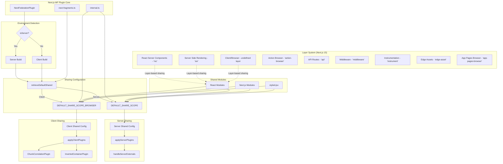
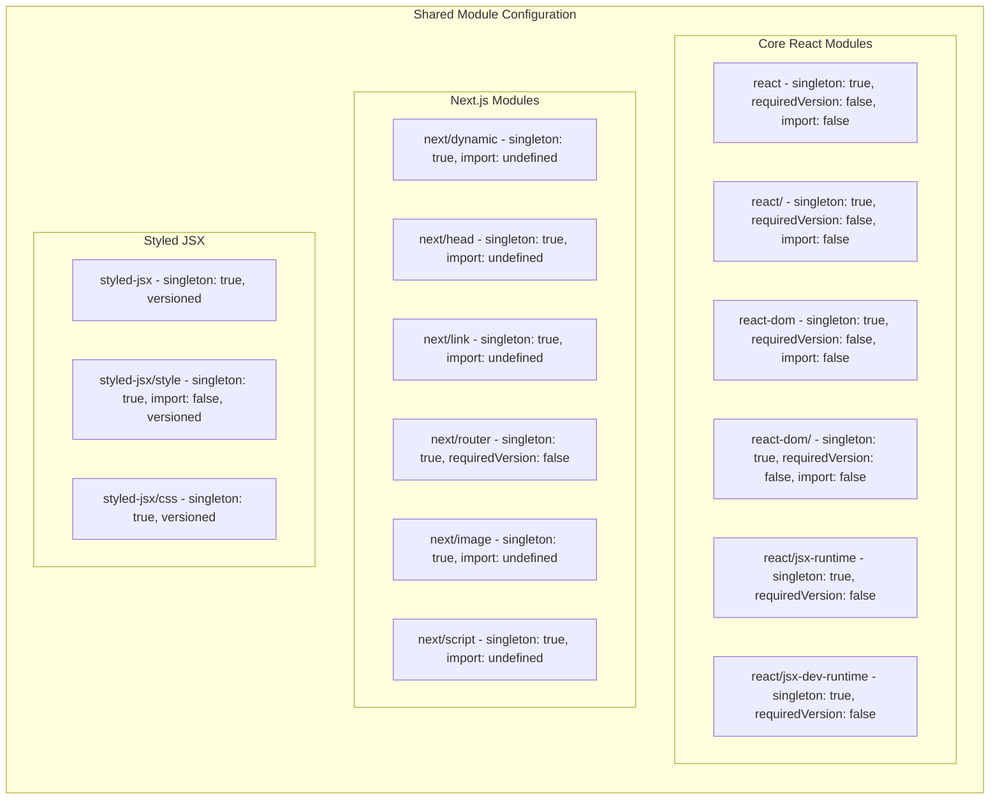
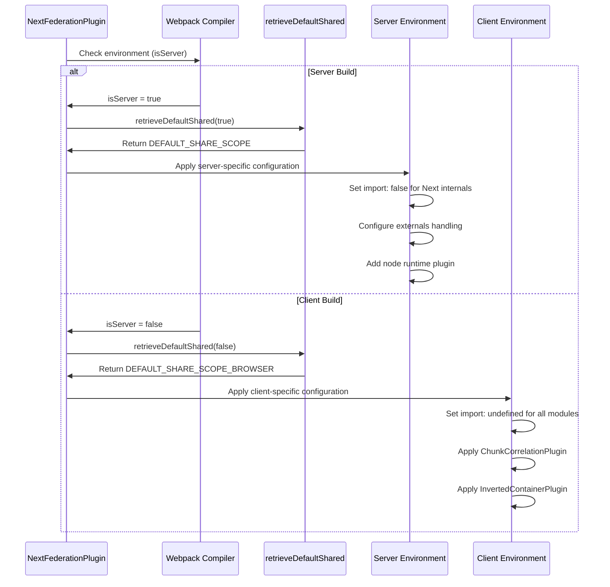
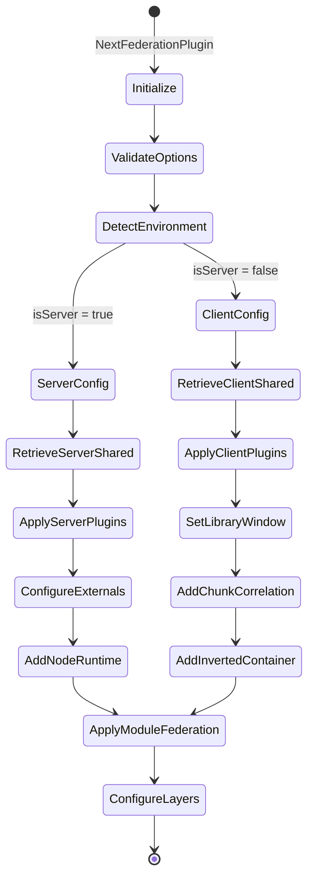
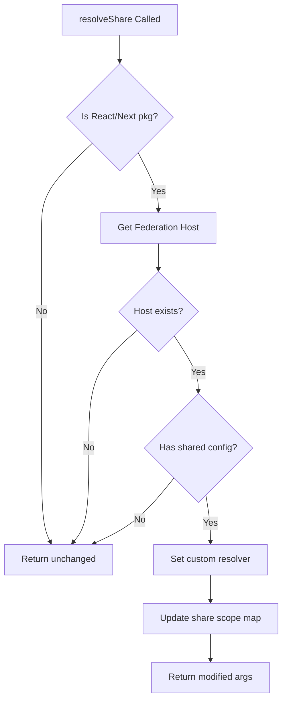
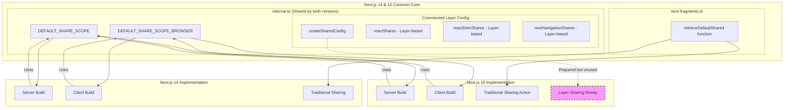
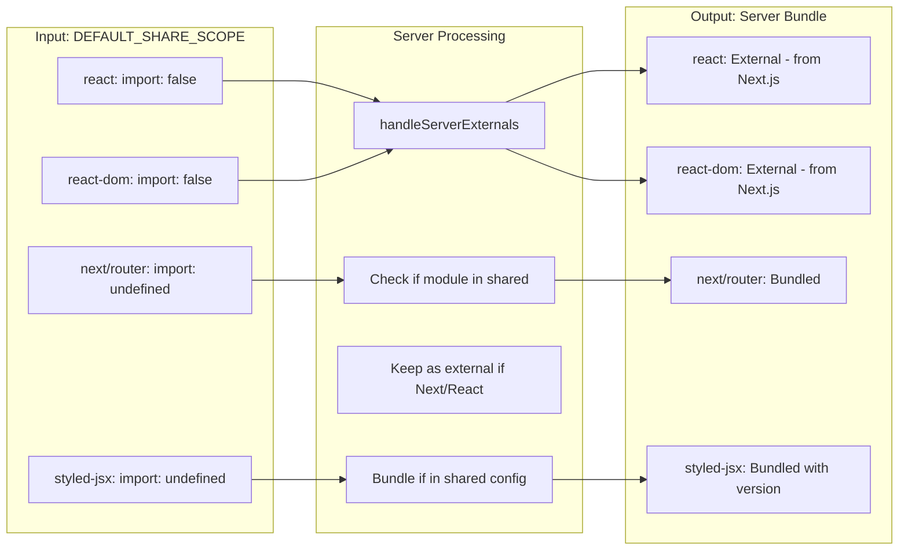
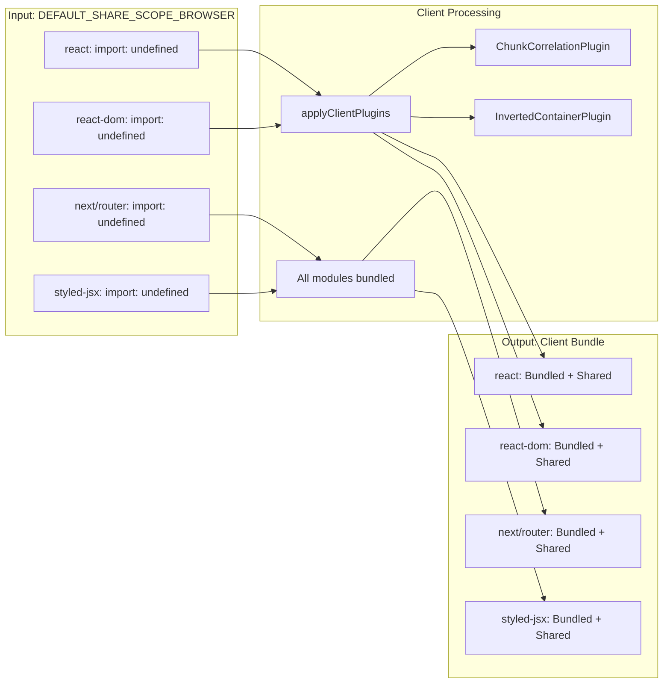
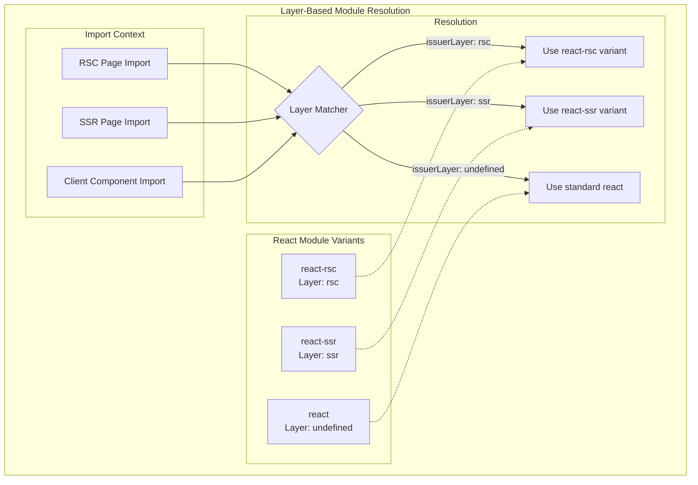

# Next.js Module Federation Plugin Sharing Mechanism Documentation

## Overview

This document details the sharing mechanism in the Next.js Module Federation plugin, showing how it handles sharing between client and server environments across Next.js versions 14 and 15.

## Architecture Flow Diagram



## Sharing Configuration Details



## Environment-Specific Sharing Flow



## Layer-Based Sharing (Next.js 15)

### Layer Definitions Table

| Layer Name | Key | Description | Usage |
|------------|-----|-------------|-------|
| Shared | `shared` | Shared code between client and server bundles | Common utilities |
| React Server Components | `rsc` | Server-only runtime for RSC | App Router RSC pages |
| Server Side Rendering | `ssr` | SSR layer for app directory | Server-rendered pages |
| Action Browser | `action-browser` | Browser client bundle for actions | Server actions client |
| API | `api` | API routes layer | API endpoints |
| Middleware | `middleware` | Middleware code layer | Edge middleware |
| Instrumentation | `instrument` | Instrumentation hooks | Monitoring/telemetry |
| Edge Asset | `edge-asset` | Assets on the edge | Edge-optimized assets |
| App Pages Browser | `app-pages-browser` | Browser client bundle for App | Client-side app pages |

### Module Sharing by Environment

| Module | Server (DEFAULT_SHARE_SCOPE) | Client (DEFAULT_SHARE_SCOPE_BROWSER) | Notes |
|--------|------------------------------|--------------------------------------|-------|
| react | `import: false` | `import: undefined` | External on server |
| react-dom | `import: false` | `import: undefined` | External on server |
| next/router | `import: undefined` | `import: undefined` | Bundled in both |
| next/link | `import: undefined` | `import: undefined` | Bundled in both |
| next/dynamic | `import: undefined` | `import: undefined` | Bundled in both |
| styled-jsx | `import: undefined` | `import: undefined` | Versioned sharing |

### Layer-Based Sharing Configuration (Currently Commented Out)

```javascript
// Example of layer-based sharing for React
const reactShares = {
  'react-rsc': {
    singleton: true,
    requiredVersion: false,
    import: undefined,
    layer: 'rsc',
    issuerLayer: 'rsc'
  },
  'react-ssr': {
    singleton: true,
    requiredVersion: false,
    import: undefined,
    layer: 'ssr',
    issuerLayer: 'ssr'
  },
  'react': {
    singleton: true,
    requiredVersion: false,
    import: false,
    layer: undefined,
    issuerLayer: undefined
  }
}
```

## Key Differences Between Next.js 14 and 15

| Aspect | Next.js 14 | Next.js 15 | Notes |
|--------|------------|------------|-------|
| Sharing Mechanism | Traditional sharing | Layer-aware sharing (prepared) | Same core implementation |
| External Handling | Standard externals | Dynamic externals detection | Improved in 8.7.1 |
| Layer Support | Basic layers | Full layer system | RSC, SSR, etc. |
| Runtime Plugins | Standard plugins | Same + Universe tracking | Enhanced tracking |

## Plugin Application Flow



## Runtime Plugin Sharing Resolution



## Summary

The Next.js Module Federation plugin uses a sophisticated sharing mechanism that:

1. **Maintains consistency** across Next.js versions 14 and 15
2. **Differentiates** between server and client environments
3. **Prepares** for layer-based sharing in Next.js 15 (currently commented out)
4. **Handles** React and Next.js internals specially to ensure proper module resolution
5. **Uses** runtime plugins to dynamically resolve shared modules

The main distinction is not between Next.js versions but between server and client builds, with server builds treating React/Next internals as external modules (`import: false`) while client builds bundle them (`import: undefined`).

## Detailed Correlation: Next.js 14 vs 15 Sharing Internals



## Sharing Configuration Transformation

### Server Environment (Both Next.js 14 & 15)



### Client Environment (Both Next.js 14 & 15)



## Future Layer-Based Sharing (Next.js 15 Ready)



## Complete Sharing Matrix

| Module | Next.js 14 Server | Next.js 14 Client | Next.js 15 Server | Next.js 15 Client | Layer Support (15) |
|--------|-------------------|-------------------|-------------------|-------------------|--------------------|
| react | External (`import: false`) | Bundled (`import: undefined`) | External (`import: false`) | Bundled (`import: undefined`) | RSC, SSR, Client layers ready |
| react-dom | External (`import: false`) | Bundled (`import: undefined`) | External (`import: false`) | Bundled (`import: undefined`) | RSC, SSR, Client layers ready |
| react/jsx-runtime | External | Bundled | External | Bundled | Navigation layers ready |
| next/router | Bundled | Bundled | Bundled | Bundled | No layer config |
| next/link | Bundled | Bundled | Bundled | Bundled | No layer config |
| next/navigation | N/A | N/A | Bundled | Bundled | RSC, SSR layers ready |
| styled-jsx | Bundled + Versioned | Bundled + Versioned | Bundled + Versioned | Bundled + Versioned | No layer config |

## Key Insights

1. **Version Consistency**: The core sharing mechanism remains identical between Next.js 14 and 15
2. **Layer Preparation**: Next.js 15 has layer-based sharing infrastructure ready but currently disabled
3. **Environment Priority**: The primary differentiation is server vs client, not version-based
4. **External Strategy**: Server builds treat React/Next core as external to leverage Next.js's built-in versions
5. **Future-Ready**: The commented layer-based sharing in `internal.ts` shows preparation for more granular control in Next.js 15+