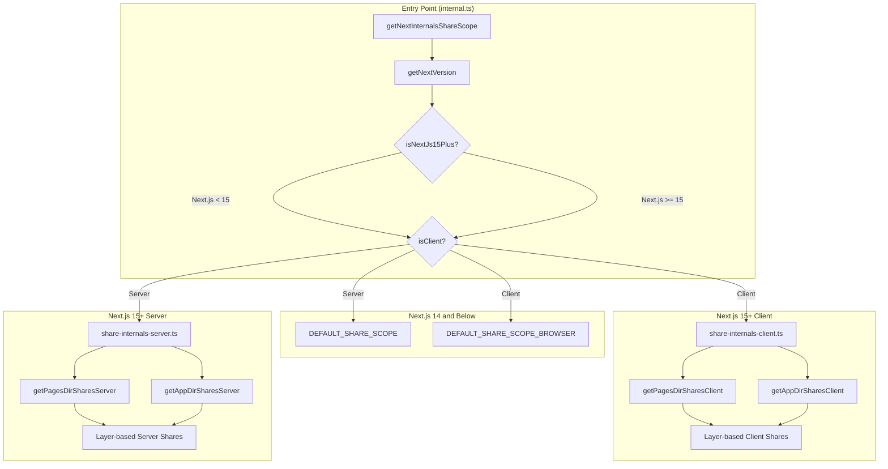
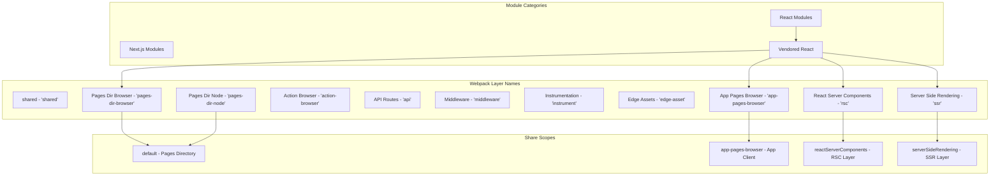
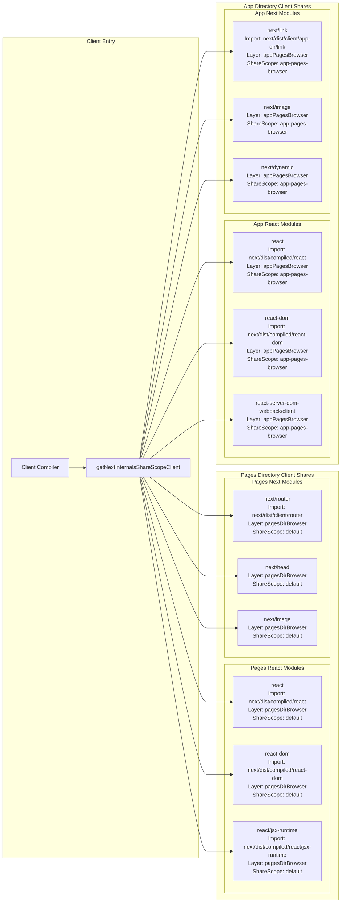
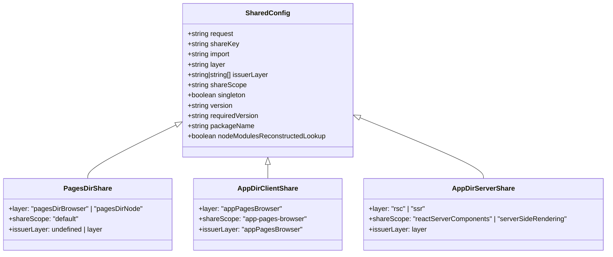
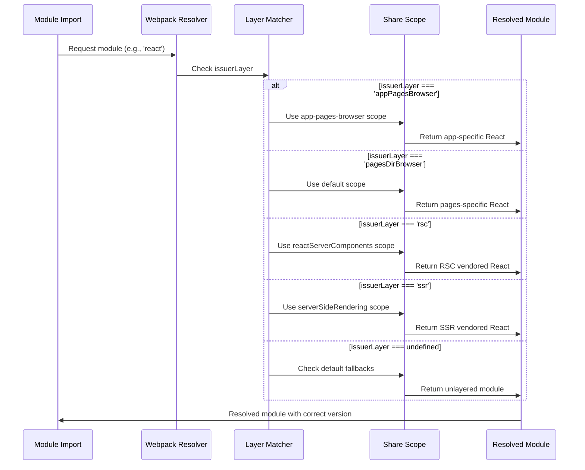

# Next.js Module Federation Plugin Sharing Mechanism Documentation

## Overview

This document details the sharing mechanism in the Next.js Module Federation plugin, showing the sophisticated layer-based sharing system that differentiates between Next.js versions and environments. A major architectural shift occurs between Next.js 14 and 15, where version 15+ introduces granular layer-based sharing with specific share scopes.

## Version Detection and Routing Flow



## Layer Architecture in Next.js 15+



## Next.js 15+ Client Sharing Architecture



## Next.js 15+ Server Sharing Architecture

```mermaid
flowchart TB
    subgraph "Server Entry"
        ServerCompiler[Server Compiler]
        ShareServer[getNextInternalsShareScopeServer]
    end

    subgraph "Pages Directory Server Shares"
        subgraph "Pages Server React"
            SPagesReact[react<br/>Import: next/dist/compiled/react<br/>Layer: pagesDirNode<br/>ShareScope: default]
            SPagesReactDom[react-dom<br/>Import: next/dist/compiled/react-dom<br/>Layer: pagesDirNode<br/>ShareScope: default]
        end
        subgraph "Pages Server Next"
            SPagesRouter[next/router<br/>Import: next/dist/client/router<br/>Layer: pagesDirNode<br/>ShareScope: default]
            SPagesModules[next/head, next/image, next/script<br/>Layer: pagesDirNode<br/>ShareScope: default]
        end
    end

    subgraph "App Directory Server Shares"
        subgraph "RSC Layer Shares"
            RSCReact[react<br/>Import: .../vendored/rsc/react<br/>Layer: rsc<br/>ShareScope: reactServerComponents]
            RSCReactDom[react-dom<br/>Import: .../vendored/rsc/react-dom<br/>Layer: rsc<br/>ShareScope: reactServerComponents]
            RSCServerDom[react-server-dom-webpack/server.*<br/>Layer: rsc<br/>ShareScope: reactServerComponents]
        end
        subgraph "SSR Layer Shares"
            SSRReact[react<br/>Import: .../vendored/ssr/react<br/>Layer: ssr<br/>ShareScope: serverSideRendering]
            SSRReactDom[react-dom<br/>Import: .../vendored/ssr/react-dom<br/>Layer: ssr<br/>ShareScope: serverSideRendering]
            SSRClientEdge[react-server-dom-webpack/client.edge<br/>Layer: ssr<br/>ShareScope: serverSideRendering]
        end
    end

    ServerCompiler --> ShareServer
    ShareServer --> SPagesReact
    ShareServer --> SPagesReactDom
    ShareServer --> SPagesRouter
    ShareServer --> SPagesModules
    ShareServer --> RSCReact
    ShareServer --> RSCReactDom
    ShareServer --> RSCServerDom
    ShareServer --> SSRReact
    ShareServer --> SSRReactDom
    ShareServer --> SSRClientEdge
```



## Share Configuration Structure (Next.js 15+)



## Detailed Sharing Comparison: Next.js 14 vs 15

### Client-Side Sharing

| Module | Next.js 14 Client | Next.js 15 Pages Dir Client | Next.js 15 App Dir Client |
|--------|-------------------|------------------------------|---------------------------|
| react | `import: undefined`<br/>shareScope: default | `import: next/dist/compiled/react`<br/>layer: pagesDirBrowser<br/>shareScope: default | `import: next/dist/compiled/react`<br/>layer: appPagesBrowser<br/>shareScope: app-pages-browser |
| react-dom | `import: undefined`<br/>shareScope: default | `import: next/dist/compiled/react-dom`<br/>layer: pagesDirBrowser<br/>shareScope: default | `import: next/dist/compiled/react-dom`<br/>layer: appPagesBrowser<br/>shareScope: app-pages-browser |
| next/router | `import: undefined`<br/>shareScope: default | `import: next/dist/client/router`<br/>layer: pagesDirBrowser<br/>shareScope: default | N/A (uses next/navigation) |
| next/link | `import: undefined`<br/>shareScope: default | Standard next/link<br/>layer: pagesDirBrowser<br/>shareScope: default | `import: next/dist/client/app-dir/link`<br/>layer: appPagesBrowser<br/>shareScope: app-pages-browser |
| react-server-dom-webpack/client | Not supported | Not used | `import: next/dist/compiled/...`<br/>layer: appPagesBrowser<br/>shareScope: app-pages-browser |

### Server-Side Sharing

| Module | Next.js 14 Server | Next.js 15 Pages Dir Server | Next.js 15 App Dir RSC | Next.js 15 App Dir SSR |
|--------|-------------------|------------------------------|------------------------|------------------------|
| react | `import: false` (external)<br/>shareScope: default | `import: next/dist/compiled/react`<br/>layer: pagesDirNode<br/>shareScope: default | `import: .../vendored/rsc/react`<br/>layer: rsc<br/>shareScope: reactServerComponents | `import: .../vendored/ssr/react`<br/>layer: ssr<br/>shareScope: serverSideRendering |
| react-dom | `import: false` (external)<br/>shareScope: default | `import: next/dist/compiled/react-dom`<br/>layer: pagesDirNode<br/>shareScope: default | `import: .../vendored/rsc/react-dom`<br/>layer: rsc<br/>shareScope: reactServerComponents | `import: .../vendored/ssr/react-dom`<br/>layer: ssr<br/>shareScope: serverSideRendering |
| Server DOM packages | Not supported | Not used | Various server.* imports<br/>layer: rsc<br/>shareScope: reactServerComponents | client.edge imports<br/>layer: ssr<br/>shareScope: serverSideRendering |

## Module Resolution Flow (Next.js 15+)



## Key Configuration Examples (Next.js 15+)

### Client-Side App Directory React Configuration
```javascript
{
  request: 'react',
  singleton: true,
  shareKey: 'react',
  packageName: 'react',
  import: 'next/dist/compiled/react',
  layer: 'app-pages-browser',
  issuerLayer: 'app-pages-browser',
  shareScope: 'app-pages-browser',
  version: '18.2.0',
  requiredVersion: '^18.2.0'
}
```

### Server-Side RSC React Configuration
```javascript
{
  request: 'react',
  singleton: true,
  shareKey: 'react',
  import: 'next/dist/server/route-modules/app-page/vendored/rsc/react',
  layer: 'rsc',
  issuerLayer: 'rsc',
  shareScope: 'reactServerComponents',
  version: '18.2.0',
  requiredVersion: '^18.2.0'
}
```

## Share Scope Isolation

```mermaid
graph TB
    subgraph "Share Scope: default"
        DefReact[react - Pages Dir]
        DefRouter[next/router]
        DefHead[next/head]
    end

    subgraph "Share Scope: app-pages-browser"
        AppReact[react - App Dir Client]
        AppLink[next/link - App variant]
        AppServerDom[react-server-dom-webpack/client]
    end

    subgraph "Share Scope: reactServerComponents"
        RSCReact[react - RSC vendored]
        RSCServerEdge[react-server-dom-webpack/server.edge]
        RSCServerNode[react-server-dom-webpack/server.node]
    end

    subgraph "Share Scope: serverSideRendering"
        SSRReact[react - SSR vendored]
        SSRClientEdge[react-server-dom-webpack/client.edge]
        SSRCompilerRuntime[react/compiler-runtime]
    end

    Note1[Isolated scopes prevent version conflicts]
    Note2[Each scope maintains its own module instances]

    Note1 -.-> DefReact
    Note1 -.-> AppReact
    Note1 -.-> RSCReact
    Note1 -.-> SSRReact

    style Note1 fill:#ffffcc
    style Note2 fill:#ffffcc
```



## Summary of Architectural Changes

### Next.js 14 and Below
- Uses simple `DEFAULT_SHARE_SCOPE` and `DEFAULT_SHARE_SCOPE_BROWSER`
- Server treats React/Next as external (`import: false`)
- Client bundles everything (`import: undefined`)
- Single share scope ("default") for all modules
- No layer-based isolation

### Next.js 15+
- Sophisticated layer-based sharing with multiple share scopes
- Different vendored React versions for different layers (RSC, SSR, client)
- Complete module isolation between Pages and App directories
- Layer-specific share scopes prevent version conflicts
- Granular control over module resolution based on issuerLayer
- Support for React Server Components and advanced App Router features

## Key Insights

1. **Version Detection**: The system dynamically detects Next.js version and routes to appropriate sharing configuration
2. **Layer Isolation**: Next.js 15+ uses webpack layers to completely isolate different rendering contexts
3. **Vendored Dependencies**: App directory uses vendored React builds specific to each layer (RSC/SSR)
4. **Share Scope Separation**: Different share scopes prevent module conflicts between Pages and App directories
5. **Backward Compatibility**: Next.js 14 and below continue using the simpler sharing approach
6. **Granular Control**: Each module can specify exactly which layer can import it via `issuerLayer`
7. **Multiple React Instances**: The system can maintain different React versions/builds for different contexts simultaneously