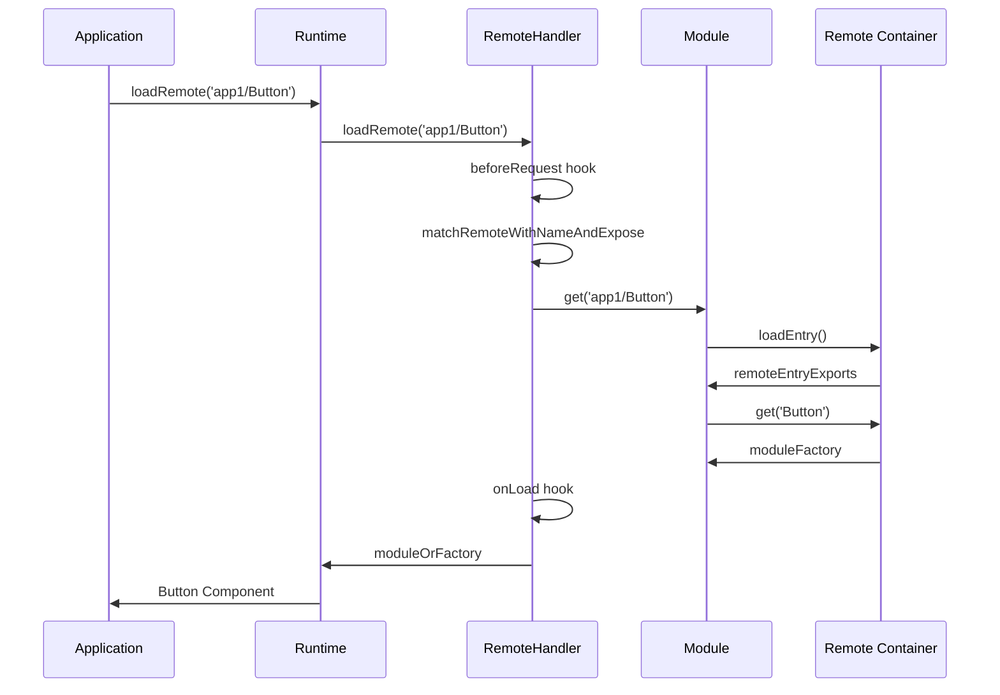
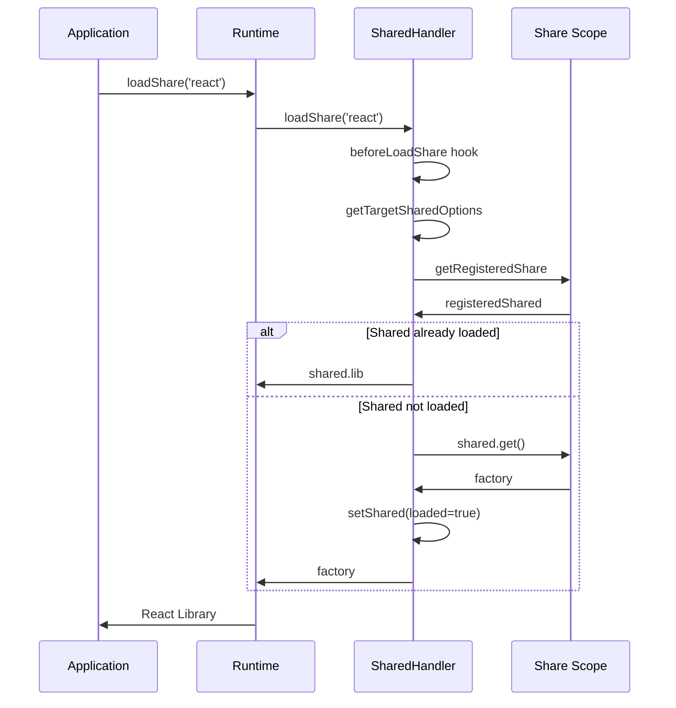

# Module Federation Runtime Architecture

## Overview

The Module Federation runtime consists of three layered packages that provide a complete federation solution:

1. **@module-federation/runtime-core** - Core interfaces, types, and base functionality
2. **@module-federation/runtime** - Singleton management and convenience APIs
3. **@module-federation/webpack-bundler-runtime** - Webpack-specific integration layer

## Package Architecture

### Layer 1: runtime-core
**Purpose**: Core federation logic and interfaces

**Key Components**:
- `ModuleFederation` class - Main federation controller
- `SharedHandler` - Manages shared dependencies and scope resolution
- `RemoteHandler` - Handles remote module loading and caching
- `SnapshotHandler` - Manages module metadata and snapshots
- Hook system with `PluginSystem`, `SyncHook`, `AsyncHook`, etc.
- Version resolution with comprehensive semver support

**Dependencies**: `@module-federation/sdk`, `@module-federation/error-codes`

### Layer 2: runtime
**Purpose**: Singleton management and convenience API

**Key Functions**:
- `init(options)` - Initialize or reuse federation instance
- `createInstance(options)` - Create new federation instance
- `loadRemote<T>(id, options)` - Load remote modules
- `loadShare<T>(pkgName, options)` - Load shared dependencies
- `loadShareSync<T>(pkgName, options)` - Synchronous shared loading
- Singleton instance management via global state

**Dependencies**: `@module-federation/runtime-core`

### Layer 3: webpack-bundler-runtime
**Purpose**: Webpack-specific integration

**Key Components**:
- `federation` object with bundler runtime functions
- `remotes(options)` - Handle webpack remote loading
- `consumes(options)` - Handle webpack shared consumption
- `initializeSharing(options)` - Initialize webpack share scopes
- `attachShareScopeMap()` - Attach runtime to webpack's share scope

**Dependencies**: `@module-federation/runtime`

## Core Classes

### ModuleFederation Class
```typescript
class ModuleFederation {
  // Core properties
  options: Options;
  name: string;
  version: string;
  
  // Handlers
  sharedHandler: SharedHandler;
  remoteHandler: RemoteHandler;
  snapshotHandler: SnapshotHandler;
  
  // Caching
  moduleCache: Map<string, Module>;
  shareScopeMap: ShareScopeMap;
  
  // Hook systems
  hooks: PluginSystem<{
    beforeInit: SyncWaterfallHook;
    init: SyncHook;
    beforeInitContainer: AsyncWaterfallHook;
    initContainer: AsyncWaterfallHook;
  }>;
  
  loaderHook: PluginSystem<{
    getModuleInfo: SyncHook;
    createScript: SyncHook;
    createLink: SyncHook;
    fetch: AsyncHook;
    loadEntryError: AsyncHook;
    getModuleFactory: AsyncHook;
  }>;
  
  bridgeHook: PluginSystem<{
    beforeBridgeRender: SyncHook;
    afterBridgeRender: SyncHook;
    beforeBridgeDestroy: SyncHook;
    afterBridgeDestroy: SyncHook;
  }>;
  
  // Main API
  async loadRemote<T>(id: string, options?: LoadOptions): Promise<T | null>;
  async loadShare<T>(pkgName: string, extraOptions?): Promise<false | (() => T)>;
  loadShareSync<T>(pkgName: string, extraOptions?): () => T | never;
  initializeSharing(scopeName?: string, extraOptions?): Array<Promise<void>>;
  registerRemotes(remotes: Remote[], options?: { force?: boolean }): void;
}
```

### SharedHandler Class
```typescript
class SharedHandler {
  host: ModuleFederation;
  shareScopeMap: ShareScopeMap;
  initTokens: InitTokens;
  
  hooks: PluginSystem<{
    afterResolve: AsyncWaterfallHook<LoadRemoteMatch>;
    beforeLoadShare: AsyncWaterfallHook;
    loadShare: AsyncHook;
    resolveShare: SyncWaterfallHook;
    initContainerShareScopeMap: SyncWaterfallHook;
  }>;
  
  registerShared(globalOptions: Options, userOptions: UserOptions);
  async loadShare<T>(pkgName: string, extraOptions?): Promise<false | (() => T)>;
  loadShareSync<T>(pkgName: string, extraOptions?): () => T | never;
  initializeSharing(scopeName: string, extraOptions?): Array<Promise<void>>;
  initShareScopeMap(scopeName: string, shareScope, extraOptions?): void;
}
```

### RemoteHandler Class
```typescript
class RemoteHandler {
  host: ModuleFederation;
  idToRemoteMap: Record<string, { name: string; expose: string }>;
  
  hooks: PluginSystem<{
    beforeRegisterRemote: SyncWaterfallHook;
    registerRemote: SyncWaterfallHook;
    beforeRequest: AsyncWaterfallHook;
    onLoad: AsyncHook;
    handlePreloadModule: SyncHook;
    errorLoadRemote: AsyncHook;
    beforePreloadRemote: AsyncHook;
    generatePreloadAssets: AsyncHook;
    afterPreloadRemote: AsyncHook;
    loadEntry: AsyncHook;
  }>;
  
  async loadRemote<T>(id: string, options?): Promise<T | null>;
  async preloadRemote(preloadOptions: Array<PreloadRemoteArgs>): Promise<void>;
  registerRemotes(remotes: Remote[], options?: { force?: boolean }): void;
  formatAndRegisterRemote(globalOptions: Options, userOptions: UserOptions);
}
```

## Hook System Architecture

The runtime uses a comprehensive hook system built on four core hook types:

### Hook Types
```typescript
// Synchronous hook - all listeners called sequentially
class SyncHook<T extends any[], R> {
  emit(args: T): R;
}

// Synchronous waterfall - each listener can modify the argument
class SyncWaterfallHook<T> {
  emit(arg: T): T;
}

// Asynchronous hook - all listeners called in parallel
class AsyncHook<T extends any[], R> {
  emit(args: T): Promise<R>;
}

// Asynchronous waterfall - listeners called sequentially, each can modify
class AsyncWaterfallHook<T> {
  emit(arg: T): Promise<T>;
}
```

### Hook Lifecycle

**ModuleFederation Core Hooks**:
- `beforeInit` - Before federation initialization
- `init` - After federation initialization
- `beforeInitContainer` - Before container initialization
- `initContainer` - After container initialization

**Loader Hooks**:
- `getModuleInfo` - Get module information
- `createScript` - Create script elements
- `createLink` - Create link elements
- `fetch` - Custom fetch implementation
- `loadEntryError` - Handle entry loading errors
- `getModuleFactory` - Get module factory

**Remote Handler Hooks**:
- `beforeRegisterRemote` - Before remote registration
- `registerRemote` - After remote registration
- `beforeRequest` - Before remote request
- `onLoad` - After module load
- `errorLoadRemote` - Handle remote loading errors
- `generatePreloadAssets` - Generate preload assets

## Singleton Management

The runtime package provides singleton management through global state:

```typescript
// Global federation state
interface Federation {
  __GLOBAL_PLUGIN__: Array<ModuleFederationRuntimePlugin>;
  __DEBUG_CONSTRUCTOR_VERSION__?: string;
  moduleInfo: GlobalModuleInfo;
  __DEBUG_CONSTRUCTOR__?: typeof ModuleFederation;
  __INSTANCES__: Array<ModuleFederation>;
  __SHARE__: GlobalShareScopeMap;
  __MANIFEST_LOADING__: Record<string, Promise<ModuleInfo>>;
  __PRELOADED_MAP__: Map<string, boolean>;
}

// Singleton management functions
function init(options: UserOptions): ModuleFederation;
function createInstance(options: UserOptions): ModuleFederation;
function getGlobalFederationInstance(name: string, version?: string): ModuleFederation | undefined;
```

**Instance Resolution Strategy**:
1. Check for build ID match (`FEDERATION_BUILD_IDENTIFIER`)
2. Match by name and version
3. Match by name only (if no versions specified)
4. Create new instance if no match found

## Version Resolution Algorithm

The runtime implements a comprehensive semver-compatible version resolution system:

### Core Algorithm (`satisfy` function)
```typescript
function satisfy(version: string, range: string): boolean {
  // 1. Parse and validate version
  const versionAtom = parseVersion(version);
  
  // 2. Split range by || (OR conditions)
  const orRanges = range.split('||');
  
  // 3. For each OR range
  for (const orRange of orRanges) {
    // 4. Handle wildcards (* or x)
    if (orRange === '*' || orRange === 'x') return true;
    
    // 5. Parse range (handle hyphens, trims)
    const parsedRange = parseRange(orRange);
    
    // 6. Parse comparators (expand ^, ~)
    const comparators = parsedRange
      .split(' ')
      .map(parseComparatorString)
      .filter(Boolean);
    
    // 7. Check all AND conditions in this OR range
    let satisfied = true;
    for (const comparator of comparators) {
      if (!compare(parseComparator(comparator), versionAtom)) {
        satisfied = false;
        break;
      }
    }
    
    // 8. If this OR range satisfied, return true
    if (satisfied) return true;
  }
  
  // 9. No OR ranges satisfied
  return false;
}
```

### Version Selection Strategies

**For Shared Dependencies**:
1. **version-first** (default): Select highest version, prefer loaded
2. **loaded-first**: Prefer already loaded versions

**Selection Logic**:
```typescript
function findVersion(shareVersionMap, strategy) {
  if (strategy === 'loaded-first') {
    return findSingletonVersionOrderByLoaded(shareVersionMap);
  }
  return findSingletonVersionOrderByVersion(shareVersionMap);
}

function findSingletonVersionOrderByVersion(shareScopeMap, scope, pkgName) {
  const callback = (prev, cur) => {
    return !isLoaded(versions[prev]) && versionLt(prev, cur);
  };
  return findVersion(shareScopeMap[scope][pkgName], callback);
}

function findSingletonVersionOrderByLoaded(shareScopeMap, scope, pkgName) {
  const callback = (prev, cur) => {
    const prevLoaded = isLoaded(versions[prev]) || isLoading(versions[prev]);
    const curLoaded = isLoaded(versions[cur]) || isLoading(versions[cur]);
    
    if (curLoaded) {
      return prevLoaded ? versionLt(prev, cur) : true;
    }
    return prevLoaded ? false : versionLt(prev, cur);
  };
  return findVersion(shareScopeMap[scope][pkgName], callback);
}
```

### Supported Range Formats

**Caret Ranges (^)**:
- `^1.2.3` → `>=1.2.3 <2.0.0-0`
- `^0.2.3` → `>=0.2.3 <0.3.0-0`
- `^0.0.3` → `>=0.0.3 <0.0.4-0`

**Tilde Ranges (~)**:
- `~1.2.3` → `>=1.2.3 <1.3.0-0`
- `~1.2` → `>=1.2.0 <1.3.0-0`
- `~1` → `>=1.0.0 <2.0.0-0`

**Hyphen Ranges**:
- `1.2.3 - 2.3.4` → `>=1.2.3 <=2.3.4`

**X-Ranges**:
- `1.2.x` → `>=1.2.0 <1.3.0-0`
- `1.x` → `>=1.0.0 <2.0.0-0`

## Webpack Integration

### Federation Object Structure
```typescript
const federation: Federation = {
  runtime,                    // @module-federation/runtime
  instance: undefined,        // ModuleFederation instance
  initOptions: undefined,     // Initialization options
  bundlerRuntime: {
    remotes,                  // Handle webpack remotes
    consumes,                 // Handle webpack consumes
    I: initializeSharing,     // Initialize sharing
    S: {},                    // Share scope map
    installInitialConsumes,   // Install initial consumes
    initContainerEntry,       // Initialize container entry
  },
  attachShareScopeMap,        // Attach to webpack
  bundlerRuntimeOptions: {},  // Bundler-specific options
};
```

### Webpack Runtime Integration

**Remote Loading**:
```typescript
function remotes(options: RemotesOptions) {
  const { chunkId, promises, chunkMapping, idToExternalAndNameMapping, webpackRequire } = options;
  
  attachShareScopeMap(webpackRequire);
  
  if (webpackRequire.o(chunkMapping, chunkId)) {
    chunkMapping[chunkId].forEach((id) => {
      const data = idToExternalAndNameMapping[id];
      const remoteInfos = idToRemoteMap[id];
      
      // Use runtime loading for supported types
      if (FEDERATION_SUPPORTED_TYPES.includes(remoteInfos[0].externalType)) {
        const remoteName = decodeName(remoteInfos[0].name);
        const remoteModuleName = remoteName + data[1].slice(1);
        
        return webpackRequire.federation.instance.loadRemote(remoteModuleName, {
          loadFactory: false,
          from: 'build'
        });
      } else {
        // Fall back to webpack loading
        return handleWebpackRemote(data, webpackRequire);
      }
    });
  }
}
```

**Shared Consumption**:
```typescript
function consumes(options: ConsumesOptions) {
  const { chunkId, moduleToHandlerMapping, installedModules, webpackRequire } = options;
  
  attachShareScopeMap(webpackRequire);
  
  if (webpackRequire.o(chunkMapping, chunkId)) {
    chunkMapping[chunkId].forEach((id) => {
      const { shareKey, getter, shareInfo } = moduleToHandlerMapping[id];
      
      const promise = webpackRequire.federation.instance
        .loadShare(shareKey, { customShareInfo: shareInfo })
        .then((factory) => {
          return factory === false ? getter() : factory;
        });
      
      installedModules[id] = promise;
    });
  }
}
```

## Module Loading Sequence

### Remote Module Loading


### Shared Dependency Loading


## Integration Guidelines for Bundler Teams

### 1. Runtime Integration
```typescript
// Import the runtime
import federation from '@module-federation/webpack-bundler-runtime';

// Initialize federation instance
federation.instance = federation.runtime.init({
  name: 'host',
  remotes: [...],
  shared: {...}
});

// Attach to bundler's share scope
federation.attachShareScopeMap(__webpack_require__);
```

### 2. Remote Loading Integration
```typescript
// Use runtime's remote loading
const loadRemote = (id) => {
  return federation.instance.loadRemote(id, {
    loadFactory: false,
    from: 'build'
  });
};
```

### 3. Shared Dependencies Integration
```typescript
// Use runtime's shared loading
const loadShared = (shareKey, shareInfo) => {
  return federation.instance.loadShare(shareKey, {
    customShareInfo: shareInfo
  });
};
```

### 4. Hook Integration
```typescript
// Register bundler-specific plugins
federation.instance.registerPlugins([
  {
    name: 'BundlerSpecificPlugin',
    init() {
      // Plugin initialization
    },
    hooks: {
      beforeRequest: (args) => {
        // Custom request handling
        return args;
      }
    }
  }
]);
```

## Key Differences from Previous Versions

1. **Layered Architecture**: Clear separation between core, runtime, and bundler-specific layers
2. **Comprehensive Hook System**: Extensive hooks for customization at every stage
3. **Advanced Version Resolution**: Full semver compatibility with multiple strategies
4. **Singleton Management**: Robust instance management with build ID support
5. **TypeScript First**: Complete TypeScript definitions and type safety
6. **Handler Separation**: Clear separation of concerns between SharedHandler and RemoteHandler
7. **Plugin Architecture**: Extensible plugin system for customization

This architecture provides bundler teams with a robust, extensible foundation for implementing Module Federation while maintaining compatibility and performance.