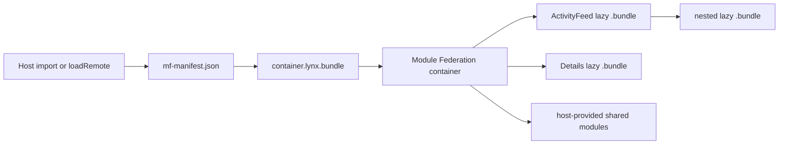
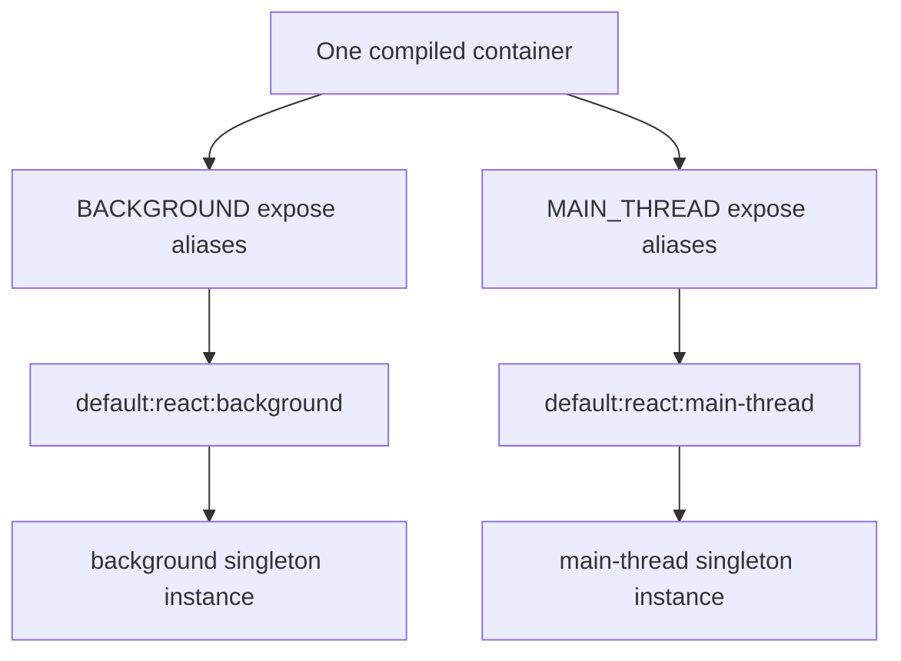

# Module Federation for Lynx

`@module-federation/lynx` adapts Rspack Module Federation to official Rspeedy
applications. It preserves normal federated imports, adds a Lynx transport for
manifest-addressed `.lynx.bundle` files, and isolates shared modules by Lynx
JavaScript realm.

The package requires a layers-capable Rspack build. The version verified by this
repository is `2.1.5-canary-54a0d8f3-20260715194831`. The bundle transport uses
`lynx.loadScript`, available in Lynx SDK 3.7 and later; `remoteBundle.engineVersion`
therefore defaults to `3.7`.

Split federation also requires `@lynx-js/web-core >= 0.22.3` and
`@lynx-js/template-webpack-plugin >= 0.13.1`. Those releases provide
bundle-relative Web execution URLs, valid empty main-thread chunks, and
assetless remote-chunk filtering used by this adapter. ReactLynx hosts require
`@lynx-js/react >= 0.123.1`; the adapter registers that release's public
lazy-bundle loader before federation async startup so non-eager shared chunks
use FetchBundle in native and Web builds.

## Host

Register the adapter after the Lynx DSL plugin so it can use the official
`BACKGROUND` and `MAIN_THREAD` layers:

```ts
import { pluginReactLynx } from '@lynx-js/react-rsbuild-plugin';
import { defineConfig } from '@lynx-js/rspeedy';
import { pluginLynxModuleFederation } from '@module-federation/lynx';

export default defineConfig({
  plugins: [
    pluginReactLynx(),
    pluginLynxModuleFederation(
      {
        name: 'lynx_host',
        remotes: {
          catalog: 'catalog@https://example.test/mf-manifest.json',
        },
        shared: {
          'app-state': { singleton: true, realm: 'background' },
        },
      },
      {
        environment: 'lynx',
      },
    ),
  ],
});
```

Application code keeps the usual syntax:

```ts
const { default: Card } = await import('catalog/Card');
```

The same manifest works through the runtime API:

```ts
import { createInstance } from '@module-federation/runtime';
import lynxRuntimePlugin from '@module-federation/lynx/runtimePlugin';

const federation = createInstance({
  name: 'lynx_runtime_host',
  remotes: [
    {
      name: 'catalog',
      entry: 'https://example.test/mf-manifest.json',
    },
  ],
  plugins: [lynxRuntimePlugin()],
});

const Card = await federation.loadRemote('catalog/Card');
```

Use the Module Federation manifest URL, not the generated JavaScript container
URL. The adapter rewrites `metaData.remoteEntry` to the public
`.lynx.bundle`; the generated `.js` container is an internal encoder input.

## Remote bundles

Native split remotes keep the Module Federation runtime in the background realm
while compiling each ReactLynx exposure for both official issuer layers:

Configure the remote's ReactLynx plugin with
`pluginReactLynx({ experimental_isLazyBundle: true })`. Split federation uses
those DynamicComponent artifacts as independently transported exposures and
fails the build when the option is missing.

```ts
pluginLynxModuleFederation(
  {
    name: 'catalog',
    exposes: {
      './Card': './src/Card',
    },
    shared: {
      '@lynx-js/react': { singleton: true },
    },
  },
  {
    environment: 'lynx',
    remoteBundle: {
      target: 'lynx',
      filename: 'catalog.lynx.bundle',
    },
  },
);
```

Set `target: 'web'` and `mainThread: true` for a Lynx for Web remote that
supports both realms:

```ts
pluginLynxModuleFederation(federationOptions, {
  environment: 'web',
  mainThread: true,
  remoteBundle: {
    target: 'web',
    filename: 'catalog.web.lynx.bundle',
  },
});
```

### Chunking modes

`remoteBundle.chunking` controls deployment shape:

| Mode              | Output                                                                          | Best for                                                |
| ----------------- | ------------------------------------------------------------------------------- | ------------------------------------------------------- |
| `split` (default) | Small container `.lynx.bundle` plus independently fetched lazy `.bundle` chunks | ReactLynx UI, caching, and requested-expose loading     |
| `single`          | One native `.lynx.bundle` containing background-only module chunks              | Non-UI native modules requiring one deployment artifact |

`split` is the federation-safe default. It avoids placing every expose and
shared fallback in the entry bundle. Keep all emitted lazy `.bundle` files
beside the remote entry (or under its manifest `publicPath`) when publishing.
Each ReactLynx exposure needs its own paired background/main-thread lazy root.
Split native bundles encode both programs into one DynamicComponent artifact;
Web remotes use the equivalent paired external bundle. Web remotes reject
`single`, and native `single` is limited to background-only non-UI modules.

`publicPath: 'auto'` is supported and recommended for colocated Web split
assets. Module Federation still resolves the public remote entry through
manifest inference or `getPublicPath`. Browser and browser-like transports
infer a root-relative manifest's origin from the fetched `Response.url`; Node
hosts should provide an absolute manifest URL (or a custom fetch response with
an absolute URL). The Lynx runtime plugin then resolves lazy bundles relative
to that actual entry URL instead of the DOM `currentScript` signal used by
Webpack's browser auto-public-path runtime. Native remotes should follow
Rspeedy and set an absolute `output.assetPrefix` (for example from a CDN or
`LYNX_REMOTE_ORIGIN`) because Lynx's native lazy-bundle bootstrap also consumes
Webpack's public path. Explicit public paths remain unchanged.

Ordinary Rspeedy entry bundles are preserved by default. A dedicated remote
environment may set `preserveSourceEntryBundles: false` to publish only its
manifest, federation container, and split exposure bundles.



The runtime fetches and registers the container with `lynx.fetchBundle`, then
evaluates its section with `lynx.loadScript`. In split mode, the generated
Lynx async-chunk map supplies the lazy `.bundle` URL; `lynx.loadLazyBundle`
fetches it, and the returned `ids`, `modules`, and `runtime` install into the
calling webpack runtime. Cached lazy bundles retain ReactLynx's synchronous
thenable so a first render can resolve in the same turn; asynchronous shared
consumes and network loads remain promise- and timeout-bound. Failed and
timed-out entry loads are evicted so a later request can retry. The default
timeout is 30 seconds and can be changed with `runtimePluginOptions.timeout`.

The manifest declares `remoteEntry.type: 'lynx'`. The runtime plugin handles
only that type (or a `.lynx.bundle` URL), leaving `script`, `module`, and other
runtime-core loaders untouched. Explicit background-only raw JavaScript entries
may use `type: 'lynx-js'` and `lynx.requireModuleAsync`.

## Layers and singletons

Split remote bundles and hosts with `mainThread: true` compile exposes for both
Lynx issuer layers and register shared declarations in realm-qualified scopes.
Unqualified shares default to the background realm; use
`realm: 'main-thread'` only for a module authored for that runtime. The semantic
realm is resolved against the DSL's exposed layer constants, so application
configs do not hard-code layer names.

A singleton is unique within one JavaScript realm, share scope, and share key.
The host, compiled imports, runtime API consumers, and remotes can therefore
share one stateful instance inside the background realm. The main-thread realm
gets a separate instance by design: Lynx does not transfer JavaScript object
identity across its thread boundary.

Prefer the official ReactLynx lazy-runtime bridge for UI bundles. An exact
`@lynx-js/react` share does not cover `/internal`, JSX-runtime, Lepus, and lazy
subpaths; partial ReactLynx sharing creates distinct runtime state. Application
state and other ordinary libraries are safe singleton candidates.

One realm-neutral container program carries internal layer-specific expose
aliases. Keys ending in `__main_thread` are reserved for those aliases; users
still import the public key such as `catalog/Card`.



The enhanced federation runtime itself executes in the native background
realm. Native split UI bundles still include their paired TASM/MTS main-thread
snapshot program; this is compiled component output, not a second runtime or a
second remote container. JavaScript object identity remains realm-local.

See `apps/lynx-module-federation-demo` for an official Rspeedy native app,
native artifact checks, and a real Lynx for Web browser E2E.
